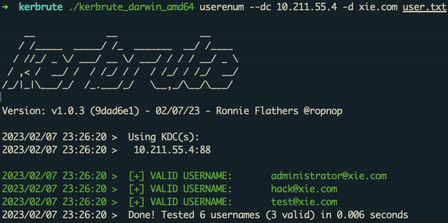
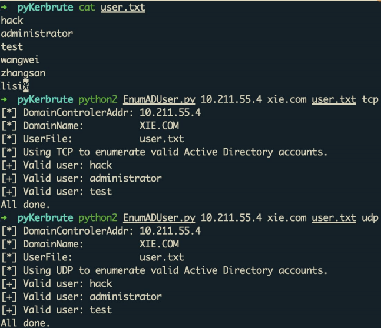
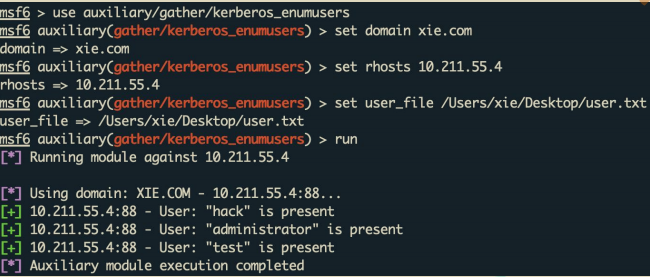
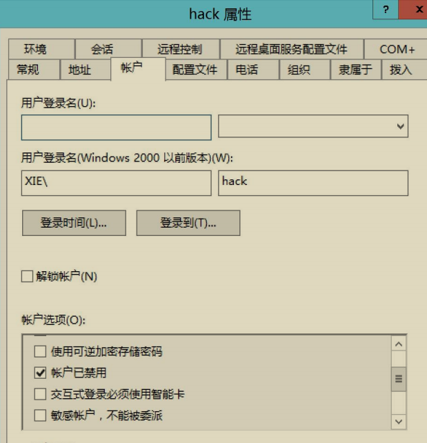
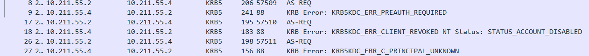
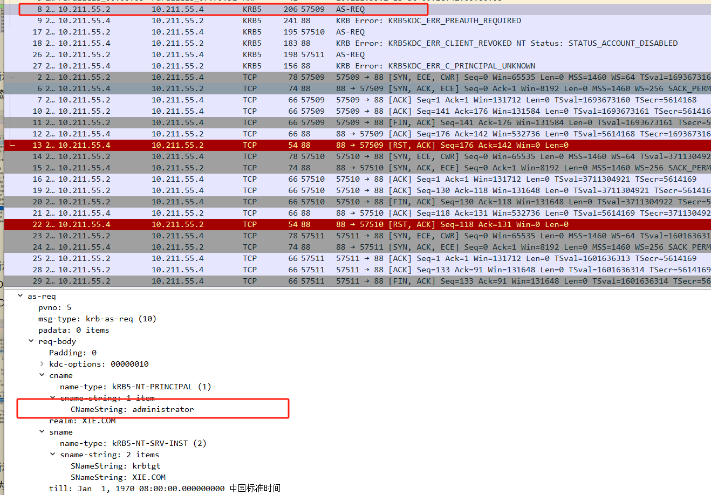
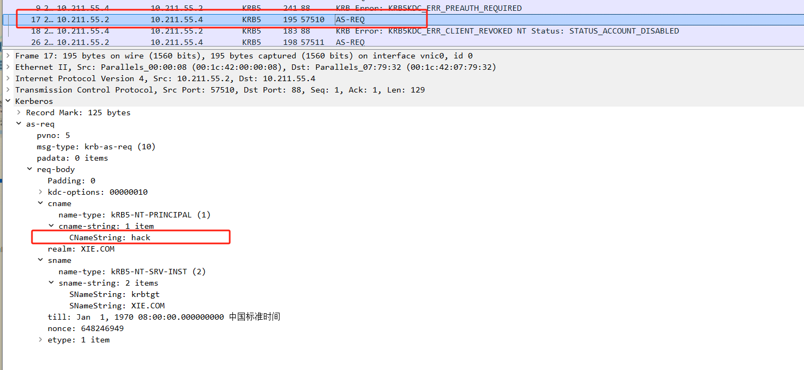
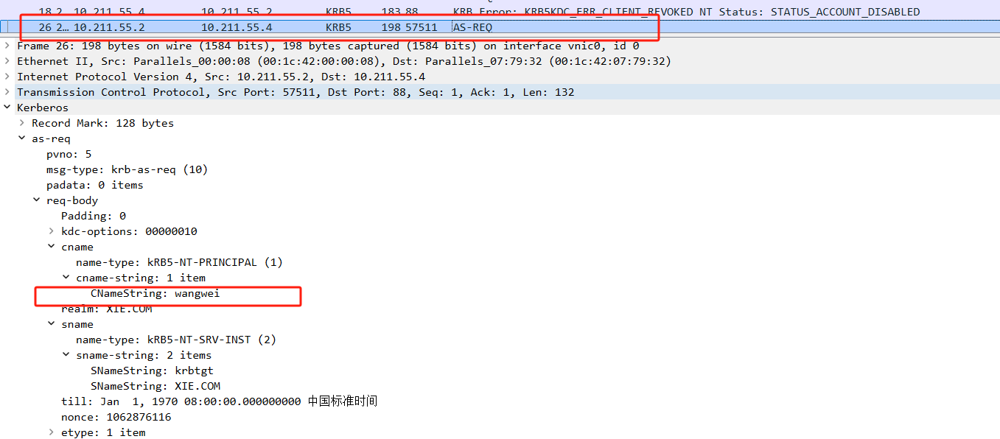

# 域内用户名枚举

域内用户名枚举可以在无域内有效凭据的情况下，枚举出域内存在的用户名，进而对域内存在的用户名进行密码喷洒攻击，以此来获得域内有效凭据。

在 Kerberos 协议认证的` AS-REQ` 阶段，请求包 cname 对应的值是用户名。**当用户名存在、用户存在但禁用、用户不存在时，`AS-REP` 返回包状态不同。所以可以利用这点，对目标域进行域用户枚举。**

|AS-REP 回复包状态|Kerberos 错误信息|
|--|--|
|用户存在 且启用|KDC_ERR_PREAUTH_REQUIRED (需要额外的预认证)|
|用户存在 但禁用|KDC_ERR_CLIENT_REVOKED NT Status： STATUS_ACCOUNT_DISABLED (用户状态不可用)|
|用户不存在|KDC_ERR_C_PRINCIPAL_UNKNOWN (找不到此用户)|

## 域内用户名枚举工具

因此，当攻击者不在域内时，可以通过域内用户枚举来枚举出域内存在的用户。以下演示使用如下几款工具进行域内用户枚举：

### 1.Kerbrute

项目地址：https://github.com/ropnop/kerbrute

一款使用 go 语言写的域用户枚举和密码喷洒工具，该工具域用户枚举命令如下：

```
./kerbrute_darwin_amd64 userenum --dc 10.211.55.4 -d xie.com user.txt
```

参数含义如下：

• userenum：用户枚举模式
• --dc：指定域控 ip
• -d：指定域名
• user.txt：用户名字典文件，里面的字典可不加域名后缀

如图所示，使用 kerbrute 工具进行用户名枚举，指定的域控 ip 为10.211.55.4，指定的域名为 xie.com，枚举的用户名字典为 user.txt 文件。可以看到枚举出有效域用户名 administrator、hack 和 test。



### 2.pyKerbrute

项目地址：https://github.com/3gstudent/pyKerbrute

一款使用 python 写的域用户枚举和密码喷洒脚本。其可以通过 tcp 和 udp两种模式进行工作，user.txt 用户名文件格式不需要加后缀格式。该工具域用户枚举命令如下：

```
#tcp 模式
python2 EnumADUser.py 10.211.55.4 xie.com user.txt tcp
#udp 模式
python2 EnumADUser.py 10.211.55.4 xie.com user.txt udp
```

如图所示，利用 pyKerbrute 工具以 TCP/UDP 两种模式进行域用户名枚举，可以看到枚举出有效域用户名 administrator 和 hack。



### 3.MSF 模块

也可以使用 MSF 下的 auxiliary/gather/kerberos_enumusers 模块进行域用户枚举，使用命令如下。

```
use auxiliary/gather/kerberos_enumusers
set domain xie.com
set rhosts 10.211.55.4
set user_file /opt/user.txt
run
```

如图所示，使用 MSF 下的 `auxiliary/gather/kerberos_enumusers` 模块进行域用户枚举，可以看到枚举出有效域用户名 test、administrator、hack。



## 域用户枚举抓包分析

在用户名字典里放入了 3 个用户名进行用户名枚举。其中 administrator 是存在的用户名，hack 是存在但被禁用的用户名，wangwei 是不存在的用户名。

如图所示，从 hack 的属性可以看出 hack 用户被禁用了。



WireShark 抓包如图所示，可以看到有 6 个与 Kerberos 相关的包，均是 AS相关的包。



如图所示，前两个包是 administrator 用户的枚举，从 AS-REP 返回包可以看到返回状态为` KDC_ERR_PREAUTH_REQUIRED`



如图所示，中间两个包是 hack 用户的枚举，从 AS-REP 返回包可以看到返回状态为 `KDC_ERR_CLIENT_REVOKED NT Status：STATUS_ACCOUNT_DISABLED`



如图所示，最后两个包是用户 wangwei 的枚举，从 AS-REP 返回包可以看到返回状态为`KDC_ERR_C_PRINCIPAL_UNKNNOWN`



## 域用户枚举攻击防御

对于防守方或蓝队来说，如何针对域用户枚举攻击进行检测和防御呢？

由于域用户枚举是通过发送大量的` AS-REQ` 请求包，根据返回包的内容筛选出存在的域用户。因此可通过以下方法进行检测：

-  流量层面的话，可通过检测同一 IP 在短时间内是否发送了大量的AS-REQ 请求包来判断。如果同一 IP 在短时间内发送的大量的 AS-REQ请求包(如 1 分钟>30 AS-REQ 包)，则可判断为异常。
-  而日志层面的话，默认情况下域用户枚举并不会对不存在的用户名发起的 AS-REQ 请求包产生任何事件日志，因此日志层面不太好检测。

注：默认情况下 Windows 系统的日志并不会记录对不存在的用户名发起的AS-REQ 请求包的日志。如果想开启此记录，需要去组策略中配置审核策略和高级审核策略。并且日志的记录还和通信的 KDC 有关，如果域中存在多个域控，则不同域控上记录的日志并不相同，并不是每个 KDC 上都会记录所有的日志。