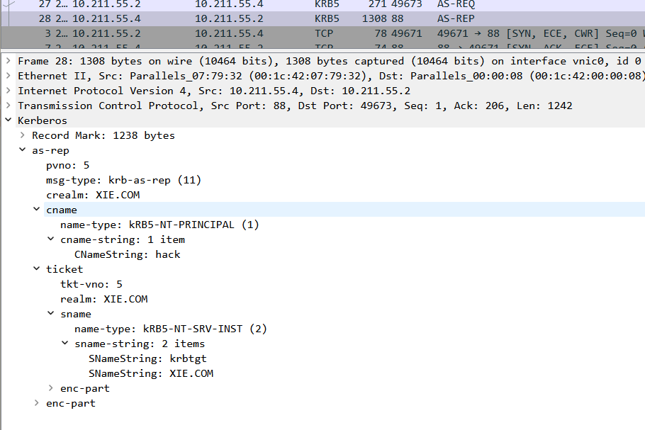

# 域内密码喷洒

域内密码喷洒一般和域内用户名枚举一起使用，可以在无域内有效凭据的情况下，通过枚举出域内存在的用户名，进而对域内存在的用户名进行密码喷洒，以此来获得域内有效凭据。

在 Kerberos 协议认证的 AS-REQ 阶段，请求包 cname 对应的值是用户名。当用户名存在，密码正确和密码错误时，AS-REP 的返回包不一样。所以可以利用这点，对目标域进行**密码喷洒（Password Spraying）攻击**。这种针对所有用户的自动密码猜测通常是为了避免帐户被锁定，因为如果目标域设置了用户锁定策略的话，针对同一个用户的连续密码猜测会导致帐户被锁定。所以只有对所有用户同时执行特定的密码登录尝试，才能增加破解的概率，消除帐户被锁定的概率。**普通的爆破就是用户名固定，爆破密码，但是密码喷洒，是用固定的密码去跑用户名。**

## 域内密码喷洒工具

因此，当攻击者不在域内时，可以先通过域内用户枚举来枚举出域内存在的用户。然后再进行域内密码喷洒，来尝试喷洒出有效的域用户密码。针对域内密码喷洒攻击，网上有很多开源的项目，以下演示使用如下几款工具进行域内密码喷洒

### 1. Kerbrute

项目地址：https://github.com/ropnop/kerbrute

一款使用 go 语言写的域用户枚举和密码喷洒工具。该工具密码喷洒命令如下：

```
./kerbrute_darwin_amd64 passwordspray --dc 10.211.55.4 -d xie.com user.txt P@ssw0rd
```

参数含义如下：

- passwordspray：密码喷洒模式
- --dc：指定域控 ip
- -d：指定域名
- user.txt：用户名字典文件，里面的字典可不加域名后缀

如图所示，运行该工具进行密码喷洒，可以看到喷洒出 hack 和 test 用户的密码均为 P@ss1234。


如图所示，如果我们通过查询得知目标域不存在密码锁定策略的话，


则我们可以针对单个用户进行密码字典爆破，如下命令针对 administrator域管理员进行密码字典爆破。

```
./kerbrute_darwin_amd64 bruteuser --dc 10.211.55.4 -d xie.com pass.txt administrator
```

如图所示，针对 administrator 域管理员进行密码字典爆破，爆破出域管理员 administrator 的密码为 P@ssword1234。


### 2. pyKerbrute

项目地址：https://github.com/3gstudent/pyKerbrute

一款使用 python 写的域用户枚举和密码喷洒脚本。其可以通过 tcp 和 udp两种模式进行工作。user.txt 用户名文件格式不需要加后缀格式。密码喷洒模式下，可以使用明文密码或者密码的 hash。密码喷洒命令如下：

```
#针对明文进行喷洒，tcp 模式和 udp 模式
python2 ADPwdSpray.py 10.211.55.4 xie.com user.txt clearpassword P@ssw0rd tcp
python2 ADPwdSpray.py 10.211.55.4 xie.com user.txt clearpassword P@ssw0rd udp

#针对哈希进行喷洒，tcp 模式和 udp 模式
python2 ADPwdSpray.py 10.211.55.4 xie.com user.txt ntlmhash e19ccf75ee54e06b06a5907af13cef42 tcp
python2 ADPwdSpray.py 10.211.55.4 xie.com user.txt ntlmhash e19ccf75ee54e06b06a5907af13cef42 udp
```

如图所示，利用 pyKerbrute 工具以 TCP/UDP 两种模式进行密码喷洒攻击，可以看到喷洒出 hack 和 test 用户的密码均为 P@ss1234。


## 域内密码喷洒抓包分析

我们针对 user.txt 字典中的如下用户名进行密码喷洒攻击，然后使用WireShark 进行抓包分析。

-  admin 是不存在的用户
-  test 用户密码不为 P@ss1234
-  hack 用户的密码为 P@ss1234


如图所示，然后利用 pyKerbrute 工具进行密码喷洒攻击，可以看到喷洒出hack 用户的密码为 P@ss1234。


在密码喷洒攻击的同时，使用 Wireshark 抓包如图所示：


接下来我们针对这六个包进行分析一下：

如图所示，是第一个 AS-REQ 请求包，其是针对 admin 用户进行预认证的。


如图所示，是第二个 AS-REP 回复包，由于 admin 用户不存在，所以 AS- REP 包返回如下错误：`KRB Error：KRB5KDC_ERR_C_PRINCIPAL_UNKNOWN`


如图所示，是第三个 AS-REQ 请求包，其是针对 test 用户进行预认证的。


如图所示，是第四个 AS-REP 回复包，由于 test 用户的密码错误，所以AS-REP 包返回如下预认证错误 ：` KRB Error：KRB5KDC_ERR_PREAUTH_FAILED`


如图所示，是第五个 AS-REQ 请求包，其是针对 hack 用户进行预认证的。


如图所示，是第六个 AS-REP 回复包，由于密码正确，所以 AS-REP 包返回正常。



## 域内密码喷洒攻击防御

由于域内密码喷洒是**通过发送大量的 AS-REQ 请求包**，根据返回包的内容判断密码是否正确。因此可通过以下方法进行检测：

- 流量层面的话，可通过检测同一 IP 在短时间内是否发送了大量的AS-REQ 请求包来判断。如果同一 IP 在短时间内发送的大量的 AS-REQ请求包(如 1 分钟>30 AS-REQ 包)，则可判断为异常。
- 而日志层面的话，当口令爆破成功时，会产生如图所示事件 ID 为`4768` 且结果代码为 0x0 的审核成功的 Kerberos 身份验证服务事件日志。而口令爆破失败时，默认情况下并不会记录任何日志。因此日志层面不太好检测
  
  <br/>


而针对域密码喷洒攻击进行防御的话，可以要求员工设置**强口令域密码**，这对于域密码喷洒攻击可以起一个很好的防御作用。

注：默认情况下 Windows 系统的日志并不会记录存在的用户名而密码错误发起的 AS-REQ 请求包的日志。如果想开启此记录，需要去组策略中配置审核策略和高级审核策略。并且日志的记录还和通信的 KDC 有关，如果域中存在多个域控，则不同域控上记录的日志并不相同，并不是每个 KDC 上都会记录所有的日志。