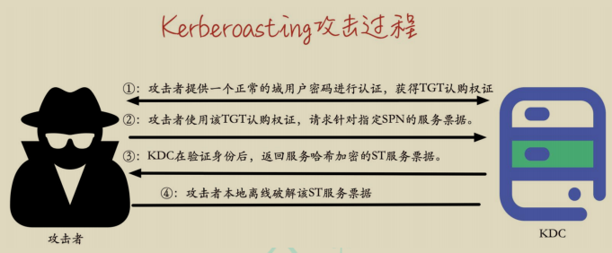

# Kerberoasting 攻击

Kerberoasting攻击发生在Kerberos协议的`TGP_REP`阶段，KDC的TGS服务返回一个由服务哈希加密的ST服务票据给客户端。由于该ST服务票据是用服务哈希经过 `RC4_HMAC_MD5` 加密算法加密的，因此客户端在拿到该 ST 服务票据后可以用于本地离线爆破。如果攻击者的密码字典足够强大，则很有可能爆破出 SPN 链接用户的明文密码。如果该服务在域内被配置为高权限运行的话，那么攻击者可能接管整个域。

**整个过程最核心的点在于攻击者和 KDC 协商 ST 服务票据加密的时候，协商的是使用 `RC4_HMAC_MD5` 加密算法。而该加密算法又相对较容易被破解，因此攻击者能在本地离线爆破。**

## Kerberoasting 攻击过程

如图所示，是 Kerberoasting 攻击的过程：



①：攻击者提供**一个正常的域用户密码**对一个域进行身份认证，KDC 在验证账号密码有效性后，会**返回一个 TGT 认购权证**。该 TGT 认购权证用于以后的 ST服务票据请求。

②：攻击者使用获得的 TGT 认购权证请求针对指定 SPN 的 ST 服务票据。在服务票证请求(TGS-REQ)过程中，攻击者可以指定它们支持的 Kerberos 加密类型为 `RC4_HMAC_MD5(ARCFOUR-HMAC-MD5)`，因为 `RC4_HMAC_MD5` 加密算法相比于其他加密算法更容易被破解。

③：如果攻击者的 TGT 认购权证是有效的，不管攻击者提供的域用户账号有无访问该指定 SPN 服务的权限，KDC 都会查找哪个帐户在`ServicedPrincipalName` 属性中注册了所请求的 SPN，然后用该用户的哈希以`RC4_HMAC_MD5` 加密类型加密 ST 服务票据并在 `TGS-REP` 返回包中发送给攻击者。

④：攻击者从 TGS-REP 中提取加密的 ST 服务票据。 由于该 ST 服务票据是用链接到请求的 SPN 的帐户哈希加密的，所以攻击者可以本地离线破解这个 ST服务票据。如果攻击者的字典足够强大，则可以爆破出该 SPN 所链接账户的明文密码。

注：**Kerberosating 攻击一般只针对注册在用户下的 SPN，因为机器账号的密码是随机生成 128 位字符，是不可能爆破出来的。**

Kerberoasting 攻击在实战中主要分为如下四步：

1. 查询域内注册于域用户下的 SPN
2. 请求指定 SPN 的 ST 服务票据
3. 导出请求的 ST 服务票据
4. 对该导出的 ST 服务票据进行离线爆破

有些工具对第一二步合并在一起，发现了可能存在弱密码的 SPN 后，直接请求该指定 SPN 的服务票据。以下演示几个工具的用法。

### SPN 服务主体名称的发现

这是 `Kerberoasting` 攻击的第一步。首先，发现域内所有注册于域用户下的SPN。默认情况下，域内会有一个注册在 krbtgt 用户下的 `SPN kadmin/changepw`。但是该 SPN 对于` Kerberoasting `攻击是没有意义的，因为`krbtgt `用户的密码是随机生成的，几乎不可能爆破出来。我们可以使用以下几款工具用于进行 SPN 服务主体名称的发现。

#### 1.RiskySPN

RiskySPN 是一个 PowerShell 脚本的集合，专注于检测滥用与 SPN 相关的帐户。该脚本可以帮助我们自动识别弱密码服务票据，根据用户帐户和密码过期时限来查找最容易包含弱密码的票据。如下命令，**该脚本会自动查找并过滤出(自动去除注册于 krbtgt 下的 kadmin/changepw)当前域内注册于域用户下的可能包含弱密码的 SPN 的详细信息**。


```
Import-Module .\Find-PotentiallyCrackableAccounts.ps1;
Find-PotentiallyCrackableAccounts -FullData -Verbose
```

如图所示，运行` Find-PotentiallyCrackableAccounts.ps1 `脚本探测域内注册于用户下的 SPN，可以看到探测出 hack 和 test 用户下注册了 SPN。


#### 2.GetUserSPNs

GetUserSPNs 是 Kerberoast 工具集中查询注册于域内用户下的 SPN 的脚本，**该脚本会查询域内所有注册于用户下的 SPN，包括注册于 krbtgt 下的kadmin/changepw**。该工具集中有 powershell 和 vbs 两种语言的脚本。

其中的 powershell 脚本用法如下：

```
Import-Module .\GetUserSPNs.ps1
```

如图所示，运行` GetUserSPNs.ps1` 脚本进行探测，可以看到探测出 krbtgt、hack 和 test 用户下注册了 SPN。


vbs 脚本的用法如下：

```
cscript .\GetUserSPNs.vbs
```

如图所示，运行 `GetUserSPNs.vbs` 脚本进行探测，可以看到探测出 krbtgt、hack 和 test 用户下注册了 SPN。


#### 3.PowerView.ps1

PowerView.ps1 是 `PowerSpolit` 中 Recon 目录下的一个 powershell 脚本，该脚本可以用于查询过滤出域用户下注册有 SPN 的用户，包括 krbtgt 用户，并返回用户的详细信息。该脚本使用如下：

```
Import-Module .\PowerView.ps1
Get-NetUser -SPN
```

如图所示，使用 `PowerView.ps1` 脚本进行探测，可以看到探测到 krbtgt、hack 和 test 用户下注册了 SPN，并返回了 krbtgt 用户、test 用户和 test 用户的详细信息。


如图所示，可以看到返回了 test 用户和 hack 用户的详细信息。


### 请求服务票据

当过滤出注册于用户下的 SPN 之后，我们就需要请求这些 SPN 的服务票据了。可以使用以下几款工具进行 SPN 服务票据的请求。

#### 1.Impacket 请求

impacket 中的` GetUserSPNs.py `脚本可以请求注册于用户下的所有 SPN 的服务票据。使用该脚本需要**提供域账号密码**才能查询。

如下命令，将请求注册于用户下的所有 SPN 的服务票据并以 hashcat 能破解的格式保存为 hash.txt 文件。

```
python3 GetUserSPNs.py -request -dc-ip 10.211.55.4 xie.com/hack:P@ss1234 -outputfile hash.txt
```

如图所示，运行 `GetUserSPNs.py` 脚本请求注册于用户下的所有 SPN 的服务票据并以 hashcat 能破解的格式保存为 hash.txt 文件。


如下命令，将请求注册于**指定用户**下的 SPN 的服务票据并以 hashcat 能破解的格式保存为 hash2.txt 文件。

```
python3 GetUserSPNs.py -request -dc-ip 10.211.55.4 xie.com/hack:P@ss1234 -outputfile hash2.txt -request-user test
```

如图所示，运行 GetUserSPNs.py 脚本请求注册于 test 用户下的 SPN 的服务票据并以 hashcat 能破解的格式保存为 hash2.txt 文件。


#### 2.使用 Rubeus 请求

Rubeus 里面的 kerberoast 支持对所有用户或者特定用户执行 kerberoasting操作，其**原理在于先用 LDAP 查询域内所有注册在域用户下的 SPN(除了kadmin/changepw)，再通过发送 TGS 包，然后直接打印出能使用 John 或hashcat 爆破的 Hash。**

如下命令会请求注册于用户下的所有 SPN 的服务票据，并以 hashcat 能破解的格式保存为 hash.txt 文件。

```
Rubeus.exe kerberoast /format:john /outfile:hash.txt
```


如下命令会请求注册于用户下指定 SPN 的服务票据，并以 hashcat 能破解的格式保存为 hash2.txt 文件

```
Rubeus.exe kerberoast /spn:MySQL/win7.xie.com:3306 /format:john /outfile:hash2.txt
```

#### 3.powershell 命令请求

如下 powershell 命令用于请求指定 SPN 的服务票据，请求的服务票据保存在内存中。

```
Add-Type -AssemblyName System.IdentityModel
New-Object System.IdentityModel.Tokens.KerberosRequestorSecurityToken -ArgumentList "MySQL/win7.xie.com:3306"
```

如图所示，通过运行 powershell 命令请求指定`SPN"MySQL/win7.xie.com:3306"` 的服务票据。


#### 4.mimikatz 请求

使用 mimikaatzc 存在内存中，命令如下：

```
#请求服务票据
kerberos::ask /target:MySQL/win7.xie.com:3306
#列出服务票据
kerberos::list
#清除所有票据
kerberos::purge
```

如图所示，使用 mimikatz 请求指定 SPN"MySQL/win7.xie.com:3306" 的服务票据。


### 导出服务票据

以上请求服务票据的过程中，有的工具可以直接将票据以 base64 形式打印出来保存为文件，而有的工具会将票据保存在内存中。所以对于保存在内存中的票据，我们可以使用工具将票据从内存中导出来。

#### 1.查看内存中的票据

首先，我们需要查看一下内存中保存的票据。可以使用以下命令查看内存中的票据。直接在 cmd 窗口执行 klist 或者在 mimikatz 下面执行。

```
#直接在 cmd 窗口执行
klist
#在 mimikatz 下面执行
mimikatz.exe "kerberos::list" "exit"
```

如图所示，执行 klist 查看内存中的票据。


使用 mimikatz 查看内存中的票据。


查看了内存中的票据后，我们就需要将票据从内存中导出成文件了。

#### 2.mimikatz 导出票据

执行如下命令，使用 mimikatz 将内存中的票据导出来，执行完成后，会在mimikatz 同目录下导出 后缀为 kirbi 的票据文件。

```
mimikatz.exe "kerberos::list /export" "exit"
```


#### 3.Empire 导出票据

也可以使用 Empire 下的 `Invoke-Kerberoast.ps1` 脚本，可以将内存中的票据以 Hashcat 或 John 能破解的格式打印出来。如下命令，将内存中的票据以Hashcat 能破解的格式打印出来。

```
Import-Module .\Invoke-Kerberoast.ps1;
Invoke-Kerberoast -outputFormat hashcat
```

如图所示，使用 Invoke-Kerberoast.ps1 脚本导出内存中的票据。


### 离线破解服务票据

通过前面几步拿到了.kirbi 票据文件或 hashcat、John 能直接破解的文件。接下来就需要本地离线破解该服务票据了。

#### 1.kerberoast

Kerberoast 是用于攻击 Kerberos 实现的一些工具。该工具中的`tgsrepcrack.p`y 脚本可以对 mimikatz 导出的后缀为`.kirbi` 格式的票据进行爆破。

```
python2 tgsrepcrack.py pass.txt 1-40a10000-hack@SQLServer\~win7.xie.com\~1533\~MSSQL-XIE.COM.kirbi
```


#### 2.tgscrack

该工具先将后缀为 kirbi 格式的票据转换为该工具能破解的格式，然后通过 go语言脚本指定密码文件进行爆破。

```
python2 extractServiceTicketParts.py 1-40a10000-hack@SQLServer\~win7.xie. com\~1533\~MSSQL-XIE.COM.kirbi > hash.txt
go run tgscrack.go -hashfile hash.txt -wordlist pass.txtS
```


#### 3.Hashcat

针对 impacket 和 Rebeus 请求的票据格式，可以使用 hashcat 来进行爆破。

```
hashcat -m 13100 hash.txt pass.txt --force
```

## Kerberoasting 抓包分析

我们通过使用 impacket 执行如下命令请求指定 SPN 服务票据。

```
python3 GetUserSPNs.py -request -dc-ip 10.211.55.4 xie.com/hack:P@ss1234 -outputfile hash.txt -request-user test
```

如图所示，使用 impacket 请求指定 SPN 的服务票据。


在攻击的过程中使用 WireShark 进行抓包分析，如图所示，可以看到攻击过程有四个 Kerberos 相关的包。


如图所示，第一个 AS-REQ 包是使用我们提供的用户 xie\hack 向 KDC 的AS 服务请求 TGT 认购权证


如图所示，第二个 AS-REP 包是 KDC 返回 TGT 认购权证，可以看到，TGT认证权证的加密方式为 `AES256`。


如图所示，第三个 TGS-REQ 包，用上一步拿到的 TGT 认购权证向 KDC 的TGS 服务请求针对 test 用户链接的 SPN 的服务票据。可以看到，请求协商的加密类型有 HMAC_MD5、DES 和 DES3。


如图所示，第四个 TGS-REP 包，KDC 的 TGS 服务返回由指定 SPN 链接的用户的密码哈希加密的服务票据。可以看到，加密类型为 HMAC_MD5。这种加密方式是可以爆破的。


而正常 TGS-REP 回复包的 ST 服务票据的默认加密类型为 AES256，如图所示：


## Kerberoasting 攻击防御

- 确保服务账号密码为强密码、并具有随机性、定期修改。
- Kerberoasting 能成功的最大因素就是 KDC 返回的 ST 服务票据是用 `RC4_HMAC_MD5` 加密算法加密的，攻击者可以比较简单的进行爆破。如果配置强制使用 `AES256_HMAC` 方式对 Kerberos 票据进行加密。那么，即使攻击者获取了 ST 服务票据，也无法将其破解。但是配置强制使用`AES256_HMAC` 加密方式，也存在兼容性问题！
- 许多服务账户在域中被分配了过高的权限，从而导致攻击者在破解出该服务账号的密码后，能迅速进行域内权限提升。因此，应该对域内的服务账号权限进行限制，采取**最小化权限原则**。
- 防守方在检测 Kerberoasting 攻击时，可以进行日志审计，重点关注**事件 ID 为 4769(请求 Kerberos 服务票证操作)的日志**。如果有过多的4769 日志，可以对事件 ID 为 4769 的日志进行筛选。如图所示，是事件ID 为 4769 的日志。然后筛选出票证加密类型为 0x17(RC4-HMAC)的日志，如图所示，是加密类型为 0x17(RC4-HMAC)的日志。


<br/>

- 可以定期使用 zBang 工具检测当前域内危险的 SPN。如图所示，运行 zBang。


然后选择 Risky SPNs，再点击 Launch。如图所示


过一会就可以看到 zBang 运行成功，如图所示


然后我们通过 RiskySPN Results 结果页面可以看到注册在 administrator 帐户下的 test2 SPN，这是个危险的 SPN，如图所示。

