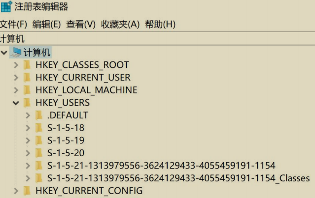
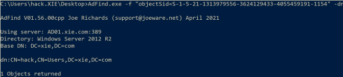
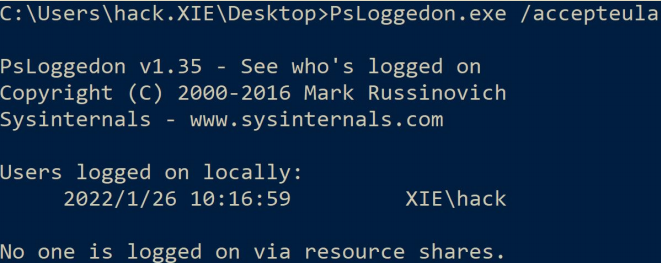
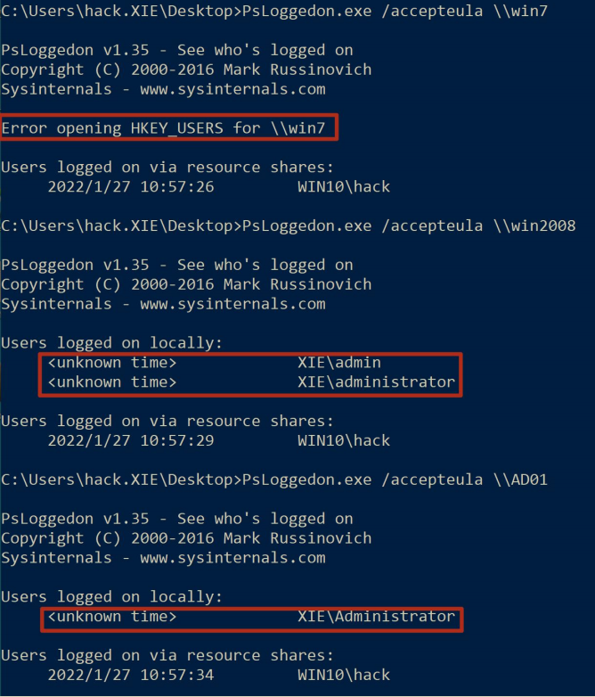
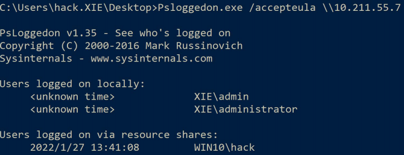
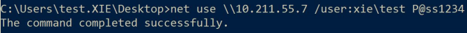
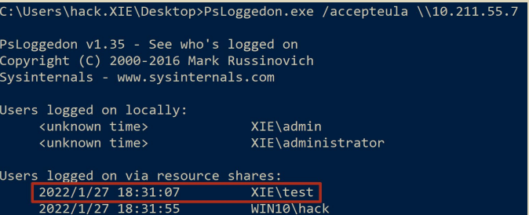
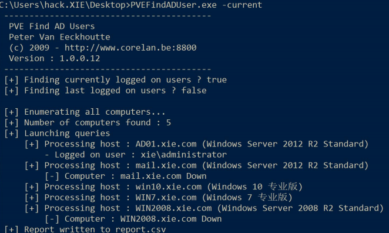
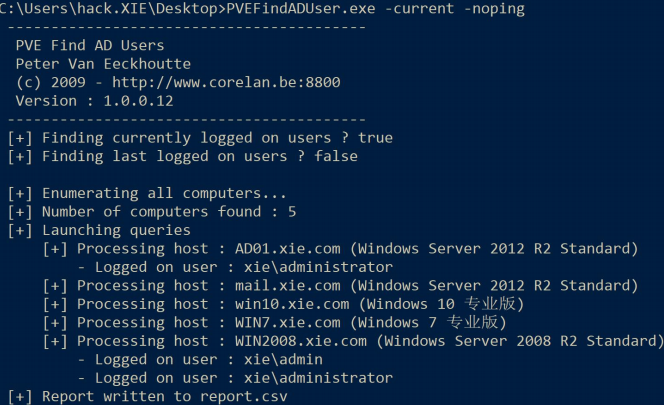
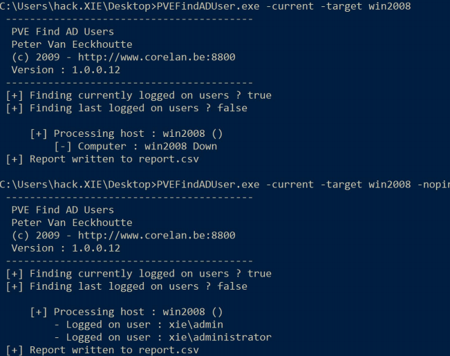

# 定位用户登录的主机

在域横向过程或拿下域控制器之后的后渗透过程，往往需要精确的定位某些用户当前在哪台机器登录着，才有更加针对性的目的去拿下某台主机，从而获得主机上登录着的用户的权限。那么，在域中如何能知道某台机器上当前登录着的用户以及如何能知道指定用户当前登录的主机呢？

## 注册表查询

注册表查询功能，可以在域横向过程中使用普通域用户枚举域内服务器当前登录的用户，原理如下：

当用户登录了某台主机，在该主机的 HKEY_USERS 注册表内会有该用户的文件夹。如图所示，可以看到 HKEY_USERS 注册表下有 S-1-5-21-1313979556-3624129433-4055459191-1154 的文件夹。



使用 adfind 执行如下命令查找 SID 为 S-1-5-21-1313979556-3624129433-4055459191-1154 的用户：

```
AdFind.exe -f "objectSid=S-1-5-21-1313979556-3624129433-4055459191-1154" -dn
```

如图所示，可以看到查询到 SID 为 S-1-5-21-1313979556-3624129433-4055459191-1154 对应的用户为 hack。说明 hack 用户登录着当前机器！



因此，我们可以通过远程连接机器，查看其注册表项值来知道谁在登录目标机器。远程查看注册表项这个操作可以通过 API 来实现，我们可以遍历域内所有机器，查询机器正在登陆的用户。并且该 API 域内普通用户即可调用查询。

但是需要注意以下三点:

- 默认 PC 机器是没有开启注册表远程连接的，因此 PC 机器无法查询当前登录的用户。
- 默认服务器开启了注册表远程连接，因此服务器可以查询当前登录的用户。
- 域内任何用户，即使配置了不能本地 RDP 登录域内机器 A，但是只要域内机器 A 开启了远程注册表连接，我们就可以通过 API 查询机器 A 的注册表，查询正在登陆的用户。

以下演示两款比较好用的工具：Psloggedon.exe 和 PVEFindADUser.exe，这两个工具都是使用注册表来查询目标机器当前登录的用户。

## Psloggedon

这是一款微软官方提供的可以查询服务器当前登录用户的工具。该工具的原理是通过检查注册表 HKEY_USERS 项的 Key 值 和 通过 NetSessionEnum API 来枚举网络会话。该工具在实现查询指定用户登录的主机功能时有问题，因此以下不演示。**该工具的运行不需要域管理员权限，只需要普通域用户权限即可。**

### (1) 查询本机登录的用户

```
PsLoggedon.exe /accepteula
```



### (2) 查询指定主机登录的用户

在域中，仅需要一个普通域用户权限，就可枚举出域内所有服务器(包括域控)当前的登录用户。由于 PC 机器默认没有开启注册表远程连接，因此 PC 机器无法查询当前登录的用户；而服务器默认开启注册表远程连接，因此服务器可以查询当前登录的用户。

使用 Psloggedon.exe 分别执行如下命令查询指定主机 win7、win2008、AD01 和10.211.55.7 机器当前登录的用户。

```
#查询 win7 机器当前登录的用户，由于 PC 机器默认没有开启注册表远程连接，所以查询会失败
PsLoggedon.exe /accepteula \\win7
#查询 win2008 服务器当前登录的用户
PsLoggedon.exe /accepteula \\win2008
#查询 AD01 域控当前登录的用户
PsLoggedon.exe /accepteula \\AD01
#查询 10.211.55.7 服务器器当前登录的用户
PsLoggedon.exe /accepteula \\10.211.55.7
```

如图所示，当查询 win7 机器登录的用户，由于 PC 机器默认没有开启注册表远程连接，所以查询会失败；查询 win2008 机器登录的用户，查询出 xie\admin 和xie\administrator 用户；查询 AD01 机器登录的用户，查询出 xie\administrator用户。



如图所示，查询指定 ip10.211.55.7 主机当前登录的用户，可以看到查询出当前登录着 xie\admin 和 xie\administrator 用户。



我们注意到这里还有一行 Users logged on via resource shares，如图所示：


这个是目标主机通过资源共享远程登录的用户，这里将会显示当前用户Win10\hack 通过资源共享登录到目标主机，因为这个接口的查询是通过NetSessionEnum API 来枚举网络会话的，需要先登录才能枚举该网络会话。

如图所示，我们在 win7 机器上通过 net use 命令远程连接 10.211.55.7 机器。



然后再次查询 10.211.55.7 机器当前登录的用户，如图所示，可以看到多了一个XIE\test。这里就是通过远程资源共享连接的用户。



## PVEFindADUser

这是一款使用 C#语言写的可用于查询指定主机当前登录用户的工具。该工具的原理是通过检查注册表 HKEY_USERS 项的 Key 值来确定目标主机当前登录的用户。该工具的运行不需要域管理员权限，只需要普通域用户即可。

以下是该工具的参数说明：

参数：

-  -h：该参数显示帮助信息
-  -u：该参数检查程序是否有新版本
-  -v：该参数显示详细信息
-  -current ：该参数显示域中每台机器上当前登录的用户。如果指定用户名，那么显示该用户登录过的机器。如果不指定用户名，所有用户登录的机器都将显示。
-  -last：该参数显示域中机器上最后登录的用户。如果指定用户名，那么只显示该用户上次登录的机器。如果不指定用户名，则将显示所有具有上次登录用户的机器。需要说明的是，指定的用户名需要包含域名，如xie\administrator。如果在用户名中加了，如 xie*admin，则将查询用户名中带有 admin 的用户当前登录的主机。
-  -noping：该参数用于指定在探测之前不对目标计算机执行 ping 命令。
-  -target：该参数用于指定要查询的主机，可以是主机名也可以是 ip。如果未指定此参数，将查询当前域中的所有主机。如果指定了此参数，则后跟一个由逗号分隔的主机名列表，如host.xie.com,host2.xie.com,host3.xie.com 或192.168.10.1,192.168.10.2,192.168.10.3。
-  -os：将目标机器操作系统信息写入 cvs 文件。如果是直接查询计算机，此此选项不输出任何东西。
-  -stopfound：在找到第一个匹配项时停止搜索。此参数仅在查找当前已登录的用户时有效。

### (1) 查询所有主机当前的登录用户

使用 PVEFindADUser.exe 分别执行如下命令可以查询域中所有机器上当前登录的所有用户。查询结果将被输出到 report.csv 文件中。

```
#查询域中所有机器当前登录的用户
PVEFindADUser.exe -current

#查询域中所有机器当前登录的用户，不通过 ping 检测目标机器是否开启
PVEFindADUser.exe -current -noping

#查询域中所有机器当前登录的用户，不通过 ping 检测目标机器是否开启，并且将主机的操作系统写入 report.csv 文件
PVEFindADUser.exe -current -noping -os
```

如图所示，查询域中所有机器当前登录的用户。可以看到查询出 AD01 机器当前登录着 xie\administrator 用户。mail 机器由于关机所以显示 down。win10 和 win7机器由于是 PC 机器，所以查询不出来。win2008 机器由于开启了防火墙，因此ping 不通，所以该工具认为 win2008 机器 down 了。



如图所示，查询域中所有机器当前登录的用户，指定-noping 参数，不通过 ping探测目标机器是否开启。可以看到查询出 AD01 机器当前登录着xie\administrator 用户。mail 机器由于关机所以显示 down。win10 和 win7 机器由于是 PC 机器，所以查询不出来。win2008 机器即使开启了防火墙禁止 ping，也查询出当前登录着 xie\admin 和 xie\administrator 用户。



### (2) 查询指定主机当前的登录用户

```
#查询 win2008 主机当前登录的用户
PVEFindADUser.exe -current -target win2008
#查询 win2008 主机当前登录的用户，不使用 ping 探测目标主机是否存活
PVEFindADUser.exe -current -target win2008 -noping
#查询 win2008 和 ad01 主机当前登录的用户，不使用 ping 探测目标主机是否存活
PVEFindADUser.exe -current -target win2008,ad01 -noping
#查询 10.211.55.7 主机当前登录的用户，不使用 ping 探测目标主机是否存活
PVEFindADUser.exe -current -target 10.211.55.7 -noping
#查询 10.211.55.7 和 10.211.55.4 主机当前登录的用户，不使用 ping 探测目标主机是否存活
PVEFindADUser.exe -current -target 10.211.55.7,10.211.55.4 -noping
#查询 win7 主机当前登录的用户
PVEFindADUser.exe -current -target win7
```

如图所示，当不加-noping 时，由于 win2008 机器防火墙开启无法 ping 通，所以该工具认为 win2008 机器 down 了。当加了-noping 参数时，不使用 ping 检测目标机器是否开启，此时探测到 win2008 机器当前登录着 xie\admin 和xie\administrator 用户。



### (3) 查询指定用户当前登录的主机

使用 PVEFindADUser.exe 执行如下命令查询指定用户当前登录的主机。该工具会一个一个列出域内服务器当前是否登录着指定用户。需要注意的是，为了准确性，强烈建议加上-noping 参数。

```
#查询 xie\administrator 用户当前登录的主机
PVEFindADUser.exe -current xie\administrator -noping
#查询 xie\administrator 用户当前登录的主机，找到了一个即停止寻找
PVEFindADUser.exe -current xie\administrator -noping -stopfound
```