# 目录

```
NTLM协议详解
    SSP和SSPI的概念
        1.SSPI
        2.SSP
    LM Hash加密算法
        加密流程
    NTLM Hash 加密算法
        1.NTLM Hash 加密流程
        2.Windows系统存储的NTLM Hash
    NTLM 协议认证
        1.工作组环境下的 NTLM 认证
            工作组环境下的 NTLM 抓包分析
        2.域环境下的 NTLM 认证
        3.Net-NTLM hash组成
        4.NTLM v1 和 NTLM v2 的区别
            Challenge 质询值：
            Net-NTLM Hash 使用的加密算法：
    NTLM 协议的安全问题
        1.Pass The Hash
        2.NTLM Relay
        3.Net-NTLM v1 Hash 破解
```

# NTLM协议详解

NTLM(New Technolopy LAN Manager)身份验证协议是微软用于**Windows身份验证**的主要协议之一。早期SMB协议以明文口令的形式在网络上传输，因此产生了安全性问题。后来出现了`LM(LAN Manager)`身份验证协议，它是如此的简单以至于很容易被破解。后来微软提出了NTLM身份验证协议，以及更新的NTLM V2版本。**NTLM协议既可以为工作组中的机器提供身份验证，也可以用于域环境身份验证。NTLM协议可以为SMB,HTTP,LDAP,SMTP等上层微软应用提供身份验证。**

## SSP和SSPI的概念

我们首先了解两个基本概念：SSPI和SSP

### 1.SSPI

**SSPI**(Security Service Provider Interface或 Security Support Provider Interface，安全服务提供**接口**)是Windows定义的一套接口，该接口定义了与安全有关的功能函数，包括但不限于：

- 身份验证机制
- **为其他协议提供的Session Security 机制**。Session Security指的是会话安全，即为通讯数据提供完整性校验以及数据的加解密功能。

SSPI接口定义了与安全有关的功能函数，用来获取验证，信息完整性，信息隐私等安全功能，该接口只是定义了一套接口函数，但是并没有实现具体的内容。

### 2.SSP

**SSP**(Security Service Provider , 安全服务提供**者**)是SSPI的实现者，微软自己实现了如下的SSP，用于提供安全服务功能，包含但不限于：

- NTLM SSP：Windows NT 3.51 中引入(msv1_0.dll) ，为 Windows 2000之前的客户端-服务器域和非域身份验证（SMB/CIFS）提供 NTLM 质询/响应身份验证。
- Kerberos SSP：Windows 2000 中引入，Windows Vista 中更新为支持AES(kerberos.dll)，Windows 2000 及更高版本中首选的客户端-服务器域相互身份验证。
- Digest SSP：Windows XP 中引入(wdigest.dll) ，在 Windows 与Kerberos 不可用的非 Windows 系统间提供基于 HTTP 和 SASL 身份验证的质询/响应。
- Negotiate SSP：Windows 2000 中引入(secur32.dll) ，默认选择Kerberos，如果不可用则选择 NTLM 协议。Negotiate SSP 提供单点登录能力，有时称为集成 Windows 身份验证（尤其是用于 IIS 时）。在Windows 7 及更高版本中，NEGOExts 引入了协商使用客户端和服务器上支持的已安装定制 SSP 进行身份验证。
- Cred SSP：Windows Vista 中引入，Windows XP SP3 上也可用(credssp.dll)，为远程桌面连接提供单点登录（SSO）和网络级身份验证。
- Schannel SSP：Windows 2000 中引入(Schannel.dll)，Windows Vista 中更新为支持更强的 AES 加密和 ECC[6]该提供者使用 SSL/TLS 记录来加密数据有效载荷。
- PKU2U SSP：Windows 7 中引入(pku2u.dll) ， 在不隶属域的系统之间提供使用数字证书的对等身份验证。

因为SSPI中定义了与Session Security有关的API。所以上层应用利用任何SSP与远程的服务进行了身份验证后，此SSP都会为本次连接生成一个随机Key。这个随机Key被称为**Session Key**。上层应用在经过身份验证后，可以选择性地使用这个Key对之后发往服务端或接受自服务端的数据进行签名或加密。在系统层面，SSP就是一个dll，用来验证身份验证等安全功能。不同的SSP，实现的身份验证机制是不一样的。比如NTLM SSP 实现的就是一种*<u>基于质询/响应身份验证机制</u>*，而Kerberos SSP实现的就是*<u>基于Ticket票据的身份验证机制</u>*。我们可以编写自己的SSP，然后注册到操作系统中，让操作系统支持我们自定义的身份验证方法。

SSP、SSPI 和各种应用的关系如图 1-1 所示。

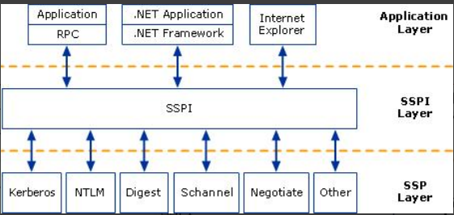

相关：https://learn.microsoft.com/zh-cn/windows/win32/secauthn/sspi-model

https://learn.microsoft.com/zh-cn/windows/win32/secauthn/ssp-packages-provided-by-microsoft

## LM Hash加密算法

LM(LAN Manager)身份验证是微软推出的一个身份认证协议，其使用的加密算法是LM Hash算法。HM Hash本质是DES加密，尽管LM Hash较容易被破解，但是为了保证系统的兼容性，Windows只是将LM Hash禁用了(从 Windows Vista 和 Windows Server 2008 开始，Windows 默认禁用了 LM Hash)。LM Hash明文密码被限定在14位以内，也就是说，如果要停止使用LM Hash，将用户的密码设置为14位以上即可。

**如果 LM Hash 的值为：aad3b435b51404eeaad3b435b51404ee，说明 LMHash 为空值或者被禁用了。**

### 加密流程

LM Hash 的加密流程如下，我们以口令 P@ss1234 为例演示：

1）将用户的明文口令转换为大写,并转换为 16 进制字符串。

P@ss1234 -> 大写 = P@SS1234 -> 转为十六进制 = 5040535331323334

2）如果转换后的 16 进制字符串的长度不足 14 字节(长度 28)，用 0 来补全。

5040535331323334 -> 用 0 补全为 14 字节(长度 28) = 5040535331323334000000000000

3）将 14 字节分为两组，每组 7 字节转换为二进制数据，每组二进制数据长度为56 比特位。如图所示。

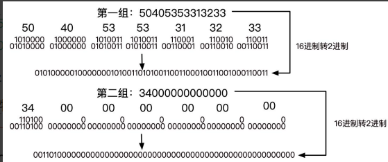

4）将每组二进制数据按7比特位为一组，分为8组，每组末尾加0，再转换成16 进制，这样每组也就成了8字节长度的16进制数据了。如图所示。

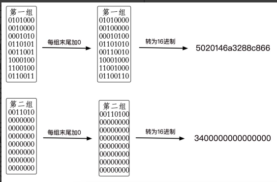

5）将上面生成的两组16进制数据，分别作为DES加密密钥对字符串“KGS!@#$%”进行加密。然后将DES加密后的两组密文进行拼接，得到最终的LMHASH值。如图所示。

KGS!@#$%转为16进制为：4B47532140232425

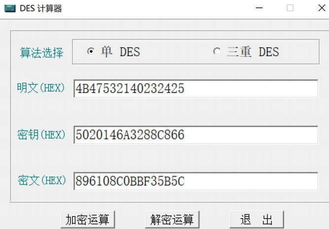

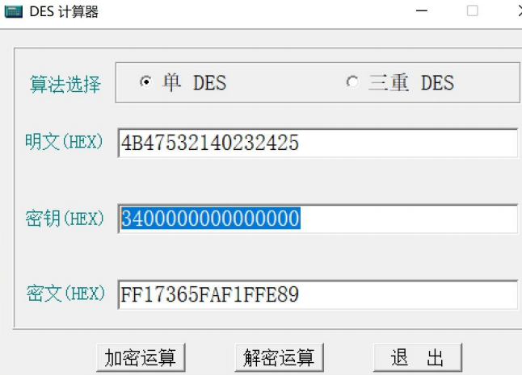

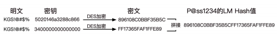

LM Hash 加密代码实现如下(Python2)：

```python
# coding=utf-8
import base64
import binascii
from pyDes import *
import hashlib,binascii
import md5

def DesEncrypt(str, Des_Key):
    k = des(Des_Key, ECB, pad=None)
    EncryptStr = k.encrypt(str)
    return binascii.b2a_hex(EncryptStr)


def Zero_padding(str):
    b = []
    l = len(str)
    num = 0
    for n in range(l):
        if (num < 8) and n % 7 == 0:
            b.append(str[n:n + 7] + '0')
            num = num + 1
    return ''.join(b)

if __name__ == "__main__":

    test_str = raw_input("please input a string: ")

    # 用户的密码转换为大写
    test_str = test_str.upper()
    print('\033[91m'+"转换为大写:"+'\033[0m')
    print(test_str)
    #转换为16进制字符串
    test_str = test_str.encode('hex')
    print('\033[91m'+"转换为16进制字符串:"+'\033[0m')
    print(test_str)
    str_len = len(test_str)

    # 密码不足14字节将会用0来补全
    if str_len < 28:
        test_str = test_str.ljust(28, '0')
        print('\033[91m'+"不足14字节(长度28)，用0来补全:"+'\033[0m')
        print(test_str)

    # 固定长度的密码被分成两个7byte部分
    t_1 = test_str[0:len(test_str) / 2]
    t_2 = test_str[len(test_str) / 2:]
    print('\033[91m'+"将14字节分为两组，每组7字节"+'\033[0m')
    print(t_1)
    print(t_2)

    # 每部分转换成比特流，并且长度位56bit，长度不足使用0在左边补齐长度
    t_1 = bin(int(t_1, 16)).lstrip('0b').rjust(56, '0')
    t_2 = bin(int(t_2, 16)).lstrip('0b').rjust(56, '0')
    print('\033[91m'+"转换为二进制数据，每组二进制数据长度为56比特位"+'\033[0m')
    print(t_1)
    print(t_2)

    # 再分7bit为一组末尾加0，组成新的编码
    t_1 = Zero_padding(t_1)
    t_2 = Zero_padding(t_2)
    print('\033[91m'+"将每组二进制数据按7比特位为一组，分为8组，每组末尾加0"+'\033[0m')
    print(t_1)
    print(t_2)
    # print t_1
    t_1 = hex(int(t_1, 2))
    t_2 = hex(int(t_2, 2))

    t_1 = t_1[2:].rstrip('L')
    t_2 = t_2[2:].rstrip('L')
    print('\033[91m'+"两组分别转换为16进制字符串"+'\033[0m')
    print(t_1)
    print(t_2)

    if '0' == t_2:
        t_2 = "0000000000000000"
    t_1 = binascii.a2b_hex(t_1)
    t_2 = binascii.a2b_hex(t_2)

    # 上步骤得到的8byte二组，分别作为DES key为"KGS!@#$%"进行加密。
    LM_1 = DesEncrypt("KGS!@#$%", t_1)
    LM_2 = DesEncrypt("KGS!@#$%", t_2)
    print('\033[91m'+"上步骤得到的8byte二组，分别作为DES key为\"KGS!@#$%\"进行加密"+'\033[0m')
    print("LM_1:"+LM_1)
    print("LM_1:"+LM_2)

    # 将二组DES加密后的编码拼接，得到最终LM HASH值。
    print('\033[91m'+"将二组DES加密后的编码拼接，得到最终LM HASH值"+'\033[0m')
    LM_Hash = LM_1 + LM_2
    print ("LM_Hash:"+LM_Hash)
```

代码运行效果如图所示。

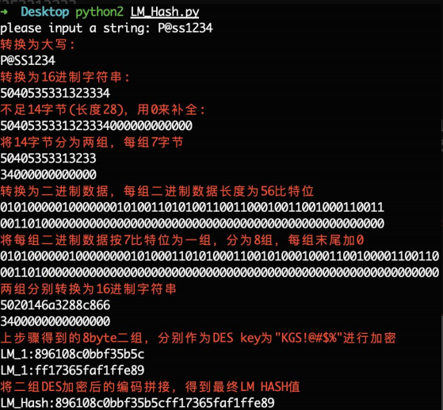

## NTLM Hash 加密算法

为了解决LM Hash加密和身份验证方案中固有的安全弱点，微软于 1993 年在Windows NT 3.1 中首次引入了 NTLM (New TechnologyLAN Manager ) Hash。下图 1-3 是各个 Windows 版本对 LM Hash 和 NTLM Hash 的支持。也就是说，微软从 Windwos Vista 和 Windows Server 2008 开始，默认禁用了 LM Hash，只存储 NTLM Hash，而 LM Hash 的位置则为空：**aad3b435b51404eeaad3b435b51404ee**

不同 Windows 系统版本对 LM 和 NTLM 的支持如图 1-3 所示。

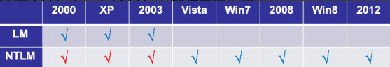

NTLM Hash 算法是微软为了在提高安全性的同时保证兼容性而设计的散列加密算法。NTLM Hash 是基于 MD4 加密算法进行加密的。

下面我们来看看 NTLM Hash 的加密流程。

### 1.NTLM Hash 加密流程

NTLM Hash 的加密方程如下，可以看到 NTLM Hash 是由明文密码经过三步加密而成：

NTLM Hash = md4(unicode(hex(password)))

NTLM Hash 的加密流程分为三步，具体如下：

1）先将用户密码转换为 16 进制格式。
2）再将 16 进制格式的字符串进行 ASCII 转 Unicode 编码。
3）最后对 Unicode 编码的 16 进制字符串进行标准 MD4 单向哈希加密。

如下可以看到 P@ss1234 通过 NTLM Hash 的加密流程一步步加密成为 NTLM

Hash：74520a4ec2626e3638066146a0d5ceae。

```
P@ss1234 -> 转为十六进制 = 5040737331323334
5040737331323334 -> ASCII 转 Unicode 编码 = 50004000730073003100320033003400
50004000730073003100320033003400 -> MD4 加密 = 74520a4ec2626e3638066146a0d5ceae
```

NTLM Hash 加密代码实现如下(Python3)：

```python
# coding=utf-8
from Cryptodome.Hash import MD4
import binascii
from cprint import cprint

#转为16进制格式
def str_to_hex(string):
  return ' '.join([hex(ord(t)).replace('0x', '') for t in string])

#再将16进制格式的字符串进行ASCII转Unicode编码
def hex_to_unicode(string):
  return string.replace(" ","00")+"00"

#最后对Unicode编码的16进制字符串进行标准MD4单向哈希加密
def unicode_to_md4(string):
  m = MD4.new()
  m.update(binascii.a2b_hex(string))
  return m.hexdigest()

if __name__ == "__main__":
    string = input("please input a string: ")
    HEX = str_to_hex(string)
    cprint.err("HEX编码:")
    print(HEX)
    Unicode = hex_to_unicode(HEX)
    cprint.err("ASCII转Unicode编码")
    print(Unicode)
    NTLm_Hash = unicode_to_md4(Unicode)
    cprint.err("对Unicode编码的16进制字符串进行标准MD4单向哈希加密得到NTLM Hash")
    print(NTLm_Hash)
```

代码运行效果如图

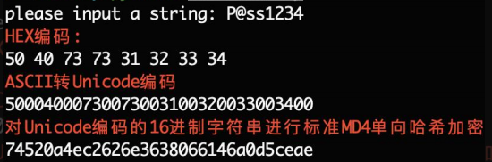

又或者直接一条 python 命令即可，如下。

```
python3 -c 'import hashlib,binascii; print("NTLM_Hash:"+binascii.hexlify(hashlib.new("md4", "P@ss1234".encode("utf-16le")).digest()).decode("utf-8"))'
```

直接一条 Python 命令进行 NTLM Hash 加密：

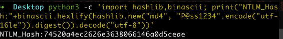

### 2.Windows系统存储的NTLM Hash

用户的密码经过NTLM Hash加密后存储在`%SystemRoot%\system32\config\SAM`文件里面

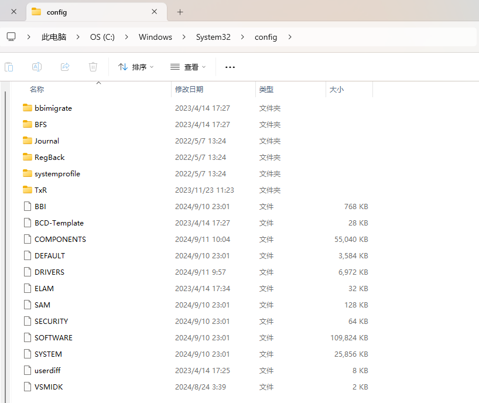

当用户输入密码进行本地认证的过程中，所有的操作都是在本地进行的。**系统将用户输入的密码转换成NTLM Hash，然后与SAM文件中的NTLM Hash进行比较，相同说明密码正确，反之错误。**当用户注销，重启，锁屏后，操作系统会让`winlogon.exe`显示登陆界面，也就是输入框。当winlogon.exe接受输入后，将密码交给`lsass.exe`进程。lsass.exe进程中会存一份明文密码，将明文密码加密成NTLM Hash，与SAM数据库进行比较认证。我们使用mimikatz就是从lsass.exe进程中抓取明文密码或者密码哈希。使用mimikatz抓取lsass内存中的凭据如图。

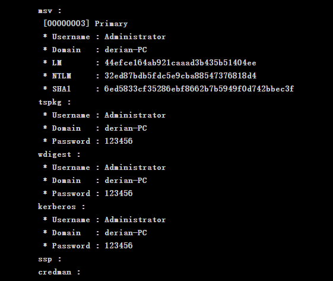

使用 MSF 或者 CobaltStrike 通过转储哈希抓到的密码格式如下，**第一部分是用户名，第二部分是用户的 SID 值，第三部分是 LM Hash，第四部分是 NTLMHash，其余部分为空。**

```
用户名:用户 SID 值:LM Hash:NTLM Hash:::
```

从 Windows Vista 和 Windows Server 2008 开始，由于默认禁用了 LM Hash，因此第三部分的 LM Hash 固定为空值，第四部分的 NTLM-Hash 才是用户密码加密后的凭据。

使用 CobaltStrike 的转储哈希功能转储目标机器内存中的凭据如图

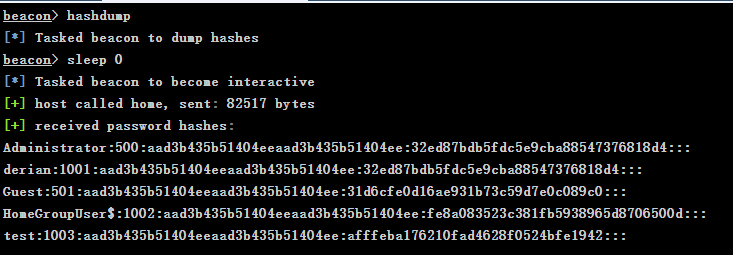

## NTLM 协议认证

NTLM 身份认证协议是一种**基于 Challenge/Response 质询响应验证机制**，由三种类型消息组成：

- type 1(协商，Negotiate)：双方确定传输协议的版本、明文用户名。
- type 2(质询，Challenge)：生成Challenge
- type 3(认证，Auth)：发送Response

NTLM 身份认证协议有 NTLM v1 和 NTLM v2 两个版本，目前使用最多的是NTLM v2 版本。**NTLM v1 与 NTLM v2 最显著的区别就是 Challenge 质询值与加密算法不同，共同之处就是都是使用的 NTLM Hash 进行加密。**

### 1.工作组环境下的 NTLM 认证

工作组环境下的 NTLM 认证流程图如图

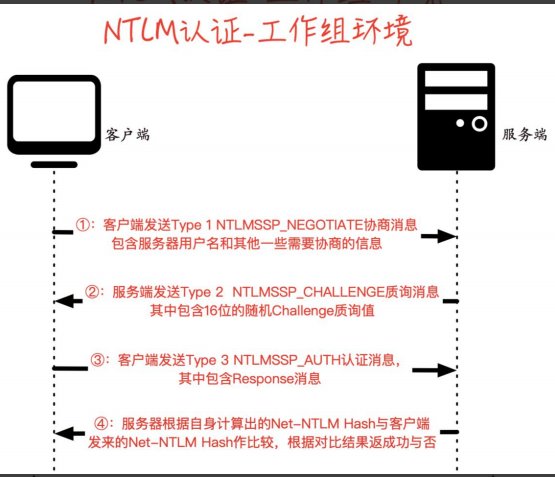

工作组环境下 NTLM 认证流程可以分为如下 4 步。

1.当客户端要访问服务器上某个受保护的服务时，需要输入服务器的用户名和密码进行验证。此时客户端会在本地缓存一份服务器密码的NTLM hash，然后向服务器发送协商消息。

2.服务器收到客户端的协商信息后，生成并回复质询消息。该消息中包含了一个由服务端生成的16位随机值challenge，服务器也会在本地缓存该值。

3.客户端收到质询消息后，会使用步骤1中缓存的服务器的NTLM hash对Challenge进行加密生成Response，接着再生成`Net-NTLM hash=Challenge+Response+用户名`等，再将`Net-NTLM hash`封装到身份验证消息中发往服务器。

4.服务器在收到身份验证消息后，用自己密码的NTLM hash对Challenge进行加密生成Response2，并比较Response2与Response是否一致。如果一致，就证明客户端掌握了服务器的密码，认证成功，否则认证失败。

> 由于 NTLM 只是底层的认证协议，其必须镶嵌在上层应用协议里面，消息的传输依赖于使用 NTLM 的上层协议，比如 SMB、HTTP 等。

#### 工作组环境下的 NTLM 抓包分析

实验环境工作组

- 主机A：192.168.125.129
- 主机B：192.168.125.130

主机A访问主机B的共享并成功认证时

```
 net use \\192.168.125.130\c$ win7.com /user:administrator
```

可以看到整个过程分为4步

- Session Setup Request, NTLMSSP_NEGOTIATE 协商
- Session Setup Response, Error: STATUS_MORE_PROCESSING_REQUIRED, NTLMSSP_CHALLENGE 返回challenge
- Session Setup Request, NTLMSSP_AUTH, User: \administrator 提交ntlm hash
- Session Setup Response 返回认证成功

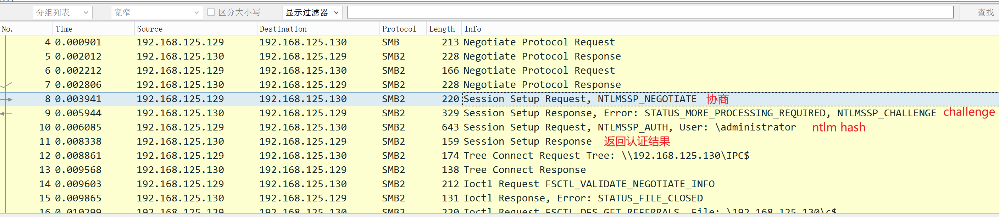

当认证失败时，整个认证过程也是4步，前三步和认证成功的过程一致，只有最后一步不一致

- Session Setup Request, NTLMSSP_NEGOTIATE 协商
- Session Setup Response, Error: STATUS_MORE_PROCESSING_REQUIRED, NTLMSSP_CHALLENGE 返回challenge
- Session Setup Request, NTLMSSP_AUTH, User: \administrator 提交ntlm hash
- Session Setup Response, Error: STATUS_LOGIN_FAILURE 返回认证失败

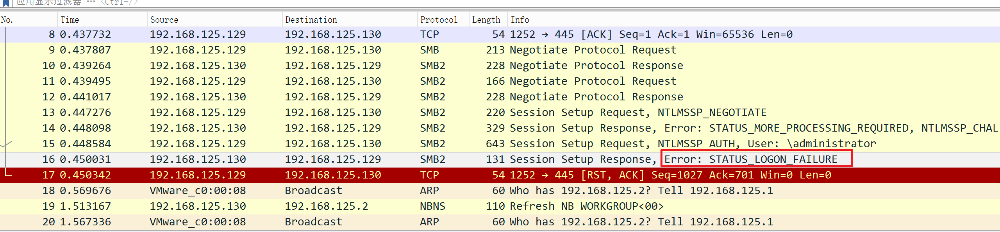

在认证的整个过程中，不过认证成功还是失败，都会返回challenge，前面的认证原理已经讲过。那返回的challenge在哪里了？

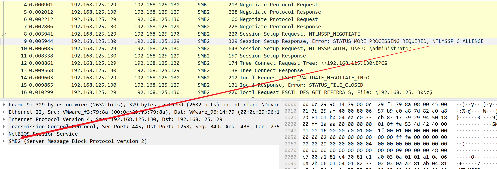

如下，NTLM Server Challenge: 745d99992196a1b2，这个16位长的字符串就是challenge

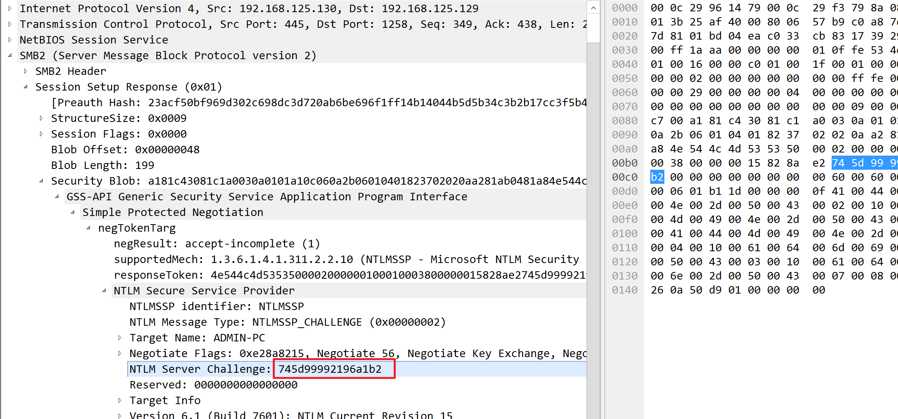

> 我们打开每个认证包发现，NTLM 认证的数据包都是放在 GSS-API 里面的.
> 
> GSS-API(Generic Security Service Application Program Interface，通用安全服务应用程序接口)，是一种统一的模式，为使用者提供与机制无关，平台无关，程序语言环境无关，并且可移植的安全服务。程序员在编写应用程序时，可以应用通用的安全机制，因此开发者不必针对任何特定的平台、安全机制、保护类型或传输协议来定制安全实现。SSPI 是 GSS-API 的一个专有变体，进行了扩展并具有许多特定于 Windows 的数据类型。SSPI 生成和接受的令牌大多与 GSS-API 兼容。而这里 NTLM SSP 实现了 SSPI，因此也相当于实现了 GSS-API。并且注册为SSP 的一个好处就是，SSP 实现了与安全有关的功能函数，因此上层协议(比如SMB、HTTP、LDAP)在进行身份认证等功能的时候，就可以不用考虑协议细节，只需要调用相关的函数即可。而认证过程中的流量嵌入在上层协议里面，不像Kerbreos，既可以镶嵌在上层协议里面，也可以作为独立的应用层协议。

### 2.域环境下的 NTLM 认证

域环境下的 NTLM 认证流程图

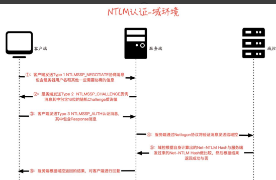

在域环境中，由于**所有域用户的哈希值都存储在域控制器的`NTDS.dit`中**，服务器本身无法计算Response消息，因此需要与域控建立一个安全通道，并通过域控完成最后的认证流程。前三个步骤同工作组环境的认证

1.当域用户输入自己的账号和密码登录客户端主机时，客户端会将用户输入的密码转换为NTLM hash并缓存。当用户想访问域内某台服务器上的资源时，客户端会向服务器发送TYPE1 Negotiate消息
2.同NTLM在工作组环境中的认证
3.同NTLM在工作组环境中的认证
------------------------------------------------------------------------------------------------------------------------------------------------------------

4.服务器收到客户端发来的TYPE 3消息后，会将消息通过 `Netlogon`协议转发给域控制器。
5.域控制器根据TYPE 3消息中的用户名获取该用户名的NTLM hash，用NTLM hash对原始的Challenge进行加密并生成Response，然后将其与TYPE 3消息中Response对比。如果一致，就证明客户端掌握了服务器密码，认证成功，否则认证失败。
6.服务器根据域控返回的验证结果，对客户端进行相应的回复。

### 3.Net-NTLM hash组成

Net-NTLM hash v2的格式如下

```
username::domain:challenge:HMAC-MD5:blob
```

username和domain如下所示，这里domain为NULL即为空

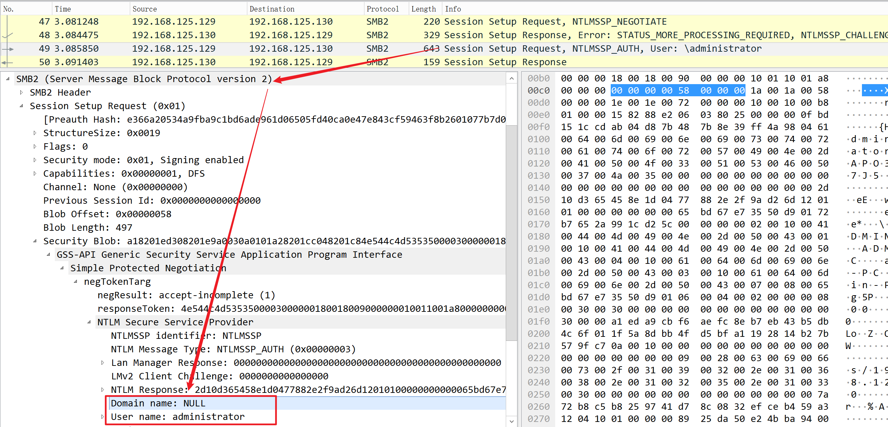

challenge

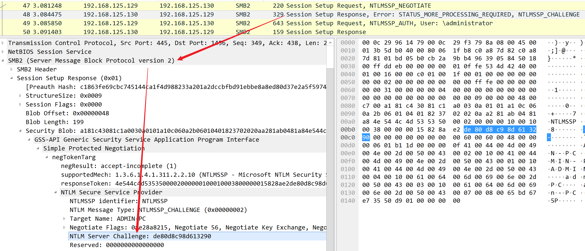

HMAC-MD5对应数据包中的NTProofStr

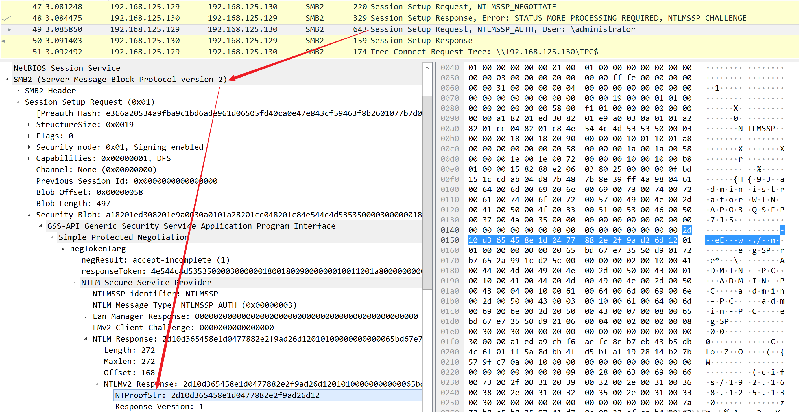

blob对应NTLM Response值中去掉NTProofStr值后剩余的后半部分，如下

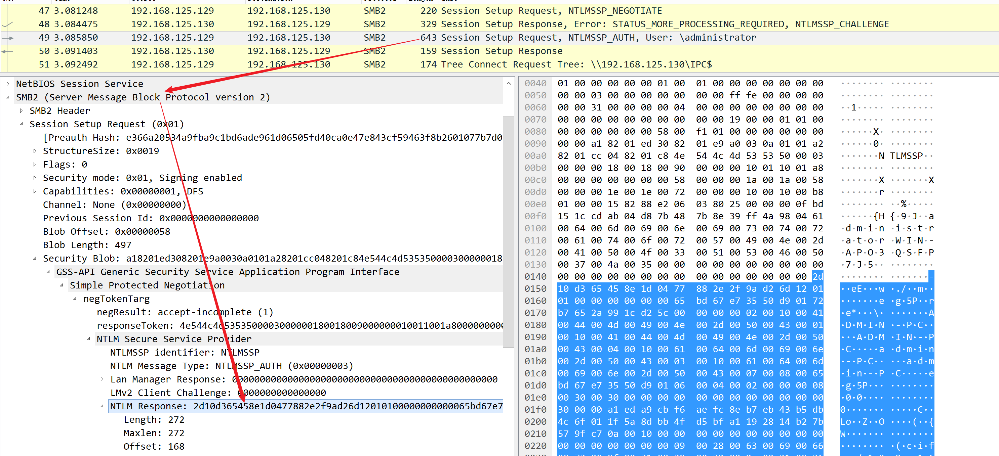

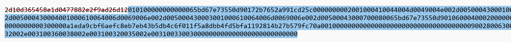

所以完整的NTLMv2数据为如下，此数据为Net-NTLM hash。

```
username::domain:challenge:HMAC-MD5:blob
administrator::: de80d8c98d613290: 2d10d365458e1d0477882e2f9ad26d12:010100000000000065bd67e73550d90172b7652a991cd25c0000000002001000410044004d0049004e002d005000430001001000410044004d0049004e002d005000430004001000610064006d0069006e002d005000430003001000610064006d0069006e002d00500043000700080065bd67e73550d90106000400020000000800300030000000000000000000000000300000a1eda9cbf6aefc8eb7eb43b5db4c6f011f5a8dbb4fd5bfa1192814b27b579fc70a001000000000000000000000000000000000000900280063006900660073002f003100390032002e003100360038002e003100320035002e00310033003000000000000000000000000000
```

然后使用hashcat即可破解,把hash放进hash.txt中，执行如下

```
hashcat.exe -m 5600 hash.txt pass.txt
```

获取出明文密码win7.com


### 4.NTLM v1 和 NTLM v2 的区别

NTLM v1身份认证协议和NTLM v2身份认证协议是NTLM 身份认证协议的不同版本。目前使用最多的是NTLM v2版本。NTLM v1与NTLM v2最显著的区别就是Challenge质询值不同和加密算法不同，共同之处就是都是使用的是NTLM Hash进行加密。

#### Challenge 质询值：

– NTLM v1： 8 字节
– NTLM v2：16 字节

#### Net-NTLM Hash 使用的加密算法：

– NTLM v1：DES 加密算法
– NTLM v2：HMAC-MD5 加密算法

## NTLM 协议的安全问题

在上面NTLM认证的流程中我们可以看到，在Type 3 Auth认证消息中是使用用户密码的Hash计算的。因此当我们没有拿到用户密码的明文而只拿到Hash的情况下，我们可以进行**Pass The Hash(PTH)**攻击，也就是大家所说的哈希传递攻击。同样，还是在Type3消息中，存在Net-NTLM Hash，当攻击者获得了 Net- NTLM Hash 后，可以进行中间人攻击，重放 Net-NTLM Hash，这种攻击手法也
就是大家所说的 **NTLM Relay(NTLM 中继)**攻击。并且由于 NTLM v1 版本协议加密过程存在天然缺陷，可以对 Net-NTLM v1 Hash 进行爆破，得到 NTLM Hash。拿到 NTLM Hash 后即可进行横向移动。

### 1.Pass The Hash

Pass The Hash(PTH)哈希传递攻击是内网横向移动的一种方式。主要原因是NTLM认证过程中使用的是用户密码的NTLM Hash 来进行加密。因此当我们获取到了用户密码的 NTLM Hash 而没有解出明文时，我们可以利用该 NTLM Hash 进行哈希传递攻击，对内网其他机器进行 Hash 碰撞，碰撞到使用相同密码的机器。然后通过 135 或 445 端口横向移动到使用该密码的其他机器。

### 2.NTLM Relay

NTLM Relay 其实严格意义上并不能叫 NTLM Relay，而是应该叫 Net-NTLM Relay。它是**发生在 NTLM 认证的第三步**，在 Response 消息中存在 Net-NTLM Hash，当攻击者获得了 Net-NTLM Hash 后，可以进行中间人攻击，重放 Net- NTLM Hash，这种攻击手法也就是大家所说的 NTLM Relay(NTLM 中继)攻击。

### 3.Net-NTLM v1 Hash 破解

由于 NTLM v1 身份认证协议加密过程存在天然缺陷，**只要获取到 Net-NTLM v1Hash，都能破解为 NTLM hash**，这与密码强度无关。在域环境中这更有效，因为域中使用 hash 即可远程连接目标机器。如果域控允许发送 NTLM v1 响应的话，我们就可以通过与域控机器进行 NTLM 认证，然后抓取域控的 Net-NTLM v1Hash，破解为 NTLM Hash。使用域控的机器账号和哈希即可导出域内所有用户哈希！

但是自从 Windows Vista 开始，微软就默认使用 NTLM v2 身份认证协议，要想降级到 NTLM v1 的话，需要手动进行修改，并且需要目标主机的*管理员权限*才能进行操作。

如下操作开启目标主机支持 NTLM v1 响应：

打开本地安全策略——>安全设置——>本地策略——>安全选项——>网络安全:LAN 管理器身份验证级别。

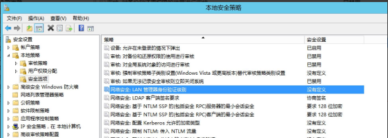

然后将其修改为仅发送 NTLM 响应，如图

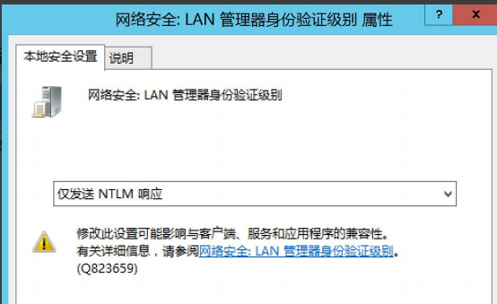

或者可以执行如下命令修改注册表：

```
#修改注册表开启 Net-NTLM v1:
reg add HKLM\SYSTEM\CurrentControlSet\Control\Lsa\ /v lmcompatibilitylevel /t
REG_DWORD /d 2 /f
#为确保 Net-NTLMv1 开启成功，再修改两处注册表键值
reg add HKLM\SYSTEM\CurrentControlSet\Control\Lsa\MSV1_0\ /v NtlmMinClient
Sec /t REG_DWORD /d 536870912 /f
reg add HKLM\SYSTEM\CurrentControlSet\Control\Lsa\MSV1_0\ /v RestrictSendi
ngNTLMTraffic /t REG_DWORD /d 0 /f
```

执行命令修改注册表成功！

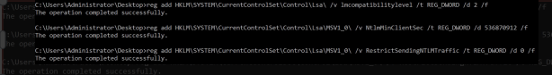