# Kerberos 协议详解

Kerberos协议是由麻省理工学院提出的一种网络身份验证协议，提供了一种在开放的非安全网络中认证识别用户身份信息的方法。它旨在通过使用密钥加密技术为客户端/服务端应用程序提供强身份验证。Kerberos 是西方神话中守卫地狱之门的三头犬的名字。之所以使用这个名字是因为 ***Kerberos 需要三方的共同参与才能完成一次认证流程***。目前主流使用的 Kerberos 版本为KerberosV5 版本，Windows、Linux 和 Mac OS 均支持 Kerberos 协议。


## Kerberos 基础

在 Kerberos 协议中，主要有以下三个角色：

- 访问服务的客户端：Kerberos 客户端是代表需要访问资源的用户进行操作的应用程序，例如打开文件、查询数据库或打印文档。每个 Kerberos 客户端在访问资源之前都会请求身份验证。
- 提供服务的服务端：域内提供服务的服务端，服务端都有一个独一的SPN。
- 提供认证服务的 KDC(Key Distribution Center，密钥分发中心)：KDC 密钥发行中心是一种网络服务，它向活动目录域内的用户和计算机提供会话票据和临时会话密钥，其服务帐户为 `krbtgt`。KDC 作为活动目录域服务ADDS 的一部分运行在每个域控制器上。

这里说一下 krbtgt 帐户，该用户是在创建活动目录时系统自动创建的一个账号，其作用是 **KDC 密钥发行中心的服务账号**，其密码是*系统随机生成*的，无法正常登陆主机。

如图所示，可以看到 krbtgt 帐户的信息。


Kerberos是一种**基于票据Ticket的认证方式**。客户端想要访问服务端的某个服务，首先需要购买服务端认可的**ST服务票据(Service Ticket)**.也就是说，客户端在访问服务之前需要先购买好票，等待服务验票之后才能访问。但是这张票并不能直接购买，需要一张**TGT认购权证(Ticket Granting Ticket)**.也就是说，客户端在买票之前必须先获得一张TGT认购权证。***TGT认购权证和ST服务票据均是由KDC(密钥分发中心)发放***；因为KDC是运行在域控制器上的，所以说<u>TGT认购权证和ST服务票据均是由域控发放的</u>。

Kerberos 使用 TCP/UDP 88 端口进行认证，使用 TCP/UDP 464 端口进行密码重设。

如图所示，可以看到域控制器 AD01 上开放的 88 和 464 端口。


Kerberos 中一些名词的简称及含义：

```
简称                全拼
DC                  Domain Controller，域控
krbtgt              KDC 密钥发行中心服务账户
KDC                 Key Distribution Center：密钥分发中心，由域控担任
AD                  Active Directory：活动目录，里面包含域内用户数据库
AS                  Authentication Service：认证服务
TGT                 Ticket Granting Ticket：TGT 认购权证，由 KDC 的 AS 认证服务发放
TGS                 Ticket Granting Service：票据授予服务
ST                  Service Ticket：ST 服务票据，由 KDC 的 TGS 票据授予服务发放
```

Kerberos 协议有两个基础认证模块：`AS_REQ & AS_REP 和 TGS_REQ &TGS_REP` ，以及微软扩展的两个认证模块 `S4U` 和 `PAC` 。S4U 是微软为了实现委派而扩展的模块，分为 `S4U2Self` 和 `S4U2Proxy` 。在 Kerberos 最初设计的流程里只说明了如何证明客户端的真实身份，但是并没有说明客户端是否有权限访问该服务，因为在域中不同权限的用户能够访问的资源是不同的。因此微软为了解决权限这个问题，引入了 `PAC (Privilege Attribute Certificate，特权属性证书)`的概念。

在分析 AS_REQ & AS_REP 和 TGS_REQ & TGS_REP 之前，我们先来看看什么是 PAC。

## PAC 特权属性证书

`PAC (Privilege Attribute Certificate，特权属性证书)`，其中所包含的是各种授权信息、附加凭据信息、配置文件和策略信息等。例如用户所属的用户组， 用户所具有的权限等。在最初的 RFC1510 中规定的标准 Kerberos 认证过程中并没有PAC，微软在自己的产品中所实现的 Kerberos 流程加入了 PAC 的概念，**因为在域中不同权限的用户能够访问的资源是不同的，因此微软设计 PAC 用来辨别用户身份和权限.**

在一个正常的 Kerberos 认证流程中，KDC 返回的 TGT 认购权证和 ST 服务票据中都是带有 PAC 的。这样做的好处就是在以后对资源的访问中， 服务端再接收到客户请求的时候不再需要借助 KDC 的帮助提供完整的授权信息来完成对用户权限的判断， 而**只需要根据请求中所包含的 PAC 信息直接与本地资源的 ACL 相比较做出裁决**。

###  PAC 在 kerberos 中的优缺点

那么 PAC 的存在究竟给我们的验证过程带来了哪些优点，亦或是缺点呢？

正如上面所提到的那样，PAC 的引入其实带来了很多的优点。客户端在访问网络资源的时候服务端不再需要向 KDC 查询授权信息， 而是直接在本地进行 PAC 信息与 ACL 的比较。从而节约了网络资源。

如图所示， 在没有 PAC 的情况下，Server 与 KDC 之间必须进行用户授权信息的查询与返回 ：

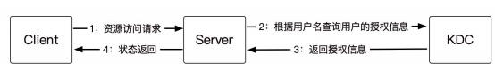

当引入 PAC 之后则变成了如图所示：

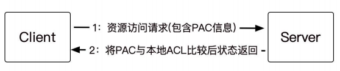

但是，PAC 的引入并不是百利而无一害的，PAC 在用户的认证阶段引入会导致认证耗时过长。Windows Kerberos 客户端会通过 RPC 调用 KDC 上的函数来验证 PAC 信息，这时候用户会观察到在服务器端与 KDC 之间的 RPC 包流量的增加。而另一方面， 由于 PAC 是微软特有的一个特性，所以启用了 PAC 的域中将不支持装有其他操作系统的服务器， 制约了域配置的灵活性。并且在 2014 年，由于 PAC 的安全性导致产生了一个域内极其严重的提权漏洞 `MS14-068`

## Kerberos协议流程

大致流程如下：


参与的角色有：

- Client: Application Client 应用客户端
- AS: Authentication Server 用来认证用户身份,认证服务器，专门用来认证客户端的身份并发放客户用于访问TGS的**TGT(票据授予票据)**
- TGS: Ticket-Granting Service 用来授权服务访问,票据授予服务器，用来发放整个认证过程以及客户端访问服务端时所需的**服务授予票据(ticket)**
- SS: Service Server 用户所请求的服务
- 客户端(Client)：发送请求的一方
- 服务端(Server)：接收请求的一方
- 密钥分发中心(Key distribution KDC),密钥分发中心又分为两个部分，分别是：AS,TGS.

Kerberos协议的应用流程可以概括为以下几步:

1. 用户登录域并向域控制器的认证服务(AS)发送用户名与域名,请求 Ticket Granting Ticket(TGT)。
2. AS使用用户密码(或NTLM哈希)进行加密运算,生成TGT并返回用户。TGT中包含用户与TGS之间的会话密钥。
3. 用户访问应用或资源时,向域控制器的票证授予服务(TGS)提交TGT以及应用服务器的ID,请求服务票证(ST)。
4. TGS验证TGT有效性,使用TGT中的会话密钥对用户与应用服务器之间的新会话密钥加密,生成ST并返回用户。
5. 用户向应用服务器提交ST以验证身份。应用服务器使用TGS提供的会话密钥解密ST,获取会话密钥并验证用户身份。
6. 应用服务器针对该用户的这次访问生成访问令牌(Access Token),并将其包含在响应消息返回用户。
7. 用户随后每次访问应用服务器都需要提供 Access Token 进行身份验证。应用服务器解密令牌,使用会话密钥验证用户身份并对请求授权。
8. Access Token 和 ST 在一定时间后过期,用户需重新向TGS申请新的ST来继续访问。TGS发出新的ST时也重新生成会话密钥。
9. 用户定期更换密码时,所有TGT、ST、Access Token等也随之无效,用户需重新认证并申请,以确保安全。

打个比方，整个过程就是：你想坐飞机，但是机场告诉你必须有机票（TGT）才可以登机，接着你去购票处（AS）出示身份证（Client name）购买了一张机票（TGT），你拿着机票登机，在检票处（TGS）出示机票，服务人员告诉了你的座位号（Ticket），然后就可以坐到自己的位置上。

我们可以通过以下几个例子来形象理解Kerberos协议的应用流程:

1. TGT获取:这就像到电影院买票,先去售票处买一张可以观看所有电影的通用票。TGT就像这个通用电影票,可以访问Kerberos领域内的所有服务。
2. ST申请:这就像通用票允许进入电影院,但每个电影场次都需要买对应的电影票方可入场。ST就像观看各个电影的门票,每个服务都需要对应的ST方可访问。
3. 会话密钥:这就像电影开始时放映员会发放3D眼镜,只有带上特定电影的3D眼镜才能正常观看。Kerberos的会话密钥就像3D眼镜,只有使用正确的密钥才能解密通信内容。
4. 更新机制:这就像电影院会定期更新电影列表,旧票无法使用;3D眼镜也需要定期更换。Kerberos的更新机制就像这些措施,可以定期更新TGT、ST、令牌等,使过期信息无法使用。
5. 密码更换:这就像电影院换票系统时需要观众全部办理新的会员卡。Kerberos的密码更换会使之前的认证信息全部无效,必须全部重新申请。
6. 细粒度访问控制:这就像不同电影有不同的票价和观众限制。Kerberos为每个服务生成不同的ST,就像每个电影有不同的门票,实现了详细的访问控制。
7. 单点登录:这就像会员卡可以观看电影院内全部电影。TGT实现了单点登录,一个认证后可以访问Kerberos领域内的全部服务。

## Kerberos 实验

为了更直观的分析 Kerberos 协议，接下来我们用普通域帐户 xie/hack 使用`impacket` 工具请求 win10 机器的 cifs 服务票据 ，然后远程 SMB 连接，在该过程中使用 WireShark 进行抓包。

实验环境如下：

- 用户(xie/hack)：10.211.55.2
- 域内主机(Win10)： 10.211.55.16
- 域控(AD01)： 10.211.55.4

impacket 使用命令如下：

```
#使用 hack 账号密码请求 win10 的 cifs 服务的 ST 服务票据
python3 getST.py -dc-ip 10.211.55.4 -spn cifs/win10.xie.com xie.com/hack:P@ss1234

#导入该 ST 服务票据
export KRB5CCNAME=hack.ccache

#使用 smb 远程连接 win10
python3 smbexec.py -no-pass -k win10.xie.com
```

如图所示，可以看到在请求了服务票据后，成功远程 SMB 连接 win10 机器。

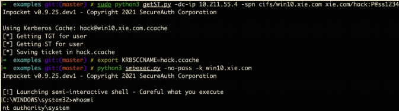

在这个过程中，我们使用 WireShark 抓包，来进一步的分析 Kerberos 协议。如图所示，是该过程的抓包图：

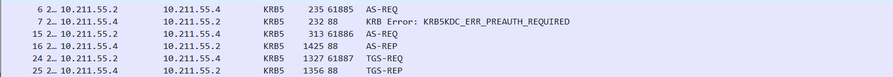

整个 Kerberos 认证流程如图所示：

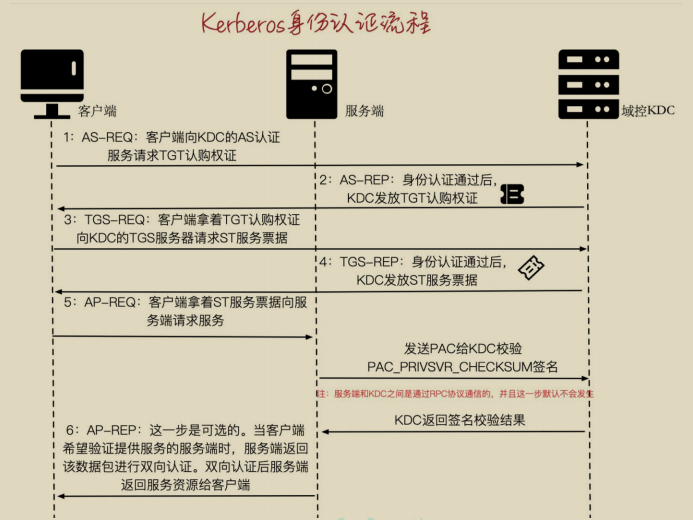

下面我们来具体分析 Kerberos 认证流程的每个步骤：

### AS-REQ & AS-REP

我们先来看看 AS-REQ&AS-REP 请求部分，也就是 WireShark 抓的第一、二个包，如图所示：

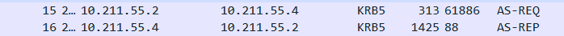

如图所示，是一个简易的 AS-REQ&AS-REP 请求过程图，便于我们直观的了解AS-REQ&AS-REP 请求过程。

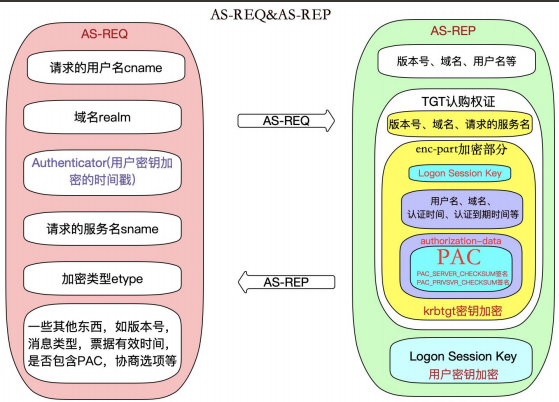

#### 1.AS-REQ 请求包分析

AS-REQ：当域内某个用户想要访问域内某个服务时，于是输入用户名和密码，本机就会向 KDC 的 AS 认证服务发送一个 AS-REQ 认证请求。该请求包中包含如下信息：

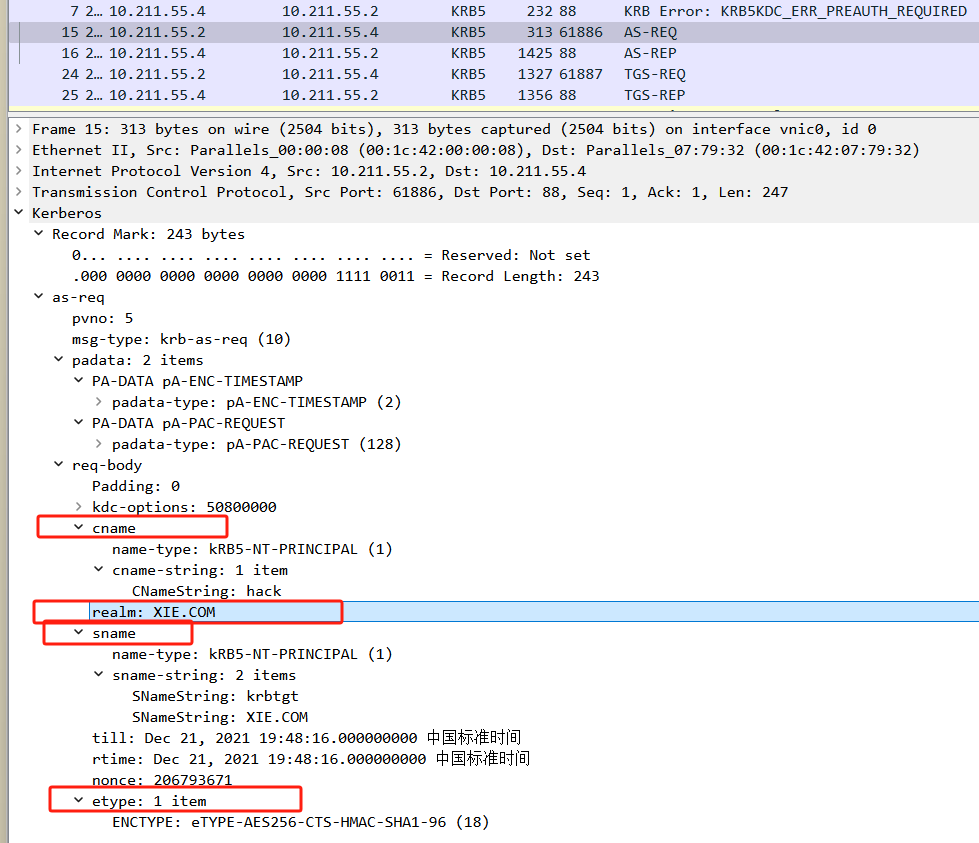

- 请求的用户名(cname)。
- 域名(realm)。
- Authenticator：一个抽象的概念，代表一个验证。这里是用户密钥加密的时间戳。
- 请求的服务名(sname)：AS-REQ 这个阶段请求的服务都是 krbtgt。
- 加密类型(etype)。
- 以及一些其他信息：如版本号，消息类型，票据有效时间，是否包含PAC，协商选项等。

#### 2.AS-REP 回复包分析

AS-REP：当 KDC 的 AS 认证服务接收到客户端发来的 AS-REQ 请求后，从活动目录数据库中取出该用户的密钥，然后用该密钥对请求包中的` Authenticator `预认证部分进行解密，如果解密成功，并且时间戳在有效的范围内，则证明请求者提供的用户密钥正确。KDC 的 AS 认证服务在成功认证客户端的身份之后，发送AS-REP 响应包给客户端。AS-REP 响应包中主要包括如下信息：

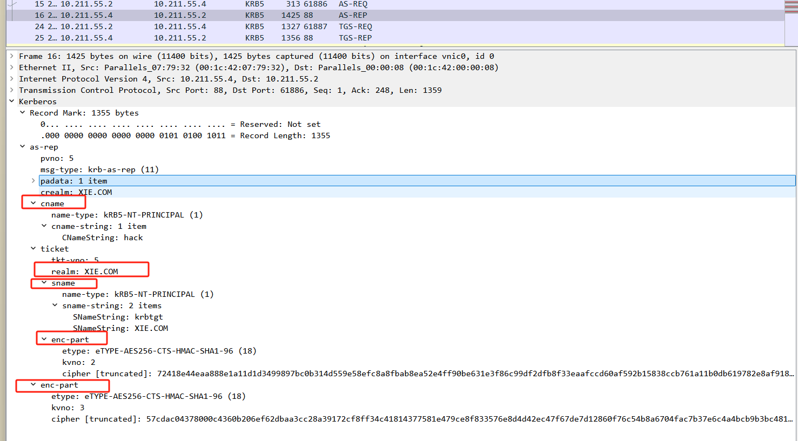

-  请求的用户名(cname)。
-  域名(crealm)。
-  TGT 认购权证：包含明文的版本号，域名，请求的服务名，以及加密部分enc-part。加密部分用 krbtgt 密钥加密。加密部分包含` Logon SessionKey`、用户名、域名、认证时间、认证到期时间和 `authorization-data`。`authorization-data `中包含最重要的 PAC 特权属性证书(包含用户的 RID，用户所在组的 RID) 等。
-  enc_Logon Session Key：使用用户密钥加密 `Logon Session Key` 后的值，其作用是用于确保客户端和 KDC 下阶段之间通信安全。也就是 AS- REP 中最外层的 `enc-part`。
-  以及一些其他信息：如版本号，消息类型等。

### TGS-REQ & TGS-REP

我们再来看看 TGS-REQ&TGS-REP 请求部分，也就是 WireShark 抓的第三、四个包，如图所示：

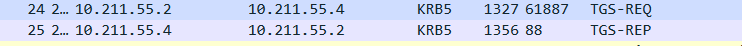

如图所示，是一个简易的 TGS-REQ&TGS-REP 请求过程图，便于我们直观的了解 TGS-REQ&TGS-REP 请求过程。

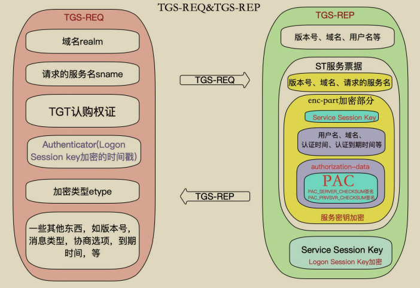

## Kerberos 协议的安全问题


在 AS-REQ 请求阶段，是用用户密码 Hash 或 AES Key 加密的时间戳。因此当只获得了用户密码 Hash 时，也可以发起 AS-REQ 请求，所以也就造成了 **PTH 哈希传递攻击**；当只获得用户密码的 AES Key 时，也可以发起 AS-REQ 请求，所以也就造成了 **PTK 密钥传递攻击**。

而 AS-REQ 请求包中 cname 字段的值代表用户名，这个值存在和不存在，返回的包有差异，所以可以用于枚举域内用户名，这种攻击方式被称为 **域内用户枚举攻击 (当未获取到有效域用户权限时，可以使用这个方法枚举域内用户)**。并且当用户名存在，密码正确和密码错误时，返回的包也不一样，所以可以进行用户名密码爆破。但是在实战中，渗透测试人员通常都会使用一种被称为 **密码喷洒（Password Spraying）**的攻击方式来进行测试和攻击。对密码进行喷洒式的攻击，这个叫法很形象，因为它属于自动化密码猜测的一种。这种针对所有用户的自动密码喷洒通常是为了避免帐户被锁定，因为针对同一个用户的连续密码猜测会导致帐户被锁定。所以只有对所有用户同时执行特定的密码登录尝试，才能增加破解的概率，消除帐户被锁定的概率。普通的爆破就是用户名固定，爆破密码，但是<u>*密码喷洒是用固定的密码去跑所有的用户名*</u>。

在 AS-REP 阶段，由于返回的 TGT 认购权证是*<u>由 krbtgt 用户的密码 Hash 加密</u>*的，因此如果我们拥有 krbtgt 的密码 hash 就可以自己制作一个 TGT 认购权证，这种攻击方式被称为**黄金票据攻击**。同样，在 TGS-REP 阶段，TGS_REP 里面的 ST 服务票据是<u>*使用服务的 hash 进行加密*</u>的，如果我们拥有服务的 hash，就可以签发任意用户的 ST 服务票据，这个票据也被称为白银票据，这种攻击方式被称为**白银票据攻击**。相较于黄金票据，白银票据使用要访问服务的 hash，而不是krbtgt 的 hash。

在 AS-REP 阶段，Login session key 是用用户密码 Hash 加密的。对于域用户，如果设置了“Do not require Kerberos preauthentication”不需要预认证选项，此时攻击者向域控制器的 88 端口发送 AS_REQ 请求，此时域控不会做任何验证就将 TGT 认购权证 和 该用户 Hash 加密的 Login Session Key 返回。因此，攻击者就可以对获取到的 用户 Hash 加密的 Login Session Key 进行离线破解，如果破解成功，就能得到该用户的密码明文，这种攻击方式被称为 **AS-REPRoasting 攻击**。

在 TGS-REP 阶段，由于 ST 服务票据是用服务 Hash 加密的。因此，如果我们能获取到 ST 服务票据，就可以对该 ST 服务票据进行利息破解，得到服务的Hash，这种攻击方式被称为 **Kerberoasting 攻击**。这个问题存在的另外一个因素是因为用户向 KDC 发起 TGS_REQ 请求，不管用户对服务有没有访问权限，只要TGT 认购权证正确，那么 KDC 都会返回 ST 服务票据。其实 AS_REQ 里面的服务就是 krbtgt，也就是说这个攻击方式同样可以用于爆破 AS_REP 里面的 TGT 认购权证，但是之所以没见到这种攻击方式是因为 krbtgt 的密码是随机生成的，爆破不出来。