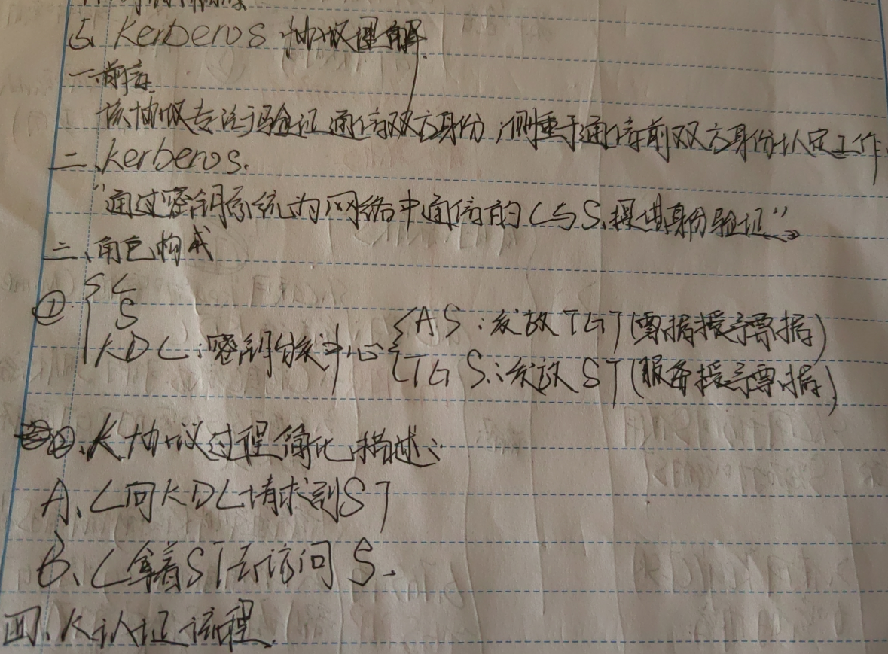
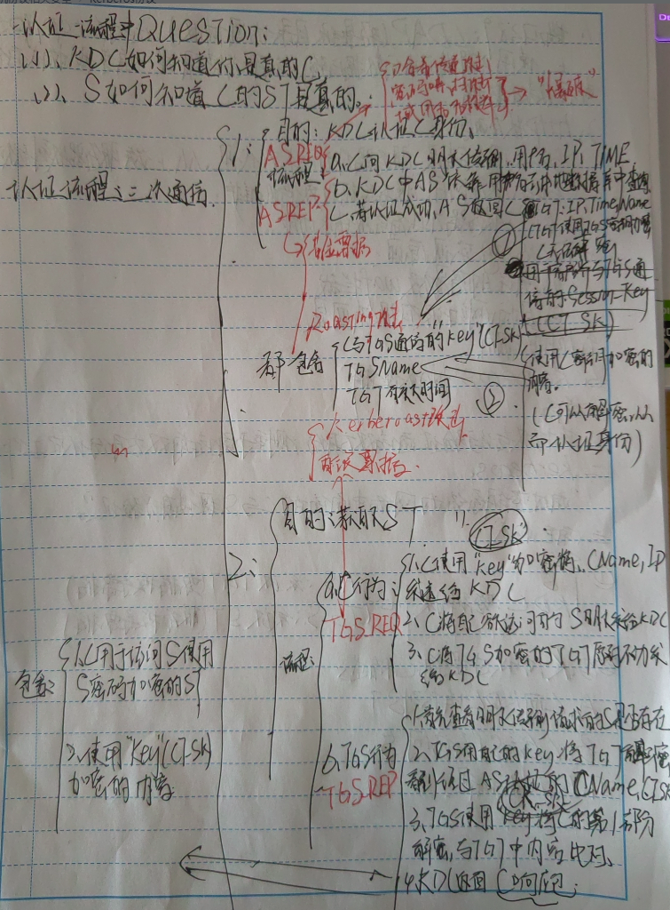
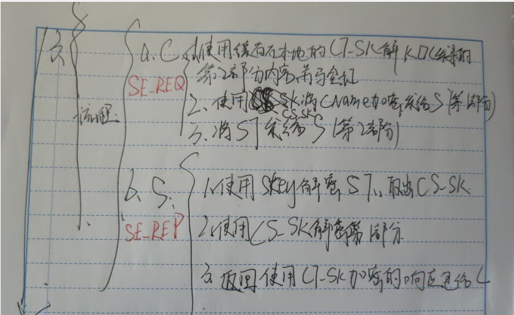
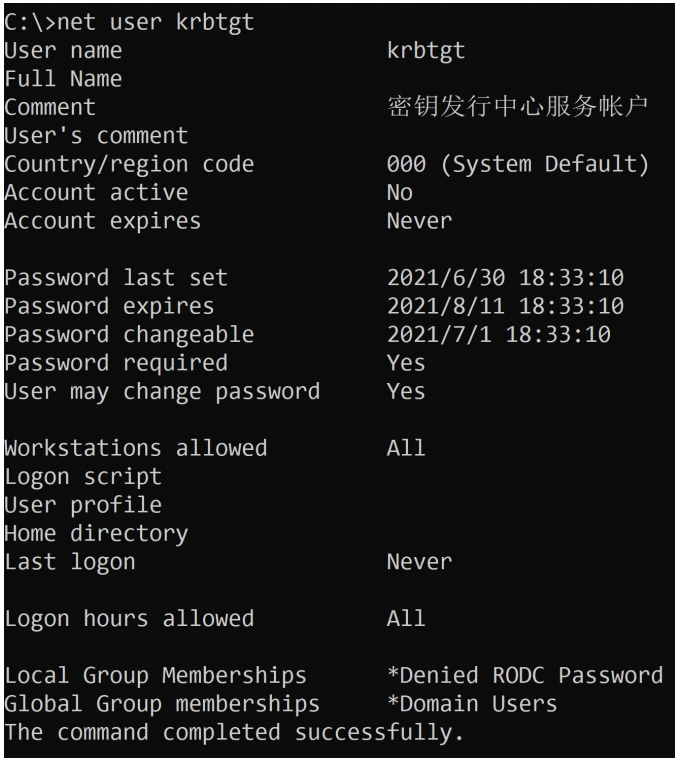
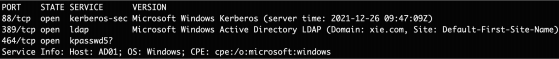
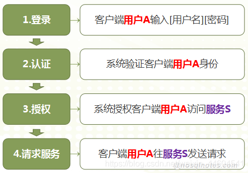

# Kerberos 协议详解

Kerberos协议是由麻省理工学院提出的一种网络身份验证协议，提供了一种在开放的非安全网络中认证识别用户身份信息的方法。它旨在通过使用密钥加密技术为客户端/服务端应用程序提供强身份验证。Kerberos 是西方神话中守卫地狱之门的三头犬的名字。之所以使用这个名字是因为 ***Kerberos 需要三方的共同参与才能完成一次认证流程***。目前主流使用的 Kerberos 版本为KerberosV5 版本，Windows、Linux 和 Mac OS 均支持 Kerberos 协议。







## Kerberos 基础

在 Kerberos 协议中，主要有以下三个角色：

- 访问服务的客户端：Kerberos 客户端是代表需要访问资源的用户进行操作的应用程序，例如打开文件、查询数据库或打印文档。每个 Kerberos 客户端在访问资源之前都会请求身份验证。
- 提供服务的服务端：域内提供服务的服务端，服务端都有一个独一的SPN。
- 提供认证服务的 KDC(Key Distribution Center，密钥分发中心)：KDC 密钥发行中心是一种网络服务，它向活动目录域内的用户和计算机提供会话票据和临时会话密钥，其服务帐户为 krbtgt。KDC 作为活动目录域服务ADDS 的一部分运行在每个域控制器上。

这里说一下 krbtgt 帐户，该用户是在创建活动目录时系统自动创建的一个账号，其作用是 **KDC 密钥发行中心的服务账号**，其密码是*系统随机生成*的，无法正常登陆主机。

如图所示，可以看到 krbtgt 帐户的信息。



Kerberos是一种**基于票据Ticket的认证方式**。客户端想要访问服务端的某个服务，首先需要购买服务端认可的**ST服务票据(Service Ticket)**.也就是说，客户端在访问服务之前需要先购买好票，等待服务验票之后才能访问。但是这张票并不能直接购买，需要一张**TGT认购权证(Ticket Granting Ticket)**.也就是说，客户端在买票之前必须先获得一张TGT认购权证。***TGT认购权证和ST服务票据均是由KDC(密钥分发中心)发放***；因为KDC是运行在域控制器上的，所以说<u>TGT认购权证和ST服务票据均是由域控发放的</u>。

Kerberos 使用 TCP/UDP 88 端口进行认证，使用 TCP/UDP 464 端口进行密码重设。

如图所示，可以看到域控制器 AD01 上开放的 88 和 464 端口。



Kerberos 中一些名词的简称及含义：

```
简称                全拼
DC                  Domain Controller，域控
krbtgt              KDC 密钥发行中心服务账户
KDC                 Key Distribution Center：密钥分发中心，由域控担任
AD                  Active Directory：活动目录，里面包含域内用户数据库
AS                  Authentication Service：认证服务
TGT                 Ticket Granting Ticket：TGT 认购权证，由 KDC 的 AS 认证服务发放
TGS                 Ticket Granting Service：票据授予服务
ST                  Service Ticket：ST 服务票据，由 KDC 的 TGS 票据授予服务发放
```

## Kerberos协议流程

大致流程如下：



参与的角色有：

- Client: Application Client 应用客户端
- AS: Authentication Server 用来认证用户身份,认证服务器，专门用来认证客户端的身份并发放客户用于访问TGS的**TGT(票据授予票据)**
- TGS: Ticket-Granting Service 用来授权服务访问,票据授予服务器，用来发放整个认证过程以及客户端访问服务端时所需的**服务授予票据(ticket)**
- SS: Service Server 用户所请求的服务
- 客户端(Client)：发送请求的一方
- 服务端(Server)：接收请求的一方
- 密钥分发中心(Key distribution KDC),密钥分发中心又分为两个部分，分别是：AS,TGS.

Kerberos协议的应用流程可以概括为以下几步:

1. 用户登录域并向域控制器的认证服务(AS)发送用户名与域名,请求 Ticket Granting Ticket(TGT)。
2. AS使用用户密码(或NTLM哈希)进行加密运算,生成TGT并返回用户。TGT中包含用户与TGS之间的会话密钥。
3. 用户访问应用或资源时,向域控制器的票证授予服务(TGS)提交TGT以及应用服务器的ID,请求服务票证(ST)。
4. TGS验证TGT有效性,使用TGT中的会话密钥对用户与应用服务器之间的新会话密钥加密,生成ST并返回用户。
5. 用户向应用服务器提交ST以验证身份。应用服务器使用TGS提供的会话密钥解密ST,获取会话密钥并验证用户身份。
6. 应用服务器针对该用户的这次访问生成访问令牌(Access Token),并将其包含在响应消息返回用户。
7. 用户随后每次访问应用服务器都需要提供 Access Token 进行身份验证。应用服务器解密令牌,使用会话密钥验证用户身份并对请求授权。
8. Access Token 和 ST 在一定时间后过期,用户需重新向TGS申请新的ST来继续访问。TGS发出新的ST时也重新生成会话密钥。
9. 用户定期更换密码时,所有TGT、ST、Access Token等也随之无效,用户需重新认证并申请,以确保安全。

打个比方，整个过程就是：你想坐飞机，但是机场告诉你必须有机票（TGT）才可以登机，接着你去购票处（AS）出示身份证（Client name）购买了一张机票（TGT），你拿着机票登机，在检票处（TGS）出示机票，服务人员告诉了你的座位号（Ticket），然后就可以坐到自己的位置上。

我们可以通过以下几个例子来形象理解Kerberos协议的应用流程:

1. TGT获取:这就像到电影院买票,先去售票处买一张可以观看所有电影的通用票。TGT就像这个通用电影票,可以访问Kerberos领域内的所有服务。
2. ST申请:这就像通用票允许进入电影院,但每个电影场次都需要买对应的电影票方可入场。ST就像观看各个电影的门票,每个服务都需要对应的ST方可访问。
3. 会话密钥:这就像电影开始时放映员会发放3D眼镜,只有带上特定电影的3D眼镜才能正常观看。Kerberos的会话密钥就像3D眼镜,只有使用正确的密钥才能解密通信内容。
4. 更新机制:这就像电影院会定期更新电影列表,旧票无法使用;3D眼镜也需要定期更换。Kerberos的更新机制就像这些措施,可以定期更新TGT、ST、令牌等,使过期信息无法使用。
5. 密码更换:这就像电影院换票系统时需要观众全部办理新的会员卡。Kerberos的密码更换会使之前的认证信息全部无效,必须全部重新申请。
6. 细粒度访问控制:这就像不同电影有不同的票价和观众限制。Kerberos为每个服务生成不同的ST,就像每个电影有不同的门票,实现了详细的访问控制。
7. 单点登录:这就像会员卡可以观看电影院内全部电影。TGT实现了单点登录,一个认证后可以访问Kerberos领域内的全部服务。