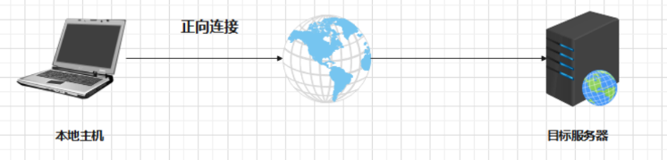
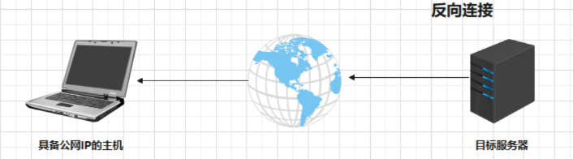
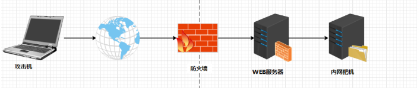

# 隧道穿透技术详解

假设我们获取到一台内网主机的权限，并希望将这台主机作为跳板，通过外网主机访问到内网进行后续渗透利用，而在这个过程中我们可能会碰到一些阻碍，比如**防火墙、入侵检测系统**等，这些安全防护措施不允许有异常端口对外发起通信连接，此时便无法通过在这台受控主机上开启单独的端口来与外界连接通信，但是我们可以寻找防火墙等防护设备允许与外界通讯的端口，将数据包混杂在正常流量中，通过正常端口发送到外网攻击机来实现绕过防火墙的目的，这种技术就叫做内网隧道穿透技术，而这个数据包在传输过程中所经历的逻辑路径就叫做隧道。

## 1.正向连接

正向连接是指**本地主机向目标主机的Web服务发起访问请求**，目标主机收到请求后两者互相建立通信连接的过程，在实际应用场景中，正向连接这种方式常用于**目标主机不出网或者目标有公网IP地址且没有防火墙**的情况，可以利用Web正向连接去搭建代理隧道。

## 2.反向连接

反向连接是指假设**当我们获取目标服务器权限后，使其主动发起请求去访问攻击者所使用具有公网IP的主机**，从而建立两者之间的连接，可以互相访问通信。反向连接和正向连接恰好相反，在实际应用场景中，反向连接这种方式**常用于目标主机出网**的情况。

## 3.端口转发

端口转发是**指将某一个端口接收到的流量转发到另外一个本地端口或者其他网络端口上的过程**，假设在红蓝对抗中，红队人员获取到Web服务器的权限，通过信息收集的方式发现Web服务器具有双网卡，并且可以和内网靶机主机之间进行通信，如果我们想要使攻击机能通过RDP远程的方式远程到内网靶机，我们可以通过端口转发方式将内网靶机的3389端口转发到Web服务器的80端口上，攻击机再通过访问Web服务器的80端口直接访问到内网靶机3389端口RDP服务，以此达到通讯的目的。

## 4.代理和隧道的区别

**代理**它是指一种**特殊的网络服务**，它允许一个网络终端通过代理服务与另一个网络终端进行非直接的连接,它**扮演了位于服务器和客户端的“中间人”**，**攻击者可以通过受控主机设置代理服务，去访问目标内网中其他主机的服务**。

**隧道**主要就是为了**解决数据包无法传输**，隧道技术一般用来**绕过一些安全设备的监控，例如防火墙过滤，网络连接通讯，数据回链封装等**，如果安全防护设备对我们发送的流量进行拦截，我们就可以使用隧道技术来绕过拦截，隧道技术就是使用不同的协议技术来建立通讯连接,当然，在隧道中也是包含了一些关于代理的技术。

## 5.常见隧道转发场景

|转发场景|具体描述|
|--|--|
|目标处于网络边界|内外网都可以访问、网络边界主机未安装防火墙所有端口都对互联网开放|
|目标处于内网|允许特定的应用层协议出网(比如HTTP、SSH、DNS等应用层协议)(3389、22、445、53、80、443等)|
|目标处于内网，不能访问外网|可以访问边界主机，防火墙策略限制外部网络直接访问内网的敏感端(3389、22、445等)。|

## 6.常见隧道穿透分类

从计算机OSI 七层模型来讲隧道穿透技术主要应用在***应用层，传输层，网络层***这三层，每一层常见的隧道利用方式及隧道类型如表

|隧道方式|隧道类型|
|--|--|
|应用层隧道|SSH隧道，HTTP隧道，HTTPS隧道，DNS隧道|
|传输层隧道|TCP隧道，UDP隧道|
|网络层隧道|IPv6隧道，ICMP隧道，GRE隧道|