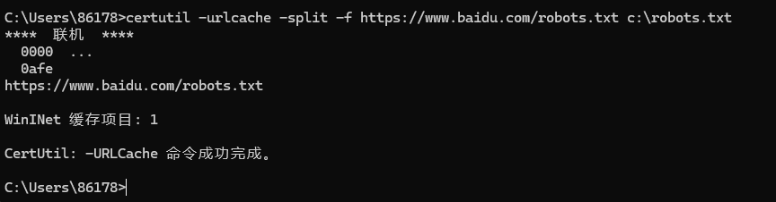
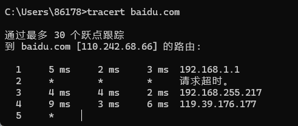
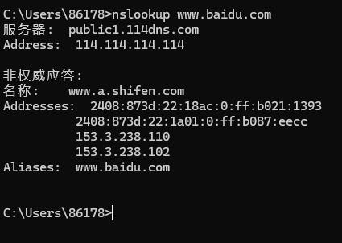

# 如何判断各种协议是否出网

在进行内网渗透时，经常会遇到目标主机不出网的场景，而主机不出网的原因有很多，常见的原因例如**目标主机未设置网关，被防火墙或者其他防护设备拦截设置了出入站策略，只允许特定协议或端口出网等**。当我们遇到这种情况时，利用各种包含该协议的方式探测目标主机允许哪些协议出网，根据探测到的协议信息进行隧道穿透。

## 1.TCP/UDP协议探测出网

### 1.NC工具探测TCP协议出网

使用netcat工具，执行"nc <IP地址 端口号>"

```
nc -lnpv ip port
nc -lnpv 192.168.1.108 80		# TCP
```

### 2.Telnet命令探测TCP协议出网

1）使用Telnet命令来探测目标服务器是否出网，首先需要在目标服务器使用nc工具开启监听4444端口，执行命令`nc -lvnp 4444`，成功开启目标服务器监听


2）当开启监听后，在本地主机中使用Telnet命令连接到目标服务器。执行`telnet 192.168.111.128 4444`命令，如图则证明连接成功，即代表允许TCP出网。


### 3.UDP协议探测出网

```
nc -zuv ip port
nc -zuv 192.168.1.108 80	# UDP
```

## 2.HTTP/HTTPS协议探测出网

根据目标系统类型去执行命令，不同类型的操作系统，使用的探测方式也不同，例如在Windows操作系统中可以使用自带的bitsadmin、certutil等命令来对Http或Https进行出网探测，linux操作系统可以使用自带的curl、wget等命令进行出网探测。

> Windows XP 和 Windows Server 2003没有Powershell、bitsadmin，certutil也不能用。

### 1.Windows系统探测HTTP/HTTPS出网

#### (1)Bitsadmin 命令

Bitsadmin命令在Windows操作系统是用于创建、下载或上传作业，并监视作业进度的命令行工具。可通过该命令行工具测试能否从网站下载文件，以此来检测http或https是否出网，下面我们以百度官网的robots.txt为例进行演示，使用Bitsadmin命令下载百度官网目录下的robots.txt文件，并保存到本地C盘下的robots.txt中。

执行`bitsadmin /rawreturn /transfer down "https://www.baidu.com/robots.txt" c:\robots.txt`命令，此时已成功下载robots.txt文件到C盘目录下。然后通过`type C:\robots.txt`命令读取查看，验证其存在，如若正常则证明探测出网成功，如图.


#### (2)Certuil 命令

Certuil命令是windows操作系统中的一款下载文件的命令行工具，可作为证书服务的安装，用来转储和显示证书颁发机构 (CA) 配置信息，配置证书服务，备份和还原CA组件，以及验证证书、密钥对和证书链。

下面我们还是以百度网站下的的robots.txt文件为案例，使用Certuil命令执行`certutil -urlcache -split -f https://www.baidu.com/robots.txt c:\robots.txt`将百度网站下的robots.txt文件保存到本地C盘目录下，通过验证发现robots.txt文件存在，则证明http/https协议出网，如图.



### 2.Linux系统探测HTTP/HTTPS出网

#### (1)Curl命令

```
curl http://www.baidu.com
```

#### (2)Wget命令

```
wget http://www.baidu.com/robots.txt
```

## 3.ICMP协议探测出网

ICMP（Internet Control Message Protocol）是一种面向无连接的协议，属于网络层的协议，用于检测网络通信故障和实现链路追踪。当我们需要判断探测ICMP协议是否出网时，可通过Ping和Tracert命令进行探测.

Tracert命令是Windows中用来跟踪路由的命令，它依靠ICMP协议实现，在ICMP出网测试中只需要使用Tracert命令跟踪下目标地址即可，以百度为案例，执行tracert baidu.com命令，获得如图所示的返回信息，即证明出网成功。

```
执行命令"ping <IP地址或域名>"

ping ip/domain
tracert ip/domain
ping www.baidu.com	# ICMP
tracert baidu.com	# ICMP
```



## 4.DNS协议探测出网

在进行DNS连通性检测时，常用的命令为nslookup和dig.

nslookup是Windows操作系统自带的DNS探测命令。其用法如下：

```
nslookup www.baidu.com       //vps-ip    
#nslookup domain [dns-server]  如果没有指定dns服务器，就采用系统默认的dns服务器。
```



dig是Linux默认自带的DNS探测命令。其用法如下：

```
dig @8.8.8.8 www.baidu.com   //这里指定DNS服务器，8.8.8.8是Google的DNS服务器。返回响应结果，证明出网成功
```

