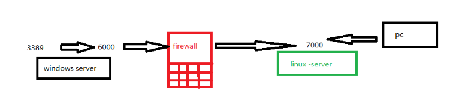
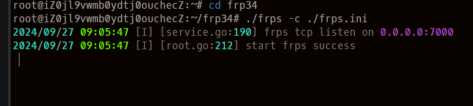
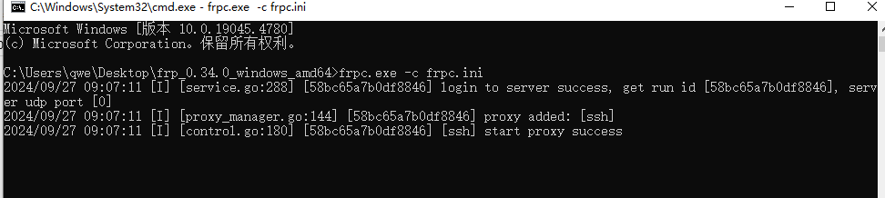
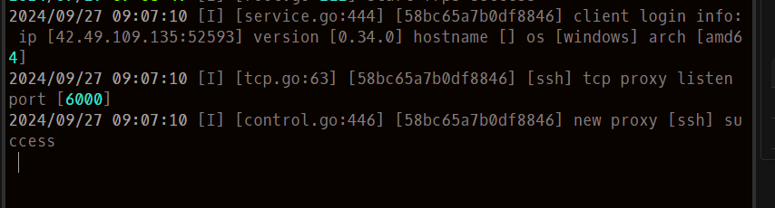
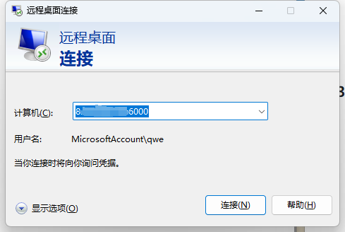
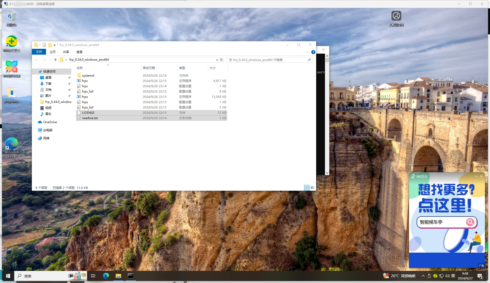

# 内网常规隧道利用方法

## 1.端口转发

介绍最常见的frp端口转发工具的使用场景，frp工具是一个红队人员在内网渗透测试中最典型的端口转发工具，frp工具可分为Windows和Linux两个版本，这里以frp工具为例，以转发3389端口为目的演示端口转发功能。



本次的试验目的是在另一台pc上连接内网服务器的3389端口，在环境搭建阶段我们已经将防火墙打开，而且由于pc和内网服务器不在同一网段，所以是无法直接连3389的，因此，我们需要将内网服务器的3389转发出来，转发到公网服务器的一个端口上，这样我们通过连接公网服务器的某个端口，就可以访问内网服务器的3389了。

### 1.配置服务端

编辑frps.ini

```
[common]
bind_port = 7000
```

打开文件默认就是这个，不用动，保持这样就行，这是配置服务端的端口，然后用下面的命令启动服务端

```
./frps -c ./frps.ini
```



### 2.配置客户端

```
[common]
server_addr = 8.x.x.x     #服务端ip，也就是公网服务器ip
server_port = 7000          #服务器端口

[ssh]                       #这个是节点名称，可以随便写
type = tcp                  #通信协议
local_ip = 127.0.0.1        #本地地址
local_port = 3389           #要转发的端口
remote_port = 6000          #要转发到的远程端口
```

配置完成后，运行以下命令启动客户端

```
frpc.exe -c frpc.ini
```



随后就能看到服务端显示有新的客户端连进来了



### 3.连接远程桌面





## 2.Socks隧道代理

  Socks是**Socket Secure**的缩写，其是一种工作在OSI七层模型中的第五层网络会话层协议，Socks主要的作用是代表客户端将任何协议或者任何程序产生的任何类型的流量路由到服务器上，以此来将本地和远端两个系统连接起来。

由于Socks其处于第七层和第四层模型之间，因此socks可以支持HTTP、HTTPS、FTP、SSH、FTP等多种协议，Socks从版本上来讲，又可分为socks4和socks5这两种版本，目前socks协议最新版本为socks5，socks4和socks5这两者版本最主要的区别是**socks4仅支持TCP代理，不支持UDP代理以及各种验证协议**，**socks5不仅支持TCP/UDP代理以及各种身份验证协议的同时，还会通过身份验证建立完整的TCP 连接，并使用Secure Shell (SSH) 加密隧道的方法来中继流量**，在红蓝攻防对抗中，我们经常会利用Socks5来建立通信隧道以此来访问远程核心靶标系统中的内部网络。

### 1.socks常见利用场景

假设在目标内网中已经获取了一台可执任意行命令权限的主机后，需要来对其主机所属的区域以及安全策略进行判断探测是否可以建立socks连接

|目标位置|场景描述|
|--|--|
|内网|防火墙未对出口流量及端口做任何方面的安全策略，内网中的服务器可任意访问外部网络，不受安全策略限制。|
|内网|防火墙只配置了特定的入站规则，仅允许特定业务的端口进行访问（例如：80、443）|
|内网|防火墙都配置了特定的出入站规则，仅开放了特定的端口（例如：80、443）|

###  2.socks全局代理软件

（1）Proxifier

（2）SocksCap64

（3）Proxychains