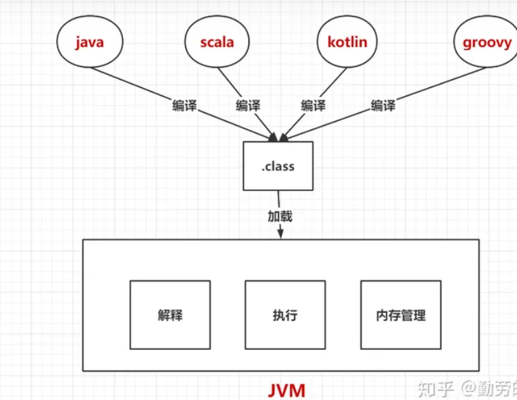
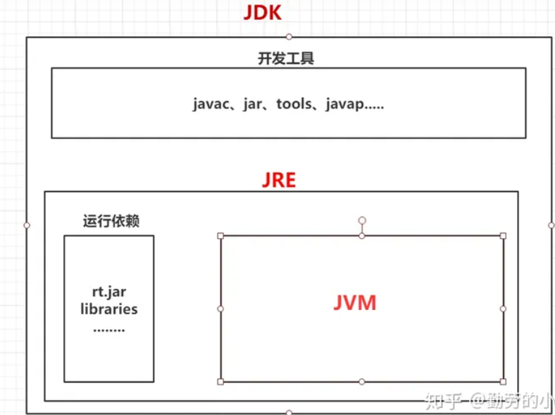
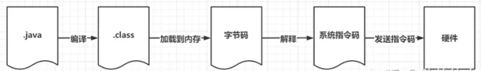
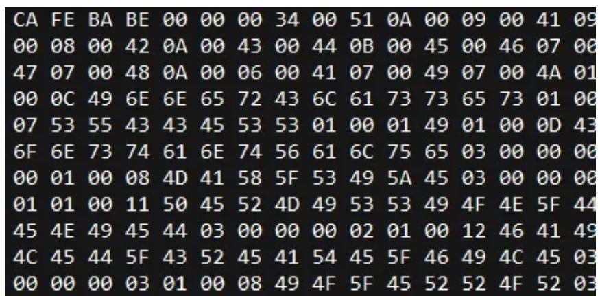
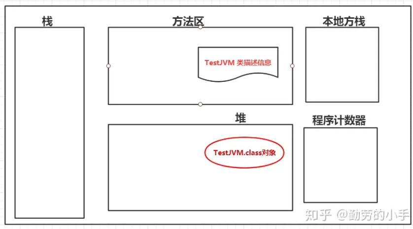

# 一.JVM是什么？

Java的流行很大一个因素都得益于它是一门跨平台的语言，只需一次编译就可以在各个不同的平台运行。**严格来说跨平台的特性并非Java语言的特性，其实提供这个特性的是JVM，只是我们经常说Java时默认已经把JVM算进来了。**

这么说虽然没错但是确实不太准确，而且JVM从设计上看也并非只想运行Java语言，而是面向所有语言的运行平台，只要遵守JVM的约定(只要编译成.class文件)，那么任何语言都可以运行在JVM虚拟机上的，现在确实也有除了Java之外的很多语言都是运行在JVM上了，比如scala、kotlin、groovy等，所以综合来说JVM其实是一个独立的个体，它是一个可以运行任何语言的平台。



# 二.JDK、JRE、JVM的关系

> JDK（Java Development Kit）：**JDK 是 Java 开发工具包**，它是开发 Java 程序的基础。JDK 包含了 Java 编译器（javac）,Java 运行时环境（JRE）,Java 相关的工具和库等。开发人员使用 JDK 来编写,编译和调试 Java 程序。
> 
> JRE（Java Runtime Environment）：**JRE 是 Java 运行时环境**，它包含了 Java 虚拟机（JVM）以及运行 Java 应用程序所需的核心库和文件。如果你只是想运行 Java 程序而不需要进行开发，只需安装 JRE 即可。
> 
> JVM（Java Virtual Machine）：**JVM 是 Java 虚拟机**，它是 Java 的核心，负责将 Java 代码翻译成可以在特定平台上运行的机器码。JVM 的主要任务是解释 Java 字节码并将其转换为特定平台的本地指令，从而实现 Java 的跨平台特性。
> 
> 它们之间的关系可以用如下图示来说明：
> 
>   +---------------------------------+
  |              JDK                               |
  | +-----------------------------+   |
  | |            JRE                            |   |
  | | +-------------------------+   |   |
  | | |           JVM                     |    |   |
  | | +-------------------------+   |   |
  | +-----------------------------+   |
  +---------------------------------+
> 
> 简单来说，JDK 包含了 JRE，而 JRE 包含了 JVM。开发人员在开发 Java 程序时需要 JDK，而终端用户在运行 Java 程序时只需要 JRE。 JRE 则依赖 JVM 来实际运行 Java 代码。

首先需要确定的是JDK里是包含JRE的，而JRE里又包含JVM，它们区别在于面向的服务对象不同所以进行了不同的包装。

JVM：JVM是**面向操作系统**的，**它负责把程序运行编译成的.Class字节码解释成系统所能识别的指令并执行**，同时也负责程序运行的内存的管理。

JRE：JRE是**面向于程序**的，JRE对JVM进行了一层包装，它除了提供JVM的功能之外，还提供了一套语言需要编译成Class后在JVM内运行所依赖环境（比如说 String.class、Object.class等这种运行时必须依赖的对象）。

JDK：JDK是**面向更上层的开发人员**，JDK在JRE的基础上又进行了一层包装，它除了提供运行功能之外，还**对开发人员提供了一套常用的开发工具和类库，来方便开发人员写代码（比如说方便部署的编译工具，方便开发的工具类等）**。



# 三.JVM的工作流程

从文章的第一张图我们知道，JVM只负责解释执行层面的工作，而具体的编译工作是没有纳入到JVM工作范围的，但是为了更清晰的理解JVM的功能我们又必须从编译开始了解。

**一个java文件从编码到执行需要经过下面几个阶段**

1、编译阶段：首先.java经过javac编译成.class文件

2、加载阶段：然后.class文件经过类的加载器加载到JVM内存。

3、解释阶段：class字节码经过字节码解释器解释成系统可识别的指令码。

4、执行阶段：系统再向硬件设备发送指令码执行操作。



## 1、编译阶段

类的编译阶段主要目的是把源码文件编译成JVM可以解析的class文件，这个阶段会经过词法分析、语法语义分析、生成字节码，这个几个阶段后生成最后的class, 用16进制的方式打开class文件后内容大概如下图:



### class文件包含下面几部分内容

**Magic Number(魔数)**： 在.class文件头4个字节如图“CA FE BA BE”内容，魔数的作用就是定义一个识别标准，只有符合这个标准才能被JVM解读 。

**版本号**: 编译class文件的JDK版本号，此版本是向下兼容的。

**常量池**: 常量池中信息主要包括字面量（字符串（String a=“b”）、基本类型的常量（final 修饰的变量））和符号引用（类和接口全限定名，字段名称和描述符、方法名称和描述符，方法句柄和方法类型，动态调用点和动态常量）。

**访问标志**: 该类是否为接口、注释、枚举、模块，是否为final ,abstract等信息。

**类索引**: 类索引、父类索引、接口索引集合，用于确定类的继承和实现关系。

**字段表集合**：用于描述接口或者类中声明的变量信息，如修饰作用域（public,private,protected）,是实例变量还是类变量(static)，是否可变(final),是否可序列化(transient),并发可见性(volatile)，字段数据类型，字段名。

**方法表集合**：方法表集合和字段表的信息类似，只不过这里保存的是保存方法相关的信息，包括方法的名称，访问标志(如public 、static 、final、abstract、native、sychronized等)，名称索引，属性表集合（在方法内定义的属性、方面里面的代码指令）等信息。

**属性表集合**: 包括类、方法、实例的变量属性和代码的指令码。

## 2、加载阶段

加载阶段主要是**把编译阶段生成的.class文件加载到JVM内存中去**，这个阶段会经过**装载、连接、初始化**三个过程。

### 2.1、装载

装载阶段主要做的事情就是先把class的信息读到内存来。

**（1）先通过类的全限定名读取到描述此类的二进制流。**

**（2）把字节流中描述静态结构的信息转化为方法区中的运行时数据结构。**

**（3）在Java堆中生成一个代表这个类的java.lang.Class对象，作为这个对象的访问入口。**

```
public class TestJVM {

    public static int a;
    public static TestJVM testJVM;

    static {
        a=88;
        testJVM=new TestJVM();
    }

}
```

上面的代码经过加载阶段后会在JVM内存保存着类的字节码，并且会生成一个TestJVM.Class对象，这个对象是作为TestJVM.class的统一访问入口，下图是按**逻辑**分区，并非数据实际保存物理位置。



### 2.2、连接