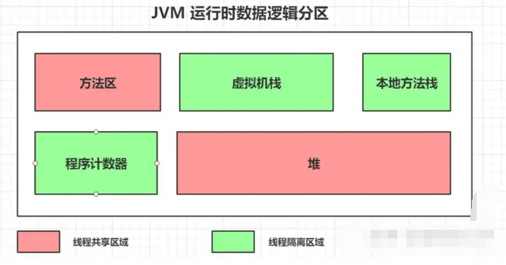
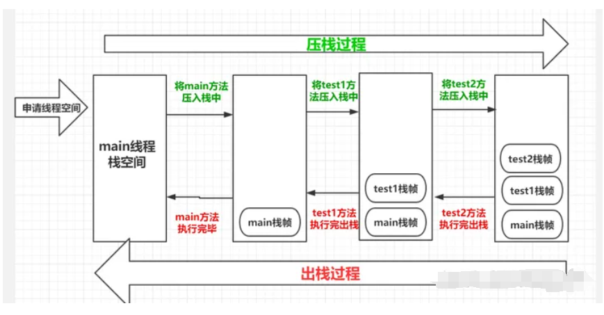
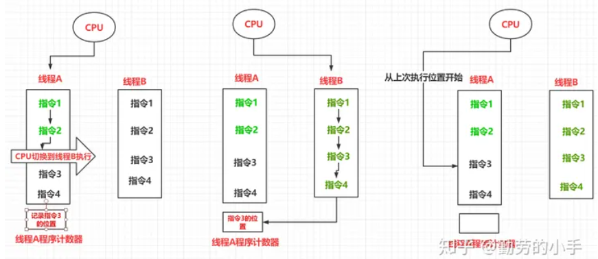
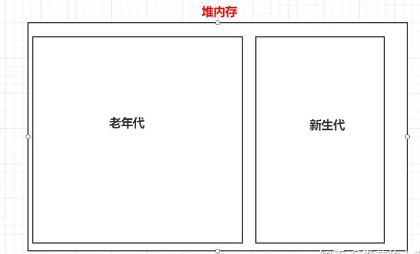
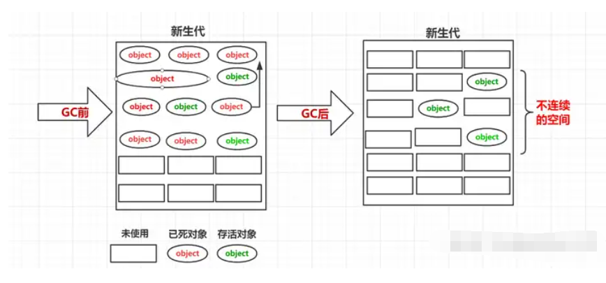
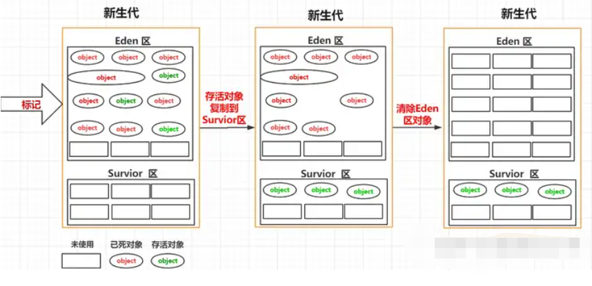
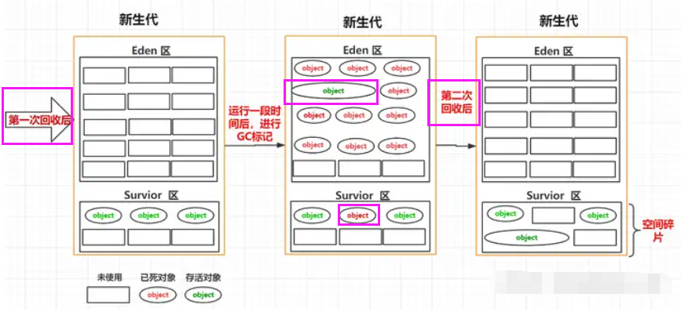
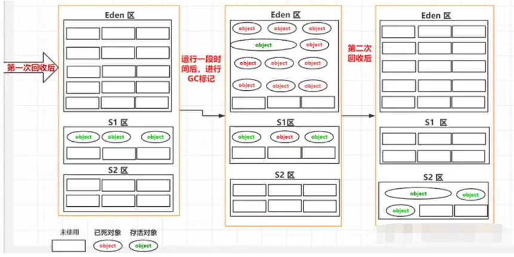
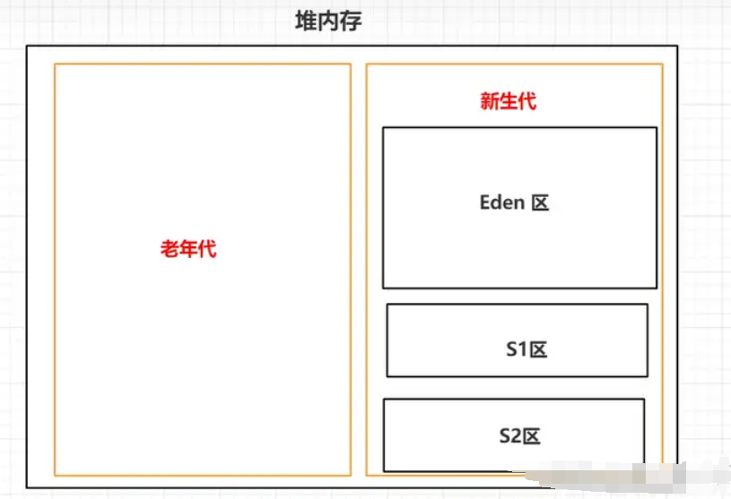

我们已经了解了JVM的基本工作流程以及在每个阶段大概做了哪些事情，这一篇我们主要**探讨一下源码经过编译、加载后最终这些信息在JVM在运行后是如何进行分类存储的**。 根据各种数据的特性JVM从逻辑上把内存划分成了几个区域；分别为方法区、虚拟机栈、本地方法栈、程序计数器、堆 5个区域，了解这几个分区对我们的编程和调优有着重要的意义，下面我们一起来逐个了解。



# 一.方法区

JVM方法区是用于保存已经被虚拟机加载的**类元信息（包括类的版本、字段、方法、接口和父类等信息）、运行时常量信息(static、final定义的常量)、字符串常量信息(String a="dfc")**。

## 1.方法区、永久代、元数据区的关系

> 在Java虚拟机（JVM）中，方法区（Method Area）、永久代（PermGen，Permanent Generation）和元数据区（Metadata Area）是三个相关的概念，但在不同的JVM实现版本中可能有所不同。**在Java 8及之前的版本中，通常使用永久代来实现方法区和元数据区，但在Java 8及之后的版本中，永久代已被元空间（Metaspace）所取代。**
> 
> 1.方法区（Method Area）：方法区是JVM的一部分，**用于存储类的结构信息、运行时常量池、静态变量、类中的字节码等**。在Java中，每个类都对应一个Class对象，这些Class对象的信息就存储在方法区中。方法区通常是线程共享的，因为它包含了所有已加载的类的信息，而类的信息在整个应用程序中是共享的。
> 
> 2.永久代（PermGen，Permanent Generation）：永久代是Java虚拟机堆内存的一部分，在Java 8及之前的版本中**用于实现方法区**。永久代主要用于存储类的元信息、静态变量、常量等。由于永久代的大小是有限的，并且在某些情况下会导致内存溢出（OutOfMemoryError），因此在Java 8中被元空间所取代。
> 
> 3.元数据区（Metadata Area）：元数据区是Java 8及之后版本中引入的概念，**用于存储类元数据**。元数据区实际上是一块本地内存，不再受永久代大小的限制，因此可以更好地适应动态应用程序的需求。元数据区的大小可以动态调整，并且可以通过设置参数来控制。
> 
> 在Java 8及之前的版本中，**永久代承担了方法区和元数据区的功能**，而在Java 8及之后的版本中，**永久代被元空间所取代**，元空间作为元数据区的实现，提供了更灵活、更高效的存储方式。**因此，方法区、永久代和元数据区之间的关系主要是在不同Java版本中的内存结构的实现方式上的不同。**

方法区是JVM 定义的一种规范，是所有虚拟机都需要遵守的约定， 而“永久代（PermGen space）”和“元数据（MetaSpace）”都是实际某个虚拟机针对“方法区”的一种实现，“永久代”是的JDK1.7之前 Hotspot虚拟机对方法区的实现，而“元数据”则是1.8之后Hotspot虚拟机针对方法区的一种实现而已。

## 2.PermGen space 和MetaSpace的区别?

> HotSpot是Oracle JDK和OpenJDK中**默认的Java虚拟机（JVM）实现**。它是一个高性能、成熟的JVM，由Sun Microsystems（现在是Oracle Corporation）开发并持续优化。HotSpot采用即时编译（Just-In-Time Compilation，JIT）技术，能够在运行时将Java字节码直接编译成本地机器代码，从而提高程序的执行性能。
> 
> HotSpot JVM具有许多优化功能，包括：
> 
> 1.即时编译器（JIT Compiler）：HotSpot包含两个即时编译器，分别是客户端编译器（C1）和服务端编译器（C2）。这两个编译器根据程序的运行情况，动态地将频繁执行的字节码编译成本地机器代码，以提高执行速度。
> 
> 2.垃圾回收器（Garbage Collector）：HotSpot包含多种垃圾回收器，如新生代回收器（Parallel Scavenge、G1）、老年代回收器（CMS、Parallel Old、G1）等。这些回收器针对不同类型的应用场景和内存需求进行了优化，以提高垃圾回收的效率和性能。
> 
> 3.优化技术：HotSpot还包含了许多针对性能优化的技术，如逃逸分析、锁消除、内联优化等，这些技术可以在编译过程中对代码进行优化，提高程序的执行效率。
> 
> 总的来说，HotSpot是一个成熟、高性能的Java虚拟机实现，是Java应用程序在生产环境中常用的运行环境之一。

不管是PermGen space 还是 MetaSpace 他们都是Hotspot针对方法区的一种实现，**两者最大的区别在于PermGen space 是在JVM虚拟机中分配内存的，而Metaspace则是在虚拟机之外的系统本地分配内存。**

因为很多类是在运行期间加载的，这部分类加载的空间不可控，如果这部分内存是在JVM内存里分配的话，永久代分配太大那么JVM其他区域（比如说堆）的内存就会变小，反之如果设置太小，就容易出现方法区内存溢出，因为本身存储的类信息属于不确定大小，类信息在我们运行的时候可以动态加载。所以jdk1.8中选择把Metaspace内存分配在本地内存，如果这样做的好处是Metaspace空间的大小不会受限于虚拟机分配的内存大小，只会受限于机器内存，可分配的内存大了那么就不会那么容易出现内存溢。

## 3.字符串常量、静态变量数据存放区域

java6中 所有常量池数据是存放在永久代中，但到java7后 Hostpot 把永久代中的字符串常量、静态变量数据迁移到了堆中，后面的java 8并没有对这部分内容进行迁移，在java8 中字符串常量、静态变量数据还是放到堆中，所以**常量池只是在JVM规范定义上属于方法区，但Hotspot在实现的时候部分常量池的内容实际上是保存在堆中了。**

# 二.虚拟机栈

栈这部分区域主要是用于**线程运行方法**的区域，此区域属于线程私有的空间，**每一个线程创建后都会申请一个自己单独的栈空间，每一个方法的调用都会对应着一个栈帧。**

*栈帧里存储着方法的局部变量表（保存着变量的数据）、操作数栈(进行运算时存放数据的空间)、动态连接（指向常量池的引用）和方法返回地址（当前方法返回后的数据存放的地方）信息。*

**每调用一个方法都会生成一个新的栈帧，调用方法的过程就是一个压栈和出栈的过程，遵循先进后出的原则，比如下面代码,用 main() 调用 test1() 再调用test2()的执行过程类似于下图。**

```
public class TestStack {

    public static void main(String[] args) {
        System.out.println("执行main方法");
        test1();

    }

    public static void  test1(){
        System.out.println("test-1");
                test2();
    }

    public static void  test2(){
        System.out.println("test-2");
    }

}
```

**压榨出栈过程**



# 三.本地方法栈

由于**java需要与一些底层系统如操作系统或某些硬件交换信息**时的情况，这个时候就需要通过调用native本地方法来实现，本地方法栈和虚拟机栈功能差不多，区别在于**本地方法栈是虚拟机调用native方法时使用的**。

# 四.程序计数器

程序计数器是一块较小的内存空间，它的作用可以看作是当前线程所执行的字节码的行号指示器，程序计数器记录着某个线程当前执行指令的位置，此区域属于线程隔离区。

因为CPU是根据时间片的方式分配资源的，它在某一个线程上进行调度的时间是一个或者多个时间片，所以当CPU从A线程切换到B线程执行时，就需要记录A线程当前指令所在的位置，方便CPU再次切回A线程时可以从上次的位置开始继续执行指令， 而程序计数器就是用来记录线程指令历史位置的区域。



# 五.堆

堆内存主要是用来**存放创建的对象数据**，此区域属于**线程共享区**，<u>对于开发人员来说这块区域是我们关注的比较多的</u>，因为**很多优化都是针对堆区来进行的**，为了能更清楚的描述堆里的数据和分区信息，所以会结合<u>垃圾回收的一些机制</u>来描述这块内存区域。

## 1.新生代和老年代划分机制

堆内存主要是用来存放我们运行过程中创建的对象数据，**根据对象所生存时间长短的特性在逻辑上分为 新生代和老年代**。

对于JVM而言，大部分对象都是属于一个朝生夕死的状态，这部分对象随着方法的调用而创建，方法的结束而消亡，只有少部分的对象会长久的留在JVM 内存中，所以根据这样的特性JVM 把内存分为了新生代 和老年代两个区，**一般情况新创建的对象会放到新生代中，只有经过一定次数的GC后还没有被回收的对象，我们认为这部分对象在未来也会长时间存在，所以会把这部分的对象转移到老年代的区域中去。**



## 2.Eden区和 Survior 划分机制

我们尝试想象一下，如果新生代不进行任何分区，我们垃圾回收的过程是怎样的。

1.首先我们会把需要回收的对象进行标记。

2.然后把标记为垃圾的对象进行清除。

过程类似下图：



通过上面的图我们可以看出来，GC把垃圾对象回收后如果不对存活下来的对象进行整理，那么就会**出现很多不连续的内存空间**，这也就是我们常说的**空间碎片**，因为没有连续的空间分配，这样就可能造成我们一个大对象过来申请内存空间时，明明内存是有足够容纳对象的总空间，但是却**因为这些内存空间不连续性导致对象无法创建**。

所以为了减少这种空间碎片，所以就**把新生代分为了Eden 区和Survior 区，在进行垃圾回收时，先把存活的对象复制到 Survior 区，然后再对Eden区统一进行清理，这样的话Eden区每次GC过后都是留下的一片连续的空间**：



## 3.S1 区和S2区划分机制

上面我们把新生代划分为Eden区和Survior区后，空间碎片问题好像改善了很多，因为这样**解决了Eden区的空间碎片问题**，但是这样的话我们忽略了一个问题，**空间碎片问题Survior 区也会存在**，因为进行GC时，我们Survior 区也会有垃圾对象，所以每次GC也会对Survior 区进行标记清除，那么这样的话**Survior 区也同样会出现不连续的空间**。



为了避免Survior区的空间碎片，所以我们**把Survior 分成了S1区和S2区**，**在同一时间S1和S2区只会有一个存放对象**，**每次进行垃圾回收的时候，我们都会把不能进行回收的对象放到S1或S2其中的某一个区**，垃圾回收的流程类似下面几个步骤。

1.第一次GC我们会把Eden区的不可回收对象拷贝到**S1区**，然后把**Eden区**的所有对象进行清理。

2.第二次GC我们会把Eden区和S1区不可回收的对象拷贝到**S2区**，然后把**Eden区和S1区**的所有对象进行清理。

3.第三次GC我们会把Eden区和S2区不可回收的对象拷贝到**S1区**，然后把**Eden区和S2区**的所有对象进行清理。

..........

就这样我们每次GC都都能保证S区有一块空白连续的内存可以提供我们使用。



最后经过了一些特定区域职责划分后，堆内存划分为 老年代、新生代，新生代又划分为Eden区、s1区、s2区域。

