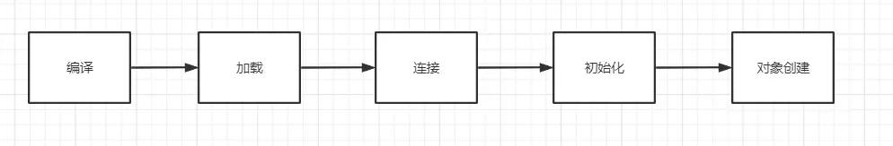
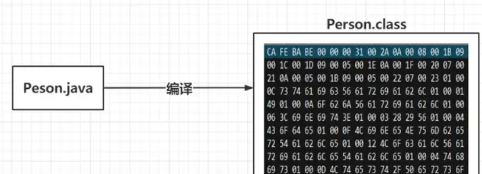
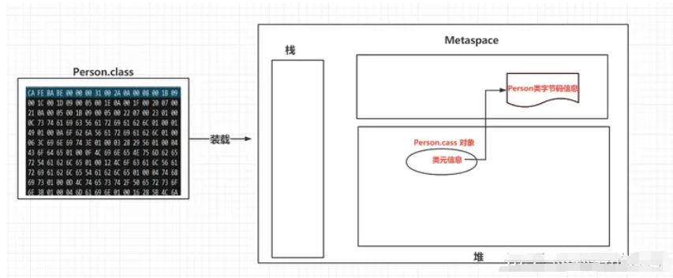
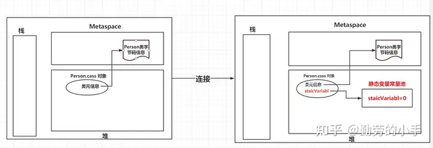
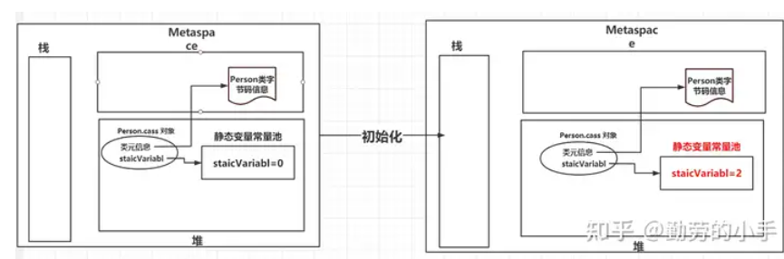
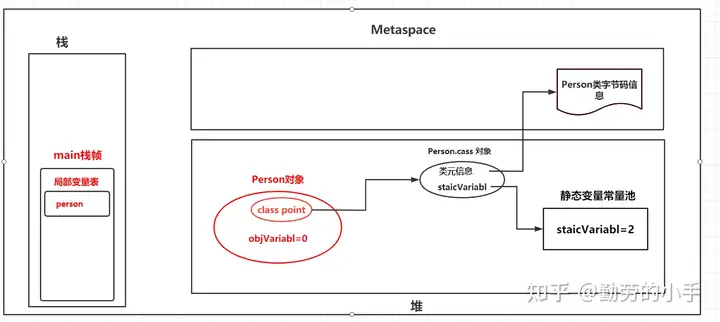
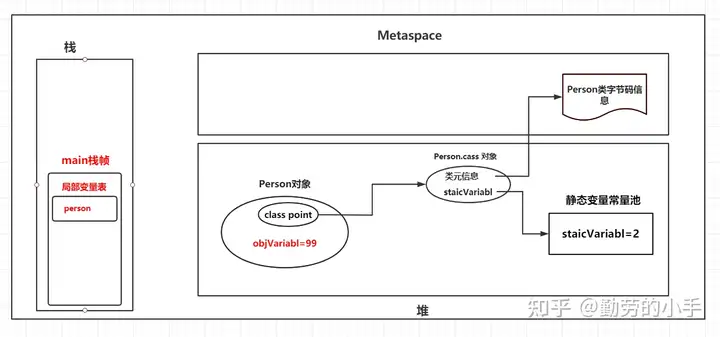
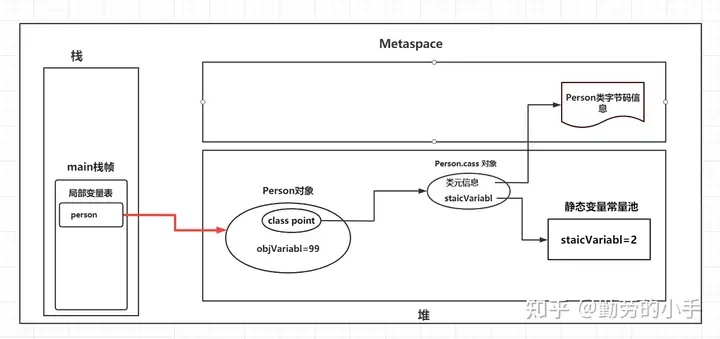
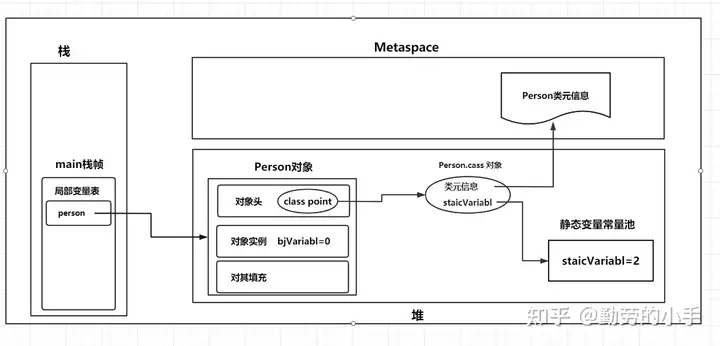

综合之前两篇的知识，结合代码一起推演一下对象的真实创建过程，以及对象创建完之后实际在JVM内存里是如何保存的。

这里我们通过一个类的代码分别追踪类的静态变量、成员变量、在经过静态块、对象代码块的变更后，最终创建完的对象在内存中是如何标示和保存的，演示流程和演示代码如下：



```
public class Person {
    //静态变量
    public  static  int staicVariabl=1;
    //成员变量
    public   int  objVariabl;
    //静态初始代码块
    static {
        staicVariabl=2;
    }
    //对象初始化代码块
    {
        objVariabl=88;
    }
    //构造方法
    public Person() {
        objVariabl=99;
    }
    public static void main(String[] args) {
        Person person=new Person();
    }
}
```

# 一.编译

经过编译后Person.java 会生成一个Person.class文件。



# 二.装载

Person.class经过加载后，会**把类的相关信息加载到JVM内存中**，解析出类的描述信息会保存到**Metaspace**,同时这里会**生成一个代表这个类的java.lang.Class对象**，作为这个类的各种数据的访问入口。



# 三.连接

连接阶段会**对静态变量的值进行默认赋值**，此时Person类的staicVariabl 赋值为0；



# 四.初始化

1.首先会对Person类的静态变量staicVariabl 进行真正的赋值的操作（此时staicVariabl =1）。

2.然后收集类的静态代码块内容，生成一个类的<clinit>() 方法并执行（此时staicVariabl =2）。



# 五.对象创建

**当我们new一个对象的时候JVM首先会去找到对应的类元信息**，如果找不到意味着类信息还没有被加载，所以**在对象创建的时候也可能会触发类的加载操作**。当类元信息被加载之后，我们就可以**通过类元信息来确定对象信息和需要申请的内存大小。**

## 对象创建的流程

当我们执行上面代码中main方法中的 Person person=new Person() 时，我们的对象就开始创建了，执行流程大致分为三步：

1.构建对象：首先main线程会在栈中申请一个自己的栈空间，然后调用main方法后会生成一个main方法的栈帧。然后执行new Person() ，这里会根据Person类元信息先确定对象的大小，向JVM堆中申请一块内存区域并构建对象，同时对Person对象成员变量信息并赋默认值。



2.初始化对象：然后执行对象内部生成的init方法，初始化成员变量值，同时执行搜集到的{}代码块逻辑，最后执行对象构造方法（init 方法执行完后objVariabl=88，构造方法执行完后objVariabl=99)。



3.引用对象：对象实例化完毕后，再把栈中的Person对象引用地址指向Person对象在堆内存中的地址。



# 六.对象在内存的布局

对象创建完成后在内存中保存了保存的信息包括对象头、实例数据及对齐填充三类信息。

## **对象头**：

对象头里主要包括几类信息，分别是锁状态标志、持有锁的线程ID、GC分代年龄、对象HashCode，类元信息地址、数组长度，这里并没有对对象头里的每个信息都列出而是进行大致的分类，下面是对其中几类信息进行说明。

**锁状态标志**：对象的加锁状态分为无锁、偏向锁、轻量级锁、重量级锁几种标记。

**持有锁的线程**： 持有当前对象锁定的线程ID。

**GC分代年龄**： 对象每经过一次GC还存活下来了，GC年龄就加1。

**类元信息地址**： 可通过对象找到类元信息，用于定位对象类型。

**数组长度**： 当对象是数组类型的时候会记录数组的长度。

## 实例数据

对象实例数据才是对象的自身真正的数据，主要包括自身的成员变量信息，同时还包括实现的接口、父类的成员变量信息。

## 对齐填充

根据JVM规范对象申请的内存地址必须是8的倍数，换句话说对象在申请内存大小时候8字节的倍数，如果对象自身的信息大小没有达到申请的内存大小，那么这部分是对剩余部分进行填充。

## Person对象最终创建完成后内存中数据情况大概如下图：

