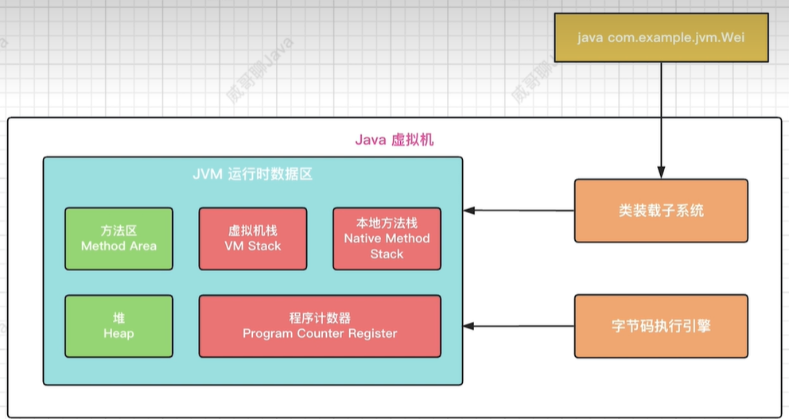
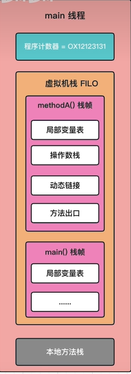
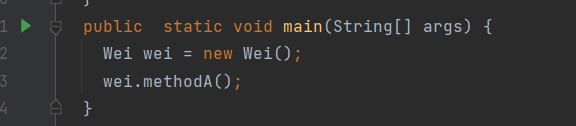
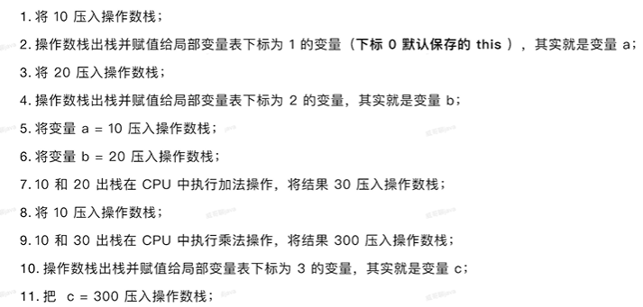
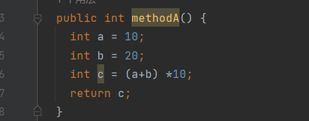
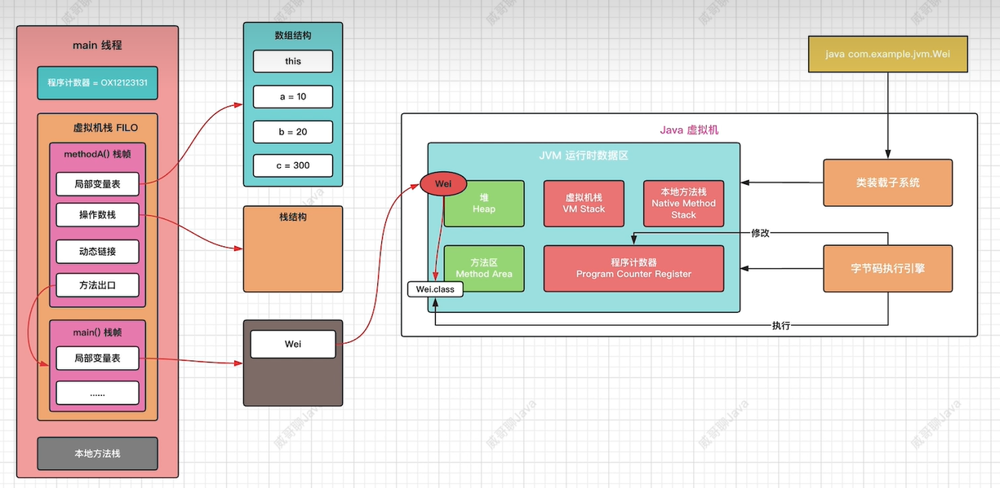

# JVM中代码的执行过程

现有代码如下：

```
public class Wei {
  /**
   * 一个方法对应一块栈帧内存区域
   */
  public int methodA() {
    int a = 10;
    int b = 20;
    int c = (a+b) *10;
    return c;
  }
  public  static void main(String[] args) {
    Wei wei = new Wei();
    wei.methodA();
  }
}
```

那么JVM是如何执行这份代码的？我们首先要了解下JVM的完整结构，如下图：



可以看到，JVM是由三部分组成：类装载子系统，JVM运行时数据区和字节码执行引擎。它们三个是如何写作完成代码的执行的呢？简单来说，分为两步：

1.通过类装载子系统把class文件加载到JVM运行时数据区；

2.字节码执行引擎执行JVM运行时数据区的数据；

接下来我们重点关注第二步，我们知道，字节码文件加载到JVM运行时数据区后，开始执行main方法，我们使用一张图来说明main线程的栈结构：



main方法执行第一步时，会在堆上生成对象Wei的对象实例，main方法的局部变量表中保存的是该对象实例在堆中的内存地址，即对该对象的引用。接着我们看第二步，执行methodA();



现在我们使用如下命令，反编译下字节码文件，命令和内容分别如下：

```
PS C:\Users\86178\Desktop\project\javaproject\demo\src> javap -c .\Wei.class > wei.txt
```

```
Compiled from "Wei.java"
public class Wei {
  public Wei();
    Code:
       0: aload_0
       1: invokespecial #1                  // Method java/lang/Object."<init>":()V
       4: return

  public int methodA();
    Code:
    //将一个8位带符号整数压入栈
       0: bipush        10
    //将int类型值存入局部变量1(1代表局部变量表的下标，默认下标0是this)
       2: istore_1
    //将一个8位带符号整数压入栈
       3: bipush        20
    //将int类型值存入局部变量2
       5: istore_2
    //从局部变量1中装载int类型值
       6: iload_1
    //从局部变量2中装载int类型值
       7: iload_2
    //执行int类型的加法
       8: iadd
    //将一个8位带符号整数压入栈
       9: bipush        10
    //执行int类型的乘法
      11: imul
    //将int类型值存入局部变量3
      12: istore_3
    //从局部变量3中装载int类型值
      13: iload_3
      14: ireturn

  public static void main(java.lang.String[]);
    Code:
       0: new           #2                  // class Wei
       3: dup
       4: invokespecial #3                  // Method "<init>":()V
       7: astore_1
       8: aload_1
       9: invokevirtual #4                  // Method methodA:()I
      12: pop
      13: return
}
```

methodA()解释：






执行完后，完整的内存关系图如下：



`methodA()`执行完后，通过栈帧中的**方法出口**，可以定位到`main()`代码的执行位置。`methodA()`栈帧被弹出`main`线程的虚拟机栈。

`main()`方法执行结束，`main()`栈帧被弹出`main`线程的虚拟机栈。