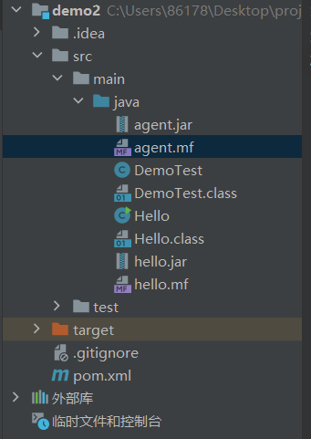
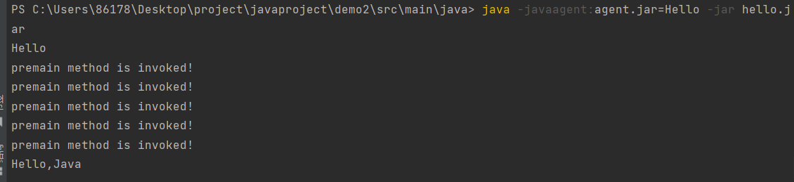
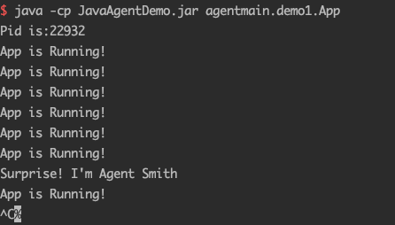

# AOP

> JAVA中如何实现AOP：
> 
> 在 Java 中实现 AOP（面向切面编程）通常使用的技术是**动态代理**和**字节码增强**。这两种技术都允许开发人员在运行时对方法的调用进行拦截，并在方法执行前后执行额外的逻辑，从而实现横切关注点的功能。
> 
> 1.**动态代理**：Java 提供了** java.lang.reflect.Proxy** 类来实现动态代理。通过动态代理，你可以创建一个实现了某个接口的代理对象，在代理对象的方法调用前后执行额外的逻辑。通常，AOP 框架会使用动态代理来创建代理对象，然后将代理对象织入到目标对象的调用链中。
> 
> 2.**字节码增强**：字节码增强是通过**修改目标类的字节码**来实现 AOP 的。Java 的字节码可以在运行时被加载、修改和重新定义。因此，AOP 框架可以通过在目标类的字节码中插入额外的代码来实现方法拦截和横切逻辑。常见的字节码增强工具包括 `ASM`、`CGLIB` 和 `ByteBuddy` 等。
> 
> 一般来说，AOP 框架会结合这两种技术来实现 AOP 功能。例如，**Spring Framework 中的 AOP 模块使用动态代理来实现基于接口的代理，而对于没有接口的类，则使用字节码增强来生成子类，并在子类中添加横切逻辑。**

AOP为`Aspect Oriented Programming`的缩写，意为: **面向切面编程**。在运行时，***<u>动态地将代码切入到类的指定方法、指定位置上的编程思想</u>***就是面向切面的编程。

> JDK 1.5 开始，Java新增了Instrumentation(Java Agent API)和JVMTI(JVM Tool Interface)功能，**允许JVM在加载某个class文件之前对其字节码进行修改，同时也支持对已加载的class(类字节码)进行重新加载(Retransform)**。
> 
> 开发者可以在一个普通Java程序（带有main函数的Java类）运行时，通过`–javaagent`参数指定一个特定的jar文件(包含`Instrumentation`代理)来启动`Instrumentation`的代理程序。在类的字节码载入`jvm`前会调用`ClassFileTransformer`的`transform`方法，从而实现修改原类方法的功能，实现AOP。

通过java.lang.instrument实现的工具我们称之为Java Agent，Java Agent能够在不影响正常编译的情况下来修改字节码，即**动态修改已加载或者未加载的类，包括类的属性、方法**，**Agent内存马的实现就是利用了这一特性使其动态修改特定类的特定方法，将我们的恶意方法添加进去。**

说白了Java Agent只是一个Java类而已，只不过普通的Java类是以main函数作为入口点的，Java Agent的入口点则是`premain`和`agentmain`

Java Agent 支持两种方式进行加载：

- 实现 premain 方法，在**启动时**进行加载 （该特性在 jdk 1.5 之后才有）
- 实现 agentmain 方法，在**启动后**进行加载 （该特性在 jdk 1.6 之后才有）

# premain

首先创建一个premain的agent:

```
import java.lang.instrument.Instrumentation;

public class DemoTest {
  public static void premain(String agentArgs, Instrumentation inst) throws Exception{
    System.out.println(agentArgs);
    for(int i=0;i<5;i++){
      System.out.println("premain method is invoked!");
    }
  }
}
```

然后通过mvn或者mf文件打生成jar包：

```
Manifest-Version: 1.0
Premain-Class: DemoTest
```

利用javac生成class文件之后打包：`jar cvfm agent.jar agent.mf DemoTest.class`

然后再创建一个普通的类Hello.java和mf文件:

```
public class Hello {
    public static void main(String[] args) {
        System.out.println("Hello,Java");
    }
}
```

mf文件:

```
Manifest-Version: 1.0
Main-Class: Hello
```

同样打包为jar: `jar cvfm hello.jar hello.mf Hello.class`

接下来运行的时候增加-javaagent:agent.jar: `java -javaagent:agent.jar=Hello -jar hello.jar`





# agentmain

## App.java

循环输出，模拟运行的应用

```
package agentmain;

import java.lang.management.ManagementFactory;

public class App {
  public static void main(String[] args) throws InterruptedException {
    while (true){
      String name = ManagementFactory.getRuntimeMXBean().getName();
      String pid = name.split("@")[0];
      System.out.println("Pid is:" + pid);
      for(int i=0;i<500;i++){
        System.out.println("App is Running!");
        Thread.sleep(2000);
      }
    }
  }
}
```

## AgentDemo.java

实现agentmain功能，用于agent的功能实现

```
package agentmain;

import java.lang.instrument.Instrumentation;

public class AgentDemo {
  public static void agentmain(String agentArgs, Instrumentation inst){
    System.out.println("Surprise! I'm Agent Smith");
  }
}
```

## Inject.java

通过VirtualMachine的loadAgent方式，把Agent注入正在运行的App里：

```
package agentmain;

import com.sun.tools.attach.VirtualMachine;

public class Inject {
  public static void main(String[] args) throws Exception {
    String pid = args[0];
    String jarName = args[1];

    VirtualMachine vm = VirtualMachine.attach(pid);
    vm.loadAgent(jarName);
    vm.detach();
  }
}
```

以上三个java文件通过IDEA打包为Jar文件，首先运行App.jar：

```
java -cp JavaAgentDemo.jar agentmain.demo1.App
```

然后使用Inject.jar注入进程

```
java -cp JavaAgentDemo.jar agentmain.demo1.Inject 22932 /var/tmp/AgentDemo.jar
```

可以看到App.jar的输出被动态的改变了：

