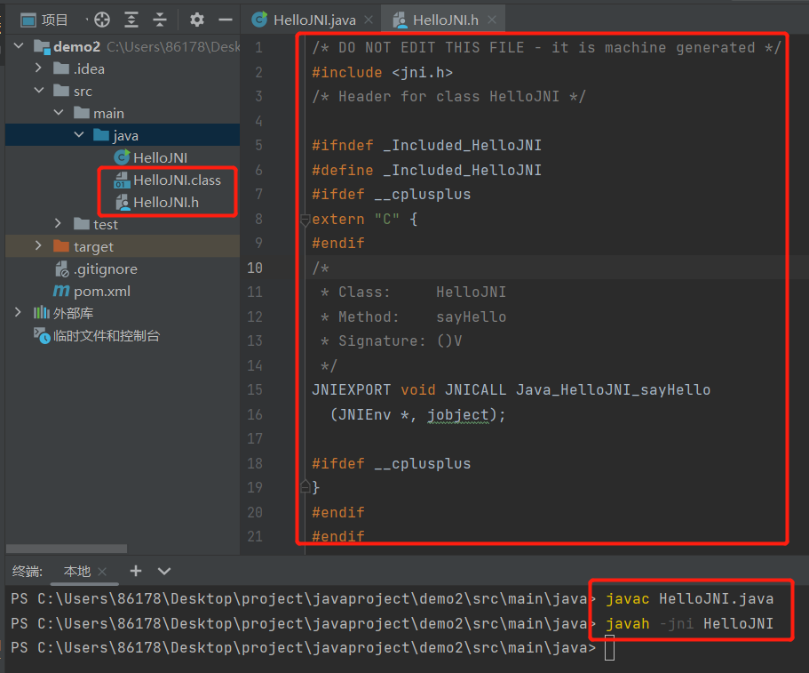
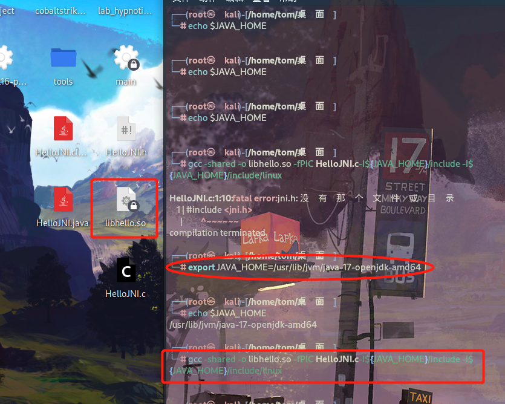
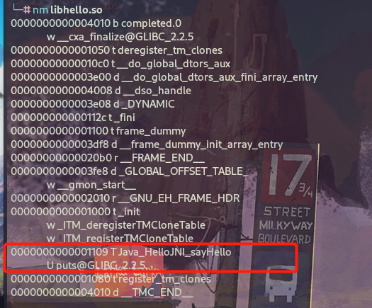
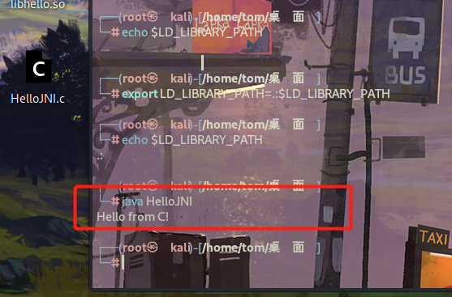

# Java Native Interface

JNI是Java Native Interface的缩写，中文译为“Java本地接口”。通俗地说，JNI是一种技术，通过这种技术可以做到以下两点：

1. **Java程序中的函数可以调用Native语言写的函数，Native一般指的是C/C++编写的函数。**
2. **Native程序中的函数可以调用Java层的函数，也就是说在C/C++程序中可以调用Java的函数。
也就是Java与C/C++代码互相调用**

在平台无关的Java中，为什么要创建一个与Native相关的JNI技术呢？这岂不是破坏了Java的平台无关特性吗？JNI技术的推出有以下几个方面的考虑：

1. 承载Java世界的虚拟机是用Native语言写的，而虚拟机又运行在具体的平台上，所以虚拟机本身无法做到平台无关。然而，有了JNI技术后就可以对Java层屏蔽不同操作系统平台（如Windows和Linux）之间的差异了（例如同样是打开一个文件，Windows上的API使用OpenFile函数，而Linux上的API是open函数）。这样，就能实现Java本身的平台无关特性。其实Java一直在使用JNI技术，只是我们平时较少用到罢了。
2. 早在Java语言诞生前，很多程序都是用C/C++语言写的，它们遍布在软件世界的各个角落。Java出世后，它受到了追捧，并迅速得到发展，但仍无法将软件世界彻底改朝换代，于是才有了折中的办法。既然已经有C/C++模块实现了相关功能，那么在Java中通过JNI技术直接使用它们就行了，免得落下重复制造轮子的坏名声。另外，在一些要求效率和速度的场合还是需要C/C++语言参与的。
3. 在Android平台上，JNI就是一座将C/C++世界和Java世界间的天堑变成通途的桥。
4. 效率上 C/C++是本地语言，比java更高效
5. 代码移植，如果之前用C语言开发过模块，可以复用已经存在的c代码
6. java反编译比C语言容易，一般加密算法都是用C语言编写，不容易被反编译

> JNI的存在意义主要在于桥接Java和本地代码，使得Java程序可以调用其他编程语言(如 C，C++)编写的代码或库。其作用如下：
> 
> 1.性能优化：某些计算密集型任务可以通过调用效率更高的本地代码来实现，从而提升性能。
> 
> 2.复用现有库：可以调用现有的本地库或代码，避免重复开发。
> 
> 3.访问系统特性：某些系统特性或硬件功能只能通过本地代码访问，JNI 提供了一种途径来实现这种访问。
> 
> 4.与硬件交互：某些硬件接口只能通过本地代码进行交互，JNI 允许 Java 程序与这些接口通信。

# JNI开发的基本流程

1.一个标准的 JNI 开发流程主要包含以下步骤：

1. 创建 HelloWorld.java，并声明 native 方法 sayHi()；
2. 使用 javac 命令编译源文件，生成 HelloWorld.class 字节码文件；
3. 使用 javah 命令导出 HelloWorld.h 头文件（头文件中包含了本地方法的函数原型）；
4. 在源文件 HelloWorld.cpp 中实现函数原型；
5. 编译本地代码，生成 Hello-World.so 动态原生库文件；
6. 在 Java 代码中调用 System.loadLibrary(...) 加载 so 文件；
7. 使用 Java 命令运行 HelloWorld 程序。

总之，JNI提供了一个桥梁，使得Java应用程序可以与本地代码进行交互，从而获得更高的性能和更广泛的功能。但需要注意的是，使用JNI需要小心处理内存管理和跨平台兼容性等问题。

# 简单的 JNI 例子

展示如何使用 JNI 从 Java 调用 C 代码。

## Step 1:编写 Java 类

首先，编写一个Java类，声明一个本地方法。

```
public class HelloJNI {
    // 声明本地方法
    private native void sayHello();

    // 加载本地库
    static {
        System.loadLibrary("hello"); // 对应生成的本地库名为 libhello.so 或 hello.dll
    }

    public static void main(String[] args) {
        new HelloJNI().sayHello(); // 调用本地方法
    }
}
```

上面代码的静态代码块在这个类被类加载器加载的时候调用了System.loadLibrary()方法来加载一个native库“hello”（这个库中实现了sayHello函数）。这个库在windows上对应了“hello.dll”，而在类UNIX平台上对应了“libhello.so”。这个库应该包含在Java的库路径（使用java.library.path系统变量表示）上，否则这个上面的程序会抛出UnsatisfiedLinkError错误。你应该使用VM的参数-D java.library.path=path_to_lib来指定包含native库的路径。
接下来，我们使用native关键字将sayHello()方法声明为本地实例方法，这就很明显地告诉JVM：这个方法实现在另外一个语言中（C/C++），请去那里寻找他的实现。注意，一个native方法不包含方法体，只有声明。上面代码中的main方法实例化了一个HelloJNI类的实例，然后调用了本地方法sayHello()。

> `private native void sayHello();`声明了一个本地方法，该方法将在 C 代码中实现。
> 
> `System.loadLibrary("hello"); `加载名为 hello 的本地库，这个库在不同平台上会有不同的文件扩展名（例如，Unix/Linux 上是 libhello.so，Windows 上是 hello.dll）。
> 
> `main` 方法创建 HelloJNI 实例并调用本地方法 sayHello。

## Step 2: 生成 JNI 头文件

编译 Java 代码并生成 JNI 头文件。

```
# 编译 Java 代码
javac HelloJNI.java

# 生成 JNI 头文件
javah -jni HelloJNI
```

这将生成一个名为 HelloJNI.h 的头文件，其中包含了本地方法的声明。



我们看到，上面的头文件中生成了一个Java_HelloJNI_sayHello的C函数：

```
JNIEXPORT void JNICALL Java_HelloJNI_sayHello(JNIEnv *, jobject);
```

将java的native方法转换成C函数声明的规则是这样的：`Java_{package_and_classname}_{function_name}(JNI arguments)`。包名中的点换成单下划线。需要说明的是生成函数中的两个参数：

1. JNIEnv *：这是一个指向JNI运行环境的指针，后面我们会看到，我们通过这个指针访问JNI函数
2. jobject：这里指代java中的this对象

下面我们给出的例子中没有使用上面的两个参数，不过后面我们的例子会使用的。到目前为止，你可以先忽略JNIEXPORT和JNICALL这两个玩意。
上面头文件中有一个extern “C”，同时上面还有C++的条件编译语句，这么一来大家就明白了，这里的函数声明是要告诉C++编译器：这个函数是C函数，请使用C函数的签名协议规则去编译！因为我们知道C++的函数签名协议规则和C的是不一样的，因为C++支持重写和重载等面向对象的函数语法。
接下来，我们给出C语言的实现，以实现上面的函数：

## Step 3:编写 C 代码

接下来，编写对应的 C 实现。

HelloJNI.c：

```
#include <jni.h>
#include <stdio.h>
#include "HelloJNI.h"

// 实现本地方法
JNIEXPORT void JNICALL Java_HelloJNI_sayHello(JNIEnv *env, jobject obj) {
    printf("Hello from C!\n");
}
```

> HelloJNI.h 包含了 JNI 的必要头文件和函数声明。
> 
> Java_HelloJNI_sayHello 函数实现了 sayHello 方法，使用 printf 打印消息。
> 
> jni.h 文件通常位于 `$JAVA_HOME/include `目录中，且特定平台的文件位于 `$JAVA_HOME/include/<platform>` 中，例如，Linux 平台上为` $JAVA_HOME/include/linux`。

## Step 4: 编译 C 代码

编译本地代码生成共享库,此处Linux环境。

```
# 在 Unix/Linux 系统上
gcc -shared -o libhello.so -fPIC HelloJNI.c -I${JAVA_HOME}/include -I${JAVA_HOME}/include/linux

# 在 Windows 系统上
gcc -shared -o hello.dll HelloJNI.c -I"%JAVA_HOME%\include" -I"%JAVA_HOME%\include\win32"
```

> 使用 gcc 编译 C 代码并生成共享库，编译时需要指定 Java 头文件的路径。



我们首先使用nm命令查看libhello.so中都有那些函数：

> nm 是一个用于列出二进制文件（如可执行文件、目标文件和库）中符号表的命令。符号表包含了符号（函数和变量）的信息，包括它们的名称、地址和类型。nm 命令在调试和开发过程中非常有用，特别是用于分析编译后的文件和库。



可以看到我们的sayHello函数已经在这个里面，这说明我们编译的基本没有问题。

## Step 5: 运行 Java 程序

确保共享库在库路径中，然后运行 Java 程序。

```
# 设置库路径（Unix/Linux）
export LD_LIBRARY_PATH=.:$LD_LIBRARY_PATH

# 设置库路径（Windows）
set PATH=%PATH%;.

# 运行 Java 程序
java HelloJNI
```



如果一切正常，程序将输出：

```
Hello from C!
```

# JNI 模板代码

JNI Demo：

```
JNIEXPORT void JNICALL Java_HelloJNI_sayHello(JNIEnv *, jobject);
```

## JNI 函数名

为什么 JNI 函数名要采用  `Java_HelloJNI_sayHello` 的命名方式呢？—— 这是 JNI 函数静态注册约定的函数命名规则。Java 的 native 方法和 JNI 函数是一一对应的映射关系，而建立这种映射关系的注册方式有 2 种：静态注册 + 动态注册。
其中，静态注册是基于命名约定建立的映射关系，一个 Java 的 native 方法对应的 JNI 函数会采用约定的函数名，即**` Java_[类的全限定名 (带下划线)]_[方法名] `**。JNI 调用 sayHello() 方法时，就会从 JNI 函数库中寻找函数 `Java_HelloJNI_sayHello()`

> Java 的 native 方法和 JNI 函数是一一对应的映射关系，建立这种映射关系的注册方式有 2 种：
• 方式 1 - 静态注册： 基于命名约定建立映射关系；
• 方式 2 - 动态注册： 通过 JNINativeMethod 结构体建立映射关系。

## 关键词 JNIEXPORT

`JNIEXPORT` 是宏定义，表示一个函数需要暴露给共享库外部使用时。JNIEXPORT 在 Window 和 Linux 上有不同的定义：

jni.h:

```
// Windows 平台 :
#define JNIEXPORT __declspec(dllexport)
#define JNIIMPORT __declspec(dllimport)
// Linux 平台：
#define JNIIMPORT
#define JNIEXPORT  __attribute__ ((visibility ("default")))
```

## 关键词 JNICALL

`JNICALL` 是宏定义，表示一个函数是 JNI 函数。JNICALL 在 Window 和 Linux 上有不同的定义：

jni.h:

```
// Windows 平台 :
#define JNICALL __stdcall // __stdcall 是一种函数调用参数的约定 ,表示函数的调用参数是从右往左。
// Linux 平台：
#define JNICALL
```

## 参数 jobject

`jobject` 类型是 JNI 层对于 Java 层应用类型对象的表示。每一个从 Java 调用的 native 方法，在 JNI 函数中都会传递一个当前对象的引用。区分 2 种情况：

- 静态 native 方法： 第二个参数为 jclass 类型，指向 native 方法所在类的 Class 对象；
- 实例 native 方法： 第二个参数为 jobject 类型，指向调用 native 方法的对象。

<br/>

<br/>

<br/>

<br/>

<br/>

<br/>

<br/>

<br/>

<br/>

<br/>

<br/>

<br/>

<br/>

<br/>

<br/>

<br/>

<br/>

<br/>

<br/>

<br/>

<br/>

<br/>

<br/>

<br/>

<br/>

<br/>

<br/>

<br/>

<br/>

<br/>

<br/>

<br/>

<br/>

<br/>

<br/>

<br/>

<br/>

<br/>

<br/>

<br/>

<br/>

<br/>

<br/>

<br/>

<br/>

<br/>

***

`这世上真话本就不多，一个女孩子的脸红胜过一大段对白。但后来有了胭脂，便分不出是真情还是假意`