# 代码审计常用思路

1. 接口排查（“正向追踪”）：先找出从外部接口接收的参数，并跟踪其传递过程，观察是否有参数校验不严的变量传入高危方法中，或者在传递的过程中是否有代码逻辑漏洞。
2. 危险方法溯源（“逆向追踪”）：检查敏感方法的参数，并查看参数的传递与处理，判断变量是否可控并且已经过严格的过滤。
3. 功能点定向审计：根据经验判断该类应用通常会在哪些功能中出现漏洞，直接审计该类功能的代码。
4. 第三方组件、中间件版本比对：检查 Web 应用所使用的第三方组件或中间件的版本是否受到已知漏洞的影响。
5. 开发框架安全审计：审计 Web 应用所使用的开发框架是否存在自身安全性问题，或者由于用户使用不当而引发的安全风险。
6. 补丁比对：通过对补丁做比对，反推漏洞出处。

# 远程调试

IntelliJ IDEA 可以在无源代码的情况下进行远程调试，只需将程序的 class 文件或 Jar 包添加进项目依赖即可对一些未开源的 Java 程序或大型中间件进行远程调试。

## 对 Jar 包进行远程调试

使用 IntelliJ IDEA 创建一个 Java 项目，并创建一个 lib 文件夹将 Jar 包放入。如下图所示，选中 lib 文件夹后，右键选择“Add as Library…”，将 lib 文件夹添加进项目依赖。成功添加后可以看到 Jar 包中反编译后的源代码。

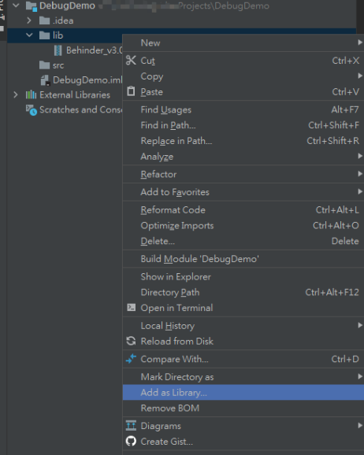

如下图所示，通过右上角的“Add Configurations”，并单击“+”来添加一个“Remote”。默认配置界面如图示，单击“Apply”提交并保存即可。其中“-agentlib:jdwp=transport=dt_socket,server=y,suspend=n,address=5005”将作为运行时的启动参数。

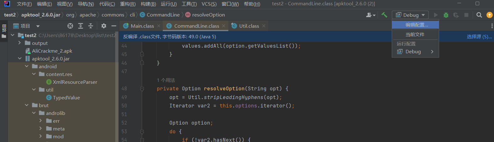

IDEA 中默认配置远程调试设置

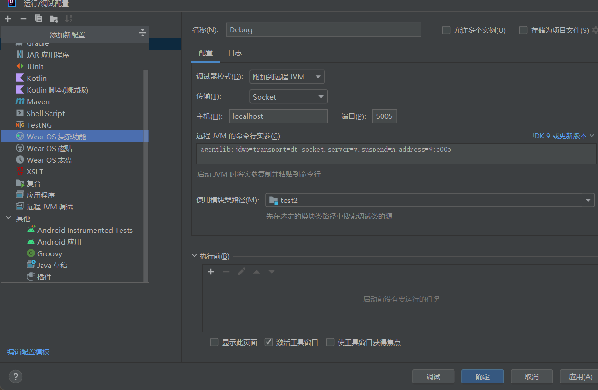

将“-agentlib:jdwp=transport=dt_socket,server=y,suspend=n,address=5005”作为启动参数运行 Jar 包，如下图所示。suspend 表示是否暂停程序等待调试器的连接，“y”表示暂停，“n”表示不暂停。建议选择暂停，避免程序执行过快导致一些断点无法拦截程序。

```
java -agentlib:jdwp=transport=dt_socket,server=y,suspend=y,address=5005 -jar apktool_2.6.0.jar
```

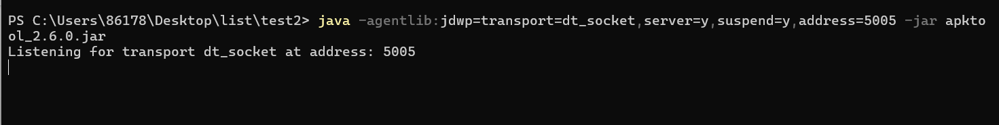

单击 IntelliJ IDEA 右上角的 Debug 按钮，即可发现程序在断点处暂停，然后就可以进行逐步的调试了。

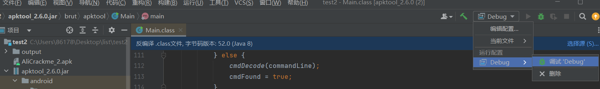

远程调试成功

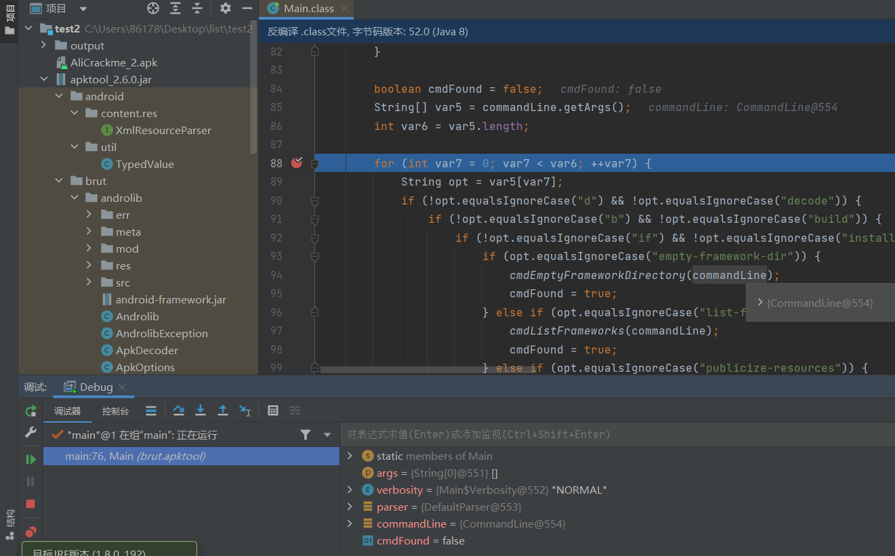

## 对 Weblogic 进行远程调试

进入/weblogic/CVE-2017-10271 文件夹，修改其中的 docker-compose.yml 文件，将 8453 端口打开。

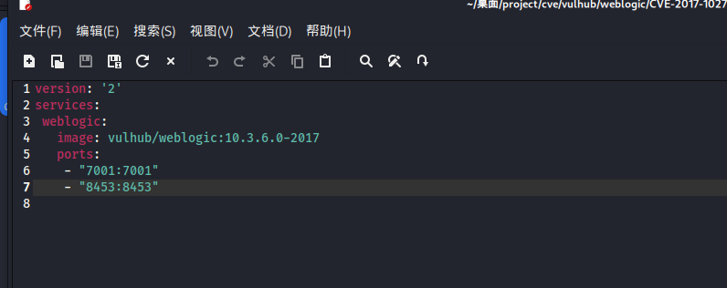

使用 docker-compose 命令 docker-compose up -d 编译镜像并启动容器。容器成功启动，开启 8453 端口并且映射到本机。

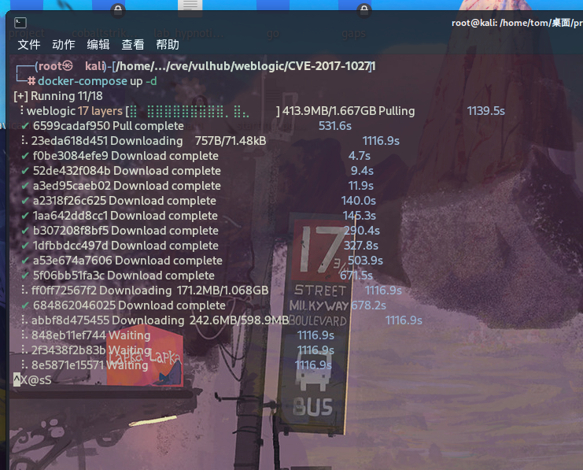

使用 docker exec -it 3d /bin/bash 命令进入容器，使用 vi 修改文件/root/Oracle/ Middleware/user_projects/domains/base_domain/bin/setDomainEnv.sh。在下图所示代码段处添加如下两行代码。

```
ebugFlag="true" 
export debugFlag
```

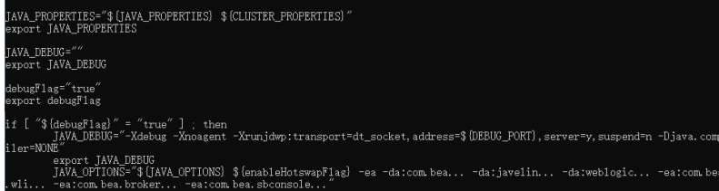

使用 docker restart 命令重启容器，再进入容器，将/root/Oracle/Middleware 文件夹下的 modules 文件夹和 wlserver_10.3 文件夹使用 zip 命令压缩成 zip 压缩包。容器中是一个简易的 Linux 系统，需要执行 apt-get install zip 来安装 zip 压缩功能。Windows命令行对路径长度有限制，如果直接使用 docker 的 cp 指令，就会在复制一些长文件名的文件时报错，因此这一步的目的是打包成压缩文件再进行复制，以避免这个问题的出现。如下图所示，使用 docker 的 cp 指令分别将 modules.zip 和 wlserver_ 10.3.zip 复制至本机当前路径的 test 文件夹中。

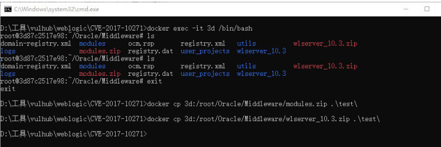

将该文件移动至一个项目文件中，并使用 IDEA 打开，如下图所示，选中w1server_10.3/server/lib 文件和 modules 文件并右键单击，选择“Add as Library…”添加依赖文件。

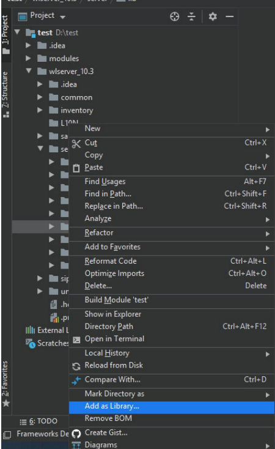

如下图所示，单击 IDEA 右上角的“Add Configurations”按钮，在弹出的选项框中单击左上角的“+”进行“Add New Configurations”操作。然后在下拉框中找到 Remote 选项并单击，进入后图所示的配置页面，填写端口号为 8453，注意，需要与第一步在 docker-compose.yml 文件中的填写内容保持一致。填写完毕，单击“Apply”按钮应用配置，再单击“OK”按钮关闭配置页面即可。

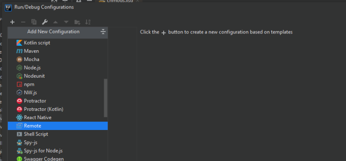

配置远程调试

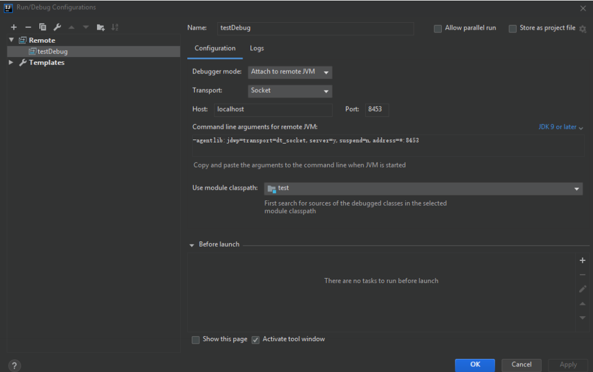

如下图所示，在 wlserver_10.3/server/lib/weblogic.jar!/weblogic/wsee/jaxws/ WLSServletAdapter.class 的 hadle 方法处设置断点，接着单击右上角的 Debug 按钮（绿色小虫子图标）运行 Debug 模式。然后使用浏览器访问 http://127.0.0.1:7001/ wls-wsat/CoordinatorPortType，同时查看 IDEA 是否如后图所示，程序在断点处停

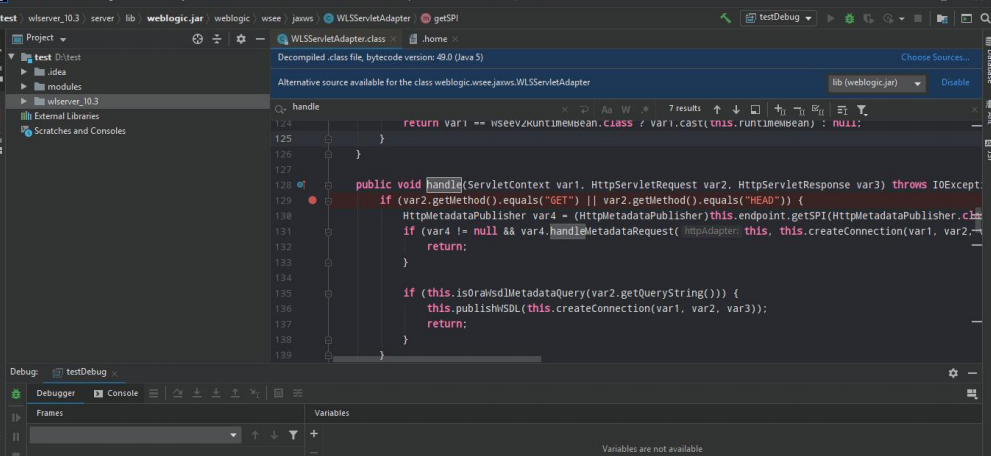

止。当程序成功在断点处停止运行时，表示远程调试配置成功，此时就可以像调试本地程序一样调试 Docker 中的 Weblogic 应用了。

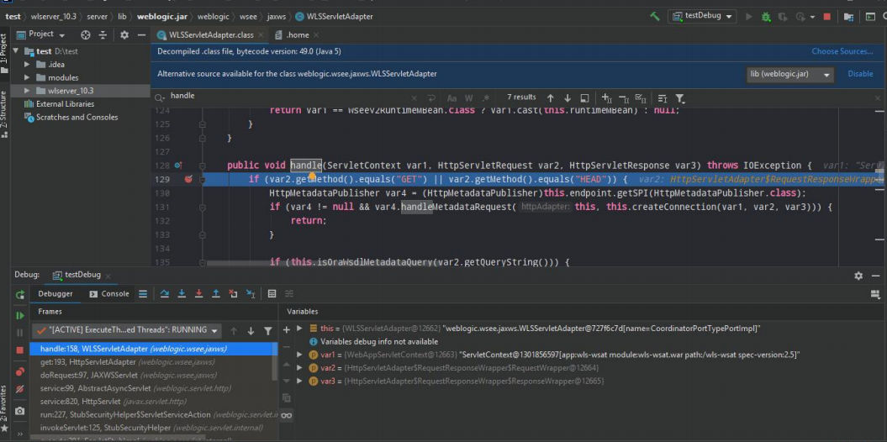

## 对 Tomcat 进行远程调试

进入 Vulhub 中 CVE-2017-12615 漏洞环境所在的文件夹，如图 2-43 所示，修改docker-compose.yml 文件，将 5005 端口开启

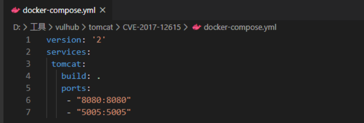

使用 docker-compose up –d 命令快速启动 CVE-2017-12615 漏洞验证环境。如下图所示，进入容器中，并在/usr/local/tomcat/bin/catalina.sh 插入命令Java_OPTS="-agentlib:jdwp=transport=dt_socket,server=y,suspend=y,address=5005"。需要注意的是，容器中事先未安装 Vim 编辑器，需要先使用 apt-get install vim 命令进行安装。修改完毕后，退出容器，并重启容器。

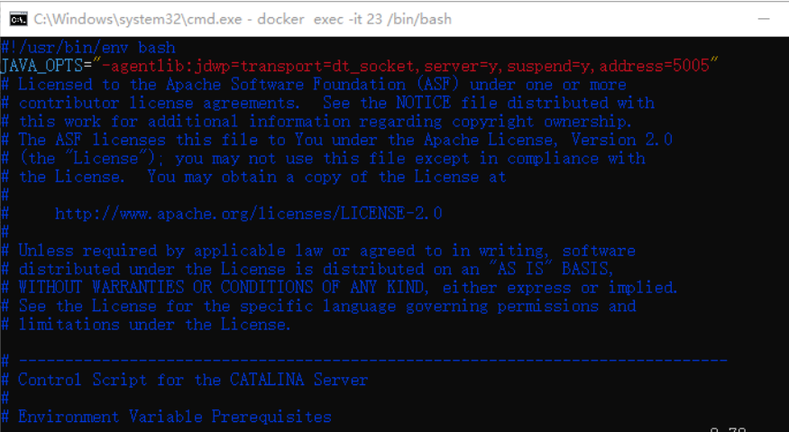

使用 docker cp 命令，将/usr/local/tomcat/lib 文件夹复制至物理机。再使用 IDEA打开，如下图所示。右键选中 lib 文件夹并选择“Add as Library…”选项添加依赖文件。

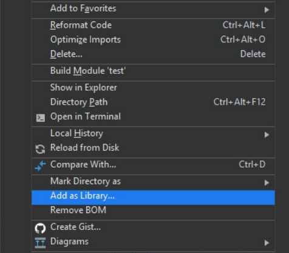

如下图所示，单击 IDEA 右上角的“Add Configurations”，在弹出的选项框里单击左上角的“+”进行“Add New Configuration”操作。然后下拉找到 Remote 选项并单击，进入图二所示的配置页面，填写端口号为 8453，注意，需和第一步在docker-compose.yml 文件里填写的内容保持一致。填写完毕，单击“Apply”按钮应用设置，再单击“OK”按钮关闭配置页面即可。如图三所示，设置断点，单击 IDEA 右上角 Debug 运行（绿色小虫子标志），然后使用浏览器访问 http://127.0.0.1:8080，会发现程序已在断点处暂停，这就可以像调试本地程序一样调试 Docker 中的 Tomcat。

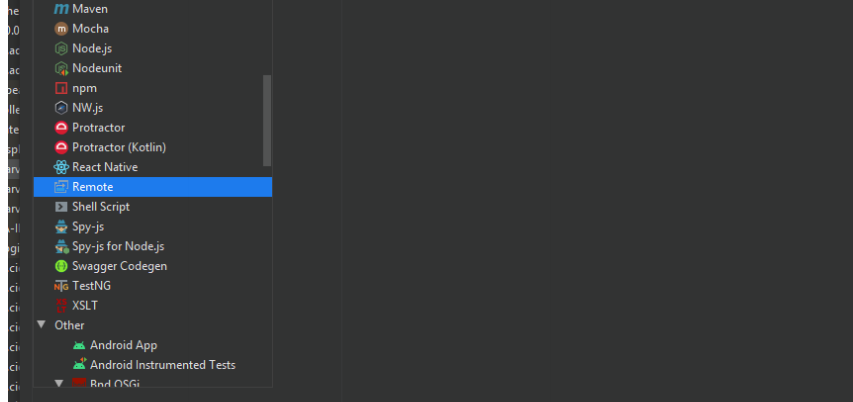

配置远程调试端口

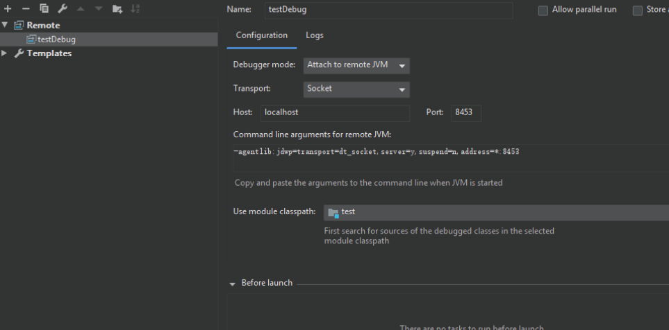

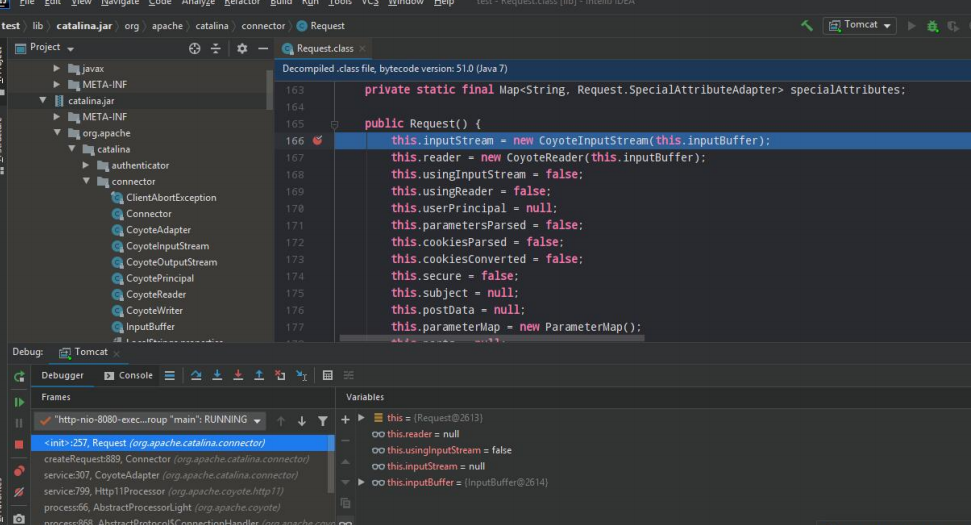