Java 平台有 3 个主要版本，分别是 Java SE（Java Platform Standard Edition，Java平台标准版）、Java EE（Java Platform Enterprise Edition，Java 平台企业版）和 Java ME（Java Platform Micro Edition，Java 平台微型版）。其中，Java EE 是 Java 应用最广泛的版本。Java EE 也称为 Java 2 Platform 或 Enterprise Edition（J2EE）。Java EE 可以说是一个框架，也可以说是一种规范。

# Java EE 分层模型

## Java EE 的核心技术

Java EE 的核心技术有很多，包括 ***JDBC、JNDI、EJB、RMI、Servlet、JSP、XML、JMS、Java IDL、JTS、JTA、JavaMail 和 JAF***。这里仅解释部分常用技术的释义。

- **Java数据库连接(Java Database Connectivity , JDBC)** 在Java中用来规范客户端程序如何访问数据库的应用程序接口，提供了诸如查询和更新数据库中数据的方法

- **Java命令和目录接口(Java Naming and Directory Interface,JNDI)**是Java的一个目录服务应用程序界面(API),它提供了一个目录系统，并将服务名称与对象关联起来，从而使得开发人员在开发过程中可以用名称来访问对象。
- **企业级 JavaBean（Enterprise JavaBean，EJB）**是一个用来构筑企业级应用的、在服务器端可被管理的组件。
- **远程方法调用（Remote Method Invocation，RMI）**是 Java 的一组拥护开发分布式应用程序的 API,它大大增强了 Java 开发分布式应用的能力。
- **可扩展标记语言（eXtensible Markup Language，XML）**是被设计用于传输和存储数据的语言。
- **Java 消息服务（Java Message Service，JMS）**是一个 Java 平台中关于面向消息中间件（MOM）的 API，用于在两个应用程序之间或分布式系统中发送消息，进行异步通信。
- **JSP（JavaServer Pages）**是由 Sun 公司主导并创建的一种动态网页技术标准。JSP 部署于网络服务器上，可以响应客户端发送的请求，并根据请求内容动态生成HTML、XML 或其他格式文档的 Web 网页，然后返回给请求者。

## Java EE 分层模型

Java EE 应用的分层模型主要分为以下 5 层。

- **Domain Object（领域对象）层**：本层由一系列 POJO（Plain Old Java Object，普通的、传统的 Java 对象）组成，这些对象是该系统的 Domain Object，通常包含各自所需实现的业务逻辑方法。
- **DAO（Data Access Object，数据访问对象）层**：本层由一系列 DAO 组件组成，这些 DAO 实现了对数据库的创建、查询、更新和删除等操作。
- **Service（业务逻辑）层**：本层由一系列的业务逻辑对象组成，这些业务逻辑对象实现了系统所需要的业务逻辑方法。
- **Controller（控制器）层**：本层由一系列控制器组成，这些控制器用于拦截用户的请求，并调用业务逻辑组件的业务逻辑方法去处理用户请求，然后根据处理结果向不同的 View 组件转发。
- **View（表现）层**：本层由一系列的页面及视图组件组成，负责收集用户请求，并显示处理后的结果

如下图所示，<u>***首先由数据库给 Domain Object 层提供持久化服务，然后由Domain Object 层去封装 DAO 层，DAO 层为业务逻辑层提供数据访问服务，接着业务逻辑层为控制器层提供逻辑支持，最终在表现层显示结果。***</u>

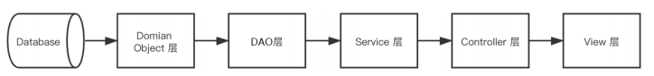

Java EE 分层模型的应用，使得项目易于维护，管理简化，并且适应大规模和复杂的应用需求以及不断变化的业务需求。此外，分层模型还能有效提高系统并发处理能力。

# MVC 模式与 MVC 框架

在对某一项目进行代码审计时，我们需要从其输入、处理和输出来审计漏洞，遵循 MVC（Model View Controller）思想。在 MVC 应用程序中，有 3 个主要的核心部件，分别是模型、视图、控制器，它们独立处理各自的任务，这种分离的思想使得我们在审计时能够抓住关键问题，而不用关心类似于界面显示等无关紧要的问题。

## Java MVC 模式

### MVC 的概念

MVC 全名是 Model View Controller，M（Model）是指数据模型，V（View）是指用户界面，C（Controller）是控制器。使用 MVC 最直接的目的就是将M和V实现代码分离，C 则是确保 M 和V 的同步，一旦 M 改变，V 就应该同步更新。简单来说，MVC 是一个设计模式，它强制性地使应用程序的输入、处理和输出分开。MVC 应用程序被分成 3 个核心部件：Model、View、Controller。它们独立处理各自的任务。

Java MVC 模式与普通 MVC 的区别不大，具体如下。

- **模型（Model）**：表示携带数据的对象或 Java POJO。即使模型内的数据改变，它也具有逻辑来更新控制器。
- **控制器（Controller）**：表示逻辑控制，控制器对模型和视图都有作用，控制数据流进入模型对象，并在数据更改时更新视图，是视图和模型的中间层。
- **视图（View）**：表示模型包含的数据的可视化层。

### MVC 工作流程

MVC 的工作流程也很容易理解。首先，Controller 层接收用户的请求，并决定应该调用哪个 Model 来进行处理；然后，由 Model 使用逻辑处理用户的请求并返回数S据；最后，返回的数据通过 View 层呈现给用户。

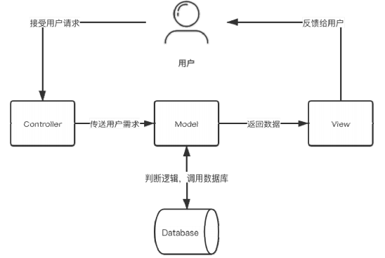

MVC 模式使视图层和业务层分离，以便更改 View 层代码时，不用重新编译Model 和 Controller 代码。同样，当某个应用的业务流程或者业务规则发生改变时，只需要改动 Model 层即可实现需求。

## Java MVC 框架

Java MVC 的框架有很多，如比较经典的 Struts1 框架、Struts2 框架、Spring MVC框架，此外还有小众的 JSF 框架以及 Tapestry 框架。下面简单介绍这些框架。

- Struts1 框架：Struts 是较早的 Java 开源框架之一，它是 MVC 设计模式的一个优秀实现。Struts1 框架基于 MVC 模式定义了通用的 Controller，通过配置文件分离了Model 和 View，通过 Action 对用户请求进行了封装，使代码更加清晰、易读，整个项目也更易管理。
- Struts2 框架：Struts2 框架并不是单纯由 Struts1 版本升级而来，而是 Apache 根据一个名为 WebWork 的项目发展而来的，所以两者的关系并不大。Struts2 框架同样是一个基于 MVC 设计模式的 Web 应用框架，它本质上相当于一个 Servlet。在MVC 设计模式中，Struts2 作为控制器来建立模型与视图的数据交互。
- Spring MVC 框架：Spring MVC 是一个基于 MVC 思想的优秀应用框架,它是Spring 的一个子框架，也是一个非常优秀的 MVC 框架。Spring MVC 角色划分清晰，分工明细，并且与 Spring 框架无缝结合。作为当今业界最主流的 Web 开发框架，Spring MVC 框架已经成为当前最热门的开发技能之一，同时也广泛用于桌面开发领域。
- JSF 框架：JSF 框架是一个用于构建 Java Web 应用程序的标准框架，也是一个MVC Web 应用框架，它提供了一种以组件为中心的用户界面（UI）构建方法，从而简化了 Java 服务器端应用程序的开发。
- Tapestry 框架：Tapestry 框架也是一种基于 Java 的 Web 应用程序框架，与上述4 款框架相比，Tapestry 并不是一种单纯的 MVC 框架，它更像 MVC 框架和模板技术的结合，不仅包含前端的 MVC 框架，还包含一种视图层的模板技术，并使用Tapestry 完全与 Servlet/JSP API 分离，是一种非常优秀的设计。相对于现有的其他Web 应用程序框架而言，Tapestry 框架会帮助开发者从烦琐的、不必要的底层代码中解放出来.

# Java Web 的核心技术——Servlet

Servlet 其实是在 Java Web 容器中运行的小程序。用户通常使用 Servlet 来处理一些较为复杂的服务器端的业务逻辑。Servlet 原则上可以通过任何客户端-服务器协议进行通信，但是它们常与 HTTP 一起使用，因此，“Servlet”通常用作“HTTP servlet”的简写。Servlet 是 Java EE 的核心，也是所有 MVC 框架实现的根本。

## Servlet 的配置

版本不同，Servlet 的配置不同。Servlet 3.0 之前的版本都是在 web.xml 中配置的，而 Servlet 3.0 之后的版本则使用更为便捷的注解方式来配置。此外，不同版本的Servlet 所需的 Java/JDK 版本也不相同。

Servlet 版本及其对应的 Java 版本：

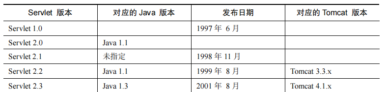

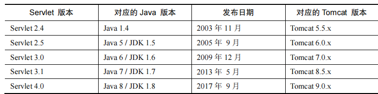

### 1.基于web.xml

下图是一个基于web.xml的Servelt配置

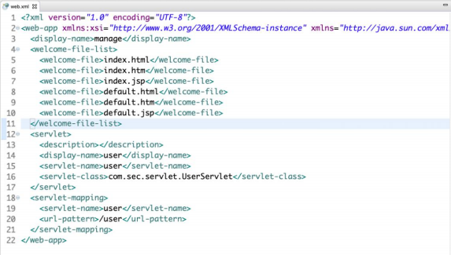

在 web.xml 中，Servlet 的配置在 Servlet 标签中，Servlet 标签是由 Servlet 和Servlet-mapping 标签组成，两者通过在 Servlet 和 Servlet-mapping 标签中相同的Servlet-name 名称实现关联，上图的标签含义如下：

- <servelt>:声明Servlet配置入口
- <description>:声明Servlet描述信息
- <display-name>:定义Web应用的名字
- <servlet-name>:声明Servlet名称以便在后面的映射时使用
- <servlet-class>:指定当前Servlet对应的类的路径
- <servlet-mapping>:注册组件访问配置的路径入口
- <url-pattern>:指定配置这个组件的访问路径

### 2.基于注解方式

Servlet 3.0 以上的版本中，开发者无须在 web.xml 里面配置 Servlet，只需要添加@WebServlet 注解即可修改 Servlet 的属性，如下图所示。

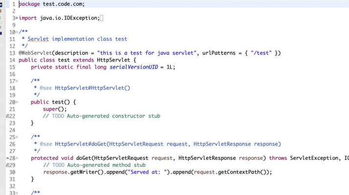

可以看到第 13 行@WebServlet 的注解参数有 description 及 urlPatterns，除此之外还有很多参数，具体如下表所示。

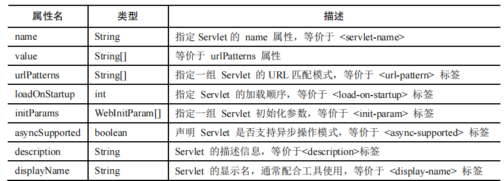

由此可以看出，web.xml 可以配置的 Servlet 属性，都可以通过@WebServlet 的方式进行配置。

## Servlet 的访问流程

以下面这张图为例，其访问流程如后图所示。

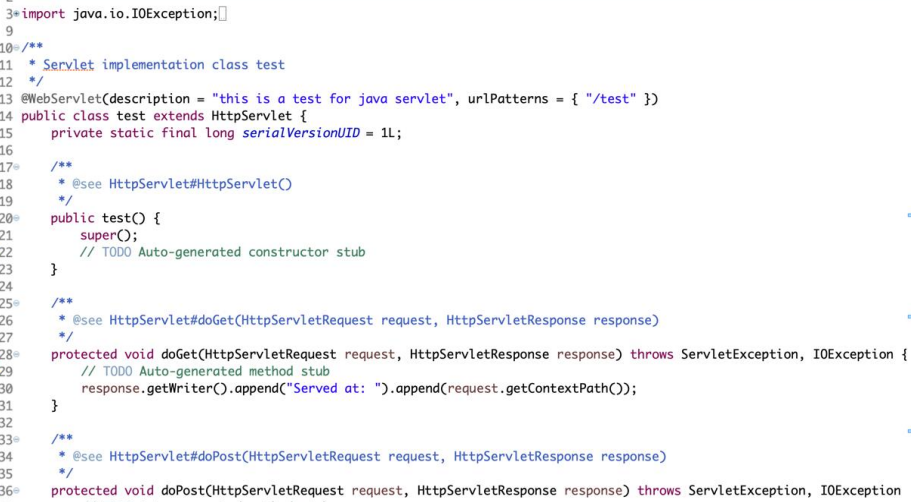

Servlet的访问流程：

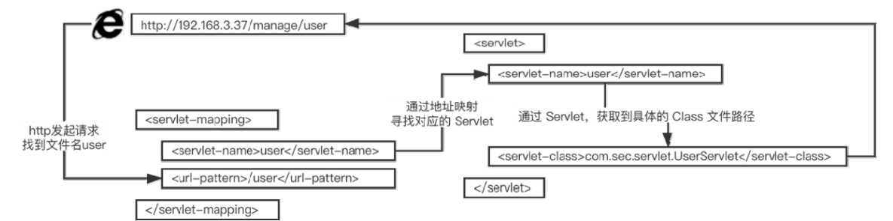

首先在浏览器地址栏中输入 user，即访问 url-pattern 标签中的值；然后浏览器发起请求，服务器通过 servlet-mapping 标签中找到文件名为 user 的 url-pattern，通过其对应的 servlet-name 寻找 servlet 标签中 servlet-name 相同的 servlet；再通过 servlet 标签中的 servlet-name，获取 servlet-class 参数；最后得到具体的 class 文件路径，继而执行 servlet-class 标签中 class 文件的逻辑。
从上述过程可以看出，servlet 和 servlet-mapping 中都含有<servlet-name> </servlet-name>标签，其主要原因是通过 servlet-name 作为纽带，将 servlet-class 和url-pattern 构成联系，从而使 URL 映射到 servlet-class 所指定的类中执行相应逻辑。

## Servlet 的接口方法

HTTP 有 8 种请求方法，分别为 GET、POST、HEAD、OPTIONS、PUT、DELETE、TRACE 以及 CONNECT 方法。与此类似，Servlet 接口中也对应着相应的请求接口：GET、POST、HEAD、OPTIONS、PUT、DELETE 以及 TRACE，这些接口对应着请求类型，service()方法会检查 HTTP 请求类型，然后在适当的时候调用 doGet、doPost、doPut，doDelete 等方法。

Servlet 的接口方法如下。

### 1.init() 接口

在 Servlet 实例化后，Servlet 容器会调用 init()方法来初始化该对象，主要是使Servlet 对象在处理客户请求前可以完成一些初始化工作，例如建立数据库的连接，获取配置信息等。init() 方法在第一次创建 Servlet 时被调用，在后续每次用户请求时不再被调用。init() 方法的定义如下。

```
public void init() throws ServletException{ 
 // 此处内容为开发者定义的初始化代码
}
```

### 2.service() 接口

service() 方法是执行实际任务的主要方法。Servlet 容器（Web 服务器）调用service()方法来处理来自客户端（浏览器）的请求，并将格式化的响应写回给客户端，每次服务器接收到一个 Servlet 请求时，服务器都会产生一个新的线程并调用服务。要注意的是，在 service()方法被 Servlet 容器调用之前，必须确保 init()方法正确完成。

Service()方法的定义如下。

```
public void service(ServletRequest request, 
 ServletResponse response) 
 throws ServletException, IOException 
{ 
 // 此处内容为开发者处理用户请求的代码
}
```

### 3.doGet()/doPost()等接口

doGet() 等方法根据 HTTP 的不同请求调用不同的方法。如果 HTTP 得到一个来自 URL 的 GET 请求，就会调用 doGet() 方法；如果得到的是一个 POST 请求，就会调用 doPost() 方法。

```
public void doGet(HttpServletRequest request, 
 HttpServletResponse response) 
 throws ServletException, IOException 
{ 
// 此处内容为开发者处理 GET 请求的代码
// 以此类推，若是 POST 请求，则调用 public void doPost 方法
}
```

### 4.destroy() 接口

当 Servlet 容器检测到一个 Servlet 对象应该从服务中被移除时，会调用该对象的destroy() 方法，以便 Servlet 对象释放它所使用的资源，保存数据到持久存储设备中。例如将内存中的数据保存到数据库中、关闭数据库连接、停止后台线程、把 Cookie 列表或单击计数器写入磁盘，并执行其他类似的清理活动等。destroy() 方法与 init() 方法相同，只会被调用一次。

```
public void destroy() 
{ 
 // 此处内容为开发者进行终止操作的代码
}
```

### 5.getServletConfig() 接口

getServletConfig() 方法返回 Servlet 容器调用 init() 方法时传递给 Servlet 对象的ServletConfig 对象，ServletConfig 对象包含 Servlet 的初始化参数。开发者可以在Servlet 的配置文件 web.xml 中，使用<init-param>标签为 Servlet 配置一些初始化参数：

```
<servlet> 
 <servlet-name>servlet</servlet-name> 
 <servlet-class>org.test.TestServlet</servlet-class> 
 <init-param> 
 <param-name>userName</param-name> 
 <param-value>panda</param-value> 
 </init-param> 
 <init-param> 
 <param-name>E-mail</param-name> 
 <param-value>test@test.net</param-value> 
</init-param> 
 </servlet>
```

经过上面的配置，即可在 Servlet 中通过调用 getServletConfig()，并获得一些初始化的参数。

### 6.getServletInfo() 接口

getServletInfo() 方法会返回一个 String 类型的字符串，包括关于 Servlet 的信息，如作者、版本及版权等。

## Servlet 的生命周期

我们常说的 Servlet 生命周期指的是 Servlet 从创建直到销毁的整个过程。在一个生命周期中，Servlet 经历了被加载、初始化、接收请求、响应请求以及提供服务的过程.

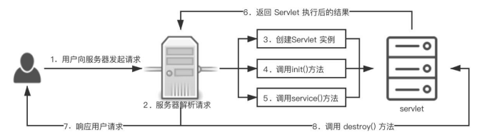

***当用户第一次向服务器发起请求时，服务器会解析用户的请求，此时容器会加载 Servlet，然后创建 Servet 实例，再调用 init() 方法初始化 Servlet，紧接着调用服务的 service() 方法去处理用户 GET、POST 或者其他类型的请求。当执行完 Servlet 中对应 class 文件的逻辑后，将结果返回给服务器，服务器再响应用户请求。当服务器不再需要 Servlet 实例或重新载入 Servlet 时，会调用 destroy() 方法，借助该方法，Servlet 可以释放掉所有在 init()方法中申请的资源。***

# Java Web 过滤器——filter

filter 被称为过滤器，是 Servlet 2.3 新增的一个特性，同时它也是 Servlet 技术中最实用的技术。开发人员通过 Filter 技术，能够实现对所有 Web 资源的管理，如实现权限访问控制、过滤敏感词汇、压缩响应信息等一些高级功能。

## filter 的配置

filter 的配置类似于 Servlet，由<filter>和<filter-mapping>两组标签组成，如下图所示。同样，如果 Servlet 版本大于 3.0，也可以使用注解的方式来配置 filter。

### 基于 web.xml 的配置

filter 同样有很多标签，其中各个标签的含义如下。

- <filter>：指定一个过滤器。
- <filter-name>：用于为过滤器指定一个名称，该元素的内容不能为空。
- <filter-class>：用于指定过滤器的完整的限定类名。
- <init-param>：用于为过滤器指定初始化参数。
- <param-name>：为<init-param>的子参数，用于指定参数的名称。
- <param-value>：为<init-param>的子参数，用于指定参数的值。
- <filter-mapping>：用于设置一个 filter 所负责拦截的资源。
- <filter-name>：为<filter-mapping>子元素，用于设置 filter 的注册名称。该值必须是在<filter>元素中声明过的过滤器的名称。
- <url-pattern>：用于设置 filter 所拦截的请求路径（过滤器关联的 URL 样式）。
-  <servlet-name>：用于指定过滤器所拦截的 Servlet 名称。

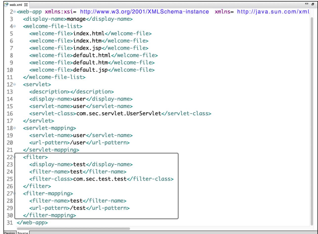

### 基于注解方式的配置

因为 Servlet 的关系，在 Servlet 3.0 以后，开发者同样可以不用在 web.xml 里面配置 filter，只需要添加@WebServlet 注解就可以修改 filter 的属性

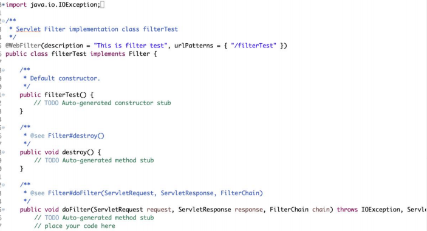

可以看到第 15 行的@WebServlet 的注解参数有 description 及 urlPatterns，此外还有很多参数

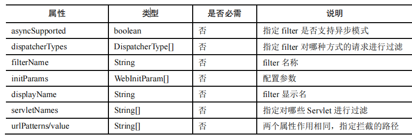

由此可见，web.xml 可以配置的 filter 属性都可以通过 @WebServlet 的方式进行配置。但需要注意的是，一般不推荐使用注解方式来配置 filter，因为如果存在多个过滤器，使用 web.xml 配置 filter 可以控制过滤器的执行顺序；如果使用注解方式来配置 filter，则无法确定过滤器的执行顺序。

## filter 的使用流程及实现方式

filter 接口中有一个 doFilter 方法，当开发人员编写好 Filter 的拦截逻辑，并配置对哪个 Web 资源进行拦截后，Web 服务器会在每次调用 Web 资源的 service() 方法之前先调用 doFilter 方法，具体流程如下图 所示。

当用户向服务器发送 request 请求时，服务器接受该请求，并将请求发送到第一个过滤器中进行处理。如果有多个过滤器，则会依次经过 filter 2，filter 3，……，filter n。接着调用 Servlet 中 的 service() 方法，调用完毕后，按照与进入时相反的顺序，从过滤器 filter n 开始，依次经过各个过滤器，直到过滤器 filter 1。最终将处理后的结果返回给服务器，服务器再反馈给用户。

filter 进行拦截的方式也很简单，在 HttpServletRequest 到达 Servlet 之前，filter 拦截客户的 HttpServletRequest ，根据需要检查 HttpServletRequest ，也可以修改HttpServletRequest 头和数据。在 HttpServletResponse 到达客户端之前，拦截HttpServletResponse，根据需要检查 HttpServletResponse，也可以修改 HttpServletResponse头和数据。

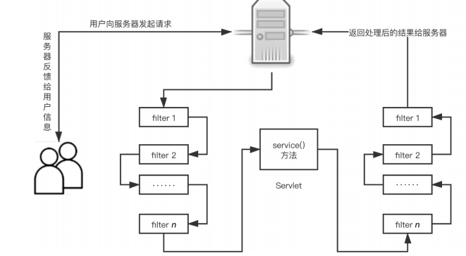

## filter 的接口方法

### 1.Init() 接口

与 Servlet 中的 init() 方法类似，filter 中的 init() 方法用于初始化过滤器。开发者可以在 init() 方法中完成与构造方法类似的初始化功能。如果初始化代码中要用到 FillerConfig 对象，则这些初始化代码只能在 filler 的 init() 方法中编写，而不能在构造方法中编写。

init() 方法的定义如下。

```
public void init(FilterConfig fConfig) throws ServletException { 
 // 此处内容为开发者定义的初始化代码... 
}
```

### 2.doFilter() 接口

doFilter 方法类似于 Servlet 接口的 service() 方法。当客户端请求目标资源时，容器会筛选出符合<filter-mapping> 标签中<url-pattern> 的 filter，并按照声明<filter-mapping> 的顺序依次调用这些 filter 的 doFilter() 方法。需要注意的是doFilter() 方法有多个参数，其中参数 request 和 response 为 Web 服务器或 filter 链中的上一个 filter 传递过来的请求和响应对象。参数 chain 代表当前 filter 链的对象，只有在当前 filter 对象中的 doFilter() 方法内部需要调用 FilterChain 对象的doFilter() 方法时，才能把请求交付给 filter 链中的下一个 filter 或者目标程序处理。

doFilter() 方法的定义如下。

```
public void doFilter(ServletRequest request, ServletResponse response, 
FilterChain chain) throws IOException, ServletException { 
 // 此处内容为开发者定义的过滤代码
 ... 
 // 传递 filter 链
 chain.doFilter(request, response); 
}
```

### 3.destroy() 接口

filter 中的 destroy() 方法与 Servlet 中的 destroy() 作用类似，在 Web 服务器卸
载 filter 对象之前被调用，用于释放被 filter 对象打开的资源，如关闭数据库、关闭
I/O 流等。

```
public void destroy() { 
 // 此处内容为开发者进行终止操作的代码
}
```

## filter 的生命周期

filter 的生命周期与 Servlet 的生命周期比较类似，指的是 filter 从创建到销毁的整个过程。在一个生命周期中，filter 经历了被加载、初始化、提供服务及销毁的过程

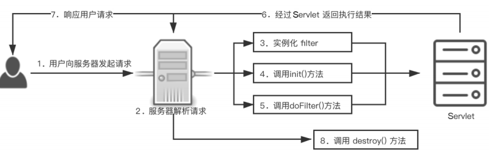

当 Web 容器启动时，会根据 web.xml 中声明的 filter 顺序依次实例化这些filter。然后在 Web 应用程序加载时调用 init() 方法，随即在客户端有请求时调用doFilter() 方法，并且根据实际情况的不同，doFilter() 方法可能被调用多次。最后在Web 应用程序卸载（或关闭）时调用 destroy()方法。