# 	SpringMVC实现步骤

```
servlet 的实现方式： jsp发起-----servlet-----jsp显示结果
步骤：1）创建web应用
     2）加入web依赖   Spring-webmvc(springmvc框架依赖) ，servlet依赖
     3）声明springmvc核心对象DispatcherServlet   
        1.DispatcherServlet是一个servlet对象    
        2.DispatcherServlet叫做前端控制器（front controller） 
        3.DispatcherServlet作用：在servlet的init()方法中，创建springmvc中的容器对象    作为servlet，接收请求
     4）创建一个jsp,发起请求
     5）创建一个普通类，作为控制器使用（代替之前的servlet）  
        1.在注解上面加入@Controller注解  
        2.在类中定义方法，方法上面加入@RequestMapping注解方式处理请求，相当于servlet得doGet，doPost
    6）创建作为结果得jsp页面
    7）创建springmvc得配置文件(spring的配置文件一样)  
        1.声明组件扫描器，指定@Controller注解所在的包名  
        2.声明视图解析器对象
```

# 第一个注解的SpringMVC程序

 目录

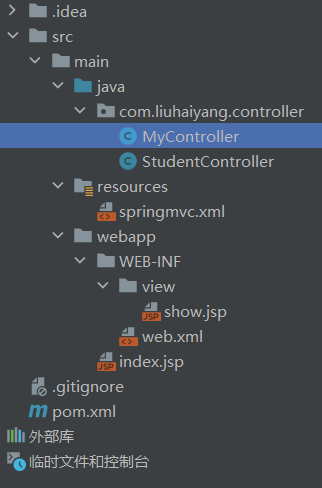

创建一个普通的类，作为控制器使用，代替之前的servlet

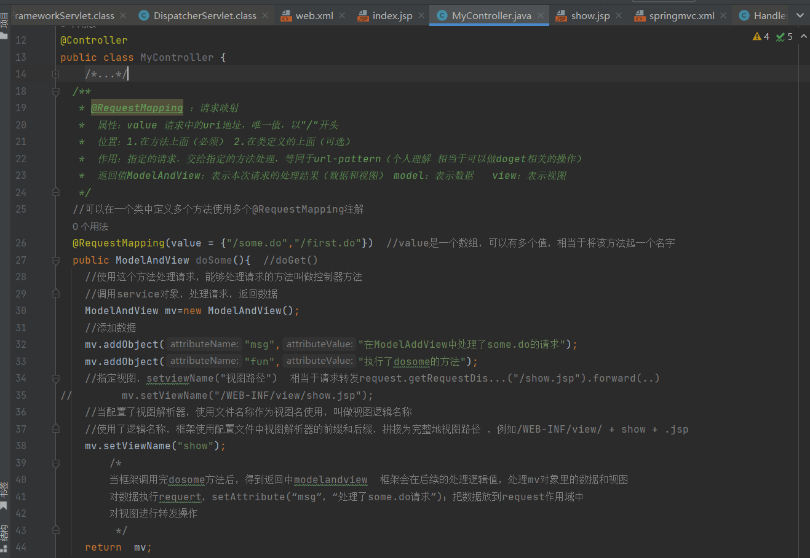

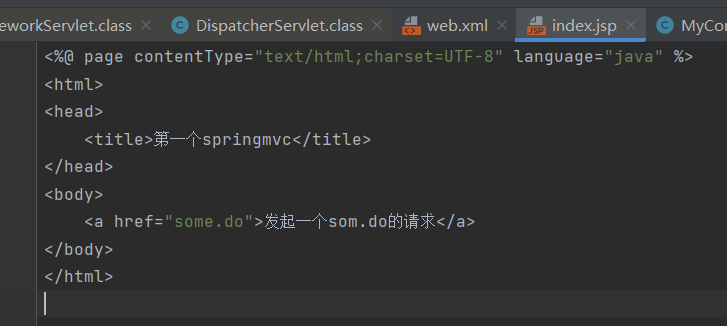

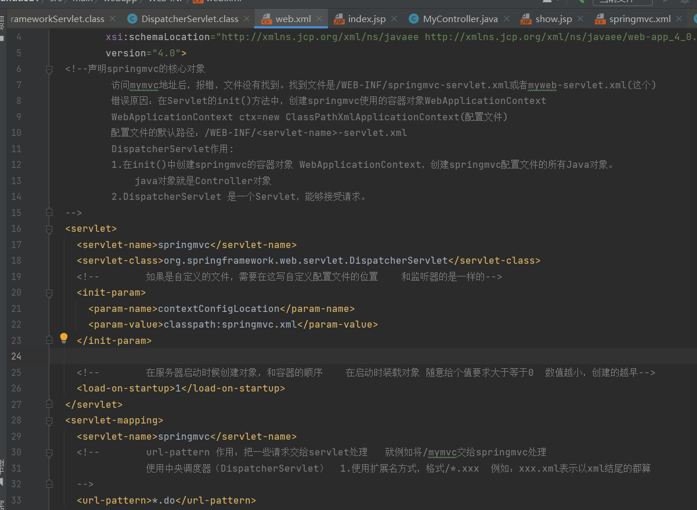

创建显示处理结果的jsp页面（webapp\WEB-INF\view\show.jsp）

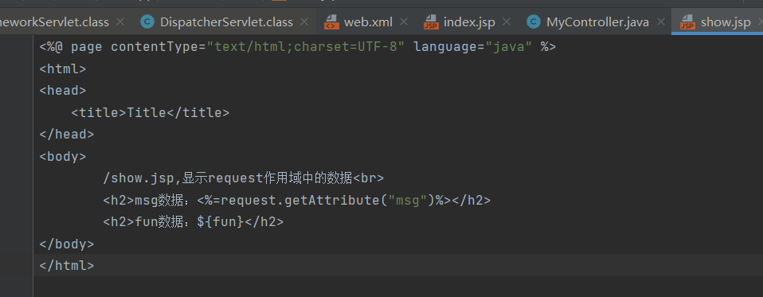

<br/>

创建springmvc的配置文件

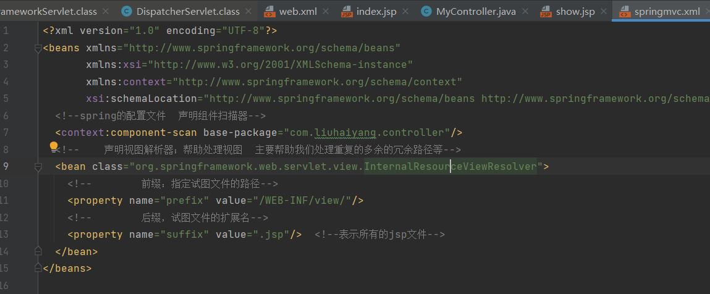

配置Tomcat并且启动测试

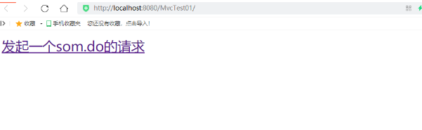

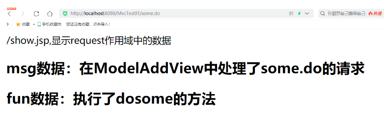

# SpringMVC框架处理web请求的顺序

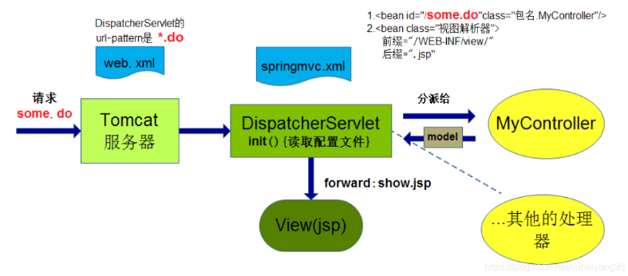

SpringMVC 执行流程

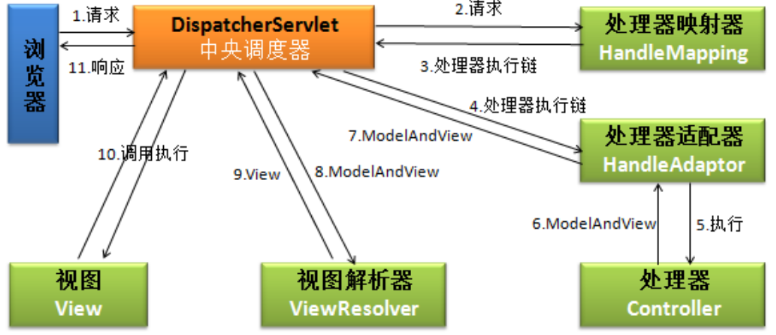

# springmvc 源码分析

## DispatcherServlet 组件

```
HandlerMapping（处理器映射器）:HandlerMapping 是⽤来查找 Handler 的，也就是处理器，具体的表现形式可以是类，也可以是⽅法。⽐如，标注了@RequestMapping的每个⽅法都可以看成是⼀个Handler。Handler负责具体实际的请求处理，在请求到达后，HandlerMapping 的作⽤便是找到请求相应的处理器Handler 和 Interceptor.
HandlerAdapter（处理器适配器）:HandlerAdapter 是⼀个适配器。因为 Spring MVC 中 Handler 可以是任意形式的，只要能处理请求即可。但是把请求交给 Servlet 的时候，由于 Servlet 的⽅法结构都是doService(HttpServletRequest req,HttpServletResponse resp)形式的，要让固定的 Servlet 处理⽅法调⽤ Handler 来进⾏处理，便是 HandlerAdapter 的职责。
ViewResolver:ViewResolver即视图解析器，⽤于将String类型的视图名和Locale解析为View类型的视图，只有⼀个resolveViewName()⽅法。从⽅法的定义可以看出，Controller层返回的String类型视图名viewName 最终会在这⾥被解析成为View。View是⽤来渲染⻚⾯的，也就是说，它会将程序返回的参数和数据填⼊模板中，⽣成html⽂件。ViewResolver 在这个过程主要完成两件事情：ViewResolver 找到渲染所⽤的模板（第⼀件⼤事）和所⽤的技术（第⼆件⼤事，其实也就是找到视图的类型，如JSP）并填⼊参数。默认情况下，Spring MVC会⾃动为我们配置⼀个InternalResourceViewResolver,是针对 JSP 类型视图的。
```

所有请求都会通过DispatcherServlet 来执行。

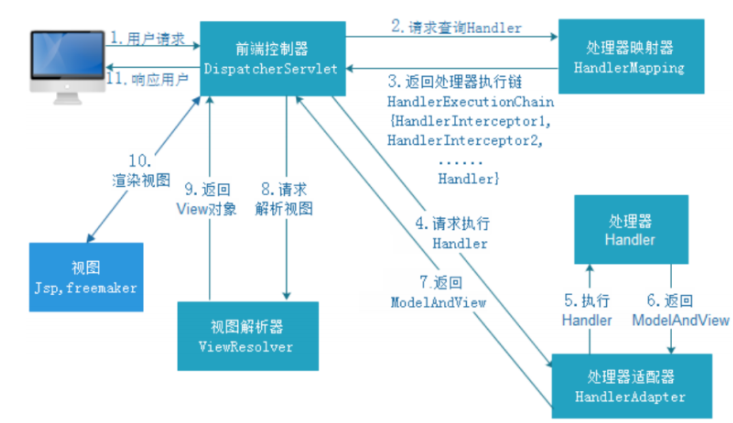

流程说明：

```
1、DispatcherServlet 接收到客户端发送的请求。
2、DispatcherServlet 收到请求调用HandlerMapping 处理器映射器。
3、HandleMapping 根据请求URL 找到对应的handler 以及处理器 拦截器，返回给DispatcherServlet
4、DispatcherServlet 根据handler 调用HanderAdapter 处理器适配器。
5、HandlerAdapter 根据handler 执行处理器，也就是我们controller层写的业务逻辑，并返回一个ModeAndView
6、HandlerAdapter 返回ModeAndView 给DispatcherServlet
7、DispatcherServlet 调用 ViewResolver 视图解析器来 来解析ModeAndView
8、ViewResolve  解析ModeAndView 并返回真正的view 给DispatcherServlet
9、DispatcherServlet 将得到的视图进行渲染，填充到request域中
10、返回给客户端响应结果。
```

## springmvc 源码分析

请求进来。先找HttpServlet.发现FrameworkServlet  重现了doGet()和doPost() 方法。所以会执行其中的方法。

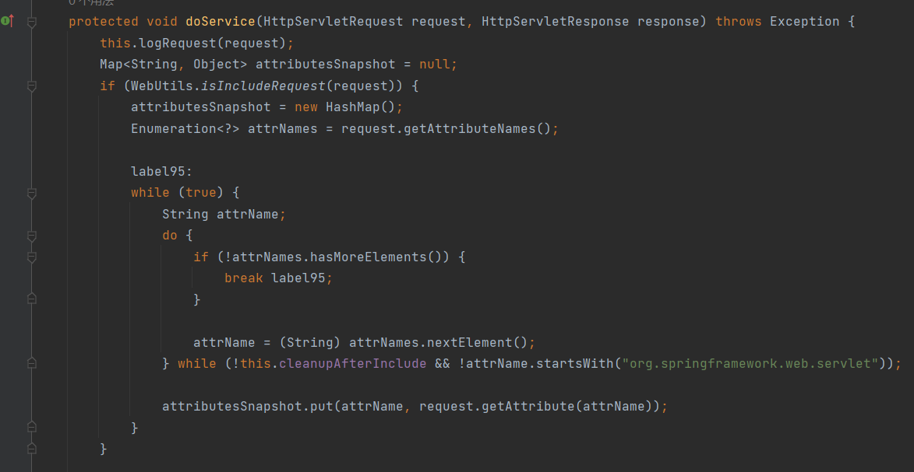

我们接着看FrameworkServlet  的doGet和doPost 方法都是调用其processRequest 方法。这个方法里面主要的调用DispatcherServlet中doService()方法。在DispatcherServlet 中的这个方法。会调用doDispatch() 方法执行

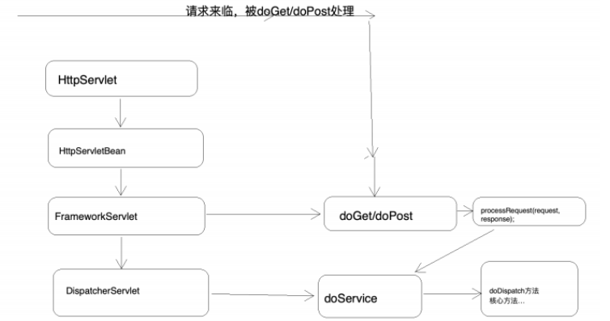

所以整体的请求流程都在doDispatch() 方法中。主要流程如下：

1、根据url 请求获取到handlerExecutorChina 对象，也就是获取到handler执行链对象，这个对象中包含执行的handler 和一个拦截器的集合。

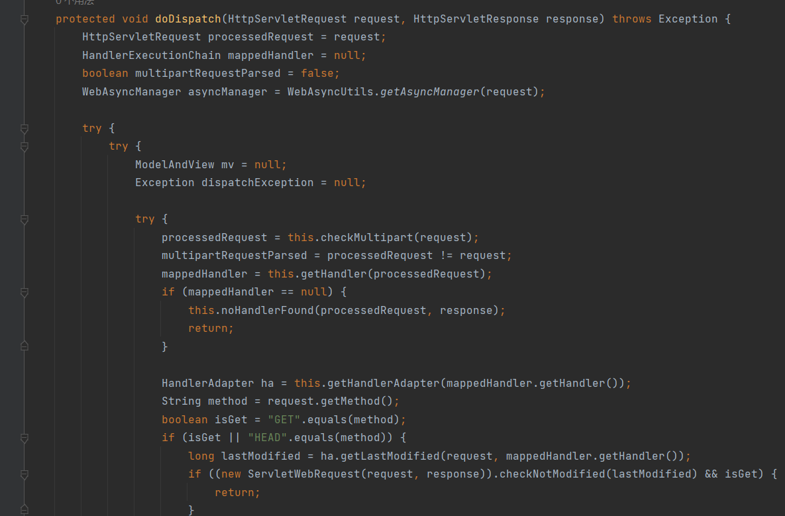

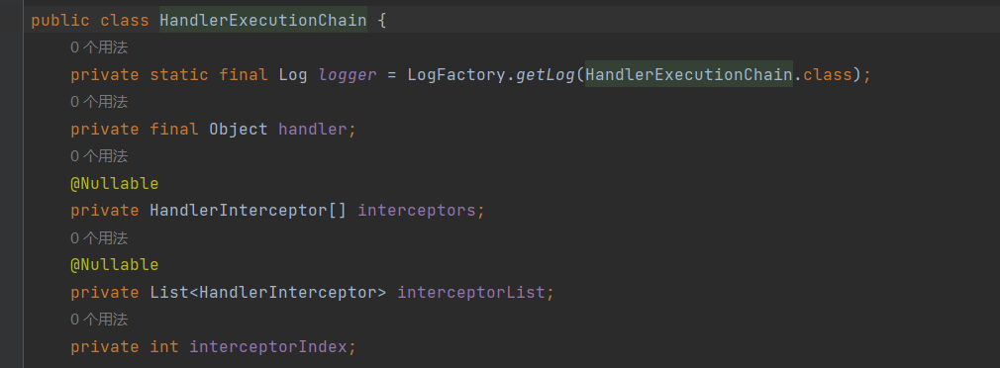

根据这个handlerExecutorChina 执行链对象获取到对应的handlerAdapter handler适配器。

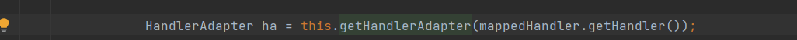

根据这个适配器，真正执行handler ,并且返回一个modeAndView 这里的handler 就是我们通常所有的controller 层的业务逻辑


根据获取到的modeAndView ，解析渲染页面并返回结果。

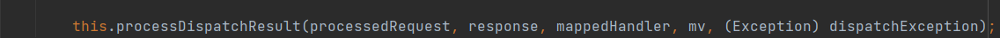

这样整体核心流程就完了。只有这四步。其实和最开始的流程处理图是一样的。总结一下：***先根据请求从handlermapping 中获取到handle ,然后通过handle 找到能处理该请求的 handlerAdapter ,通过handlerAdapter 执行真正的handler 也就是我们的业务代码，并返回一个 ModeAndView 。然后通过viewResolver 解析成view 返回给页面***