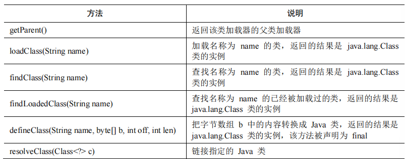
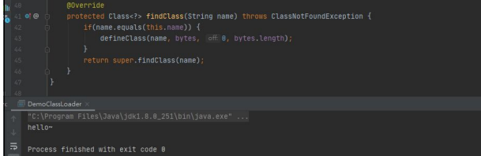
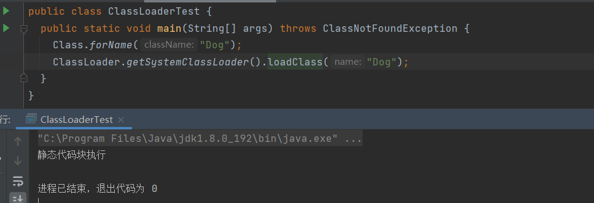
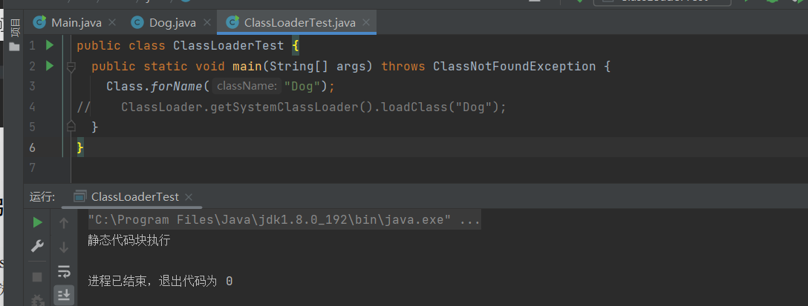
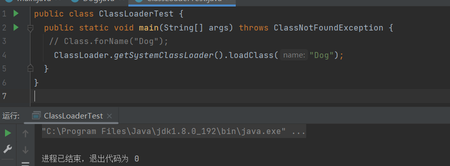
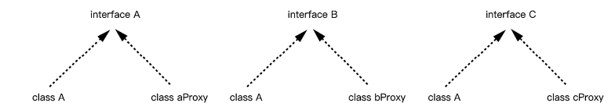
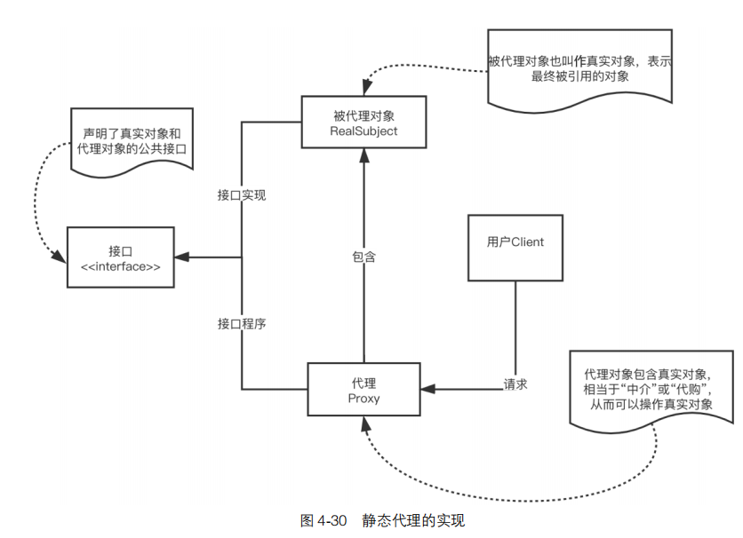
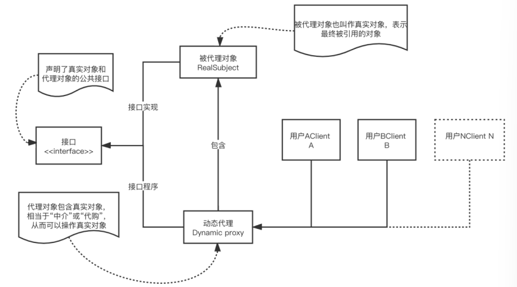

# ClassLoader 类加载机制

Java 程序是由 class 文件组成的一个完整的应用程序。在程序运行时，并不会一次性加载所有的 class 文件进入内存，而是通过 Java 的类加载机制（ClassLoader）进行动态加载，从而转换成 java.lang.Class 类的一个实例。

## ClassLoader 类

ClassLoader 是一个抽象类，主要的功能是通过指定的类的名称，找到或生成对应的字节码，返回一个 java.lang.Class 类的实例。开发者可以继承 ClassLoader 类来实现自定义的类加载器。

ClassLoader 类中和加载类相关的方法:



## loadClass()方法的流程

前面曾介绍过 loadClass()方法可以加载类并返回一个 java.lang.Class 类对象。通过如下源码可以看出，当 loadClass()方法被调用时，会首先使用 findLoadedClass()方法判断该类是否已经被加载，如果未被加载，则优先使用加载器的父类加载器进行加载。当不存在父类加载器，无法对该类进行加载时，则会调用自身的 findClass()方法，因此可以重写 findClass()方法来完成一些类加载的特殊要求。该方法的代码如下所示。

```
protected Class<?> loadClass(String name, boolean resolve) 
 throws ClassNotFoundException
    {
      synchronized (getClassLoadingLock(name)) {
        Class<?> c = findLoadedClass(name);
        if (c == null) {
          long t0 = System.nanoTime();
          try {
            if (parent != null) {
              c = parent.loadClass(name, false);
            } else {
              c = findBootstrapClassOrNull(name);
            }
          } catch (ClassNotFoundException e) {
            //省略
          }
          if (c == null) {
            //省略
            c = findClass(name);
            //省略
          }
        }
        if (resolve) {
          resolveClass(c);
        }
        return c;
      }
    }
```

## 自定义的类加载器

根据loadClass()方法的流程，可以发现通过重写findClass()方法，利用defineClass()方法来将字节码转换成 java.lang.class 类对象，就可以实现自定义的类加载器。示例代码如下所示。

```
import java.lang.reflect.Constructor;
import java.lang.reflect.InvocationTargetException;
import java.lang.reflect.Method;

public class Main extends ClassLoader {
  private final byte[] bytes ;
  private String name = "";
  public static void main(String[] args) throws ClassNotFoundException, NoSuchMethodException, IllegalAccessException, InvocationTargetException, InstantiationException, InvocationTargetException {
    String clzzName = "com.test.Hello";
    byte[] testBytes = new byte[]{
      -54, -2, -70, -66, 0, 0, 0, 52, 0, 28, 10, 0, 6, 0, 14, 9,
      0, 15, 0, 16, 8, 0, 17, 10, 0, 18, 0, 19, 7,
      0, 20, 7, 0, 21, 1, 0, 6, 60, 105, 110, 105, 116, 62, 1, 0,
      3, 40,
      //省略
    };
    Main demo = new Main(clzzName,testBytes);
    Class<?> clazz = demo.loadClass(clzzName);
    Constructor<?> constructor = clazz.getConstructor();
    Object obj = constructor.newInstance();
    Method method = clazz.getMethod("sayHello");
    method.invoke(obj);
  }
  public Main(String name, byte[] bytes){
    this.name = name;
    this.bytes = bytes;
  }
  @Override
  protected Class<?> findClass(String name) throws ClassNotFoundException
  {
    if(name.equals(this.name)) {
      defineClass(name, bytes, 0, bytes.length);
    }
    return super.findClass(name);
  }
}

```

该示例代码的执行结果如图:



## loadClass()方法与 Class.forName 的区别

loadClass()方法只对类进行加载，不会对类进行初始化。Class.forName 会默认对类进行初始化。当对类进行初始化时，静态的代码块就会得到执行，而代码块和构造函数则需要适合的类实例化才能得到执行，示例代码如下所示。

```
public class Dog {
  static {
    System.out.println("静态代码块执行");
  }
  {
    System.out.println("代码块执行");
  }
  public Dog(){
    System.out.println("构造方法执行");
  }
}
public class ClassLoaderTest {
  public static void main(String[] args) throws ClassNotFoundException {
    Class.forName("Dog");
    ClassLoader.getSystemClassLoader().loadClass("Dog");
  }
}
```

该示例代码的执行结果如图







## URLClassLoader

URLClassLoader 类是 ClassLoader 的一个实现，拥有从远程服务器上加载类的能力。通过 URLClassLoader 可以实现对一些 WebShell 的远程加载、对某个漏洞的深入利用。

# Java 动态代理

代理是 Java 中的一种设计模式，主要用于提供对目标对象另外的访问方式，即通过代理对象访问目标对象。这样，就可以在目标对象实现的基础上，加强额外的功能操作，实现扩展目标对象的功能。

代理模式的关键点在于代理对象和目标对象，代理对象是对目标对象的扩展，并且代理对象会调用目标对象。

Java 代理的方式有 3 种：***静态代理、动态代理和 CGLib 代理***，下面对这 3 种代理进行简单介绍。

## 静态代理

**所谓静态代理，顾名思义，当确定代理对象和被代理对象后，就无法再去代理另一个对象。**同理，在 Java 静态代理中，如果我们想要实现另一个代理，就需要重新写一个代理对象，其原理如图



总而言之，**在静态代理中，代理类和被代理类实现了同样的接口，代理类同时持有被代理类的引用**。**当我们需要调用被代理类的方法时，可以通过调用代理类的方法实现**，静态代理的实现如图



## 动态代理

静态代理的优势很明显，即允许开发人员在不修改已有代码的前提下完成一些增强功能的需求。但是静态代理的缺点也很明显，它的使用会由于代理对象要实现与目标对象一致的接口，从而产生过多的代理类，造成冗余；其次，大量使用静态
代理会使项目不易维护，一旦接口增加方法，目标对象与代理对象就要进行修改。而动态代理的优势在于可以很方便地对代理类的函数进行统一的处理，而不用修改每个代理类中的方法。对于我们信息安全人员来说，动态代理意味着什么呢？**实际上**，**Java 中的“动态”也就意味着使用了反射**，**因此动态代理其实是基于反射机制的一种代理模式**。

动态代理与静态代理的区别在于，通过动态代理可以实现多个需求。动态代理其实是通过实现接口的方式来实现代理，具体来说，动态代理是通过 Proxy类创建代理对象，然后将接口方法“代理”给 InvocationHandler 接口完成的。



动态代理的关键有两个，即上文中提到的 Proxy 类以及 InvocationHandler 接口，这是我们实现动态代理的核心。

### 1．Proxy 类

在 JDK 中，Java 提供了 Java.lang.reflect.InvocationHandler 接口和 Java.lang. reflect.Proxy 类，这两个类相互配合，其中 Proxy 类是入口。Proxy 类是用来创建一个代理对象的类，它提供了很多方法。

- `static Invocation Handler get Invocation Handler (Object proxy) `：该方法主要用于获取指定代理对象所关联的调用程序。
-  `static Class<?> get Proxy Class (ClassLoader loader, Class<?>... interfaces) `：该方法主要用于返回指定接口的代理类。
-  `static Object newProxyInstance (ClassLoader loader, Class<?>[] interfaces, Invocation Handler h)`：该方法主要返回一个指定接口的代理类实例，该接口可以将方法调用指派到指定的调用处理程序。 
-  `static boolean is Proxy Class (Class<?> cl)`：当且仅当指定的类通过 `get Proxy Class` 方法或 `newProxyInstance` 方法动态生成为代理类时，返回 true。该方法的可靠性对于使用它做出安全决策而言非常重要，所以它的实现不应仅测试相关的类是否可以扩展 Proxy。

在上述方法中，最常用的是 newProxyInstance 方法，该方法的作用是创建一个代理类对象，它接收 3 个参数：loader、interfaces 以及 h，各个参数含义如下。

- `loader`：这是一个 `ClassLoader` 对象，定义了由哪个 `ClassLoader `对象对生成的代理类进行加载。
- `interfaces`：这是代理类要实现的接口列表，表示用户将要给代理对象提供的接口信息。如果提供了这样一个接口对象数组，就是声明代理类实现了这些接口，代理类即可调用接口中声明的所有方法。
-  `h`：这是指派方法调用的调用处理程序，是一个 `InvocationHandler `对象，表示当动态代理对象调用方法时会关联到哪一个` InvocationHandler` 对象上，并最终由其调用。

### 2．InvocationHandler 接口

Java.lang.reflect InvocationHandler，主要方法为 Object invoke（Object proxy, Method method, Object[] args），该方法定义了代理对象调用方法时希望执行的动作，用于集中处理在动态代理类对象上的方法调用。Invoke 有 3 个参数：proxy、method、args，各个参数含义如下。

- proxy：在其上调用方法的代理实例。
- method：对应于在代理实例上调用的接口方法的 Method 实例。 Method 对象的声明类将是在其中声明方法的接口，该接口可以是代理类赖以继承方法的代理接口的超接口。
- args：包含传入代理实例上方法调用的参数值的对象数组，如果接口方法不使用参数，则为 null。基本类型的参数被包装在适当基本包装器类（如Java.lang.Integer 或 Java.lang.Boolean）的实例中。