# filter 过滤器

下面内容介绍web.xml文件中的`<filter>`标签。

Spring MVC 是构建于 Servlet 之上的，所以 Servlet 中的过滤器自然也可以使用，只不过不能配置在 spring-mvc.xml 中，而是要直接配置在 web.xml 中，因为它是属于Servlet 的技术。

重新查看 web.xml 文件，如图

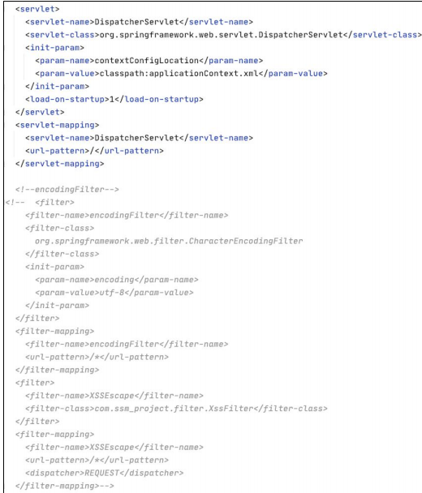

在前面的讲解中将这两个 filter 进行了注释，因此这两个 filter 并没有生效。我们以下面的 filter-name 为 `XSSEscape` 的 filter 来进行讲解。
首先，此时程序是没有 XSS 防护的，所以存在存储型 XSS 漏洞，我们来尝试存储型 XSS 攻击，如图

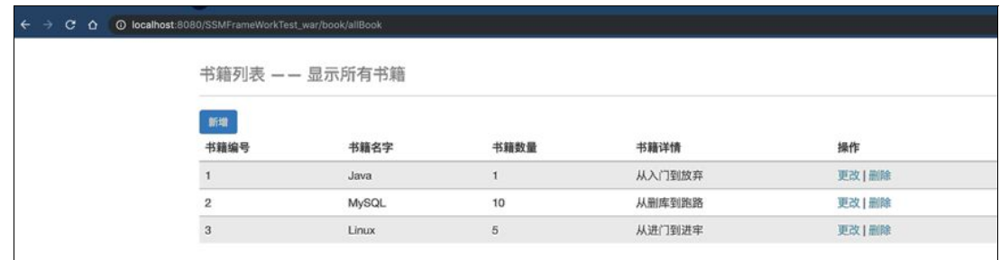

单击新增功能，如图

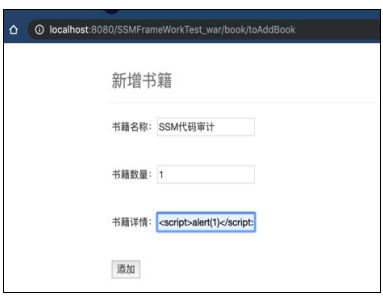

查看提交路径，如图

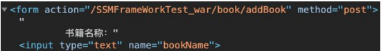

去后台寻找与之对应的方法，如图

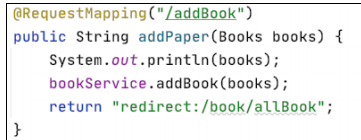

找到后在这里设置断点，查看传入参数的详细信息，如图

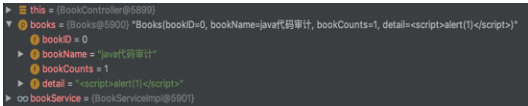

XSS 语句在未经任何过滤直接传入，如图

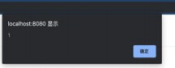

此时可以在 web.xml 中配置<filter>防御 XSS 攻击，如图

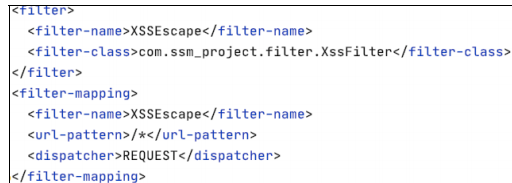

这里声明了com.ssm_project.filter的包路径下又一个类XssFilter，它是一个过滤器。

下面的`<dispatcher>`属性中的 REQUEST 的意思是只要发起的操作是一次 HTTP请求，比如请求某个 URL、发起一个 GET 请求、表单提交方式为 POST 的 POST 请求、表单提交方式为 GET 的 GET 请求。一次重定向则相当于前后发起了两次请求，这些情况下有几次请求就会经过几次指定过滤器。

`<dispatcher>`属性 2.4 版本的 Servlet 中添加的新的属性标签总共有 4 个值，分别是 REQUEST、FORWARD、INCLUDE 和 ERROR，以下对这 4 个值进行简单说明。

```
（1）REQUEST。
只要发起的操作是一次 HTTP 请求，比如请求某个 URL、发起一个 GET 请求、表单提交方式为 POST 的 POST 请求、表单提交方式为 GET 的 GET 请求，就会经过指定的过滤器。
（2）FORWARD。
只有当当前页面是通过请求转发过来的情形时，才会经过指定的过滤器。
（3）INCLUDE。
只要是通过<jsp:include page="xxx.jsp" />嵌入的页面，每嵌入一个页面都会经过一次指定的过滤器。
（4）ERROR。
假如 web.xml 中配置了<error-page></error-page>，如下所示。
<error-page> 
<error-code>400</error-code> 
<location>/filter/error.jsp</location> 
</error-page>
意思是 HTTP 请求响应的状态码只要是 400、404、500 这 3 种状态码之一，容器就会将请求转发到 error.jsp 下，这就触发了一次 error，经过配置的 DispatchFilter。需要注意的是，虽然把请求转发到 error.jsp 是一次 forward 的过程，但是配置成<dispatcher>FORWARD</dispatcher>并不会经过 DispatchFilter 过滤器。
```

这4种dispatcher方式可以单独使用，也可以组合使用，只需配置多个`<dispatcher> </dispatcher>`即可。

**审计时的过滤器 `<dispatcher>` 属性中使用的值也是我们关注的一个点。**``<url-pattern>``属性会指明我们要过滤访问哪些资源的请求，“/*”的意思是拦截所有对后台的请求, 包括一个简单的对 JSP 页面的 GET 请求。同时我们可以具体地指定拦截对某一资源的请求，同时也可以设置对某些资源的请求不进行过滤而单独放过.

示例代码如下。

```
<filter> 
<filter-name>XSSEscape</filter-name> 
<filter-class>com.springtest.filter.XssFilter</filter-class> 
</filter> 
<filter-mapping> 
<filter-name>XSSEscape</filter-name> 
<url-pattern>/com/app/UserControl</url-pattern> 
<dispatcher>REQUEST</dispatcher> 
</filter-mapping>
```

既然能够指定单独过滤特定资源，自然也就可以指定放行特定资源。

设置对全局资源请求过滤肯定是不合理的。生产环境中有很多静态资源不需要进行过滤，所以我们可以指定将这些资源进行放行，示例代码如下。

```
<filter> 
<filter-name> XSSEscape </filter-name> 
<filter-class> com.springtest.filter.XssFilter </filter-class> 
<init-param> 
<!-- 配置不需要被登录过滤器拦截的链接，只支持配后缀、前缀及全路径，多个配置用逗号分隔 --> 
<param-name>excludedPaths</param-name> 
<param-value>/pages/*,*.html,*.js,*.ico</param-value\> 
</init-param> 
</filter> 
<filter-mapping> 
<filter-name> XSSEscape </filter-name> 
<url-pattern>/*</url-pattern> 
</filter-mapping>
```

这样配置后，如果有对 html、js 和 ico 资源发起的请求，Serlvet 在路径选择时就不会将该请求转发至 XssFilter 类。

在审计代码时，这也是需要注意的一个点，因为开发人员的错误配置有可能导致本应该经过过滤器的请求却被直接放行，从而使项目中的过滤器失效。

了解<filter>标签的作用后，查看 XssFilter 类的内容，如图

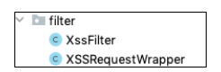

可以看到 filter 包下有两个 Java 类，先来查看 XssFilter 类，如图

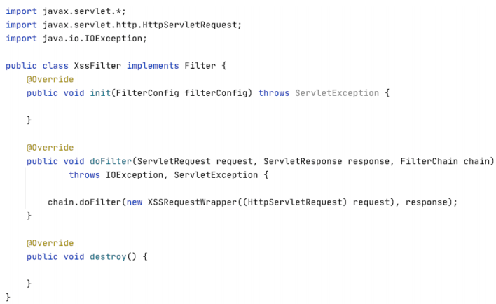

可以看到 XssFilter 类实现了一个 Filter 接口。查看 Filter 接口的源码，如图

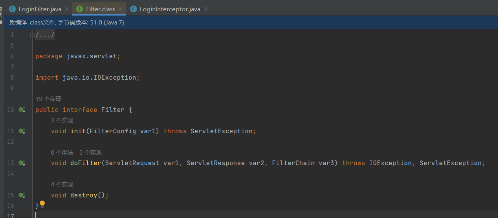

可以看到 Filter 所属的包是 javax.servlet。Filter 是 Servlet 的三大组件之一，javax.servlet.Filter 是一个接口，其主要作用是
过滤请求，实现请求的拦截或者放行，并且添加新的功能。

众所周知，接口其实是一个标准，所以我们想要编写自己的过滤器，自然也要遵守这个标准，即实现 Filter 接口。

Filter 接口中有 3 个方法，这里进行简单介绍。

```
● init 方法：在创建完过滤器对象之后被调用。只执行一次。
● doFilter 方法：执行过滤任务方法。执行多次。
● destroy 方法：Web 服务器停止或者 Web 应用重新加载，销毁过滤器对象。
```

**当 Servlet 容器开始调用某个 Servlet 程序时，如果发现已经注册了一个 Filter 程序来对该 Servlet 进行拦截，那么容器不再直接调用 Servlet 的 service 方法，而是调用 Filter 的 doFilter 方法，再由 doFilter 方法决定是否激活 service 方法。**

不难看出，需要我们重点关注的方法是 doFilter 方法，如图

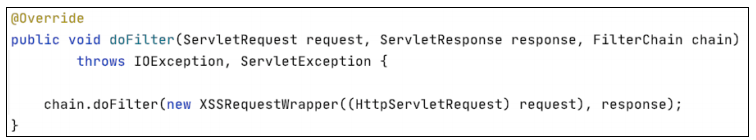

这里的 request 参数和 response 参数可以理解为封装了请求数据和响应数据的对象，需要过滤的数据存放在这两个对象中。

对于最后一个参数 FilterChain，通过名称可以猜测这个参数是一个过滤链。查看FilterChain 的源码，如图

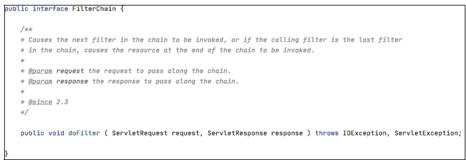

可以发现 FilterChain 是一个接口，而且该接口只有一个 doFilter 方法。FilterChain参数存在的意义就在于，在一个 Web 应用程序中可以注册多个 Filter 程序，每个Filter 程序都可以对一个或一组 Servlet 程序进行拦截。如果有多个 Filter 程序，就可以对某个 Servlet 程序的访问过程进行拦截，当针对该 Servlet 的访问请求到达时，Web 容器将把多个 Filter 程序组合成一个 Filter 链（也叫作过滤器链）。

Filter 链中的各个 Filter 的拦截顺序与它们在 web.xml 文件中的映射顺序一致，在上一个 Filter.doFilter 方法中调用 FilterChain.doFilter 方法将激活下一个Filter 的 doFilter 方法，最后一个 Filter.doFilter 方法中调用的 FilterChain.doFilter 方法将激活目标 Servlet 的 service 方法。

只要 Filter 链中任意一个 Filter 没有调用 FilterChain.doFilter 方法，则目标Servlet 的 service 方法就都不会被执行。

读者应该发现，虽然 FilterChain 名称看起来像过滤器，但是调用 chain.dofilter方法似乎并没有执行任何类似过滤的工作，也没有任何类似黑名单或者白名单的过滤规则。

在调用 chain.dofilter 方法时，我们传递了两个参数：`new XSSRequestWrapper ((HttpServletRequest) request)`和` response`，就是说我们传递了一个 `XSSRequestWrapper`对象和 `ServletRespons `对象，我们关心的当然是这个 `XSSRequestWrapper `对象。

在传递参数的过程中，我们通过调用 XSSRequestWrapper 的构造器传递了HttpServletRequest 对象，这里简单从继承关系向读者展示 HttpServletRequest 和ServletRequest 的关系，如图

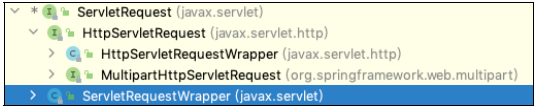

这里生成一个 XSSRequestWrapper 对象并传入了参数，如图

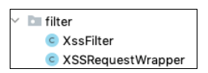

filter 下面有一个叫作 XSSRequestWrapper 的类，如图

可以发现过滤行为在这里进行，而 XssFilter 的存在只是在链式执行过滤器，并最终将值传给 Servlet 时调用 XSSRequestWrapper 来进行过滤并获取过滤结果。

**可能有许多读者不明白为什么不将过滤的逻辑代码写在 XssFilter 中，而是重新编写一个类？这样做首先是为了解耦，其次是因为 XSSRequestWrapper 继承了一个类 HttpServletRequestWrapper。**

查看 HttpServletRequestWrapper 类的继承关系，如图

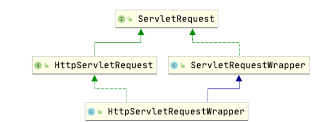

可以看到 HttpServletRequestWrapper 实现了 HttpServletRequest 接口。我们的想法是尽可能将请求中有危害的数据或者特殊符号过滤掉，然后将过滤后的数据转发向后面的业务代码并继续执行，而不是发现请求数据中有特殊字符就直接停止执行，抛出异常，返回给用户一个 400 页面。因此要修改或者转义 HttpServletRequest 对象中的恶意数据或者特殊字符。然而 HttpServletRequest 对象中的数据不允许被修改，也就是说，HttpServletRequest 对象没有为用户提供直接修改请求数据的方法。

XSSRequestWrapper 类：

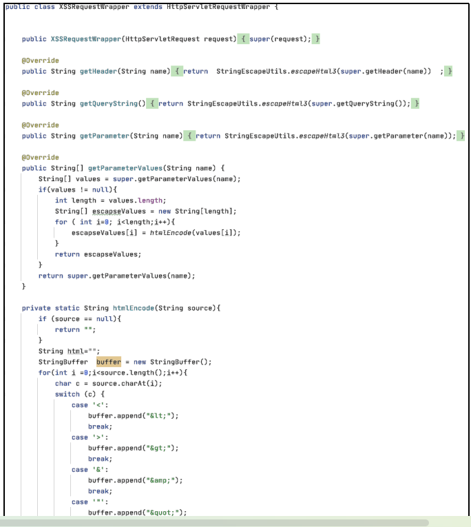

因此就需要用到 HttpServletRequestWrapper 类，这里用到了常见的 23 种中设计模式之一的装饰者模式，限于篇幅原因这里不对装饰者模式进行讲解，感兴趣的读者可以自行研究。HttpServletRequestWrapper 类为用户提供了修改 request 请求数据的方法，这也是需要单写一个类来进行过滤的原因，是因为框架就是这么设计的。

当 HttpServletRequestWrapper 过滤完请求中的数据并完成修改后，返回并作为chain.doFilter 方法的形参进行传递。

最后一个 Filter.doFilter 方法中调用的 FilterChain.doFilter 方法将激活目标Servlet 的 service 方法。

由于我们没有配置第二个 Filter，因此 XssFilter 中的 chain.doFilter 将会激活Servlet 的 service 方法，即 DispatcherServlet 的 service 方法，然后数据将传入 Spring MVC 的 Controller 层并交由 BookController 来处理。

现在使用 Filter 来演示效果。首先设置断点，如图

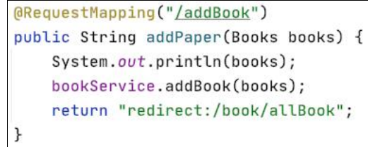

再次执行到这里时，XSS 语句中的特殊字符已经被 Filter 转义，自然也不会存在 XSS 的问题了。

XSS 语句中的特殊字符被 Filter 转义：

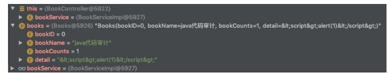

XSS 语句被转移：

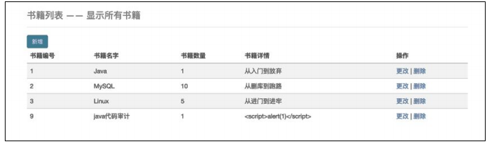