# Java EE 开发框架安全审计

## 开发框架审计技巧

### SSH 框架审计技巧

#### 1．SSH 框架简介

前面介绍了 SSM 框架，即 Spring MVC、Spring 和 MyBatis。接下来介绍 Java Web曾经开发的 SSH 框架，即 `Struts2`、S`pring` 和 `Hibernate`。

自 Struts2 诞生以来，漏洞层出不穷，直到最近的 S2-059 和 S2-060，高危漏洞仍然不计其数。由于安全上的种种原因，以及 Spring MVC 和 Spring Boot 等框架的兴起，Struts2 逐渐淡出了开发人员的视野。但是很多企业的项目还是使用 Struts2 进行开发的，所以 Java 代码审计人员非常有必要了解该框架的审计方法。

接下来介绍 DAO 层的框架，它和 MyBatis 一样同为 ORM 框架的 Hibernate。虽然二者同为 ORM 框架，但是区别还是挺大的，后续讲解中会介绍两个框架之间的区别，以及审计 Hibernate 时的注意事项。

#### 2．Java SSH 框架审计技巧

我们将前面的 SSM 的 Demo 进行重写,方便两个框架之间进行比较，从而加深理解，项目目录结构如图

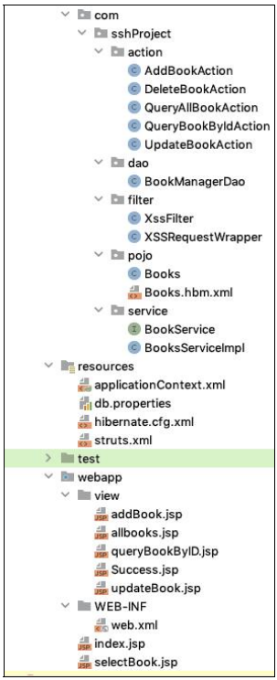

如前所述，在有 web.xml 的情况下，审计一个项目时首先需要查看该文件，以便对整个项目有一个初步的了解。

web.xml 内容如图

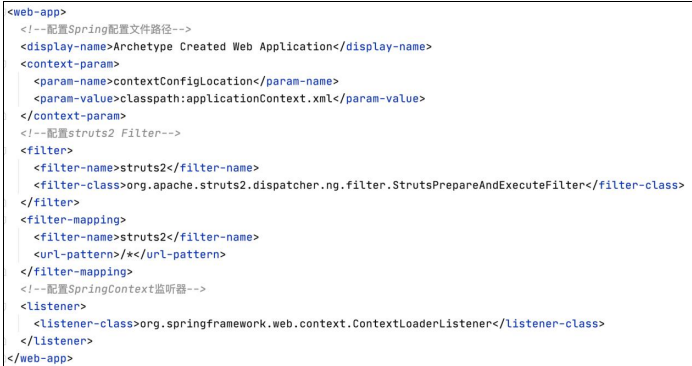

web.xml 文件中,第一项配置表明了 Spring 配置文件的所在位置，第二项配置是一个 Filter，这里明显不同于 SSM 中 web.xml 的配置，本质上都是 Tomcat 通过加载web.xml 文件读取其中的信息来判断将前端的请求交由谁进行处理。Spring MVC 的选择是配置一个 Servlet，而 Struts2 的选择是配置一个 Filter。而且细心的读者还会发现，在配置 Spring MVC 的 `DispatcherServlet` 时，Spring 配置文件（也就是`applicationContext.xml` 位置）是直接通过配置参数传入的，而这里则是通过配置一个`context-param`。

**Struts2 配置 Filter，而 Spring MVC 配置 Servlet**，接下来查看 applicationContext.xml，该配置文件内容如图

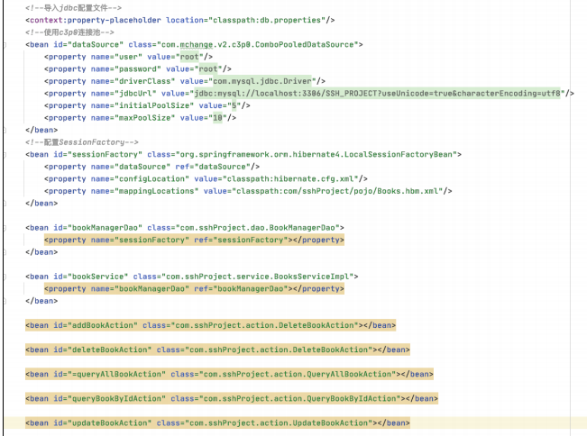

该文件中主要配置了项目所需的各种 bean，这里可以清楚地看到使用的是 c3p0的连接池。接着是配置 sessionFactory，并将连接池作为参数传入，同时作为参数传输的还有一个 hibernate 的总配置文件，以及一个 hibernate 的映射文件。接下来是配置每个 Action 的 bean 对象。

查看完 Spring 的配置文件后，在审计 SSH 框架的代码之前还需要对一个配置文件有所了解，即 Struts2 的核心配置文件 `struts2.xml`，该配置文件的详细内容如图:

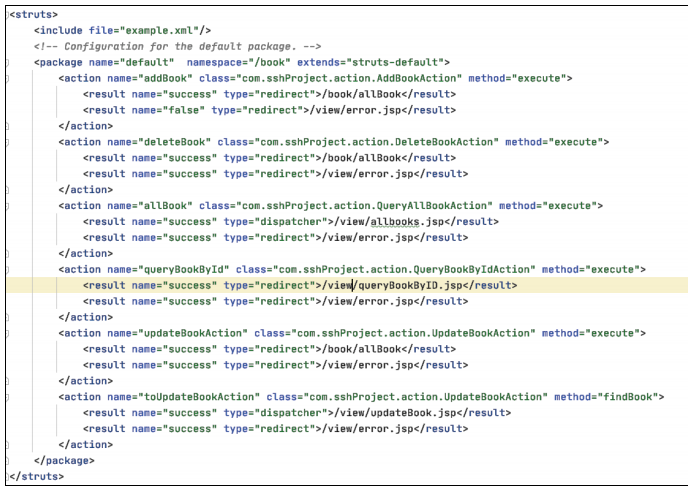

> struts2.xml文件是Struts 2框架中的配置文件之一，它的作用是配置和定义Struts 2框架中的动作（Action）、拦截器（Interceptor）、结果（Result）以及其他相关组件。在项目中，struts2.xml文件起着非常重要的作用，它定义了项目中的各种行为和组件之间的关系和流程，包括：
> 
> 配置动作（Action）：指定了请求URL与相应的处理类之间的映射关系，定义了请求参数如何传递给处理类，并指定了处理结果应该如何返回给客户端。
> 
> 定义拦截器（Interceptor）：指定了在执行动作之前、之后或者发生异常时需要执行的拦截器，用于在请求处理的不同阶段进行预处理或后处理操作，比如日志记录、权限验证等。
> 
> 配置结果（Result）：定义了处理完成后的返回结果，包括转发、重定向、直接输出内容等。
> 
> 配置全局参数：可以在struts2.xml文件中配置全局的参数，如国际化、异常处理方式、开发模式等。

**该配置文件中配置了 Sturts2 中最核心的部分，即所谓的 Action。**

这里配置的每一个 Action 都有其对应的请求 URI 和处理该请求的 Class，以及所对应的方法。我们先从 allBook 这个 action 开始讲解，该功能用于首页所有书籍的展示。

allBook action 对应的class 的全限定类名是com.sshProject.action.QueryAllBookAction。class 属性后面还有一个 method 属性，该属性的作用就是执行指定的方法，默认值为“execute”，当不为该属性赋值时，默认执行 Action 的“execute”方法。

**每个 action 标签中还会有一些 result 子标签，该标签有两个属性，分别是 name属性和 type 属性。name 属性的主要作用是匹配返回的字符串，并选择与之对应的页面。这里当 QueryAllBookAction 执行完成后，如果返回的字符串是 success，则返回queryBookByID.jsp；如果返回的字符串是 false，则返回 error.jsp。**

**result 中还有一个常用属性是 type。type 属性的值代表去往 JSP 页面是通过转发还是通过重定向。转发和重定向这两种方式的区别为，转发是服务端自己的行为，在转发的过程中携带 Controller层执行后的返回结果；而重定向则需要客户端的参与，通过 300 状态码让客户端对指定页面重新发起请求。**

介绍完 Action 标签中的常见属性，下一步就是追踪 QueryAllBookAction 这个类，来详细观察其中的内容。根据 result 的标签的配置，struts2 会**执行 QueryAllBookAction类的 execute 方法**，该方法的实现过程如图

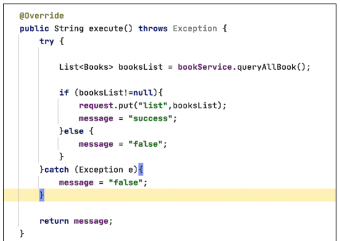

如果只看 execute 方法的内容，可能会不太清楚其中的一些变量是如何获取的。QueryAllBookAction 类的剩余部分如图

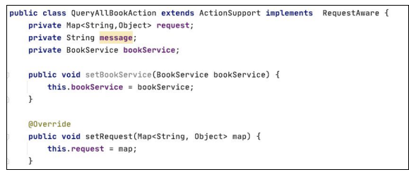

**这里的 bookService 就是 Web 三层架构中服务层的部分。setBookService 方法在当前 QueryAllBookAction 实例化时会被一个名为 params 的拦截器进行调用，并为bookService 变量进行赋值。**

> 实例化 QueryAllBookAction 发生在客户端发起请求并且Struts 2框架接收到该请求时。当客户端请求与 QueryAllBookAction 相关的 URL 时，Struts 2 框架会根据 struts2.xml 中的配置，实例化 QueryAllBookAction，并将请求参数传递给它。
> 
> 拦截器在 Struts 2 中用于在请求处理的不同阶段进行预处理或后处理操作。在提到的情景中，描述了一个名为 params 的拦截器，该拦截器在 QueryAllBookAction 实例化时调用 setBookService 方法，为 bookService 变量进行赋值。这意味着在 QueryAllBookAction 实例化时，params 拦截器会被调用，用来处理请求参数，并在必要时为 QueryAllBookAction 的属性进行设置，其中包括了 bookService 变量的赋值操作。

QueryAllBookAction除继承ActionSupport这个父类以外，还实现了RequestAware接口，该接口内容如图

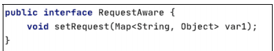

该接口内只有一个方法，目的是获取 request 对象中的全部 attributes 的一个 map如果想要获取整个 request 对象，则需要实现 ServletRequestAware，该接口内容如图

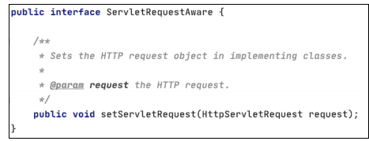

在介绍完 QueryAllBookAction 对象的属性如何被赋值之后，最关键的还是execute 方法，可以看到在 execute 方法中调用了 bookService. queryAllBook()方法。

bookService 变量的类型是 BookService，是一个接口，其内容如图

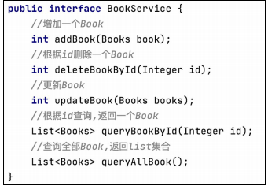

该接口中针对常用的增、删、改、查各定义对应的抽象方法，并由 `BooksServiceImpl`来具体负责实现。在 BooksServiceImpl 中找到 `queryAllBook `方法，如图:

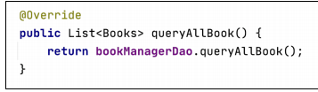

这里调用了一个 `bookManagerDao.queryAllBook` 方法，bookManagerDao 明显是一个全局变量，观察其类型是 `BookManagerDao` 类型，如图:

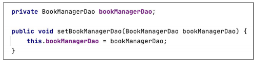

这里要讲到 Spring 的依赖注入，BooksServiceImpl 类提供了 bookManagerDao 变量的 setter 方法，然后使用 Spring 的依赖注入在 BooksServiceImpl 类实例化时通过读取配置信息后调用 setter 方法将值注入 bookManagerDao 变量中。

> 以上实现的步骤如下：
> 
> 在 `BooksServiceImpl` 类中定义 `bookManagerDao` 变量：首先，在 `BooksServiceImpl` 类中定义了一个 `bookManagerDao` 变量，并提供了相应的 `setter` 方法，用于接受注入的值。
> 
> 配置 Spring 配置文件：在 Spring 的配置文件（如 applicationContext.xml）中，需要配置 bean 对象的定义，其中包括 BooksServiceImpl 类的定义以及 bookManagerDao 的定义。同时，需要在配置中指定依赖注入的方式。
> 
> 通过配置信息实例化 BooksServiceImpl：当 Spring 容器启动时，它会根据配置文件中的定义来实例化各个 bean 对象。在这个过程中，会创建 BooksServiceImpl 对象的实例。
> 
> 依赖注入：在 `BooksServiceImpl` 实例化的过程中，Spring 会检测到其依赖于 `bookManagerDao `对象。然后，根据配置信息，Spring 会找到与之对应的 bean（可能是在配置文件中定义的另一个类的实例，或者通过其他方式定义的实例），并将其注入到 `BooksServiceImpl` 实例中的 `bookManagerDao` 变量中，通过调用其 setter 方法完成注入。
> 
> 实现配置信息读取：配置信息读取可能是通过 Spring 提供的属性注入、XML 配置、注解等方式实现的。例如，可以在配置文件中使用 <property> 标签指定注入的值，也可以使用注解方式标记要注入的属性。
> 
> 综上所述，通过 Spring 的依赖注入机制，可以在实例化 BooksServiceImpl 类时，通过读取配置信息并调用相应的 setter 方法，将值注入到其中的 bookManagerDao 变量中。

这里提到了读取配置文件，接下来查看该项目的 Spring 配置文件，即 applicationContext.xml 中的配置信息，如图

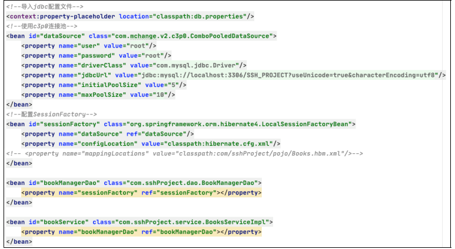

首先是导入了 jdbc 的配置文件，并配置了连接池和 SessionFactory。然后配置了`bookManagerDao` 和 b`ookService` 两个 bean，并将 `bookManagerDao` 注入` bookService`，Spring 在启动时会读取 applicationContext.xml 并根据其中配置的 bean 的顺序将其逐个进行实例化，同时对每个 bean 中指定的属性进行注入。Spring 依赖注入的方式有很多种，这里介绍的通过配置 xml 然后通过 setter 方法进行注入只是其中一种。

从 applicationContext.xml 配置文件中可以发现 BooksServiceImpl 类中的bookManagerDao 存储的是一个 BookManagerDao 对象，所以定位到 BookManagerDao类的 queryAllBook 方法来看其具体实现，其内容如图

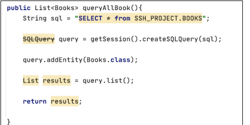

这里进行了一次查询操作，并将查询的结果封装进一个 list 对象中进行返回。以上就是 SSH 框架处理一个用户请求的大致流程，生产环境中的业务比较复杂，会对各种参数进行合法性校验，但是整体的审计思路不会改变，就是按照程序执行的流程，关注程序每一步对传入参数的操作。

#### 3.查询案例

该项目中有一个根据 ID 查询书籍的功能。selectBook.jsp 中的表单内容如图

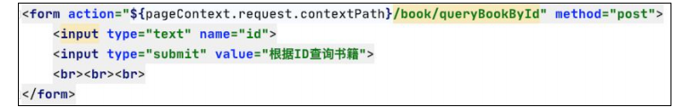

根据表单提交的 url 在 struts.xml 中查询，找到处理该请求的 Action，如图

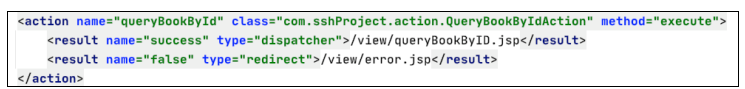

然后到QueryBookByIdAction类中查看该类的execute方法的具体内容，如图

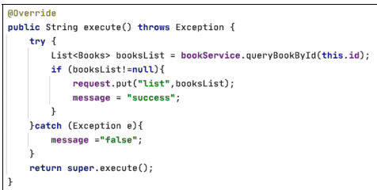

结合之前的表单提交的一个图书的 id，大概可知此处是通过传入的图书 id 在后台数据库中进行查询。根据之前的观察已知 `bookService` 变量指向的是一个`BooksServiceImpl `对象，所以找到该类中的 `queryBookById` 方法，该方法的具体内容如图：

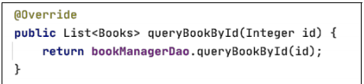

同样根据之前的观察结果，可以发现 `bookManagerDao` 变量指向的是一个`BookManagerDao` 对象。在` BookManagerDao `类中找到 `queryBookById `方法，如图

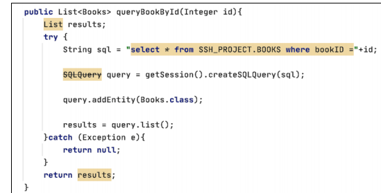

通过这一段的审计，不难发现图书的 id 参数是由前端传入的，最终拼接进了 SQL语句中并代入数据库中进行查询。在这整个流程中程序并没有对 id 参数进行任何校验，因此很有可能产生 SQL 注入漏洞。

代码审计的思路就是要关注参数是否是前端传入，参数是否可控，在对这个参数处理的过程中是否有针对性地对参数的合法性进行校验，如果同时存在以上 3 个问题，则很可能会存在漏洞。

以该 SQL 注入漏洞为例，常用的防御 SQL 注入的手段有两种：一种是通 Filter进行过滤，另一种是使用预编译进行参数化查询，这两种方式各有优缺点，也有各自的应用场景。

Filter是Servlet自带的一种技术，也是在代码审计过程中需要特别注意的一个点。用户可以自定义一个简单的过滤器，通过匹配传递来的参数中有无恶意 SQL 语句来判断程序是否继续执行。

自定义 Filter 时需要实现 Javax.servlet.Filter 接口，该接口内容如图

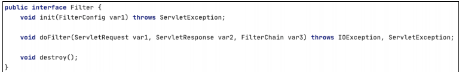

审计过程中最需要注意的是其中的 doFilter 方法，过滤的规则一般都在该方法中。

以下是该接口的一个自定义 Filter 对 doFilter 方法的具体实现，内容如图

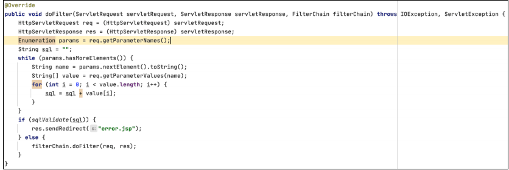

在 `doFilter` 方法中，遍历获取了查询请求中的参数，并将请求参数传递给`sqlValidate` 函数进行匹配，所以需要再去观察 `sqlValidate` 函数的具体内容，如图：

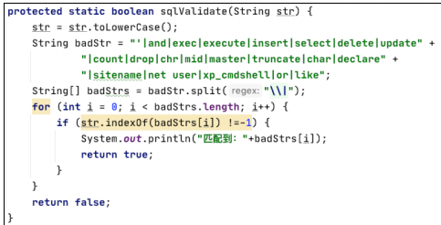

传递进来的参数会先被转化成小写，然后和 basdstr中定义的 SQL 语句进行比对，如果比对成功则返回 flase，返回到 doFilter 方法中就会终止程序继续执行，并重定向至 error.jsp 页面。

Strut2 自身也提供了验证机制，例如 `ActionSupport` 类中提供的 `validate `方法，如图

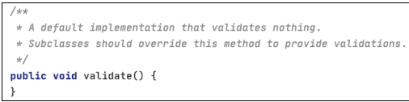

当一个 `Action` 中重写` ActionSupport` 中的 `validate `方法后，`Struts2 `每次执行该`Action` 时都会最先执行该` Action` 中的` validate`，以起到检验参数合法性的作用。这里将之前 `Filter `中` doFilter` 方法的过滤规则直接复制过来进行展示，如图

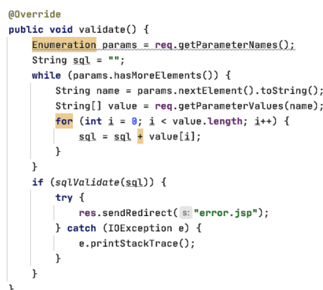

如此一来，每一次 Struts2 执行 `QueryBookByIdAction` 的 `execute `方法时都会**首先调用 `validate` 方法，这样每当传入的参数中包含恶意 SQL 语句就会终止执行并重定向至` error.jsp`，所以如果开发人员在开发过程中没有使用 `Filter `来进行过滤，采用上述重写` validate` 方法的方式也可以起到防止 SQL 注入的目的。**

除使用上述过滤方式来实现防止 SQL 注入外，在审计过程中还有很重要的一点就是预编译，除可以使用原生的 SQL 语句外，Hibernate 本身还自带一个名为 HQL的面向对象的查询语言，该语言并不被后台数据库所识别，所以在执行 HQL 语句时，Hibernate需要将 HQL翻译成 SQL语句后交由后台数据库进行查询操作。将原生 HQL语句改写成 SQL 语句，可以很便捷地在众多不同的数据库中进行移植，只需要修改配置而不必再对 HQL 语句进行任何改写。但是要注意的一点就是 HQL 是面向对象的查询语句，只支持查询操作，对于增、删、改等操作是不支持的。

使用之前的查询语句来举例，SQL 语法和 HQL 语法的简单区别如图

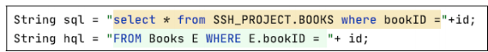

可以发现 SQL 语句是依据 bookID 字段的值从 SSH_PROJECT 数据库的 BOOKS表中查询出指定的数据，而 HQL 的语句则更像是从 Books 对象中取出指定 bookID属性的对象。Hibernate 可以像调用对象属性一样进行数据查询，是因为事先针对要查询的 POJO 对象进行映射，映射文件的具体内容如图

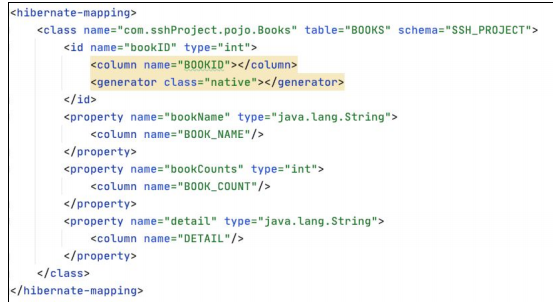

POJO 类的每个属性都与表中的字段进行一一映射，这样 HQL 才能用类似于操作对象属性的方式进行指定数据查询。与 SQL 语句相似，HQL 也存在注入问题，但是限制颇多，以下列举一些 HQL 注入的限制。

```
（1）无法查询未进行映射的表。
（2）在模型关系不明确的情况下无法使用“UNION”进行查询。
（3）HQL 表名、列名对大小写敏感，查询时使用的列名大小写必须与映射类的
属性一致。
（4）不能使用*、#、--。
（5）没有延时函数。
```

所以在生产环境中利用 HQL 注入是一件很困难的事。但是防御 HQL 注入时，除前面介绍的使用过滤器进行过滤的方法以外，还可以使用下图所示的预编译形式。

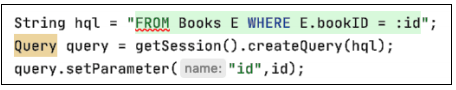