# Java EE 开发框架安全审计

## 开发框架审计技巧

### SSM 框架审计技巧

#### 1.SSM 框架简介

**SSM 框架，即 Spring MVC+Spring+MyBatis 这 3 个开源框架整合在一起的缩写**。在 SSM 框架之前，生产环境中多采用 SSH 框架（由 Struts2+Spring+Hibernate 这 3个开源框架整合而成）。后因 Struts2 爆出众多高危漏洞，导致目前 SSM 逐渐代替 SSH成为主流开发框架的选择。

1. Spring MVC ：Spring MVC 是一种基于Java实现的MVC设计模式的请求驱动类型的轻量级Web框架，采用MVC架构模式的思想，将Web层进行职责解耦。基于请求驱动指的是请求-响应模型，该框架的目的是简化开发过程。、
2. Spring ：Spring是分层的Java SE/EE full-stack轻量级开源框架，以IoC（Inverse of Control，控制反转）和 AOP（Aspect Oriented Programming，面向切面编程）为内核，使用基本的 JavaBean 完成以前只可能由 EJB 完成的工作，取代了 EJB 臃肿和低效的开发模式。Spring 的用途不仅仅限于服务器端的开发。从简单性、可测试性和松耦合性角度而言，绝大部分 Java 应用可以从 Spring 中受益。
3. MyBatis：MyBatis 是支持定制化 SQL、存储过程以及高级映射的优秀的持久层框架。MyBatis 避免了几乎所有的 JDBC 代码和手动设置参数以及获取结果集。MyBatis 可以对配置和原生 Map 使用简单的 XML 或注解，将接口和 Java 的 POJO（Plain Old Java Object，普通的 Java 对象）映射成数据库中的记录。
4. Servlet：Spring MVC 的底层就是以 Servlet 技术进行构建的。Servlet 是基于 Java 技术的Web 组件，由容器管理并产生动态的内容。Servlet 与客户端通过 Servlet 容器实现的请求/响应模型进行交互

#### 2.SSM 框架代码的执行流程和审计思路

代码审计的核心思想是**追踪参数**，而追踪参数的步骤就是程序执行的步骤。因此，代码审计是一个跟踪程序执行步骤的过程，了解了 SSM 框架的执行流程自然会了解如何如跟踪一个参数，剩下的就是观察在参数传递的过程中有没有一些常见的漏洞点。

这里通过创建一个简单的 Demo 来描述基于SSM 框架搭建的项目完成用户请求的具体流程，以及观察程序对参数的过滤是如何处理的。下图展示了一个简单的图书管理程序的目录结构，主要功能是对图书名称的增、删、查、改。无**论是审计一个普通项目或者是 Tomcat 所加载的项目，通常都从 web.xml 配置文件开始入手。Servlet 3.0 以上版本提供一些新注解来达到与配置 web.xml相同的效果。但是在实际项目中主流的配置方法仍然是 web.xml。**

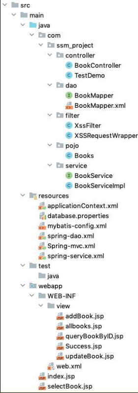

web.xml 文件的主要工作包括以下几个部分。

- web.xml 启动 Spring 容器。
- DispathcherServlet 的声明。
- 其余工作是 session 过期、字符串编码等。

首先是生成 DispatcherServlet 类。**DispatcherServlet是前端控制器设计模式的实现，提供 Spring Web MVC 的集中访问点（也就是把前端请求分发到目标Controller），而且与 Spring IoC 容器无缝集成，从而可以利用 Spring 的所有优点。**

简单地理解就是，**将用户的请求转发至 Spring MVC 中，交由 Spring MVC 的 Controller 进行更多处理。**

<init-param>子标签是生成DispatcherServlet时的初始化参数 `contextConfigLocation`，Spring 会根据该参数加载所有逗号分隔的 xml 文件。如果没有这个参数， Spring 默认加载`WEB-INF/DispatcherServlet-servlet.xml `文件。

如下图所示，<servlet-mapping>标签中还有一个子标签<url-pattern>，其中 value是“/”代表拦截所有请求。下图中还包含<filter>标签，具体功能会在后面进行介绍。

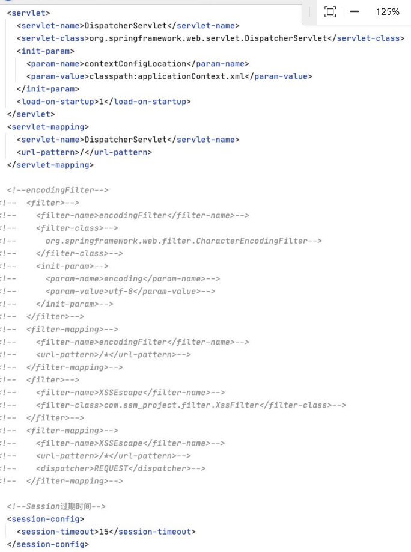

#### 3.Spring 核心配置文件 applicationContext.xml

我们可以根据加载顺序查看 applicationContext.xml

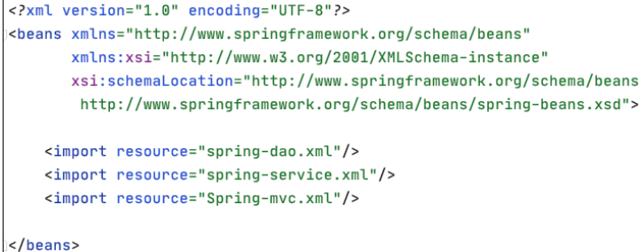

applicationContext.xml 中包含 3 个配置文件，它们是 Spring 用来整合 Spring MVC和 MyBaits 的配置文件，文件中的内容都可以直接写入 applicationContext.xml 中，因为 applicationContext.xml 是 Spring 的核心配置文件，例如生成 Bean，配置连接池，生成 sqlSessionFactory。但是为了便于理解，这些配置分别写在 3 个配置文件中，由applicationContext.xml 将 3 个 xml 进行关联。由下图我们可以清晰地看到applicationContext.xml 将这 3 个配置文件关联了起来。

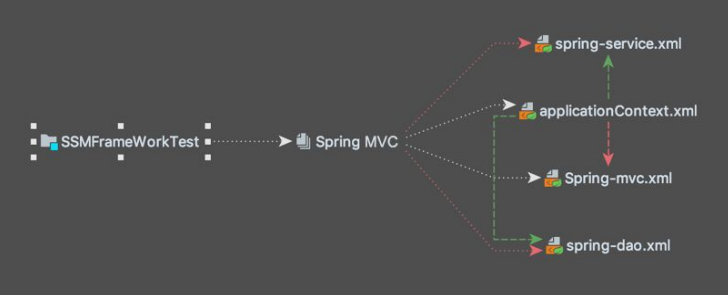

数据经由 DispatcherServlet 派发至 Spring-mvc.xml 的 Controller 层。我们先看Spring-mvc.xml 配置文件

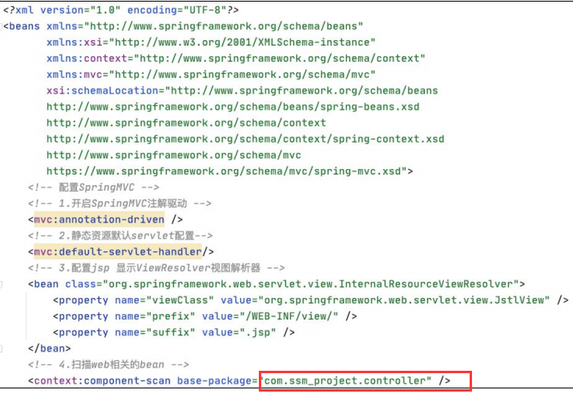

##### （1）<mvc:annotation-driven />标签。

如果在 web.xml 中 servlet-mapping 的 url-pattern 设置的是/，而不是.do，表示将所有的文件包含静态资源文件都交给 Spring MVC 处理，这时需要用到<mvc:annotation-driven />。如果不加，则 DispatcherServlet 无法区分请求是资源文件还是 MVC 的注解，而导致 Controller 的请求报 404 错误。

##### （2）<mvc:default-servlet-handler/>标签。

在 Spring-mvc.xml 中配置<mvc:default-servlet-handler/>后，会在 Spring MVC 上下文中定义一个 org.springframework.web.servlet.resource.DefaultServletHttp-RequestHandler，它会像检查员一样对进入 DispatcherServlet 的 URL 进行筛查。如果是静态资源的请求，就将该请求转由 Web 应用服务器默认的 Servlet 处理；如果不是静态资源的请求，则交由 DispatcherServlet 继续处理。

其余两项之一是指定了返回的 view 所在的路径，另一个是指定 Spring MVC 注解的扫描路径，可以发现该配置文件中都是与 Spring-mvc 相关的配置。

#### 4.SSM 之 Spring MVC 执行流程

接下来就是 Spring MVC Controller 层接受前台传入的数据。以下通过 DEMO 运行以方便演示和讲解，首页如图所示。

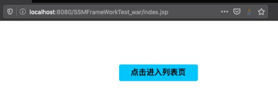

查看首页的页面源码

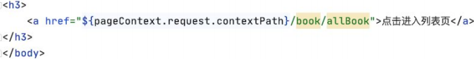

可以看到 a 标签的超链接是 `http://localhost:8080/SSMFrameWorkTest_war/ book/allbook`。

`${pageContext.request.contextPath}`是 JSP 取得**绝对路径**的方法, 也就是取出部署的应用程序名或者是当前的项目名称，避免在把项目部署到生产环境中时出错。

此时后台收到的请求路径为`/book/allBook`。***Spring MVC 在项目启动时会首先去扫描我们指定的路径，即 `com.ssm_project.controller` 路径下的所有类。***`BookController`类的代码如图所示。

**Spring MVC 会扫描该类中的所有注解，看到@Controller 时会生成该 Controller的 Bean，扫描到@RequestMappting 注解时会将@RequestMappting 中的 URI 与下面的方法形成映射。所以我们请求的 URI 是“/book/allBool”，Spring MVC 会将数据交由 BookController 类的 list 方法来处理。**

> **在Spring框架中，Bean是一个被Spring IoC容器管理的对象。简单地说，Bean就是应用程序中的对象，由Spring容器负责实例化、装配和管理。通过Spring的依赖注入机制，Bean可以被自动装配到需要它的地方。**
> 
> 在Spring MVC中，@Controller注解用于标识一个类作为控制器，而@RequestMapping注解则用于将HTTP请求映射到相应的处理方法上。当Spring容器扫描到被@Controller注解标识的类时，会创建该类的实例作为一个Bean，并将其放入IoC容器中管理。同时，当扫描到被@RequestMapping注解标识的方法时，Spring会建立请求路径和方法之间的映射关系，以便根据请求路径找到对应的方法进行处理。
> 
> 因此，在你提到的例子中，当请求URI为"/book/allBook"时，Spring MVC会查找与该URI匹配的控制器方法，然后调用相应的方法处理该请求。在这个过程中，**BookController类会被实例化为一个Bean**，**并且其中的list方法会被映射为处理请求"/book/allBook"的方法**。Bean的存在使得Spring能够更加灵活地管理和组织应用程序中的组件，并实现依赖注入和控制反转等特性。

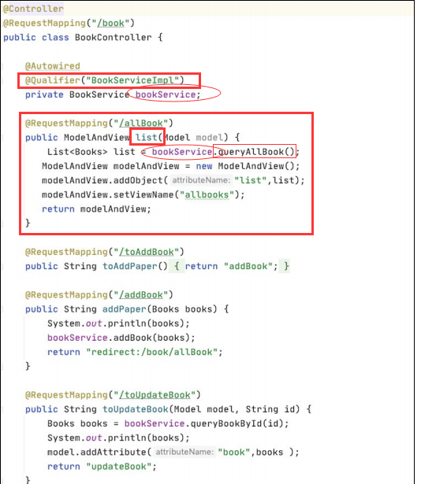

仔细观察 list 方法，其中调用了 bookService 参数的 queryAllBook 方法，这里使用了两个注解：@Autowired 和@Qualifier。这两个注解的作用简单介绍如下。

@Autowired：<u>可以用于自动装配 bean，即将符合类型的 bean 注入到标注了 @Autowired 的字段、构造方法或方法参数中。</u>当容器中存在多个满足条件的 bean 时，@Autowired 会根据类型进行自动装配。如果存在多个匹配的 bean，Spring 将会抛出异常，除非在多个候选 bean 上使用 @Primary 注解来指定优先级。

@Qualifier：当存在多个相同类型的 bean 时，@Qualifier 注解可以与 @Autowired 一起使用，通过指定 bean 的名称来精确地选择要注入的 bean。<u>在使用 @Qualifier 注解时，通常与 bean 的 id 或名称一起使用，以便精确指定要注入的 bean。</u>如果在没有使用 @Qualifier 注解的情况下存在多个满足条件的 bean，Spring 将会抛出 NoUniqueBeanDefinitionException 异常。因此，@Qualifier 主要用于解决多个候选 bean 的歧义性问题。

由此可以看到 `bookService` 参数的类型是 `BookService` 类型，通过注解自动注入的 Bean 的 id 叫作 `BookServiceImpl`。

> **@Qualifier("BookServiceImpl")的作用：**
> 
> 将 BookServiceImpl 注入到一个类中通常表示该类依赖于 BookServiceImpl，即该类需要使用 BookServiceImpl 提供的功能或服务。
> 
> 假设有一个类 SomeClass，它需要使用 BookServiceImpl 提供的一些功能来完成自己的任务。通过将 BookServiceImpl 注入到 SomeClass 中，SomeClass 就可以在需要时直接调用 BookServiceImpl 中的方法，而不需要自己去创建 BookServiceImpl 的实例。这样做的好处包括：解耦合：SomeClass 不需要直接依赖于 BookServiceImpl 的具体实现，而是依赖于 BookService 接口，从而实现了解耦合。这样，在将来如果需要替换 BookServiceImpl 的具体实现，只需要修改配置，而不需要修改 SomeClass 的代码

> **在 Spring 中，可以使用 @Autowired 注解来自动注入 BookServiceImpl。具体方法取决于你想要注入的地方：是在另一个 Bean 中，还是在 Spring MVC 的控制器中，或者其他地方。**
> 
> **假设你有一个类 SomeClass 需要注入 BookServiceImpl，可以按照以下步骤进行注入**：
> 
> 1.在 SomeClass 类中声明一个 BookService 类型的字段，并使用 @Autowired 注解进行注入：
> 
> public class SomeClass {
> 
> @Autowired
private BookService bookService;
> 
> // 其他方法}
> 
> 在上面的代码中，@Autowired 注解用于将 BookServiceImpl 注入到 SomeClass 的 bookService 字段中。
> 
> 2.确保 BookServiceImpl 类被 Spring 扫描到并注册为一个 Bean。你可以在 BookServiceImpl 类上添加 @Service 注解，或者在配置文件中使用 XML 进行配置。
> 
> import org.springframework.stereotype.Service;
> 
> @Service
public class BookServiceImpl implements BookService {
    // 实现 BookService 接口的方法
}
> 
> 3.在 Spring 的配置文件中配置组件扫描，以便 Spring 能够扫描到并注册 SomeClass 和 BookServiceImpl。
> 
> <context:component-scan base-package="com.example.package"/>
> 
> 这样，当 Spring 启动时，它会自动扫描指定的包，并将 SomeClass 和 BookServiceImpl 注册为 Spring 的 Bean，并且自动将 BookServiceImpl 注入到 SomeClass 中的 bookService 字段中。

#### 5.SSM 之 Spring 执行流程

***这里我们就要从 Spring MVC 的部分过渡到 Spring 的部分，所谓的过渡就是我们从 Spring MVC 的 Controller 层去调用 Service 层，而 Service 层就是我们使用 Spring进行 IoC 控制和 AOP 编程的地方。***

首先我们需要查看配置文件 spring-service.xml，如图

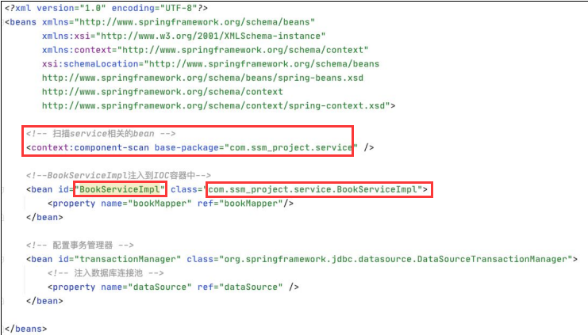

这里我们发现 id 为 BookServiceImpl 的 bean，该 bean 的 class 路径是 `com.ssm_ project.service.BookServiceImpl`。**<bean>这个标签涉及 Spring 一大核心功能点，即 IoC。**本来编写一个项目需要我们自己手动去创建一个实例，在使用了 Spring 以后只需要生成的那个类的绝对路径，以及创建一个实例时需要传入的参数。传入参数的方法可以是通过构造方法，也可以通过 set 方法。用户还可以为这个 bean 设置一个名称方便调用（如果不设置 id 参数名，则 bean 的名称默认为类名开头的小写字母，比如BookServiceImpl，如不特别指定，则生成的 bean 的名称是 bookServiceImpl）。**Spring会在启动时将用户指定好的类生成的实例放入 IoC 容器中供用户使用。通俗地说就是本来由用户手动生成实例的过程交由 Spring 来处理，这就是所谓的控制反转。**

接下来查看 BookServiceImpl 类的详细信息，如图


首先看到该类实现了 BookService 接口，查看该接口，如图

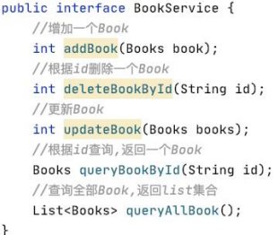

可以看到该接口中定义了 4 种方法，为了方便理解，这些方法的名字对应着日常项目中常用的操作数据库的 4 个方法，即增、删、改、查。

接下来查看接口的实现类 BookServiceImpl，如图

实现了 BookService 接口，自然也需要实现该接口下的所有方法，找到queryAllBook 方法，发现 queryAllBook 调用了 bookMapper 参数的 queryAllBook 方法，而 bookMapper 是 BookMapper 类型的参数。

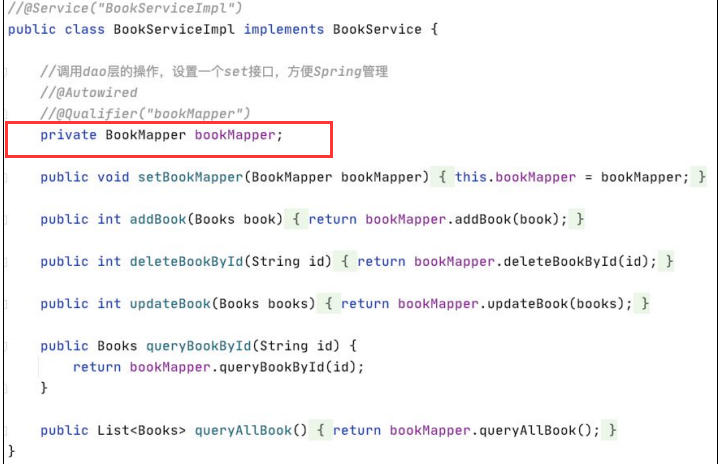

回过头来查看 spring-service.xml 中的配置。前面介绍了这一配置是将BookServiceImpl 类生成一个 bean 并放入 Spring 的 IoC 容器中。<property>标签的意思是通过该类提供的 set 方法在 bean 生成时向指定的参数注入 value，name 属性就是指定的参数的名称。可以看到 BookServiceImpl 中确实有一个私有参数，名为bookMapper，并且提供了该属性的 set 方法。ref 属性是指要注入的 value 是其他的Bean 类型，如果传入的是一些基本类型或者 String 类型，则不需要使用 ref ，只需将 ref 改成 value，如图

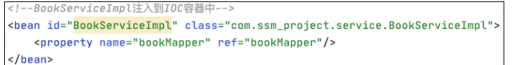

***这里通过 ref 属性向 BookServiceImpl 类中的 bookMapper 参数注入了一个 value，这个 value 是一个其他的 bean 类型，该 bean 的 id 为 bookMapper。此时 Service 层的BookServiceImpl 的 queryAllBook 方法的实现方式其实就是调用了 id 为 bookMapper的 bean 的 queryAllBook 方法，因此这个 id 为 bookMapper 的 bean 就是程序执行的下一步。***

> `<bean id="userServiceimpl" class="com.zc.Service.UserServiceimpl">-->
  <property name="UserMapper" ref="userMapper"/>-->
</bean>`以上代码实现了什么功能，举例说明:
> 
> 这段代码是一个典型的Spring配置，它实现了将一个名为"userServiceimpl"的bean注入到Spring容器中，并指定了它的类为"com.zc.Service.UserServiceimpl"。同时，通过元素，它注入了一个名为"userMapper"的属性，属性值是另一个在Spring容器中定义的bean，其名称为"userMapper"。property
> 
> 简单来说，这段代码的功能是将一个名为"userMapper"的bean注入到名为"userServiceimpl"的bean中的"UserMapper"属性中。***这通常用于实现依赖注入，即在"UserServiceimpl"类中可以直接使用"userMapper"这个属性，而无需在类内部手动创建或获取"userMapper"对象。***
> 
> ```
> public class UserServiceimpl {
>     private UserMapper userMapper;
> // 省略其他代码
> public void setUserMapper(UserMapper userMapper) {
>     this.userMapper = userMapper;
> }
> // 其他方法使用了 userMapper
> ```
> 
> 在Spring的配置文件中，通过以上的配置，Spring容器会实例化类，并自动将名为"userMapper"的bean注入到其属性中。这样，在中就可以直接使用属性了，而不需要手动创建或者通过其他方式获取"userMapper"对象。

#### 6.SSM 之 MyBatis 执行流程

接下来就是 Web 三层架构的数据访问层，也就是 MyBaits 负责的部分，通常这一部分的包名叫作 xxxdao，也就是开发过程中经常提及的 DAO 层，该包下面的类和接口通常叫作 xxxDao 或者 xxxMapper。**此时用户的请求将从 Spring 负责的业务层过渡到 MyBatis 负责的数据层，但是 MyBaits 和 Spring 之间不像 Spring MVC 和 Spring一样可以无缝衔接，所以我们需要通过配置文件将 MyBatis 与 Spring 关联起来。**这里我们来查看一下 pom.xml，如图

1

可以看到我们导入的包除了 MyBatis 本身，还导入了一个 mybatis-spring 包，目的就是为了整合 MyBatis 和 Spring。spring-dao.xml 是用来整合 Spring 和 MyBatis 的配置文件。

***刚才我们看到 Spring 启动加载 bean 时会注入一个 id 为 bookMapper 的 bean，但是我们并未在之前的任何配置文件包括注解中看到这个 bean 的相关信息，所以我们接下来要查看 spring-dao.xml 中有没有与这个 bean 有关的信息***，如图

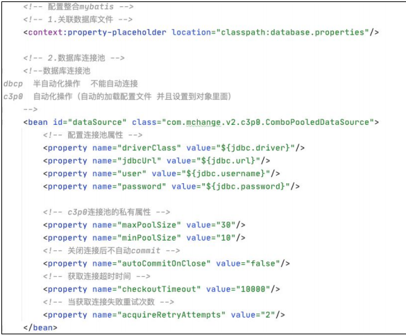

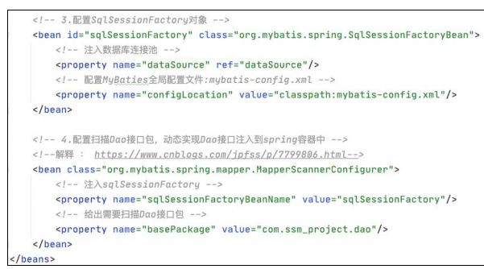

每项配置的作用基本都用注释的方式标明。

```
<context:property-placeholder location="classpath:database.properties"/>
```

这里关联了一个 properties 文件，如图所示，里面是连接数据库和配置连接池时需要的信息。

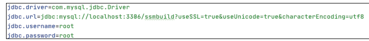

重点查看这个配置，如图

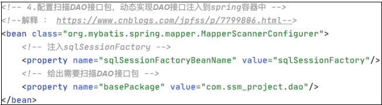

**该配置通过生成 MapperScannerConfigurer 的 bean 来实现自动扫描 com.ssm_ project.dao 下面的接口包，然后动态注入 Spring IoC 容器中**，同样动态注入的 bean的 id 默认为类名（开头字母小写），目录下包含的文件如图

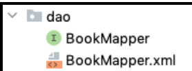

我们看到有一个叫作 BookMapper 的接口文件，说明之前生成 BookServiceImpl这个 bean 是通过<property>（BookServiceImpl 类中的 setBookMapper()方法）注入的bookMapper，是由我们配置了 MapperScannerConfigurer 这个 bean 后，这个 bean 扫描 dao 包下的接口文件并生成 bean。然后再注入 Spring 的 IoC 容器中，所以我们才可以在 BookServiceImpl 这个 bean 中通过<property>标签注入 bookmapper 这个 bean。

```
public void setBookMapper(BookMapper bookMapper) { 
this.bookMapper = bookMapper; 
}
```

> 如何理解上面那段话的意思？
> 
> **BookMapper接口文件**： 这是一个接口文件，可能定义了一系列操作书籍相关信息的方法，比如增删改查等。它属于数据访问层（DAO），用于与数据库交互。
> 
> **BookServiceImpl bean**： 这是一个服务层（Service）的bean，可能包含了一些业务逻辑，比如处理图书信息的增删改查等。在这段描述中，*提到了BookServiceImpl bean是通过注入bookMapper属性来实现对数据访问层的操作的*。
> 
> **bookMapper属性注入**： 在BookServiceImpl类中，可能有一个名为setBookMapper的方法，用于注入BookMapper实例。这是通过Spring的依赖注入功能实现的。也就是说，*BookServiceImpl类会从Spring容器中获取BookMapper的实例，并将其注入到setBookMapper方法中*。
> 
> **MapperScannerConfigurer bean配置**： 在Spring的配置文件中，可能有一个名为MapperScannerConfigurer的bean配置，它会扫描指定包下的接口文件，如DAO接口文件，并将其注册为bean。这样，BookMapper接口文件就会被扫描并注册为一个Spring bean。
> 
> **IoC容器中的管理**： 通过上述配置，Spring容器会管理BookMapper实例和BookServiceImpl实例。BookMapper实例会被MapperScannerConfigurer扫描并注册到容器中，而BookServiceImpl实例会通过配置文件中的<property>标签注入bookMapper实例，使得BookServiceImpl可以使用BookMapper提供的数据访问功能，而不需要直接依赖于具体的数据访问实现。

然后查看该配置，如图

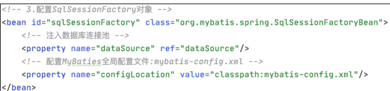

这里生成一个 id 为 SqlSessionFactory 的 bean，涉及 MyBatis 中的两个关键对象即 SqlSessionFactory 和 SqlSession。

两个对象简单介绍如下。

##### （1）SqlSessionFactory。

SqlSessionFactory 是 MyBatis 的关键对象，它是单个数据库映射关系经过编译后的内存镜像。SqlSessionFactory 对象的实例可以通过 SqlSessionBuilder 对象获得，而SqlSessionBuilder 则可以从 xml 配置文件或一个预先定制的 Configuration 的实例构建出 SqlSessionFactory 的实例。SqlSessionFactory 是创建 SqlSession 的工厂

##### （2）SqlSession。

SqlSession 是执行持久化操作的对象，类似于 JDBC 中的 Connection。它是应用程序与持久存储层之间执行交互操作的一个单线程对象。SqlSession 对象完全包括以数据库为背景的所有执行 SQL 操作的方法，它的底层封装了 JDBC 连接，可以用SqlSession 实例来直接执行已映射的 SQL 语句。

SqlSessionFactory 和 SqlSession 的实现过程如下。
MyBatis 框架主要是围绕着 SqlSessionFactory 进行的，实现过程大概如下。

- 定义一个 Configuration 对象，其中包含数据源、事务、mapper 文件资源以及影响数据库行为属性设置 settings。
- 通过配置对象，则可以创建一个 SqlSessionFactoryBuilder 对象。
- 通过 SqlSessionFactoryBuilder 获得 SqlSessionFactory 的实例。
- SqlSessionFactory 的实例可以获得操作数据的 SqlSession 实例，通过这个实例对数据库进行。

如果是 Spring 和 MyBaits 整合之后的配置文件，一般以这种方式实现SqlSessionFactory 的创建，示例代码如下。

```
<bean id="sqlSessionFactory"class="org.mybatis.spring. 
SqlSessionFactoryBean"> 
<property name="dataSource" ref="dataSource"></property> 
<property name="mapperLocations" value="classpath:com/cn/mapper/*.xml"> 
</property> 
</bean>}
```

SqlSessionFactoryBean 是一个工厂 Bean，根据配置来创建 SqlSessionFactory。手动创建 SqlSessionFactory 和 SqlSession 的流程如图

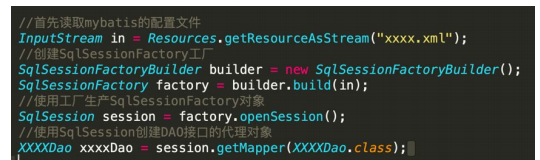

我们同时注意到<property>标签的 value 属性是“classpath:mybatis-config.xml”，这里又引入了一个 xml 配置文件，即 mybatis-config.xml，是 MyBatis 的配置文件。

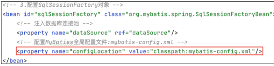

**程序刚才执行到 BookServiceImpl 类的 queryAllBook 方法，然后该方法又调用了bookMapper 的 queryAllBook 方法。我们发现 bookMapper 的类型是 BookMapper，并且从 sping-dao.xml 的配置文件中看到了该文件位于 com.ssm_project.dao 路径下。**现在打开 BookMapper.java 文件进行查看，如图

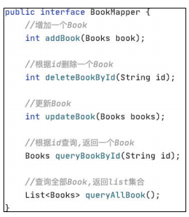

<u>我们注意到这只是一个接口，众所周知，接口不能进行实例化，只是提供一个规范，因此这里的问题是调用的 BookMapper 的 queryAllBook 是怎样执行的？</u>

仔细查看 dao 目录下的文件，如图

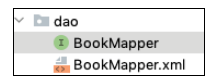

其中有一个名称与 BookMapper.java 名称相同的 xml 文件，其内容如图

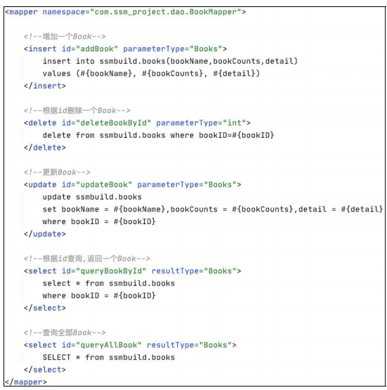

看到这个文件，虽然我们对 MyBatis 的了解并不多，但是可以大概了解为什么BookMapper 明明只是接口，我们却可以实例化生成 BookMapper 的 bean，并且可以调用它的方法。

但是 BookMapper.java 和 BookMapper.xml 显然不是 MyBatis 的全部，两个文件之间此时除了名字相同以外还没有什么直接联系，所以我们还需要将它们关联起来。查看 mybatis-config.xml 的配置文件，如图

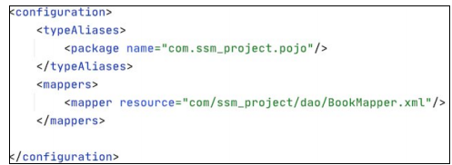

可以发现`<mappers>`标签的 resource 属性的 value 就是 `BookMapper.xml `的路径MyBatis，是基于 SQL 映射配置的框架。**SQL 语句都写在 Mapper 配置文件中，构建 SqlSession 类后，需要去读取 Mapper 配置文件中的 SQL 配置。而`<mappers> `标签就是用来配置需要加载的 SQL 映射配置文件路径的。**

也就是说，最**终由 Spring 生成 BookMapper 的代理对象，然后由 MyBaits 通过`<mappers>`标签将BookMapper代理对象中的方法与BookMapper.xml中的配置进行一一映射，并最终执行其中的 SQL 语句。**

可以发现此次请求最终调用了 BookMapper 的 queryAllBook 方法，这时我们需要去 BookMapper.xml 中寻找与之对应的 SQL 语句，如图

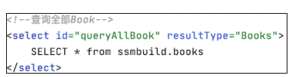

我们看到最后执行的 SQL 语句如下。

```
SELECT * from ssmbuild.books
```

**至此我们的请求已经完成，从一开始的由 DispatcherServlet 前端控制器派发给Spring MVC，并最终通过 MyBatis 执行我们需要对数据库进行的操作。**

生产环境的业务代码肯定会比这个 DEMO 复杂，但是整体的执行流程和思路并不会有太大的变化，所以审计思路也是如此。

SSM 框架有 3 种配置方式，即全局采用 xml 配置文件的形式，全局采取注解的配置方式，或者注解与 xml 配置文件配合使用的方式，区别只是在于写法不同，执行流程不会因此发生太多改变。