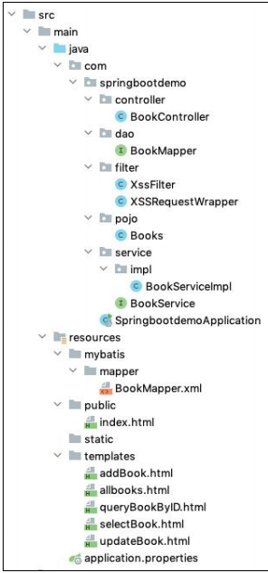
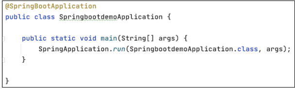
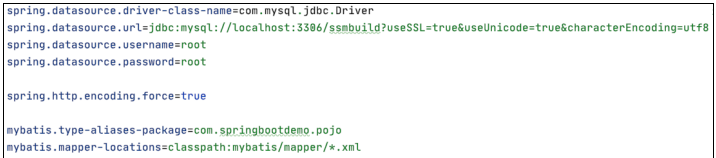
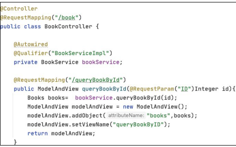
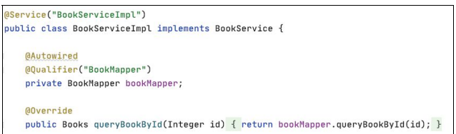
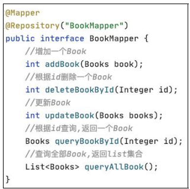
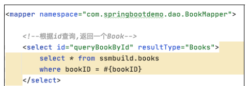

# Java EE 开发框架安全审计

## 开发框架审计技巧

### Spring Boot 框架审计技巧

#### 1．Spring Boot 简介

Spring Boot 是由 Pivotal 团队在 2013 年开始研发、2014 年 4 月发布第一个版本的全新、开源的轻量级框架。它基于 Spring 4.0 设计，不仅继承了 Spring 框架原有的优秀特性，而且通过简化配置进一步简化了 Spring 应用的整个搭建和开发过程。另外，Spring Boot 通过集成大量的框架使依赖包的版本冲突以及引用的不稳定性等问题得到了很好的解决。

#### 2．审计思路

使用 Spring Boot 框架审计时，首先是将前面介绍的 SSH 和 SSM 所使用的案例改写成 Spring Boot 的形式。项目文件结构如图所示，整体看上去与 SSM 架构的 Demo 非常相似。

从文件结构中可以发现，以往我们在审计过程中最先注意到的 `web.xml `文件在` Spring Boot `中被取消，那么审计如何开始呢？`Spring Boot` 开发的项目都有一个主配置类，通常放置于包的最外层，当前项目的主配置类是 **`SpringbootdemoApplication`**类，其代码如图。

再查看配置文件** `application.properties`**，内容如图

其中只配置了`jdbc`的链接信息，以及一个类似`mybatis`配置文件存放目录的信息。

看到这里，貌似审计进入了一个死胡同，如果不清楚 `Spring Boot `的执行流程，审计就无法继续进行。这时就需要了解` Spring Boot` 非常关键的一个知识点——**自动装配**。

**Spring Boot 项目的主配置类 SpringbootdemoApplication 有一个注解为`@SpringBootApplication`，当一个类上存在该注解时，该类才是 Spring Boot 的主配置类。当 Spring Boot 程序执行时，扫描到该注解后，会对该类当前所在目录以及所有子目录进行扫描，这也是为什么 SpringbootdemoApplication 这个主配置类一定要写在包中所有类的最外面，因此省略了之前在 SSH 以及 SSM 中的种种 XML 配置。讲到这里，相信读者应该意识到我*们在 SSH 项目以及 SSM 项目中通过 XML 配置的信息，在这里都要改为使用注解来进行配置。***

了解这一点之后，审计的思路似乎清晰了起来。根据 MVC 的设计思想，除了Filter 和 Listener 以外，首先在接收前端传入参数的就是 Controller 层。Controller 层的内容如图：

可以看到其中的代码与使用 SSM 书写时完全相同，这里以根据 ID 查询书籍的功能为例来进行讲解。同审计 SSH 和 SSM 框架时的思路相同，**`Controller `层的`queryBookById` 方法在接收到前端传入的 ID 参数后，调用了 `Service` 层来对 ID 参数进行处理，所以跟进 `BookService`**，如图

`BookService` 是一个接口，该接口只有一个实现类，所以到 `BookServiceImpl `类中进行观察，`BookServiceImpl` 类的部分代码如图

**Service 层并没有做更多的操作，只是简单调用了 DAO 层的 BookMapper，并将ID 作为参数传递进去，所以我们继续追踪 BookMapper。**

如上图所示，BookMapper 只是一个接口，且根据下图所示，BookMapper并没有实现类，那么程序是如何调用 BookMapper 中定义的方法的呢？**这里的 DAO层使用的是 MyBatis 框架，MyBaits 框架在配置和数据层交互时有两种方式：一种是通过在接口方法上直接使用注解，还有一种就是使用 XML 来进行配置。**很明显，我们在 BookMapper 的方法中没有看到相关注解，因此应该搜索相关的 XML 配置文件。

项目的 resource 目录下存放有 BookMapper 的 XML 配置文件，其部分内容如下图所示。同样在审计过程要注意程序在与数据库交互时有没有使用预编译，如果没有，则需要注意传入数据库的参数是否经过过滤和校验。

以上就是一个使用 Spring Boot 搭建简单的 Web 项目的执行流程，经过拆解和分析发现 Spring Boot 的执行流程和 SSM 的大致相同，差别只是 Spring Boot 构建的 Web项目中缺少很多配置文件。