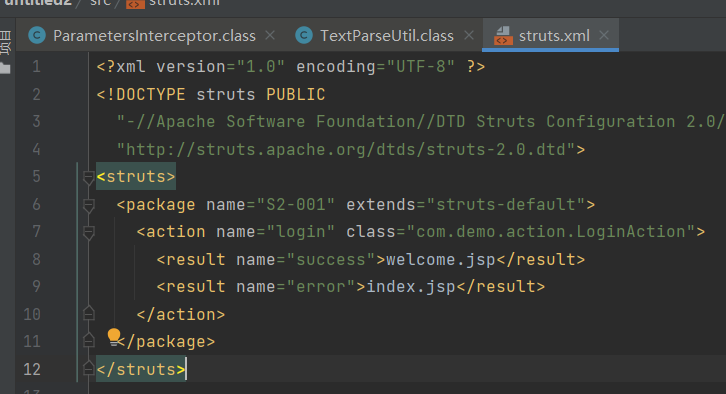

# 开发框架使用不当范例(S2-001 漏洞原理分析)

自 Struts2 在 2007 年爆出第一个远程代码执行漏洞 S2-001 以来，在其后续的发展过程中不断爆出更多而且危害更大的远程代码执行漏洞，而造成 Struts2 这么多RCE 漏洞的主要原因就是 OGNL 表达式。这里以 Struts2 的第一个漏洞 S2-001 为例来对 Struts2 远程代码执行漏洞进行初步介绍。

## OGNL 简介

首先来了解OGNL表达式，OGNL(**Object Graphic Navigatino Language**)的中文全称为"**对象图形导航语言**"，下面先通过一个简单的案例来描述其作用。

首先定义一个 Student 类，该类有 3 个属性 name、studentNumber 和 theClass，同时为 3 个属性编写 get 和 set 方法，如图所示。


然后定义一个 TheClass 类，该类有两个属性：className 和 school，同样也为两个属性编写 get 和 set 方法，如图


最后定义一个 School 类，该类只有一个属性 schoolName，如图


通过如下操作将这 3 个类实例化并为其属性一一进行赋值，最后通过使用 OGNL表达式的方式取出指定的值，如图


**在不使用 OGNL 表达式的情况下，如果要取出 schoolName 属性，需要通过调用对应的 get 方法，但是当我们使用 OGNL 的 getValue，只需要传递一个 OGNL 表达式和根节点就可以取出指定对象的属性，非常方便。**

## S2-001 漏洞原理分析

初次了解一个漏洞的原理，除了查看网络上相关的漏洞分析文章以外，最重要的一点就是一定要自己调试。

首先导入存在漏洞的 Jar 包。


首先创建一个普通的java项目，然后再引入所需的jar包。


然后编写一个简单的 Demo，首页的部分代码如图


运行上述代码得到一个简单的登录框，接下来是负责处理请求的 Action 代码，如图


然后是 Struts2 的配置文件，如图



根据上述代码可知，LoginAction 所做的就是判断 username 和 password 是否为空以及是否都为 admin，如果都满足则，返回“success”转发到 welcome.jsp。其中一项不满足，则返回“error”转发到 index.jsp。

首先来简单了解 Struts2 的执行流程。官方提供的 Struts2 的架构如图：


```
Servlet Filters：过滤器链，客户端的所有请求都要经过 Filter 链的处理。
Struts Core：Struts2 的核心部分。
Interceptors：Struts2 的拦截器。Struts2 提供了很多默认的拦截器，可以完成日常开发的绝大部分工作；而我们自定义的拦截器用来实现实际的客户业务需要的功能。
User created：由开发人员创建，包括 struts.xml、Action、Template。
```

用户会首先发起一个针对某个 Action 的请求，后台的 Servlet 容器，例如 Tomcat接收到该请求后会去加载 web.xml，根据 web.xml 中配置的 Filter，最后会执行到FilterDispatcher 即 Struts2 的调度中心，如图


在 web.xml 中，FilterDispatcher 通常会配置在 Filter 链的最后。根据官方提供的 Struts2 的架构图中的流程，FilterDispatcher 会将请求交由 ActionMapper 进行处理，而 ActionMapper 则负责判断当前的请求是否交由 Struts2 来进行处理。如果经过判断需要 Struts2 处理，FilterDispatcher会结束FilterChain的执行，所以需要将FilterDispatcher写在FilterChain的最后。相关代码如图


当 mapping 不为空时，则进入下一个步骤，即创建一个 ActionProxy。ActionProxy对象在创建的同时会通过调用 ConfigurationManager 对象来获取 Struts.xml 中的Action 配置，这样 ActionProxy 才能清楚后续应该调用哪些拦截器和哪个 Action，最终生成的 ActionProxy 对象如图


当读取到这些信息后，ActionProxy 会创建一个 ActionInvocation 对象，该对象首先会依次调用 Struts2 中默认的拦截器，所有的默认拦截器都存储在 ActionInvocation对象的 interceptors 属性中，并通过 hasNext 方法依次进行调用，相关代码如图


那么 Struts2 默认的拦截器都有哪些，并且定义在哪里呢？Strut2-core.jar 包中有一个 struts2-default.xml 文件，这里配置了 Struts2 默认情况下要执行的拦截器，如图


接下来，ActionInvocation 对象会依次执行上述的拦截器，并最终调用用户自己编写的 Action。

当拦截器执行完成后，首先就会调用开发者编写的 Action 中的 execute 方法，执行完该方法后，会根据 Struts.xml 配置的信息去查找对应的模板页面，例如 JSP、FreeMarker；然后根据对应的模板标签信息，解析成 HTML 等浏览器可以解析的页面信息后，再按照默认拦截器的相反顺序执行；最终将页面信息封装至 Response 中。这就是 Strut2 处理一次用户发来的请求其底层代码执行的流程。

了解这个流程之后就可以分析 Struts2 远程代码执行漏洞的原理了。首先运行包含 S2-001 漏洞的程序，输入以下数据，如图


单击 Submit 按钮后，password 一栏就会变成 2+9 的计算结果，如图


这意味着，后台将 password 中%{2+9}作为代码执行，并返回了计算结果。

拦截器的执行流程是：首先，需要判断%{2+9}是在何时被执行的，将断点设置在 `LoginAction` 的 `setPassword` 和 `getPassword` 方法上，如图所示；然后，因为在Struts2 执行众多的默认拦截器时，有一个名为` params` 的拦截器，该拦截器对应的权限定类名是 `com.opensymphony.xwork2.interceptor.ParametersInterceptor`，该拦截器会通过调用对应 Action 的 setter 方法来为其属性进行赋值；*最后，对赋值进行判断，如果 password 的值为“%{2+9}”，则证明代码执行的行为发生在执行 Action 之后；如果 password 的值为 11，则证明代码执行的行为发生在 Action 执行之前。通过这种简单的判断就可以减少漏洞点的搜索范围*，如图


通过在此处设置断点，可以看到直到赋值完成，“%{2+9}”仍没有被执行，这就意味着截止到执行完 ParametersInterceptor 拦截器为止，没有代码执行的行为发生。

接下来是执行 Action 的 execute 方法，最终结果是返回“error”字符串，如图


Action执行完毕后的步骤是操作对应的模板页面，当LoginAction的execute方法返回“error”字符串时，Struts2要去解析的模板页面是index.jsp

Struts2 支持多种模板引擎，种类如图所示，jsp 只是其中一种。所以在真正开始解析之前，Struts2 还需要判断开发人员使用的模板引擎种类，从而调用对应的类和方法。


负责处理 JSP 的类是 `org.apache.struts2.views.jsp.ComponentTagSupport`。解析会从第一个 Struts2 标签即`<s:form action="login">` 开始，当解析到 `ComponentTagSupport`类时，首先被调用的方法就是 `doStartTag` 方法，该方法的代码如图所示。除`doStartTag` 方法外，`ComponentTagSupport` 中还有一个 `doEndTag` 方法，一个是解析标签开始时调用，另一个是解析到标签闭合时调用。


ComponentTagSupport 是一个抽象类。由于首先被解析的是一个 Struts2 Form 标签，org.apache.struts2.views 有一个与 From 标签对应的实体类，类名为 FormTag，是ComponentTagSupport 的子类。虽然当前断点设置在 ComponentTagSupport 的doStartTag 方法上，其实是子类在调用父类方法，因为当前对象是 FromTag 对象，如图


我们跳过 From 标签的解析，因为关键点并不在这里。

解析完 From 标签后会解析 textfield 标签，这两个标签的细节如图


首先解析第一个` textfield` 标签，关键的步骤在` doEndTag` 方法中。首先会调用`this.component.end` 方法，如图


然后执行到 UIBean 类的 evaluateParams 方法。该方法用来判断标签中有哪些属性，例如当前 textfield 标签中有两个属性：一个是 name 属性，另一个是 lable 属性，判断这两个属性的代码如图


我们的标签里编写了 name 属性，第一个 if 判断的结果为 true，但是该 name 属性并不是关键点，因此我们跳过第一个 if 判断，直接来到第二个 if，判断标签是否有 label 属性，跟进 this.findString 方法

**经过一系列的嵌套调用，最终执行 `TextParseUtil` 类的` translateVariables` 方法。这里就是导致漏洞产生的核心问题所在，我们可以先看一下该函数是如何处理一个正常的请求数据的。**首先观察当前的变量和值，如图


接下来是 translateVariables 方法的部分代码，如图


```
首先会进入一个 while 循环，该循环的作用是判断 label 属性的值是否以“${”开头，目的是判断其是不是一个 OGNL 表达式，如果是则返回的值为 0，不是则返回值为1。然后根据 expression.indexOf 方法的返回值进入下一个判断。第二个 while循环是为了判断“{”与“}”的数量是否相等，相等则 count 的值为 0；由于 label属性的值是字符串“username”，不包括“${”，start 值为1，count 值为 1，因此第二个 while 循环无须执行。最终 if (start == 1 || end == 1 || count != 0)判断结果是为ture，return 的结果如图
```


> 返回值仍是字符串 username，返回结果到 UIBean 类的 evaluateParams 方法。当判断完所有属性后，evaluateParams 方法中执行了一个操作，即将字符串拼接“${}”
成为一个 OGNL 表达式“ ${username} ”，然后再带入 TextParseUtil 类 的translateVariables 方法中，代码如图 7-108 所示。这样做的目的是最终通过反射调用LoginAction 对象的 getUsername 方法，从而获取存储在 LoginAction 对象中 username属性的值。


最终获取到的值为 admin，也就是我们通过前端传入的 username 的值。但是接下来Sturts2的操作会出现问题，获取到admin后又对其进行了一次判断，判断该admin是不是 OGNL 表达式。相信大家已经意识到，这个 admin 是通过前端传入的，是可控的，那么可不可以将参数由字符串“admin”替换成一个 OGNL 表达式？

我们在 password 栏中进行了这样的尝试，继续分析，前期直到拼接处理%{password}从 LoginAction 中获取 password 的值为止都是相同的，问题就出在获取到 password 的值之后。

password 的值为%{2+9}，按照程序执行流程，会先判断其是不是一个以“%{”开头的 OGNL 表达式。%{2+9}自然是符合的，start 最后的值为 0，end 的值为 5，count的值为 0，所以会执行到 stack.findValue 这一步，将%{2+9}当作表达式来执行，后续的执行会涉及 OGNL。最终的执行结果如图

