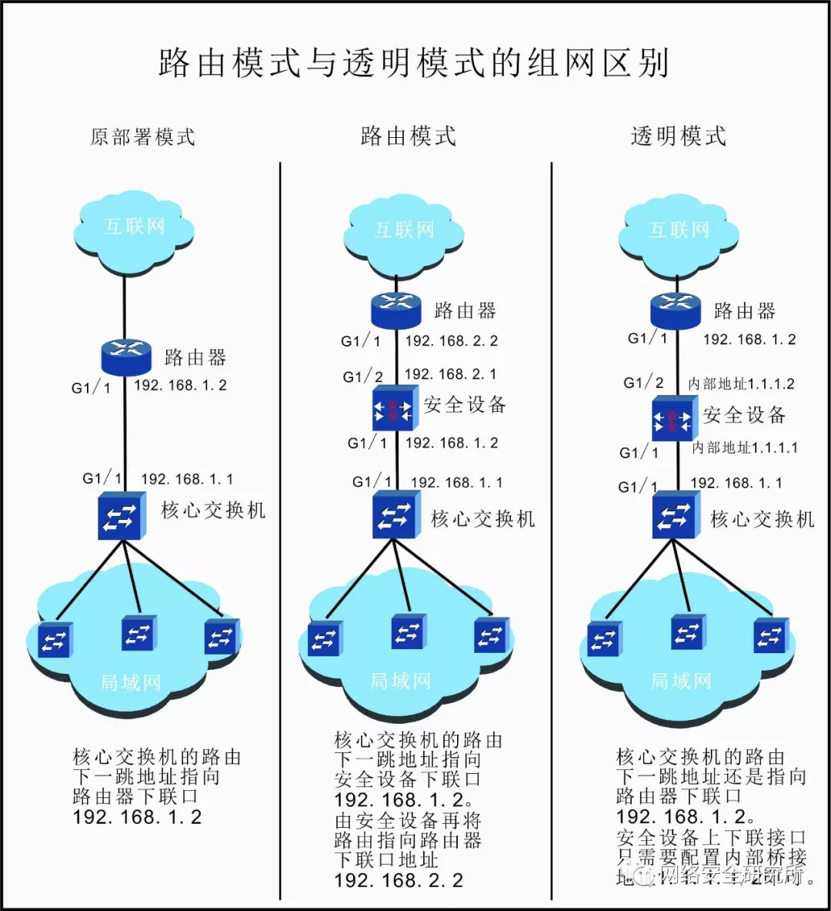
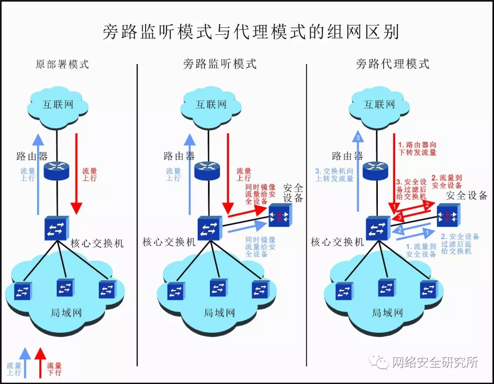

安全设备的工作模式通常可以分为**串联模式**和**旁路模式**两大类。

# 1.串联模式

顾名思义，在这种工作模式下，安全设备是串联在网络链路中的，**所有的网络流量都会经过安全设备过滤，再转发出去**。*串联模式又分为两种，一是路由模式，二是透明模式。*

## 1.1路由模式

路由模式也叫作**网关模式**，是指把安全设备当做一个路由设备或网关来使用。局域网中的出局流量先指向安全设备的内网口IP地址，安全设备通过静态或动态路由配置或者NAT地址转换，将数据发送出去。

## 1.2透明模式

透明模式也称**网桥模式、桥接模式**，工作在这种模式时，原有的网络设备不用更改任何配置，在网络链路上完全透明。对于安全设备不用配置与交换机、路由器互联的IP地址，只需要配置一对内部桥接用的IP地址即可。
    看拓扑图直观一些。

如图所示，左侧是未接入安全设备的网络配置和拓扑图，交换机上联端口G1/1配置IP地址为`192.168.1.1/30`，路由器下联端口G1/1配置IP地址为`192.168.1.2/30`，交换机与路由器之间只需配置路由相互指向即可。

中间是路由模式下，接入安全设备之后的网络拓扑图，对比左图可以看出，交换机的配置没有改变，安全设备的下联接口IP配置为`192.168.1.2/30`，这是左图中路由器下联接口的IP地址，安全设备的上联接口IP配置为`192.168.2.1/30`，路由器的下联接口也相应改为`192.168.2.2/30`。在配置路由时，交换机的下一跳地址也不再直接指向路由器，而是指向了安全设备，安全设备再通过内部的路由配置指向路由器，从而完成整个网络数据的转发。

右侧是透明模式下，接入安全设备后的拓扑图，对比左图可以看出，交换机和路由器的配置未发生改变，安全设备的接口只需配置一对内部桥接地址`1.1.1.1/2`即可。这种模式下，运维人员无需修改网络配置，即可实现安全设备的接入。

那么，问题来了，安全设备串联时，如何选择用路由模式还是透明模式？这两种模式的优缺点？

其实，从上图可以看出来，**路由模式部署方式比较麻烦**，需要对网络进行较大的改动，重新规划互联IP地址，而且一旦设备出现问题，故障恢复时间会很长。**但是，路由模式下，很多功能都可以使用，比如NAT地址转换、VPN通道、负载均衡等。在一些小微企业，完全可以用安全设备做NAT地址转换，代替路由器功能，节省开支。**

而透明模式，**部署简单**，网络配置不做任何更改，只需要在网络链路中串接设备即可。而且，**如果安全设备故障时，直接把设备跳过，或是替换一台设备，配置简单，恢复时间短。**但是像NAT、负载均衡等三层以上的功能使用不了。不过，对于大部分企业来说，NAT、负载均衡、VPN都有专用设备，安全设备只需要做好安全防护的功能即可。**因此，在实际部署中，透明模式用的比较多。**

# 2.旁路模式

在旁路模式下，安全设备在网络结构中处于旁路状态。旁路模式可以分为**旁路监听模式**和**旁路代理模式**。

## 2.1旁路监听模式

所谓的旁路监听模式，指安全设备部署于交换机旁路，通过配置交换机镜像功能，将进出口流量一模一样镜像一份给安全设备，原有流量走向不变。安全设备通过镜像流量对网络、应用系统状态进行监听、检测和分析。

## 2.2旁路代理模式

安全设备工作于旁路代理模式时，设备相当于**代理网关**。此时，需要更改网络配置，将所有的网络数据及访问流量指向旁路的安全设备，经过**安全设备过滤**后，再返回交换机。

如图所示，**旁路监听模式时，进出的流量走向与未加安全设备时无任何变化，只是通过交换机将进出流量镜像一份给安全设备。**

旁路代理模式时，进出的流量首先经过安全设备，安全设备对数据进行检测分析后，再将数据返还给交换机。

哪些设备用这两种旁路模式？优缺点是什么？
**常见的旁路部署的设备一般是IDS、负载均衡、漏洞扫描等检测分析类的设备。**
旁路监听模式部署方式简单，设备上下线对网络没有任何影响。但是由于是镜像流量，安全设备只能看，很难对网络流量进行拦截、过滤等操作，功能稍微简单。

旁路代理模式可以实现对网络流量的过滤、拦截、重分发功能，但是部署方式较为复杂，而且设备故障后，会对网络产生重大影响，故障恢复时间较长。