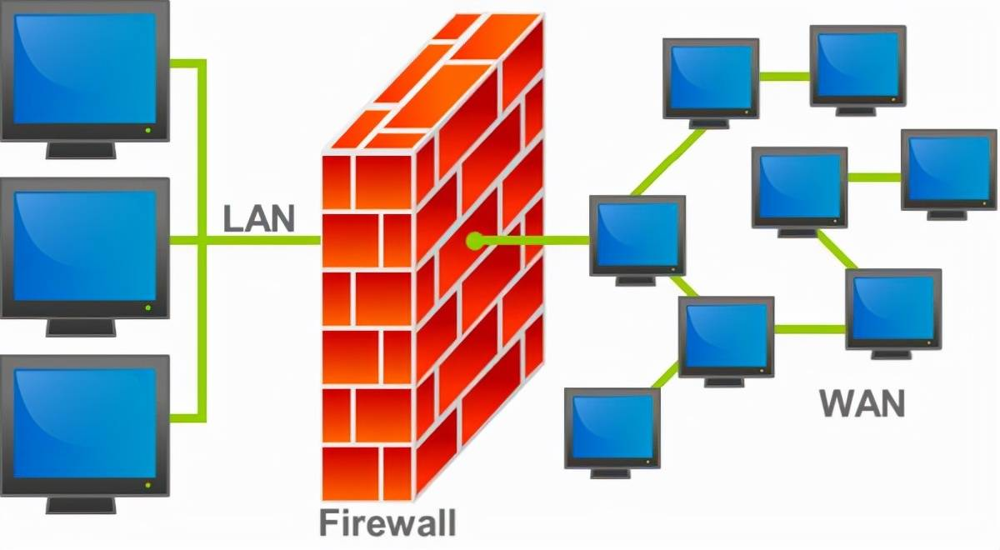
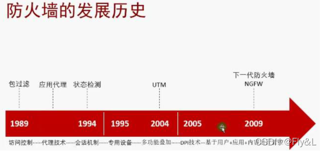

# 防火墙介绍#1

## 1.什么是防火墙？

防火墙，指由软件和硬件设备组合而成、在内部网和外部网之间、局域网与外网之间的保护屏障。用于保护计算机网络免受未经授权访问的安全系统。它的主要作用是监控和控制进出网络的数据流，确保只有合法和安全的数据能够通过。

功能:防火墙的功能主要是两个网络之间做边界防护， 企业中更多使用的是企业内网与互联网的NAT、包过滤规则、端口映射等功能。生产网与办公网中做逻辑隔离使用，主要功能是包过滤规则的使用。

防火墙可以分为软件防火墙、硬件防火墙。硬件常见的厂商有华为、深信服、思科等；软件最常见的就是windows的ISA。

## 2.硬件防火墙和软件防火墙有什么区别？

硬件防火墙，把“软件防火墙”嵌入在硬件中，把“防火墙程序”加入到芯片里面，由硬件执行这些功能，从而减少计算机或服务器的CPU负担。一般的“软件安全厂商”所提供的“硬件防火墙”，就是在“硬件服务器厂商”定制硬件，然后再把“Linux系统”与自己的软件系统结合嵌入。硬件网络防火墙是一种用于保护计算机网络安全的设备。它是一台运行在网络之间的设备，能够监视网络流量并根据预设规则对网络流量进行过滤和管理。同时，它能够检测和阻止网络攻击、病毒、恶意软件、垃圾邮件等网络安全威胁。

软件防火墙，一般基于某个操作系统平台开发，直接在计算机上进行软件的安装和配置。由于客户之间操作系统的多样性，软件防火墙需要支持多种操作系统，如“Unix、Linux、SCO-Unix、Windows”等。

**硬件防火墙，是通过硬件和软件的组合来达到隔离内外部网络的目的；而软件防火墙，是通过纯软件的的方式，实现隔离内外部网络的目的。**

## 3.硬件网络防火墙的工作原理

硬件网络防火墙的工作过程大致分为如下几步：

1. 监视网络流量：硬件网络防火墙能够监视来自网络的所有数据包，并将其传递到下一步进行处理。
2. 数据包过滤：硬件网络防火墙根据预设的规则对每个数据包进行分析和判断，判断是否允许通过网络。
3. 记录日志：硬件网络防火墙会将所有被允许或拒绝的数据包、攻击和安全事件记录下来，以供后续审计和分析。
4. 警报：硬件网络防火墙可以向管理员发出警报，以通知他们网络上出现的异常情况和安全事件。

## 4.防火墙发展史

防火墙的发展历经三代:**简单包过滤**、**应用代理**、**状态检测防火墙**，目前最新的主流技术是具有数据流过滤功能的防火墙。

早期的防火墙一般是直接安装在计算机上的一套软件，是一个应用软件，代表的产品 有checkpoint公司的防火墙，还有一些用于个人计算机的防火墙，如瑞星、360ARP，金山网盾等。

后来采用PC硬件结构，基于Unix、LINUX等操作系统内核开发安全防护的一些基本特性所构成的硬件防火墙，是软件和硬件的结合体，如天融信公司的早期防火墙产品。

现在则是采用独立设计的asic芯片，基于专门的硬件平台，没有操作系统，在CPU, 电源、风扇、总线、扩展插卡等方面优化结构，保证防火墙产品得到最优的处理性能，比 较有名的是华为、思科、H3C、juniper等公司的防火墙产品。

## 5.防火墙功能

在逻辑上，防火墙是一个分离器，一个限制器，也是一个分析器，入侵者必须首先穿越防 火墙的安全防线，才能接触目标计算机。主要是可实现基本包过滤策略的防火墙，这类是有硬件处理、软件处理等，其主要功能实现是限制对IP:port的访问。基本上的实现都是默认情况下关闭所有的通过型访问，只开放允许访问的策略。FW可以拦截低层攻击行为，但对应用层的深层攻击行为无能为力。

### 1)出色的控制能力，过滤掉不安全服务

防火墙作为一个阻塞点、控制点，能封锁所有的信息流，通过服务控制(确定哪些服 务可以被访问)、方向控制(对于特定的服务，可以确定允许哪个方向能够通过防火 墙)、用户控制(根据用户来控制对服务的访问)、行为控制(控制一个特定的服务的行 为)，对希望提供的安全服务逐项开放，把不安全的服务或可能有安全隐患的服务一律扼 杀在萌芽之中，从而极大地提高内部网络的安全性。

### 2)过滤非法用户和访问特殊站点

通过以防火墙为中心的网络安全方案配置，能将所有安全软件(口令、加密、身份认 证、审计等)配置在防火墙上，以强化网络安全策略。如是否允许所有用户和站点对内部 网络进行访问，是否按照IP地址对未授权的用户或不信任的站点进行逐项屏蔽。

### 3)它能够对网络存取和访问进行监控审计

所有的外部访问都经过防火墙时，防火墙就能记录下这些访问，为网络使用情况提供统 计数据。当发生可疑信息时防火墙能发出报警，并提供网络是否受到监测和攻击的详细信息。

## 6.防火墙的部署位置

（1）网络边界：在企业网络与外界网络的连接处部署防火墙，可以有效防止外部攻击和未经授权的访问。

（2）内网分段：对于大型企业或组织，内部网络可能较为复杂，需要将不同部门或业务功能的网络进行分段隔离。在这种情况下，可以在不同网络段之间部署防火墙，以实现细粒度的访问控制和安全防护。

（3）云环境：随着云计算的普及，越来越多的企业将数据和应用迁移到云上。在云环境中，防火墙可以部署在虚拟机或容器之间，以及云平台和外部网络之间，确保云环境的安全。

部署方式:网关模式、透明模式

网关模式是现在用的最多的模式，可以替代路由器并提供更多的功能，适用于各种类型企业.透明部署是在不改变现有网络结构的情况下，将防火墙以透明网桥的模式串联到企业的网络中间，通过包过滤规则进行访问控制，做安全域的划分。至于什么时候使用网关模式或者使用透明模式，需要根据自身需要决定，没有绝对的部署方式。需不需要将服务器部署在 DMZ区，取决于服务器的数量、重要性。

## 7.防火墙的局限性

1. 不能防止源于内部的攻击，不提供对内部的保护
2. 不能防病毒
3. 不能根据网络被恶意使用和攻击的情况动态调整自己的策略本身的防攻击能力不够，容易成为被攻击的首要目标