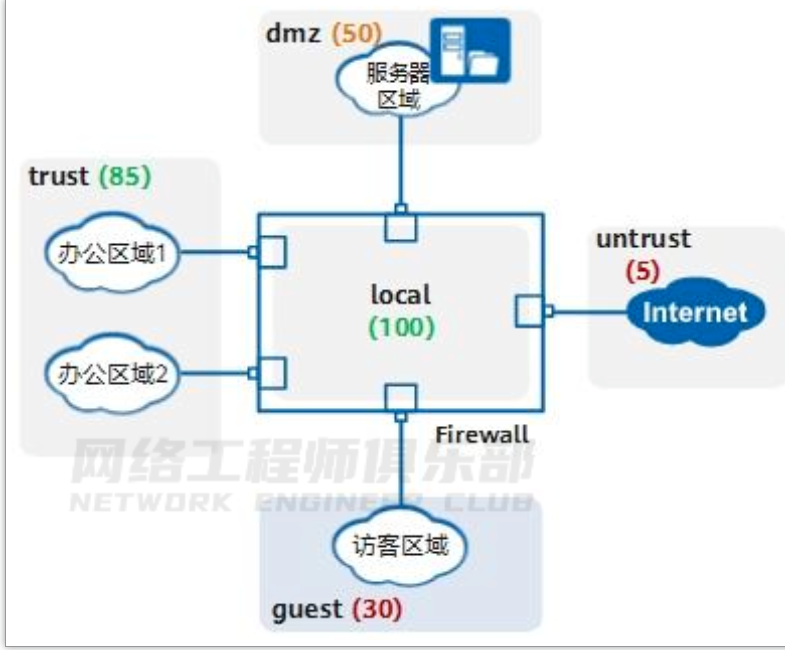

# 了解防火墙基本机制

## 01  什么是防火墙 

防火墙是一种网络安全设备，通常位于网络边界，用于隔离不同安全级别的网络，保护一个网络免受来自另一个网络的攻击和入侵。

这种“隔离”不是一刀切，是有控制的隔离，允许合法流量通过防火墙，禁止非法流量通过防火墙。

如图 1-1 所示，防火墙位于企业 Internet 出口保护内网安全。

在防火墙上可以指定规则，允许内网 10.1.1.0/24 网段的 PC 访问 Internet ，禁止 Internet 用户访问 IP 地址为192.168.1.2 的内网主机。

图 1-1 防火墙控制流量转发：

由上文可见，防火墙与路由器、交换机是有区别的。

**路由器**用来连接不同的网络，通过路由协议保证互联互通，确保将报文转发到目的地；

**交换机**通常用来组建局域网，作为局域网通信的重要枢纽，通过二层/三层交换快速转发报文；

而**防火墙**主要部署在网络边界，对进出网络的访问行为进行控制，安全防护是其核心特性。

**路由器与交换机的本质是转发，防火墙的本质是控制。**

防火墙控制网络流量的实现主要依托于安全区域和安全策略，下文详细介绍。

##  02  接口与安全区域 

前文提到防火墙用于隔离不同安全级别的网络，那么防火墙如何识别不同网络呢？

答案就是**安全区域（Security Zone）**。

通过将防火墙各接口划分到不同的安全区域，从而将接口连接的网络划分为不同的安全级别。

防火墙上的接口必须加入安全区域（部分机型的独立管理口除外）才能处理流量。

安全区域的设计理念可以减少网络攻击面，一旦划分安全区域，流量就无法在安全区域之间流动，除非管理员指定了合法的访问规则。

如果网络被入侵，攻击者也只能访问同一个安全区域内的资源，这就把损失控制在一个比较小的范围内。因此建议通过安全区域为网络精细化分区。

接口加入安全区域代表接口所连接的网络加入安全区域，而不是指接口本身。

接口、网络和安全区域的关系如图所示。

防火墙的安全区域按照安全级别的不同从 1 到 100 划分安全级别，**数字越大表示安全级别越高**。

防火墙缺省存在 trust、dmz、untrust 和 local 四个安全区域，管理员还可以自定义安全区域实现更细粒度的控制。

例如，一个企业按图 1-3 划分防火墙的安全区域，内网接口加入 trust 安全区域，外网接口加入 untrust 安全区域，服务器区接口加入 dmz 安全区域，另外为访客区自定义名称为 guest 的安全区域。

一个接口只能加入到一个安全区域，一个安全区域下可以加入多个接口。

图 1-3 划分安全区域：

上图中有一个特殊的安全区域 local，安全级别最高为 100。

local 代表防火墙本身，local区域中不能添加任何接口，但防火墙上所有接口本身都隐含属于 local 区域。

凡是由防火墙主动发出的报文均可认为是从 local 安全区域发出，凡是接收方是防火墙的报文（非转发报文）均可认为是由 local 安全区域接收。

另外除了物理接口，防火墙还支持逻辑接口，如子接口、VLANIF、Tunnel 接口等，这些逻辑接口在使用时也需要加入安全区域。

## 03  安全策略 

前文提到防火墙通过规则控制流量，这个规则在防火墙上被称为“安全策略”。

安全策略是防火墙产品的一个基本概念和核心功能，防火墙通过安全策略来提供安全管控能力。

如图 1-4 所示，安全策略由匹配条件、动作和内容安全配置文件组成，针对允许通过的流量可以进一步做反病毒、入侵防御等内容安全检测。

图 1-4 安全策略的组成及 Web 界面：

所有匹配条件在一条安全策略中都是可选配置；但是一旦配置了，就必须全部符合才认为匹配，即这些匹配条件之间是“与”的关系。

一个匹配条件中如果配置了多个值，多个值之间是“或”的关系，只要流量匹配了其中任意一个值，就认为匹配了这个条件。

一条安全策略中的匹配条件越具体，其所描述的流量越精确。

你可以只使用五元组（源/目的 IP 地址、端口、协议）作为匹配条件，也可以利用防火墙的应用识别、用户识别能力，更精确、更方便地配置安全策略。

##  04  穿墙安全策略与本地安全策略 

穿过防火墙的流量、防火墙发出的流量、防火墙接收的流量均受安全策略控制。

如图 1-5所示，内网 PC 既需要 Telnet 登录防火墙管理设备，又要通过防火墙访问 Internet。

此时需要为这两种流量分别配置安全策略。

图 1-5 穿墙安全策略与本地安全策略：

尤其讲下本地安全策略，也就是与 local 域相关相关的安全策略。

以上例子中，位于 trust域的 PC 登录防火墙，配置 trust 访问 local 的安全策略；

反之如果防火墙主动访问其他安全区域的对象，例如防火墙向日志服务器上报日志、防火墙连接安全中心升级特征库等，需要配置 local 到其他安全区域的安全策略。

**记住一点，防火墙本身是 local 安全区域，接口加入的安全区域代表接口连接的网络属于此安全区域，这样就可以分清防火墙本身和外界网络的域间关系了。**

##  05  缺省安全策略与安全策略 

防火墙存在一条缺省安全策略 default，默认禁止所有的域间流量。

**缺省策略永远位于策略列表的最底端，且不可删除。**

用户创建的安全策略，按照创建顺序从上往下排列，新创建的安全策略默认位于策略列表底部，缺省策略之前。

防火墙接收到流量之后，按照安全策略列表从上向下依次匹配。

一旦某一条安全策略匹配成功，则停止匹配，并按照该安全策略指定的动作处理流量。

如果所有手工创建的安全策略都未匹配，则按照缺省策略处理。

由此可见，安全策略列表的顺序是影响策略是否按预期匹配的关键，新建安全策略后往往需要手动调整顺序。

企业的一台服务器地址为 10.1.1.1，允许 IP 网段为 10.2.1.0/24 的办公区访问此服务器，配置了安全策略 policy1。

运行一段时间后，又要求禁止两台临时办公 PC（10.2.1.1、10.2.1.2）访问服务器。

此时新配置的安全区策略 policy2 位于 policy1 的下方。

因为 policy1 的地址范围覆盖了policy2 的地址范围，policy2 永远无法被匹配。

需要手动调整 policy2 到 policy1 的上方，调整后的安全策略如下：

因此，配置安全策略时，注意先精确后宽泛。如果新增安全策略，注意和已有安全策略的顺序，如果不符合预期需要调整。