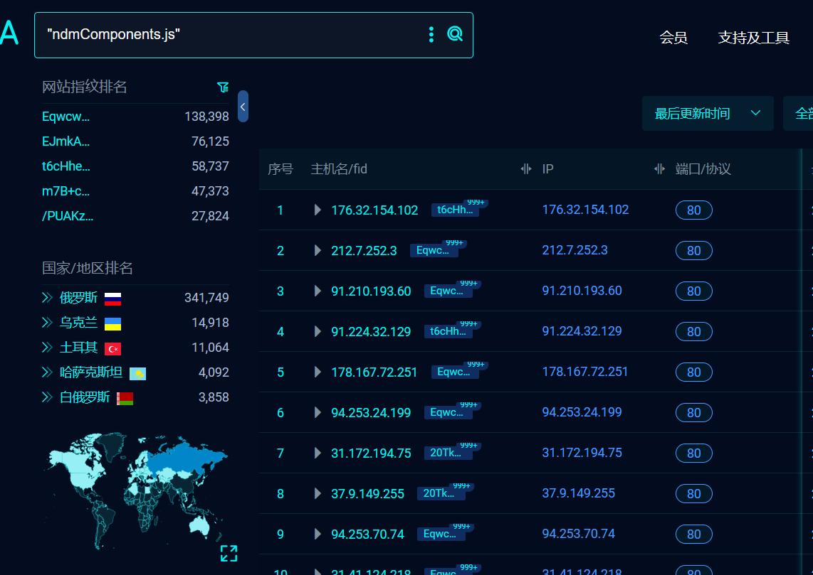
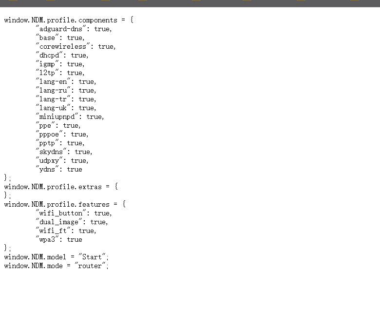
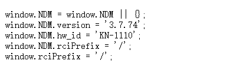

# Keenetic路由器信息泄露漏洞 (CVE-2024-4021)

## 1.漏洞详情

在Keenetic KN-1010、KN-1410、KN-1711、KN-1810和KN-1910中发现了一个漏洞，访问固定地址可以导致信息披露。可以远程发起攻击,并可能被利用。

## 2.漏洞代码存在位置

```
/ndmComponents.js
/version.js
```

## 3.漏洞复现

fofa：

```
"ndmComponents.js"
```



### 1.ndmComponents.js

JavaScript文件中ndmComponents.js公开了详细的配置设定，其中包括openvpn（开放虚拟私有网络）、wireguard（一种新型的虚拟专用网络协议）以及wpa3（第三代无线网络安全协议）等信息，这些透露了当前系统采用的通信协议与安全防护措施。这意味着，攻击者可借此洞察到网络所采用的加密技术、隧道协议等核心安全配置，便于他们针对性地探索这些技术中存在的已知漏洞或配置疏漏，增加了未授权访问和操控网络的风险。

```
/ndmComponents.js
```



### 2.version.js

JavaScript文件中version.js明确揭露了固件版本、硬件ID及其他系统设置的详细信息，这些信息对于识别设备型号和运行参数至关重要。

