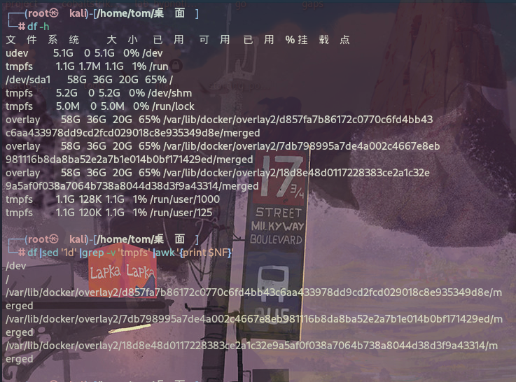

- 写一个检测脚本，用来检测本机所有磁盘分区读写是否正常
- 可以遍历所有挂载点，然后新建一个测试文件
- 然后再删除测试文件，如果可以正常新建和删除，那说明该分区没问题
  ```
  #!/bin/bash
  
  for mount_p in `df |sed '1d' |grep -v 'tmpfs' |awk '{print $NF}'`
  do
    ## 创建测试文件，并删除，从而确定该磁盘分区是否有问题
    touch $mount_p/testfile && rm -f $mount_p/testfile
    if [ $? -ne 0 ]
    then
        echo "$mount_p 读写有问题"
    else
        echo "$mount_p 读写正常 "
    fi
  done
  ```




```
这个命令的作用是显示系统中所有文件系统（不包括tmpfs）的挂载点。
```

- df: 这是一个常用的命令，用于显示文件系统的磁盘空间利用情况。
- |: 这是管道操作符，它将命令的输出传递给下一个命令。
- sed '1d': 这个命令使用sed工具，它用于流编辑，这里的1d表示删除第一行。通常，df的输出的第一行是表头，我们希望将其删除。
- grep -v 'tmpfs': grep命令用于搜索匹配的文本行，-v选项表示反向匹配，即只输出不包含'tmpfs'的行。tmpfs是一种在内存中创建临时文件系统的方式，这个命令可能会排除这些文件系统。
- awk '{print $NF}': awk是一种强大的文本处理工具，这里'{print $NF}'表示打印每一行的最后一个字段。在df的输出中，最后一个字段通常是文件系统的挂载点，这个命令可能会打印出所有非tmpfs文件系统的挂载点。

## 总结

1.  && 连接符表示当前的命令执行成功才会执行后面的命令，在上例中，只有两条命令都执行成功了，返回值才是0，否则任何一条命令执行错误，返回值都为非0
2. 写脚本的过程中，可以一边在命令行中运行命令调试一边写脚本
3. shell脚本里sed,grep,awk无处不在。

> **$? 是一个特殊的变量，用于获取上一个命令的退出状态码（或称为返回码）。在Unix/Linux系统中，退出状态码为0通常表示成功，而非0则表示失败或出现错误。**
> 
> **因此，if [ $? -ne 0 ] 这个条件语句的意思是：如果上一个命令的退出状态码不等于0，即命令执行出现了问题或失败，那么执行接下来的操作。**