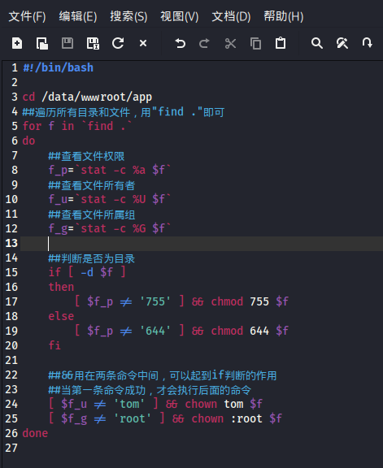
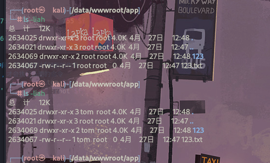

- 检查/data/wwwroot/app目录下所有文件和目录，看是否满足下面的条件。
- 所有文件权限为644
- 所有目录权限为755
- 文件和目录所有者为www，一定要有判断的过程
- 如果文件不满足，改成符合要求，注意：不要直接改权限，一定要有判断的过程

```
#!/bin/bash

cd /data/wwwroot/app
##遍历所有目录和文件，用"find ."即可
for f in `find .`
do
    ##查看文件权限
    f_p=`stat -c %a $f`
    ##查看文件所有者
    f_u=`stat -c %U $f`
    ##查看文件所属组
    f_g=`stat -c %G $f`
    
    ##判断是否为目录
    if [ -d $f ]
    then
        [ $f_p != '755' ] && chmod 755 $f
    else
        [ $f_p != '644' ] && chmod 644 $f
    fi
    
    ##&&用在两条命令中间，可以起到if判断的作用
    ##当第一条命令成功，才会执行后面的命令
    [ $f_u != 'www' ] && chown www $f
    [ $f_g != 'root' ] && chown :root $f
done
```





## 总结

1. 查看文件权限：`stat -c %a 1.txt`
2. 查看文件所属组：`stat -c %G 1.txt`
3. 查看文件所有者：`stat -c %U 1.txt`
4. &&可以实现：当前面的命令执行成功再执行后面的命令
5. ||可以实现：当前面命令不成功再执行后面的命令