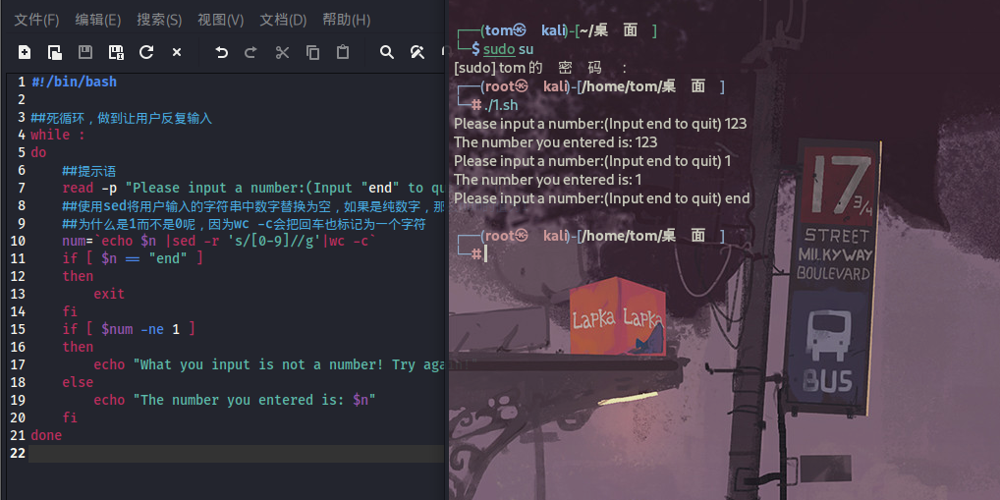

- 写一个脚本，执行后，打印一行提示"please input a number: "
- 要求用户输入数值，然后打印出该数值，然后再次要求用户输入数值，知道用户输入end停止
  ```
  #!/bin/bash
  
  ##死循环，做到让用户反复输入
  while :
  do
      ##提示语
      read -p "Please input a number:(Input "end" to quit) " n
      ##使用sed将用户输入的字符串中数字替换为空，如果是纯数字，那么num的值为1
      ##为什么是1而不是0呢，因为wc -c会把回车也标记为一个字符
      num=`echo $n |sed -r 's/[0-9]//g'|wc -c`
      if [ $n == "end" ]
      then
          exit
      fi
      if [ $num -ne 1 ]
      then
          echo "What you input is not a number! Try again!"
      else
          echo "The number you entered is: $n"
      fi
  done
  ```



<br/>

## 总结

1. wc -c计算字符串长度，其中回车也算是一个字符
2. 使用sed 's/[0-9]//g'可以将字符串里的数字删除
3. exit退出脚本